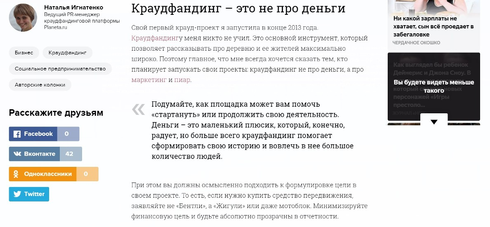

Думаю, что далеко не все в России понимают значение слова «краудфандинг». 7 лет назад, когда наша платформа только начала работу, оно вообще воспринималось как ругательное, а сейчас мы до сих пор сталкиваемся с различными новыми трактовками этого термина. Например, на прошлой неделе мы получили письмо от администрации одной из московских школ с просьбой научить их ученика «краудрафтингу». И это ещё цветочки: были и «краудфайтинги», и «краудфартинги», и другие слова, которые даже неприлично произносить публично. Мы по-доброму посмеиваемся над такими вариациями, внутри коллектива вовсю ходит мем «крауд-чота-там». Одна из моих главных целей как PR-директора платформы ㅡ изменить это и сделать краудфандинг (в том числе и сам термин) понятным всем.

Итак, даю расшифровку: краудфандинг ㅡ это взаимовыгодное сотрудничество между автором проекта и его аудиторией. Авторы создают на крауд-площадках общественно полезные проекты. У каждого проекта есть финансовая цель и период сбора. Если в течение заявленного срока деньги не собираются, они возвращаются спонсорам. При этом за поддержку крауд-проектов люди получают какие-то интересные вознаграждения: будущие музыкальные альбомы, гаджеты, книги, календари (и многое другое) или партнерские бонусы. Важно, что вознаграждения не могут быть финансовыми: спонсоры не инвестируют, а именно поддерживают крауд-проекты для того, быть причастными и помогать талантливым людям реализовывать важные идеи.

Planeta.ru – крупнейшая в России и на территории СНГ краудфандинговая платформа. За 7 лет авторами «Планеты» привлечено более 1 млрд 40 млн рублей и успешно реализовано более 4700 проектов самой разной тематики: от творчества до науки, от бизнеса до благотворительности.

_Проекты на Planeta.ru_

Кратко о монетизации платформы: мы получаем комиссию за размещение на нашем ресурсе. Это стандартная история для крауд-платформ, но мы зарабатываем только на успешных проектах. Если автор собирает от 50 до 99%, и этих денег ему хватает для реализации идеи, суммарная комиссия «Планеты» и платежных систем составляет 15% от суммы сбора. Если автор собирает 100% и больше ㅡ суммарная комиссия 10%. Если автор не смог собрать даже половину от заявленной суммы, деньги в полном объеме возвращаются пользователям (мы берем на себя даже комиссию платежных систем).

Плюс мы активно развиваем дополнительные сервисы, с которых тоже получаем некоторый доход (например, [интернет-магазин](https://shop.planeta.ru/), в котором авторы могут продавать результаты своих крауд-проектов, и еще много других направлений).

## Кому всё это интересно

У нас две главные целевые аудитории: авторы проектов и спонсоры. Все действия, касающиеся продвижения и в целом популяризации платформы, направлены на эти аудитории.

С одной стороны, мы регулярно рассказываем о том, что такое краудфандинг, как запускать проекты, почему круто запускать их именно на «Планете», обучаем потенциальных авторов на образовательных мероприятиях. Хочу отметить, что мы заинтересованы не просто в новых идеях, а в продуманных и качественно подготовленных проектах.

С другой стороны, мы постоянно говорим о том, какие вообще проекты активны сейчас и нуждаются в поддержке, стараемся создавать у спонсоров ощущение собственной крутости от того, что они участвуют в важных инициативах, буквально делают мир лучше в пару кликов.

## Как влюбить аудиторию в краудфандинг в целом и в проект в частности

На помощь приходит всемогущий пиар. Почему пиар, а не таргетинг, контекст? Кажется, это очевидно, но я объясню. О краудфандинге нужно рассказывать. Много и часто, в подробностях и деталях. Чтобы те, кто поддерживает, и те, кто придумывает проекты, знали о нем всё.

Мне очень нравится фраза Беспощадного пиарщика «пяр ㅡ это любовь». Без любви и заниматься им невозможно, а также любовь ㅡ это и есть конечная цель пиара. Моя задача ㅡ если не влюбить аудиторию в «Планету», то во всяком случае создать более доверительные отношения между площадкой и теми, кто попадает на нее или впервые узнает о ней. Кроме того, так как краудфандинг ㅡ это еще не до конца изученная в России тема, то пиар-инструменты помогают нам продвигать саму идею народного финансирования среди общественности. Чем больше успешных проектов будет, тем больше счастья и для самой платформы, и для авторов, и для страны, в конце концов.

## Публикации в СМИ как основа пиар

Мы используем разные инструменты для продвижения, однако работа со СМИ ㅡ инициирование и написание публикаций, пресс-релизы, комментарии, предоставление статистики и работа с запросами ㅡ является одним из главных пиар-направлений «Планеты».

> В чем заключаются преимущества публикаций в разных медиа? В информационном шуме, в котором мы все живем, сложно привлечь внимание. Представьте, что компания стоит на одном берегу реки и пытается позвать тех, кто стоит по ту сторону реки. Между ними бушующая стихия, в которой буквально тонут все попытки донести хотя бы что-то до целевой аудитории. Несмотря на то, что мы задействуем много инструментов продвижения, публикации в крупных медиа, на отраслевых и нишевых площадках остаются главным «мостиком», по которому наша аудитория идет к нам навстречу и получает нужный месседж.

Честно признаюсь, что пиарить краудфандинговую платформу достаточно просто и приятно, потому что мы создаем хороший продукт, который помогает людям и объединяет их. Поэтому многие СМИ с радостью идут на контакт с нами. При этом, конечно, чтобы сотрудничество было эффективным, мы придерживаемся определенной пиар-стратегии и правил.

Сначала мы выделили **темы**, о которых говорим во всевозможных медиа.

1\. Информация о краудфандинге в целом: инструкции, лайфхаки, правила создания и продвижения проектов.

2\. Суть краудфандинга, представленная в советах конкретных авторов успешных проектов, так называемые success story.

3\. Описание платформы Planeta.ru, особенности работы на ней, новости площадки.

4\. Подборки интересных проектов по тематикам.

5\. Рассказы о конкретных проектах: интервью с их авторами, новости проекта и т. д. (таких материалов около 70% от общего числа наших публикаций).

6\. Обсуждения рынка крауд-финансов, регулировании краудфандинга, других способов поиска средств на свою идею.

7\. Пиар через первых лиц платформы. Наш генеральный директор, Федор Мурачковский, не назначенный свыше руководитель, а сооснователь платформы. Он сам с друзьями придумал Planeta.ru, а потому очень вовлечен во все происходящее.

Что касается изданий: где мы говорим о краудфандинге и обо всем, что рядом с ним? У нас нет приоритетных и второстепенных площадок. Конечно, все пиарщики хотят попасть в «первую четверку»: «РБК», Forbes, «КоммерсантЪ», «Ведомости». Мы попадаем туда. Однако нам нужны и другие СМИ, все зависит от конкретного инфоповода. Например, если мы планируем «Школу краудфандинга» (наша собственная образовательная программа) в Иркутске, то я начинаю составлять базу популярных иркутских СМИ, так как мы хотим рассказать жителям региона о городском событии, в котором можно поучаствовать бесплатно.

Краудфандинг ㅡ это настолько полифоничная тема, что интересные нам СМИ определяются на основе тематик. Мы и про финансы, и про фандрайзинг, и про сообщества, и про музыку, и про литературу, и про бизнес, и про активизм и благотворительность, и про науку, и про образование.

## Как выходить на нужные СМИ

Как я уже сказала, возможно, нам чуть легче продвигать свою площадку, потому что краудфандинг несет пользу обществу, и медиа готовы бесплатно рассказывать о нас. В то же время, к каждому СМИ нужно искать свой подход. С любой редакцией важно быть предельно корректным, доброжелательным, полезным и вежливым, в том числе, в плане дедлайнов.

Объясню, как сотрудничаем с журналистами мы. В целом, эти советы пригодятся всем пиарщикам, особенно тем, кто продвигает стартап с неким социальным бэкграундом. Итак, 4 способа попасть в желаемое СМИ.

Способ 1. Цепляйте журналистов интересной статистикой, данными, цифрами, фактами и новостями, которые призваны сделать людям лучше.

Банальности никому не нужны. Прямая реклама тоже. Что хотят журналисты? Довольных читателей. Читателей, которые удивятся, получат пользу, захотят что-то сделать после прочтения.

Например, Inc. опубликовали новость о том, что за годы существования planeta.ru авторы собрали 1 миллиард рублей. Впечатляющая цифра привлекла редакцию.

  
[_Публикация на Inc._](https://incrussia.ru/news/crowd-funding-planeta/)

Также деловые издания любят статистику и советы от признанных гуру (а лучше все сразу): недавно мы подготовили публикацию для Forbes Woman о женщинах в краудфандинге. Мы прочитали зарубежное исследование, что женские крауд-проекты чаще становятся успешными, сверились со своей статистикой, удивились тому, что это так, и согласовали с редакцией самых заметных женщин-авторов, делаем материал с их советами.

Способ 2. Мониторить запросы на сервисе Pressfeed и оперативно отвечать на них.

[Сервис журналистских запросов Pressfeed](https://pressfeed.ru/) ㅡ в своем роде социальная сеть для журналистов и пиарщиков, которая значительно облегчает коммуникацию между ними.

Я отношусь к сервису как к еще одному обязательному инструменту в арсенале пиар-специалиста. То есть мы используем личные контакты и договоренности, идеи и холодные письма, наработанные годами базы СМИ, а теперь еще и Pressfeed. Это не универсальное решение проблемы пиарщика, но важный канал для общения с редакциями.

Также, кстати, и краудфандинг ㅡ не универсальная таблетка от безденежья. Просто от размещения проекта на «Планете» чуда не случится, так же и просто от регистрации на Pressfeed публикации не появятся. Но при вдумчивой и ответственной работе с сервисом хорошие статьи с участием компании не заставят себя ждать.

Суть сервиса в одном предложении: журналисты ищут на Pressfeed экспертов и героев для своих публикаций, а компании могут отвечать на эти запросы и попадать на страницы СМИ.

Например, мы без труда попали в «Коммерсантъ». Журналист спрашивал предпринимателей, как у них появилась идея для бизнеса.

  
[_Запрос_](https://pressfeed.ru/query/37561) _от издания «Коммерсантъ»_

Я быстро опросила директора, написала комментарий от его имени, и через две недели мы уже читали историю создания платформа Planeta.ru в топовом издании.

Также я рассказывала бизнес-изданию «Деловой мир», что такое краудфандинг и зачем он нужен. Изначально редакция хотела получить статью на тему, где найти деньги на развитие стартапа.

  
[_Запрос_](https://pressfeed.ru/query/54671.) _от издания «Деловой мир»_

Эту статью я писала в поезде, по пути из командировки домой. Договорились с редакцией на дедлайн в понедельник, а один из смертных грехов пиарщика ㅡ нарушить договоренности и подвести журналиста, который рассчитывает на твой материал. С этим изданием еще не работала, поэтому не знала, как воспримут мой текст. В итоге редакция утвердила статью вообще без правок, поблагодарила за сотрудничество, и затем мы уже вне сервиса договорились о новой публикации.

  
[_Публикация в «Деловом мире»_](https://delovoymir.biz/kraudfanding-dlya-startapa-kak-i-zachem.html)

В другой раз мы получили упоминание на ещё одной нишевой площадке для малого бизнеса biz360.ru.

  
[_Запрос на Pressfeed_](https://pressfeed.ru/query/52477)

В нем мы рассказали об особенностях сотрудничества «Планеты» с благотворительными проектами ㅡ это отдельное направление работы платформы.

[_Статья на Biz360_](https://biz360.ru/materials/plyusik-v-karmu-kak-i-zachem-malyy-biznes-zanimaetsya-blagotvoritelnostyu/)

Аудитория портала biz360.ru ㅡ это не сотрудники благотворительных фондов, которым будет полезна эта информация. Однако читатели смогут открыть для себя новую безопасную площадку для поддержки благотворительных инициатив.

На Pressfeed есть возможность создавать подписки на запросы по ключевым словам и темам, чтобы точно их не пропустить, ㅡ для нас это все, что связано со сбором денег, поддержкой стартапов и т. д.

  
_Пример подписки на запросы_

Еще одна полезная функция на Pressfeed ㅡ каталог СМИ по тематикам и регионам. Пользуюсь им, когда составляю базу СМИ для конкретного инфоповода, особенно помогает, когда мы готовимся к «Школе краудфандинга» в конкретном регионе.

  
_Пример: поиск СМИ из Новосибирска_

Способ 3. Найти несколько постоянных партнеров. Те площадки, которые будут принимать тексты с определенной периодичностью, а не от случая к случаю.

Пожалуй, это идеальный вариант. Стать колумнистом на какой-то площадке. Фокус пройдет с узконаправленными нишевыми ресурсами. Только нужно понимать, что партнерство должно быть выгодно обеим сторонам: и медиа, и «Планете».

СМИ интересен хороший контент, а за многими проектами стоят интересные истории, и таким образом, мы помогаем закрывать две основных «боли» площадок ㅡ контент и трафик. По возможности мы ставим партнерские публикации в новостную рассылку, которую получают наши зарегистрированные пользователи, и в социальные сети. На некоторые проекты ставим кликабельные баннеры с логотипом инфопартнера.

Например, для площадки Strelka Mag мы регулярно делаем подборки интересных проектов, посвященных городской среде, архитектурному и культурному наследию.

  
[_Публикация на Strelka Mag_](https://strelkamag.com/ru/article/komu-pomoch-luchshie-kraudfandingovye-proekty-mesyaca-5)

В то же время мы сделали издание куратором проекта по строительству галереи домовой росписи в Прикамье, поэтому поставили их логотип и ссылку на сайт платформы.

Еще раз уточню, что договориться о партнерстве легче всего с отраслевыми площадками, которые пишут в ваших тематиках

Способ 4. Публиковать гостевые посты на ресурсах, которые открыто принимают их.

На просторах интернета много площадок, которые приглашают сторонних авторов писать статьи. Редакция обозначает актуальные темы и форматы, принимает готовые тексты или помогает автору довести статью до ума.

Все требования к публикациям подробно прописаны, нужно лишь следовать им, и все получится. Больше всего такие ресурсы любят истории успеха, подборки инструментов, лайфхаки, советы. Пример ㅡ сайт Rusbase. Мы собрали для площадки советы предпринимателя, как привлекать спонсоров в проект и взаимодействовать с ними.

  
[_Публикация на Rusbase_](https://rb.ru/opinion/kraudfanding-lajfhaki/)

Между тем, в это издание можно зайти и через Pressfeed. Как-то редакция делала спецпроект об индустрии мультфильмов в России. [Разместила запрос на сервисе.](https://pressfeed.ru/query/53922) С первого взгляда тема не наша, но я быстро сообразила и собрала статистику ㅡ на создание каких мультфильмов собирались средства через краудфандинг, в том числе через нашу платформу.

  
_Комментарий для_ [_спецпроекта Rusbase_](https://rb.ru/longread/multfilms/)

## Почему мы считаем, что такой подход работает

Работа со СМИ важна для нас, прежде всего, в плане имиджа и узнаваемости. Большая часть трафика на платформу идет из социальных сетей, а медиа формируют у аудитории понимание, что такое краудфандинг, и вызывают доверие именно к нашей площадке. Для кого-то публикации в СМИ действуют как 25-й кадр: увидел информацию о проекте в соцсетях, а на прошлой неделе читал о нем в СМИ ㅡ пойду, поддержу. Этим нужно заниматься постоянно и обязательно.

> Мы еженедельно делаем мониторинги и тоже видим стабильный рост количества публикаций. Каждые полгода он увеличивается примерно на 10-15%. В 2018 году в медиа вышло 4342 публикации с упоминанием «Планеты». Это примерно по 11 материалов в день!

Впрочем, существуют косвенные показатели, которые доказывают, что публикации в СМИ работают как маркетинговый инструмент.

На платформе в каждый крауд-проект вшита статистика, с помощью которой автор может смотреть, откуда на его страницу приходят люди. В том числе, там учитываются и конкретные СМИ. Через статистику можно оценивать не только то, сколько человек пришли в проект, но и сколько покупок было сделано с определенной внешней площадки.

Приведу в пример наш [собственный крауд-проект по выпуску онлайн-курса](https://planeta.ru/campaigns/crowdproducers) о продвижении проектов (кстати, он уже успешно завершен).

  
На скрине видно, что покупки шли непосредственно с крауд-площадки, из социальных сетей, а также из переходов с портала Южного региона «Юга.ру», с сайта «Теплицы социальных технологий», с площадки «Афиша Daily».

> Кроме того, на Школах краудфандинга я лично спрашиваю авторов, с которыми мы работаем проектно, откуда они у нас узнали. Многие узнают именно из региональных СМИ. Значит, публикации работают.

Также вспоминаю случай в Санкт-Петербурге. Сразу после утреннего эфира на телевидении у меня зазвонил телефон: «Наташенька, я вас сейчас по телевизору видела. Вы такая улыбчивая и, кажется, добрая, поэтому звоню вам. Сегодня не приду, только что о вашей школе узнала, но у меня есть проект...». А потом я поняла, что мой номер на экране не высвечивался. То есть, человек увидел, запомнил название площадки, зашел на сайт, нашел меня в контактах и позвонил. Это ли не свидетельство эффективности работы со СМИ?

Бывали и такие случаи (хотя это больше исключение, чем правило), когда после публикации в СМИ информации о проекте он за несколько дней собирал приличную сумму средств. Еще в 2014 году, когда о проекте социального предпринимателя Гузели Санжаповой [написал сайт «Большой город»](http://bg.ru/society/proekt_cocco_bello_kak_dat_rabotu_tseloj_derevne-21028/), за 3 дня в проект поступило более 200 тысяч рублей.

> То, что сервис реально развивается и растет, мы оцениваем по количеству запустившихся и успешных проектов, сборам, конверсии регистраций и покупок. В 2017 году общий сбор проектов платформы составил 184 млн рублей, в 2018 году ㅡ 194 млн, даже несмотря на то, что количество проектов было уже чуть меньше. Это явное доказательство, что большее количество людей начинают «пробовать» краудфандинг.

В прошлом году на 24,8% выросла конверсия в регистрации на сайте ㅡ людям все интереснее участвовать в проектах и вообще знакомиться с сервисами «Планеты». На 14,6% выросла конверсия в покупки, получается, что тех пользователей, которые заходят просто «поглазеть», становится меньше с каждым годом. Конечно, эти цифры ㅡ результат работы всей команды по разным фронтам, но публикации в СМИ и другие пиар-инструменты тоже сыграли большую роль, в этом нет сомнений.
