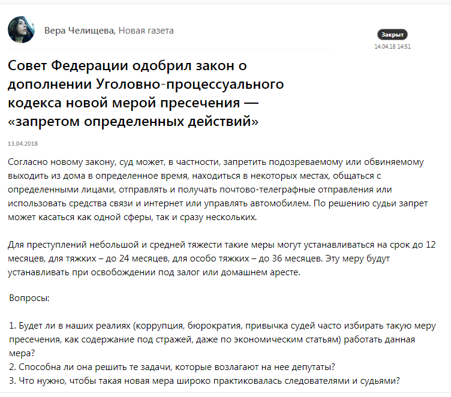
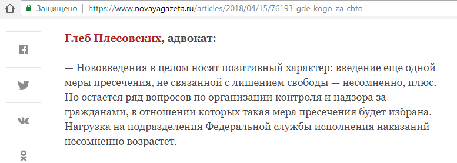
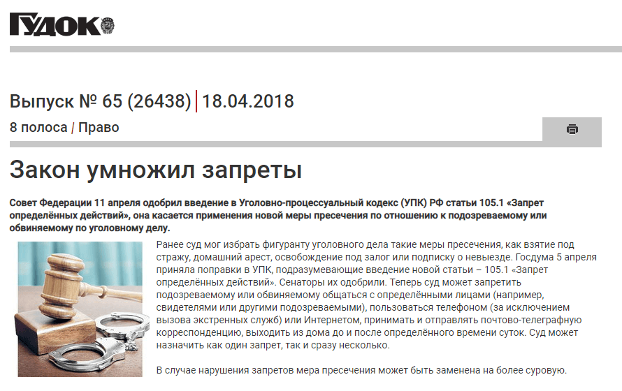
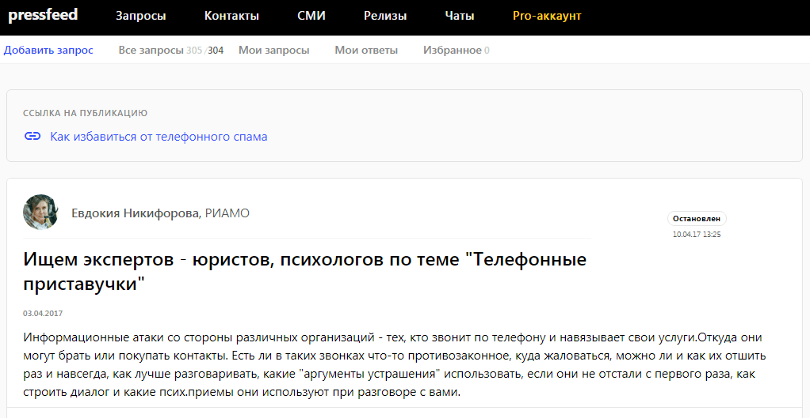
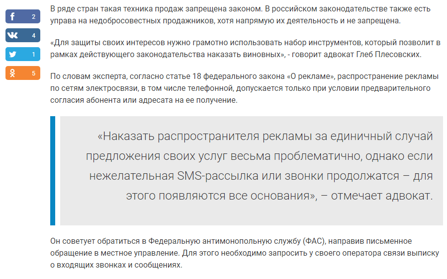
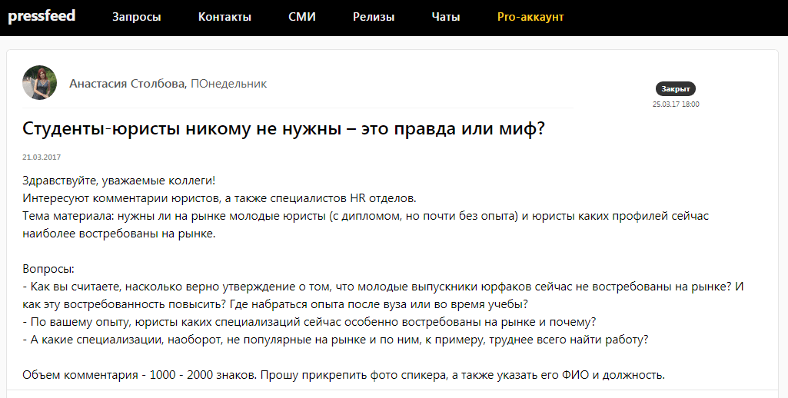
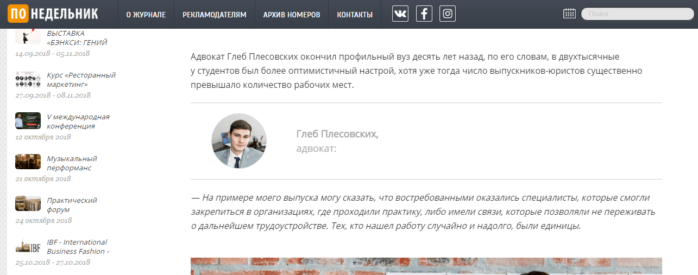
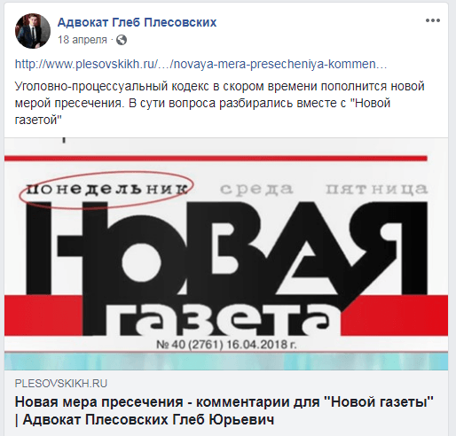
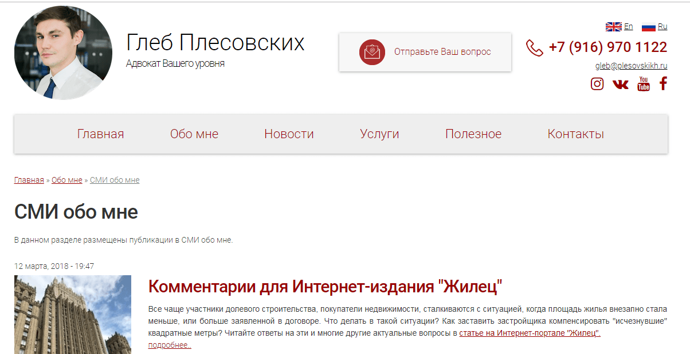

Обычно адвоката выбирают по рекомендациям, но советы знакомых — это лишь один из решающих факторов. Вот кто-то говорит человеку: «Обратись к Глебу Плесовских, он поможет». Дальше потенциальный клиент идет в интернет и начинает «гуглить» информацию об адвокате. Если адвокат дает комментарии в крупных СМИ, рассказывает истории из практики, пишет о работе в социальных сетях — значит, он знает, о чем говорит.

Глеб Плесовских занимается уголовными делами экономической направленности и тщательно отслеживает изменения в законодательстве. Он осознает, что если адвокат хочет завоевать лояльность и доверие клиентов, то должен высказывать свое мнение по актуальным юридическим темам и доказывать миру, что он эксперт в своем деле. Публикации в уважаемых федеральных СМИ — это один из тех «пунктов», которые цепляют людей. Тех, которые работают на репутацию и вынуждают поверить, что этот юрист — профессионал, его мнение заслуживает внимания общественности.

> В голове будущего клиента, который собирается обратиться к адвокату, возникает мысль: он дает интервью «Коммерсанту» и «Новой газете», а на их страницы попадают только эксперты высшего уровня.

## Как делать публикации в СМИ, если у вас нет времени

Как выйти на редакторов или журналистов нужных медиа? Налаживать связи и работать с представителями СМИ напрямую — непросто и долго, спросите у любого пиарщика. Тем более, у востребованного адвоката с огромной загрузкой и непрерывными встречами просто нет времени, чтобы «дружить» с журналистами и предлагать им свои идеи и тексты. Самый оптимальный и короткий путь в СМИ — пользоваться сервисом Pressfeed, в котором уже собраны все актуальные запросы от журналистов.

> «Чуть больше года назад я зарегистрировался на сервисе журналистских запросов [Pressfeed](https://pressfeed.ru/). Все, что нужно делать, — проверять запросы по юридической теме и отвечать на них до установленного дедлайна. Такие публикации отнимают всего несколько часов в месяц и работают на личный бренд».

Журналисты постоянно нуждаются в консультации юристов по множеству вопросов. В день на сервисе Pressfeed может появляться от 15 запросов на юридические темы.

В апреле 2018 журналист «Новой газеты» разместил на сервисе запрос о грядущем дополнении уголовно-процессуального законодательства еще одной мерой пресечения — запретом на определенные действия. Среди такого рода действий могут быть запрет на управление автотранспортным средством, использование компьютерной техники или средств связи.

  
[_Запрос_](https://pressfeed.ru/query/42475) _от «Новой газеты» на Pressfeed_

Глеб Плесовских откликнулся на запрос журналистки «Новой газеты» и написал комментарий по теме.

  
_Комментарий Глеба Плесовских в_ [_«Новой газете»_](https://www.novayagazeta.ru/articles/2018/04/15/76193-gde-kogo-za-chto)

«После выхода публикации мои коллеги начали интересоваться: как у меня получилось дать комментарий для такого издания? Но самое главное, что ко мне поступило множество вопросов от разных людей в соцсетях и через мой сайт, связанных с новой мерой пресечения», — говорит Глеб.

В этом же месяце эксперт дал похожий комментарий для газеты [«Гудок»](http://www.gudok.ru/newspaper/?ID=1416804). Тоже через запрос на Pressfeed.

  
_В этом выпуске вышла статья с мнением Глеба_

> По итогам апреля 2018 количество уникальных посетителей на официальный сайт Глеба Плесовских в дни выхода публикаций выросло в 3 раза.

«Если в медиа вышли несколько материалов с вашим участием, это не значит, что человек сразу обратится к вам, ведь услуги адвоката — специфичный и сложный продукт, который не всегда нужен нам здесь и сейчас. Но он запомнит фамилию этого адвоката. Именно так и строится личный бренд, повышается лояльность, доверие, узнаваемость и соответственно, вы становитесь более востребованным специалистом, а количество клиентов планомерно растет».

Также на Pressfeed был запрос от журналиста известного московского портала «РИАМО». Нужно было рассказать, как бороться с телефонной рекламой и холодными звонками, и делать это правильно с точки зрения закона.

  
[_Запрос_](https://pressfeed.ru/query/29868) _от редакции «РИАМО»_

> «Эту публикацию перепечатывали другие издания, тогда я тоже получил множество вопросов от заинтересованных пользователей, а за тот период трафик на сайт вырос практически в 3 раза. Мои клиенты видели эти комментарии, и возможно, это повлияло на их решение обратиться именно ко мне».

[_Фрагмент публикации_](https://riamo.ru/article/206873/kak-izbavitsya-ot-telefonnogo-spama.xl) _«РИАМО»_

В другой раз Глеб рассуждал о студентах-юристах для издания «ПОнедельник».

  
[_Запрос_](https://pressfeed.ru/query/29444) _от издания «ПОнедельник»_

Комментарий вышел в материале [«50 оттенков трудоустройства юриста»](https://ponedelnikmag.com/post/50-ottenkov-trudoustroystva-yurista).

  
_Материал с участием Глеба_

Глеб Плесовских старается делать в среднем по 2 публикации в месяц — этого достаточно, чтобы получить нужный охват аудитории. Эксперт старается отвечать на запросы деловых СМИ, которые читают образованные и прогрессивные люди. По мнению адвоката лучше брать качеством, а не количеством.

> «Мне нравится, что я могу свободно выбирать тех журналистов и те издания, с которыми хотел бы сотрудничать. После года работы с Pressfeed у меня появилось множество контактов с редакциями, в том числе и топовых федеральных СМИ. Сейчас обращаются ко мне за экспертными комментариями по моей специальности. Таким образом, я получаю внимание к себе как к профессионалу и постепенно формирую свою репутацию».

Однако, по мнению Глеба, опубликовать комментарий через Pressfeed — это лишь часть работы эксперта. Дальше вы должны сделать все, чтобы материал с вашим участием увидели и обсудили как можно больше заинтересованных людей человек.

## Вышел материал в СМИ — сделайте репост в свои социальные сети

Ссылки и анонсы на все статьи в СМИ с Глебом сразу появляются в социальных сетях эксперта: на его страницах в Instagram и Facebook.

_Пост Глеба Плесовский на его странице в Facebook_

Кто-то перейдет на статью из Instagram, а кто-то увидит ее у меня в посте на Facebook. Так вы получите максимальный охват аудитории (друзья могут делать репосты, а это тоже современная форма рекомендаций). Отлично, если пользователи вовлекаются в публикацию, начинают комментировать, зарождается дискуссия.

Однако помните о регулярности. Если потенциальный клиент находит вашу страницу в социальной сети и видит интересный контент (публикации в СМИ, истории из практики, кейсы), опубликованный вчера или сегодня, это повысит его доверие.

## Заведите на сайте раздел для экспертных материалов и публикаций в СМИ с вашим участием

Глеб Плесовских делает ставку на полезный контент, поэтому на его личном сайте plesovskikh.ru есть специальные разделы: «Полезное», «Обо мне — Практика», «Новости». В этих разделах находятся личные статьи эксперта, ответы на вопросы клиентов, истории из практики, юридические советы и так далее. Именно эти страницы сайта показывают опыт и профессионализм адвоката. Глеб всегда дублирует в подраздел «СМИ обо мне» все вышедшие публикации в медиа.

  
_Раздел «СМИ обо мне»_

«Публикации в медиа — это в том числе контент для вашего личного сайта. Для портфолио специалиста. Когда потенциальный клиент заходит на сайт и видит недавние публикации, он обязательно обратит на них внимание».

## 4 совета, как получить эффект от публикаций в СМИ

1. Научитесь правильно и четко излагать свои мысли. Тогда вам будет проще писать комментарии для журналистов, и издания будут чаще и быстрее их одобрять.
2. Мониторьте сервис Pressfeed несколько раз в неделю, но тратьте время на запросы только тех изданий, которые вы считаете самыми заметными и стоящими.
3. Увеличивайте охват публикации с помощью ваших социальных сетей и личного сайта.
4. Следите за статистикой: как комментарии повлияли на посещаемость вашего сайта. Соответственно, анализируйте, что больше интересует аудиторию.

Pressfeed — это один из самых полезных и эффективных инструментов для развития личного бренда, это возможность заявить о себе. При этом им легко пользоваться и можно выбирать только профильные темы с вашей спецификой. Всего пару часов в неделю на мониторинг запросов — и вы получите публикации в ведущих российских СМИ, которые повлияют на репутацию и узнаваемость эксперта.
