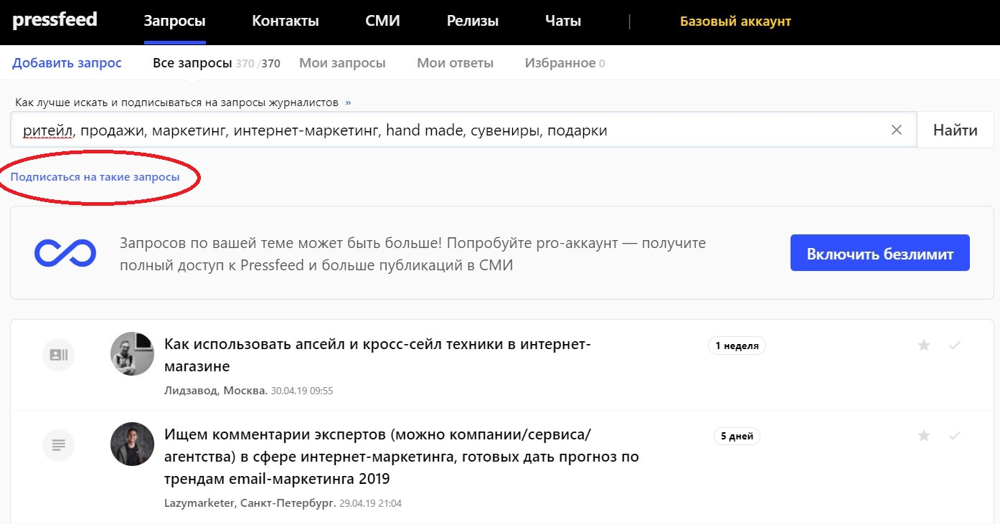
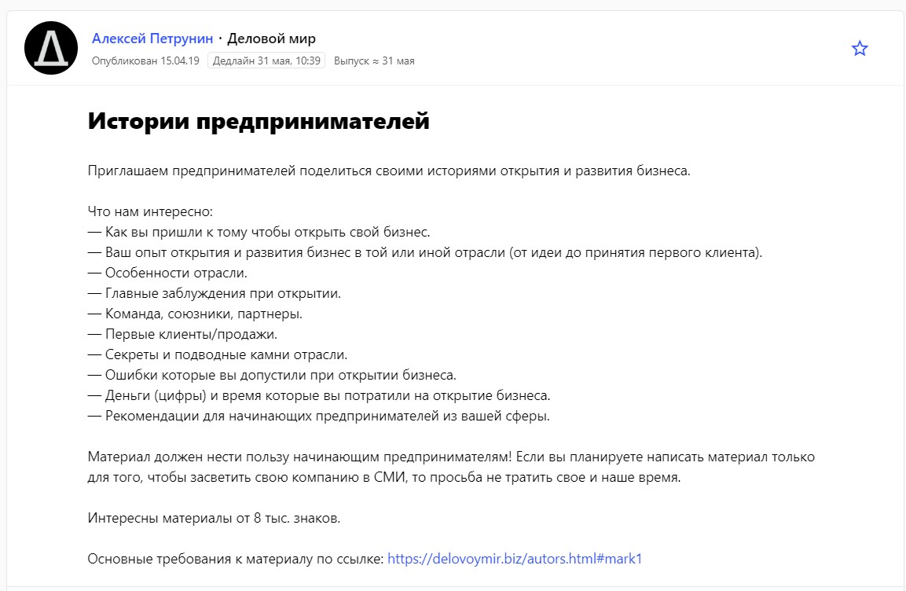
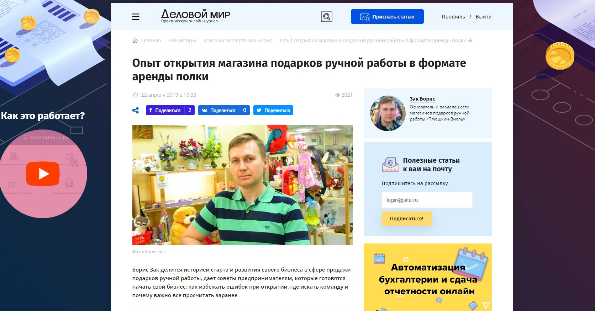
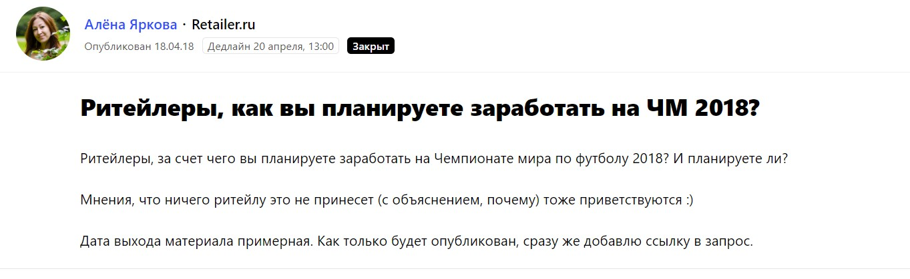
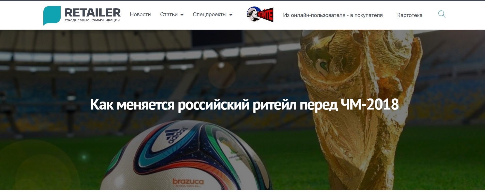
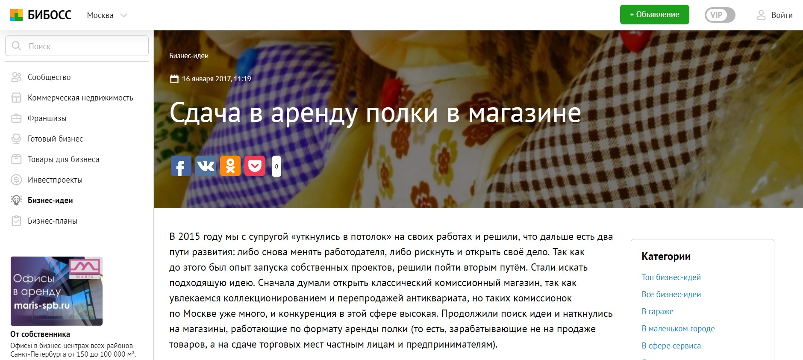
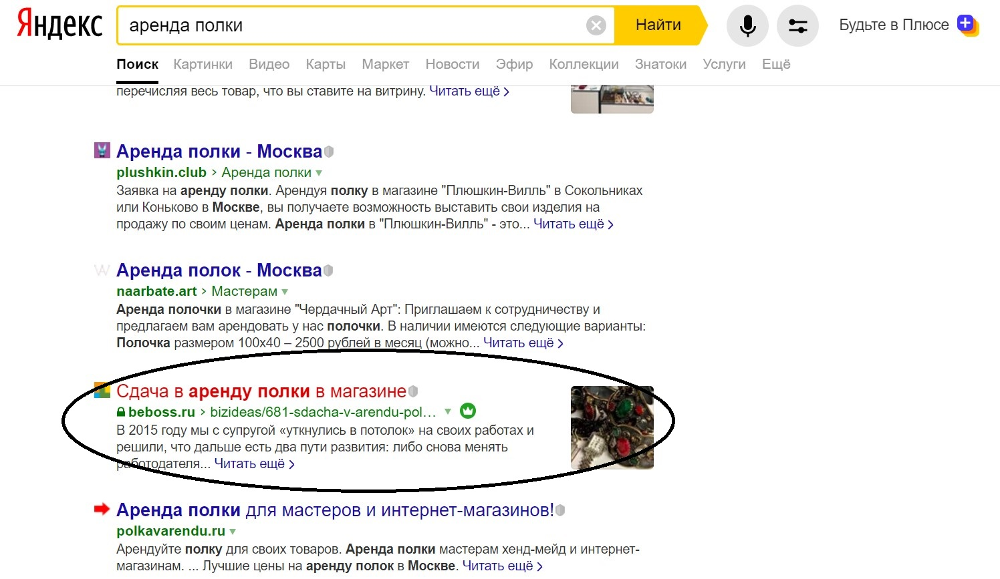
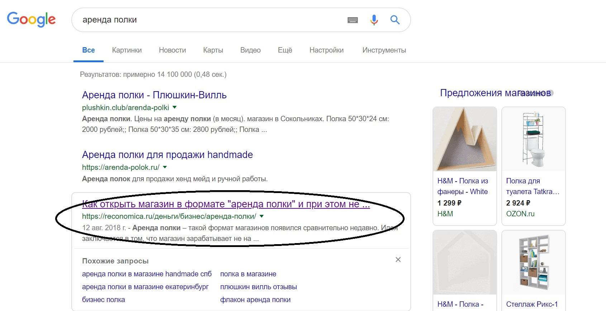

## Продвижение с помощью публикаций в СМИ влияет не только на репутацию, но и на позиции в выдаче

С момента открытия первого магазина в 2015 году мы занимаемся продвижением с помощью публикаций в медиа. Зачем мы это делаем?

Цели такие:

1. создание положительного имиджа компании,
2. повышение лояльности среди действующих клиентов,
3. привлечение новых клиентов,
4. попадание в ТОП по ключевым запросам в поисковой выдаче «Яндекс» и Google, то есть SEO-продвижение сайта компании.

Если с первыми тремя пунктами всё понятно ― это классические пиар-задачи, которые решают публикации в СМИ, то по последнему пункту поясню.

**Во-первых**, у нас довольно узкий рынок, на нём мало игроков, поэтому статьи с нашим участием, размещенные на различных качественных ресурсах, сразу появляются в поисковой выдаче по ключевым запросам. И в каждой этой публикации, помимо информации про аренду полки как услуги, также упоминается название нашей сети.

_Справка о компании:_

[_«Плюшкин-Вилль»_](http://plushkin.club/) _― розничный магазин подарков ручной работы, работающий с частными мастерами в формате аренды полки. Сегодня сеть насчитывает 3 розничных магазина в Москве, а с «Плюшкин-Виллем» постоянно сотрудничают более 400 мастеров и других арендаторов со всей России._

**Во-вторых**, статьи в медиа в целом положительно сказываются на позиции официального сайта «Плюшкин-Вилль» в поисковой выдаче.

> Тот, кто хотя бы немного разбирается в SEO, знает, что одним из внешних факторов, влияющих на позиции сайта в поисковых системах, являются упоминание названия компании на сторонних сайтах и размещение на них ссылок на ваш сайт.

При этом размещение ссылок давно стало полноценным бизнесом для компаний и фрилансеров, занимающихся продвижением сайтов. Но просто ссылки уже не работают, так как и «Яндекс», и Google выступают против накруток, а вот размещение естественных ссылок и упоминание названия компании в статьях работает хорошо. Такие «сигналы» показывают «Яндексу» и Google, что сайт хороший, качественный и ему можно доверять. Как следствие, это приводит к повышению позиций сайта в поисковиках.

Мы в рамках SEO-продвижения накрутками не пользуемся. Делаем сайт максимально удобным для пользователей (внутренняя оптимизация), а также делаем всё, чтобы и название компании, и ссылки на сайт присутствовали в статьях, в которых мы даем комментарии. И это работает.

Согласно «Яндекс.Метрике» основные переходы на наш сайт идут и по брендовым запросам, и по целевым запросам типа «игрушки ручной работы» и «аренда полки в Москве», также по разным вариациям этих запросов.

## Как и где публиковать статьи с вашим упоминанием быстро и просто

«Плюшкин-Вилль» ― небольшая компания, так называемый малый бизнес. Как вы могли догадаться, у нас нет департамента маркетинга, продажники не делают холодные звонки, а все активности по продвижению находятся в руках собственников. Порой мы обращаемся за услугами digital-специалистов, но все равно бюджеты на пиар и маркетинг у нас скромные.

Впрочем, я не вижу в этом ничего критичного, так как современный интернет предлагает массу недорогих или совсем бесплатных маркетинговых инструментов. Так как в свое время мы решили сосредоточиться на продвижении с помощью публикаций в медиа, то в данный момент наш главный помощник ― сервис журналистских запросов [Pressfeed](https://pressfeed.ru/).

Это специальная платформа, на которой редакции всевозможных СМИ ищут героев и экспертов для своих текстов. Представьте, как работает традиционный пиар-менеджер: он сам пытается договориться с журналистами, чтобы те бесплатно написали что-то интересное о компании на целевых площадках. Журналиста нужно увлечь и убедить, что упоминание о вашем бренде достойно появиться в конкретном медиа, что это не реклама, а что-то такое, что заинтересует читателя. При правильном подходе на просторах интернета выходит текст с участием компании. Такой метод взаимодействия с журналистами действительно эффективный, только он отнимает массу времени. У меня на это времени нет. Поэтому я зарегистрировался на сервисе, где весь процесс автоматизирован. Я каждый день мониторю запросы, выбираю те, что подходят по теме, и отвечаю.

О чем пишем? Темы от «Плюшкин-Вилль» — всё, что касается ведения бизнеса, маркетинга, новых форматов бизнеса, работы с аудиторией, подарков ручной работы, хенд-мейда, советов для мастеров. Мы смело делимся как положительным, так и отрицательным опытом.

## Как использовать сервис журналистских запросов Pressfeed

Pressfeed — удобный и простой способ общения со СМИ. Если использовать базовый аккаунт, то еще и полностью бесплатный. Если подключите тариф «Эксперт» (можно отвечать на неограниченное количество запросов в месяц, есть возможность видеть запросы раньше, чем их увидят все пользователи сервиса), то цена будет около 3,5 тысяч в месяц, что тоже бюджетно.

> Я сформировал подписку на целевые для нас запросы и получаю 2 письма в день со списком запросов по ключевым словам. Это слова: ритейл, продажи, маркетинг, интернет-маркетинг, hand made, сувениры, подарки.

  
_Как подписаться на ключевые темы_

В целом мы готовы давать комментарии всем СМИ, которые публикуют запросы на интересные нам темы. Никогда не знаешь, что и как выстрелит. Отбор делаем только потому, что ответить на всё не получится из-за отсутствия времени.

Приведу примеры публикаций, которые мы делаем через Pressfeed. Я писал большую статью для бизнес-портала «Деловой мир». Главный редактор ресурса искал предпринимателей, которые хотят рассказать о развитии собственного бизнеса, при этом описанный опыт должен быть полезен для начинающих бизнесменов.

  
[_Запрос_](https://pressfeed.ru/query/54645) _от издания «Деловой мир»_

Я откликнулся на запрос, объяснил, чем занимаюсь, редактор принял мою историю, вместе мы доработали текст, и в итоге на сайте вышел подробный материал о «Плюшкин-Вилле». Статью прочитали более 2 тыс. человек.

[_Публикация_](https://delovoymir.biz/opyt-otkrytiya-magazina-podarkov-ruchnoy-raboty-v-formate-arendy-polki.html) _в «Деловом мире»_

В другой раз я давал комментарий для отраслевой площадки Retailer.ru. Журналист хотел узнать, как розничные магазины собираются зарабатывать на ЧМ 2018.

  
[_Запрос_](https://pressfeed.ru/query/42614) _от Retailer.ru_

В нашем магазине продаются сувениры в футбольной тематике, и они пользовались популярностью уже за несколько месяцев до старта чемпионата. Отдельно отмечу, что во время ЧМ у нас, действительно, было много посетителей.

  
[_Публикация_](https://retailer.ru/kak-menjaetsja-ritejl-pered-chm-2018/) _с участием компании_

В другой раз я поведал свою историю читателям известного сайта The Village. Редакция искала героев, которые устали от своей постоянной работы и решили что-то изменить в жизни. Я с моей супругой открыли магазин подарков ручной работы.

  
[_Запрос_](https://pressfeed.ru/query/15957) _от The Village_

> [Материал прочитали](https://www.the-village.ru/village/business/rabota/230399-chto-delat-esli-ty-dostig-potolka-na-rabote) более 30 тыс. пользователей сайта. Это отличный показатель и бесплатная возможность засветить название своей компании перед тысячами людей.

Через Pressfeed мы познакомились и наладили отношения с сайтом о бизнесе BeBoss. Несколько статей сделали с помощью сервиса, а часть — написали вместе с редакцией уже напрямую.

Например, в январе 2017 года журналист издания спрашивал о том, какой бизнес открыть перспективнее всего, и вышла [статья с моим комментарием](https://www.beboss.ru/journal/study/76-kakoy-biznes-otkryt-v-2017-godu).

  
[_Один из запросов_](https://pressfeed.ru/query/24174) _издания BeBoss_

А всего через 5 дней там вышла еще одна публикация, в которой я непосредственно рассказал о своем бизнесе.

[_История о бизнесе_](https://www.beboss.ru/bizideas/681-sdacha-v-arendu-polki-v-magazine) _в BeBoss_

> Этот материал быстро проиндексировался и обычно всплывает на первой странице по запросу «аренда полки» в «Яндексе».

  
_Статью сразу находит поисковик_

Также я писал схожий по содержанию [текст для сайта Reconomica](https://reconomica.ru/%D0%B4%D0%B5%D0%BD%D1%8C%D0%B3%D0%B8/%D0%B1%D0%B8%D0%B7%D0%BD%D0%B5%D1%81/%D0%B0%D1%80%D0%B5%D0%BD%D0%B4%D0%B0-%D0%BF%D0%BE%D0%BB%D0%BA%D0%B8/) (тоже вышли на них через Pressfeed). Он всегда появляется по запросу «аренда полки», но уже в Google.

Всего в 2018 году мы выпустили в СМИ около 10 статей, делаем в среднем по 1 тексту в месяц. На большее пока нет возможности, но для наших целей этого сейчас достаточно. Кстати, многие журналисты, с которыми я сотрудничал через сервис Pressfeed, выходят на меня напрямую и сразу пишут на почту свои вопросы. В нашем случае со статей в СМИ клиенты не приходят напрямую, но от каждого второго клиента мы слышим: «Я о вас читал / читала». То есть узнаваемость растет, и мы видим это невооруженным глазом.

## Итоги работы с медиа

За 2018 год у нас значительно возрос поток покупателей и арендаторов. К концу октября у нас в двух магазинах почти не осталось свободных полок, и мы были вынуждены составить лист ожидания. На радостях от такого успеха 31 декабря 2018 года мы открыли третий магазин: купили действующий бизнес и переформировали его под формат аренды полки.

Частично на такой рост повлиял прошедший в Москве Чемпионат мира по футболу, а частично — грамотное продвижение в интернете.

> Статьи в СМИ и собственный блог — это же репутация бизнеса. Чем больше статей и чем более они качественные, тем больше доверия клиента к компании. Плюс прибавляем в уме хорошую индексацию и высокие позиции в поисковиках. Безусловно, от продвижения в медиа зависит успех бизнеса.

В целом я советую всем предпринимателям из сферы малого бизнеса никогда не игнорировать бесплатные инструменты для продвижения. Да, работа с тем же самым Pressfeed требует времени, но не так много, как кажется. В итоге вы получаете хорошие статьи на качественных площадках, которые рекламируют ваш бренд в рамках целевой аудитории.

_Источник главной иллюстрации: sunnylands.org_
