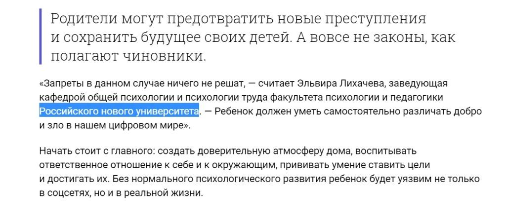
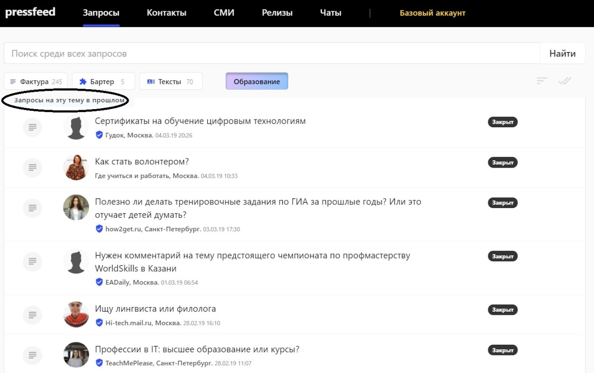

Российский новый университет (РосНОУ) — один из крупнейших частных вузов России — входит в сотню лучших высших школ страны, недавно вошел в международный рейтинг QS BRICS. В нем учится более 15 тысяч студентов, всего в вузе 7 институтов.

## Почему вузу необходимо сотрудничать со СМИ

Ректор РосНОУ Владимир Алексеевич Зернов считает, что университет должен быть максимально открытым и публичным. Именно публичность дает вузу возможность продемонстрировать свою экспертность, профессионализм, компетенции.

> Университет, о котором никто не слышал, не может вызывать доверие будущих студентов. Публикации в медиа — это часть нашей репутации. К тому же, выходы в СМИ влияют на поток поступающих. Очень многие родители первокурсников, например, обратили внимание на публикацию первого рейтинга вузов от Forbes, отметили, что видели нас там. А от потока поступающих, в конце концов, зависит основной доход университета.

Более того, публичность меняет отношение к нам со стороны потенциальных преподавателей, уважаемых ученых. Нельзя отставать от повестки дня, мы хотим быть «в теме», чтобы нас знали, чтобы люди хотели учиться и работать у нас.

Пресс-служба университета — некий мостик между научным сообществом и общественностью. В месяц пресс-служба инициирует примерно 10-15 публикаций с участием экспертов вуза.

## Как выйти на крупные СМИ, включая редакцию «Первого канала» и «России 1»

Работа пресс-службы университета нацелена на 4 формата СМИ:

* федеральные общественные СМИ,
* московские СМИ,
* региональные СМИ,
* отраслевые СМИ.

Есть два пути, как публиковать материалы с комментариями экспертов вуза: один — простой и быстрый, второй — более сложный и требующий значительных затрат сил и времени. Однако чтобы получить реальный результат в виде большого количества публикации в СМИ, нужно идти двумя путями одновременно.

#### Первый путь — специальные сервисы, где журналисты сами оставляют свои запросы

Мы пользуемся сервисом [Pressfeed](https://pressfeed.ru/). Ежедневно мониторим новые запросы и выбираем актуальные для нас. Отвечать стараемся быстро, ведь если запрос срочный, то от момента ответа журналисту до публикации в СМИ могут пройти всего лишь сутки. Можно написать журналисту ответ в специальном поле на сервисе, но порой удобнее приложить в комментарии к запросу документ с готовым текстом от эксперта.

Именно через Pressfeed мы завязали отношения с «Первым каналом». Программа «Доброе утро» постоянно размещает на сервисе запросы (на момент написания статьи программа опубликовала на платформе более 2680 запросов) и часто интересуется образовательной тематикой.

[_Запрос_](https://pressfeed.ru/query/31520) _на Pressfeed_

Мы делали совместные репортажи об особенностях приемной кампании, были сюжеты об иностранных студентах и их жизни в России, о диалектах русского языка, о том, как распознать фейковый диплом или купленный реферат и многие другие. Особенность сотрудничества с «Добрым утром» в том, что там десятки продюсеров, всегда звонят с нового номера и новый человек, но общение сложилось такое теплое, что даже с любым их сотрудником получается работать быстро и продуктивно.

С помощью Pressfeed мы познакомились с редакцией издания «Коммерсантъ»: увидели [их запрос](https://pressfeed.ru/query/23475) и сделали вместе отличный материал про образовательный soft и online-обучение.

  
[_Запрос_](https://pressfeed.ru/query/23475) _от «Коммерсантъ»_

[_Публикация_](https://www.kommersant.ru/doc/3083077) _с участием РосНОУ_

Также мы работали с крупнейшей площадкой о технологиях Hi-tech.mail.ru. Заведующий одной из кафедр университета отвечал на весьма интересный вопрос: как уберечь детей от пагубного влияния социальных сетей.

  
[_Запрос_](https://pressfeed.ru/query/39543) _от Hi-tech.mail.ru_

[_Фрагмент публикации_](https://hi-tech.mail.ru/review/vliyayut-li-socialnye-seti-na-povedenie-podrostkov/#a07) _с участием эксперта вуза_

В другой раз комментарий эксперта РосНОУ вышел в издании «Эксперт Урал». Журналист собирал статистику о результатах приемных кампаний в различных вузах. Мы не могли пройти мимо такого запроса.

  
[_Запрос_](https://pressfeed.ru/query/23225) _от издания «Эксперт Урал»_

[_Публикация с участием компании_](http://www.acexpert.ru/archive/nomer-37-701/komu-korochki-inzhenera.html)

Всего примерно 25 % всех упоминаний в месяц мы делаем через сервис Pressfeed. На нем удобно и быстро находить все запросы по теме «Образование». Нужно выбрать фильтр в разделе [«Запросы»](https://pressfeed.ru/all-queries), и система покажет то, что нужно.

_Поиск запросов по отраслевому фильтру_

Если в определенный момент запросов по этой теме нет, то можно посмотреть архивные запросы.

  
_Архивные запросы_

Зачем смотреть закрытые запросы? Чтобы понять, на какие тематики пишет тот или иной журналист, или найти новое издание. Дальше можно написать журналисту в чат на сервисе, рассказать о своей компании и экспертах, предложить темы для совместных публикаций.

Кроме того, обязательно следите за рекомендациями к актуальным для вас запросам. Иногда там можно обнаружить интересные запросы, которые мы пропустили по каким-то причинам.

  
_Рекомендации по запросам_

#### Второй путь — работа напрямую с редакциями изданий

Это сложный, долгий, но эффективный способ найти свое место в медиа. Неважно, как вы вышли на журналиста: через сервисы запросов, нашли его почту на сайте, добавились в Facebook… Нужно завязать отношения, подружиться, изучить потребности.

В целом мир Public relations — это мир взаимовыгодного сотрудничества. Вы даете журналисту полезную информацию, а он пишет о вас в издании. По-другому никак, по крайней мере, если вы хотите появляться в крупных медиа без вложения денег. Поэтому мы выявили ряд тематик, которые интересуют журналистов практически всегда.

**1. Статистика**. По любым образовательным вопросам: сколько человек поступило, какие направления подготовки набирают популярность, а какие теряют, интересы современных студентов и так далее. Из последнего: мы проработали упоминание в [«Известиях»](https://iz.ru/783226/2018-08-29/budushchie-pedagogi-ne-khotiat-zanimatsia-problemnymi-detmi) в материале о цифрах приема 2018. Статистика — это беспроигрышный вариант: практически каждая крупная компания может привести какую-либо статистику, которая заинтересует журналистов.

> СМИ любят цифры! Если у вас есть интересная цифра, обязательно предложите ее изданию.

**2. Экспертные прогнозы на будущее.** Обычно их дают наши ученые, высшее руководство вуза. Если тема актуальна для общества, то СМИ обязательно захотят вставить в материал прогноз от эксперта. Из свежих примеров: ректор РосНОУ прокомментировал состояние негосударственных вузов в России, предположил, что их ждет в будущем для[ «Российской газеты»](https://rg.ru/2017/08/20/kakie-vuzy-nakazal-rosobrnadzor.html).

_Публикация с участием с РосНОУ_

**3. Крупные события, открытия.** В каждой отрасли происходят важные события, но иногда компании не осознают их значимость. Не молчите, расскажите о них миру. К нам в [университет приезжал Микаэль Нобель](https://rg.ru/2017/10/24/nobelevskuiu-premiiu-budut-prisuzhdat-za-alternativnuiu-energetiku.html) (внучатый племянник Альфреда Нобеля) и объявил, что скоро появится новая научная премия, посвященная заслугам в области устойчивого развития человечества и сохранения окружающей среды.

## Что дают публикации в медиа частному вузу

У нас сейчас нет жестких KPI по публикациям, обычно в конце лета идет спад, а в начале осени — наоборот, шквал запросов. Однако дело не в количестве, а в качестве. Например, в июне 2018 года мы сделали 11 публикаций. Среди них были и интервью ректора «Российской газете», комментарий для Snob.ru, программа на «Радио России» с участием ректора, новости со Среднерусского экономического форума, в котором участвовал ректор и другие. 

Публикации показывают наши абитуриентам, студентам, ученым, профильным ведомствам, что мы передовой современный вуз, мнение которого важно для общества.

> В 2018 году на очную форму обучения по программам бакалавриата и специалитета в поступили на 27 % больше, чем в прошлом году. По нашей статистике, около 10 % поступивших в РосНОУ в 2018 году узнали об университете из СМИ.

Сложно провести параллели между количеством абитуриентов и количеством публикаций (или это тема для интересной диссертации), но это факт, что все больше школьников выбирают Российский новый университет для получения высшего образования. Поверьте, узнаваемость, доверие потенциальных абитуриентов, преподавателей — это не пустые слова, особенно для негосударственного университета.