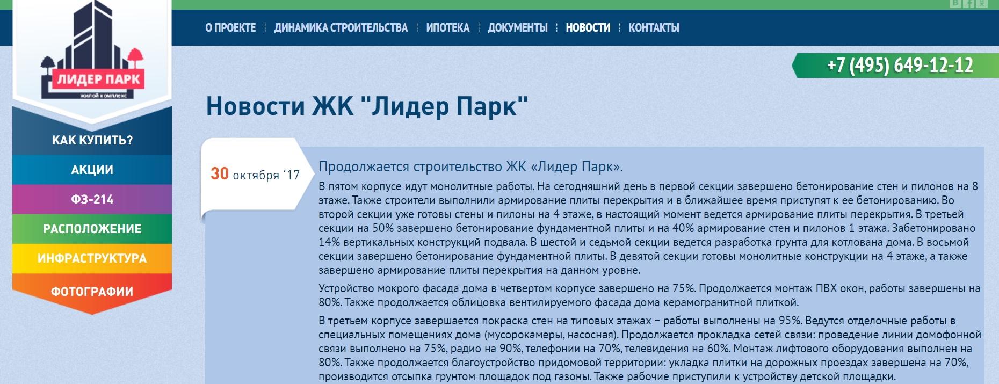
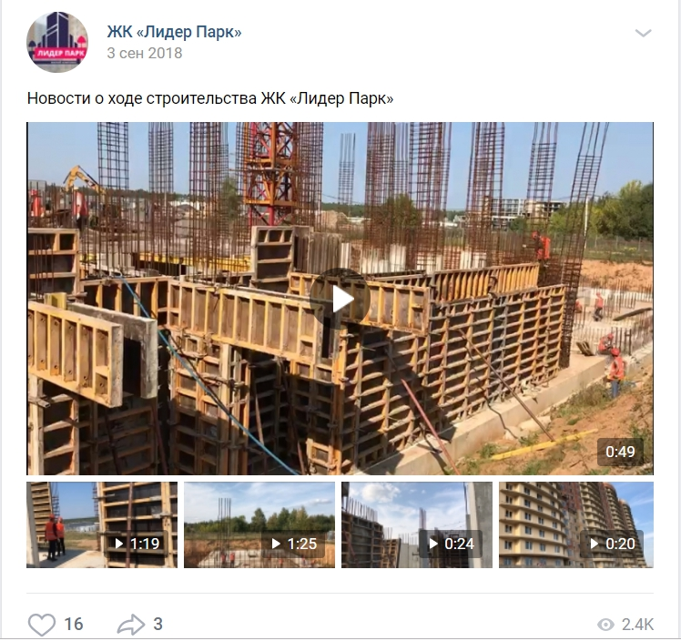
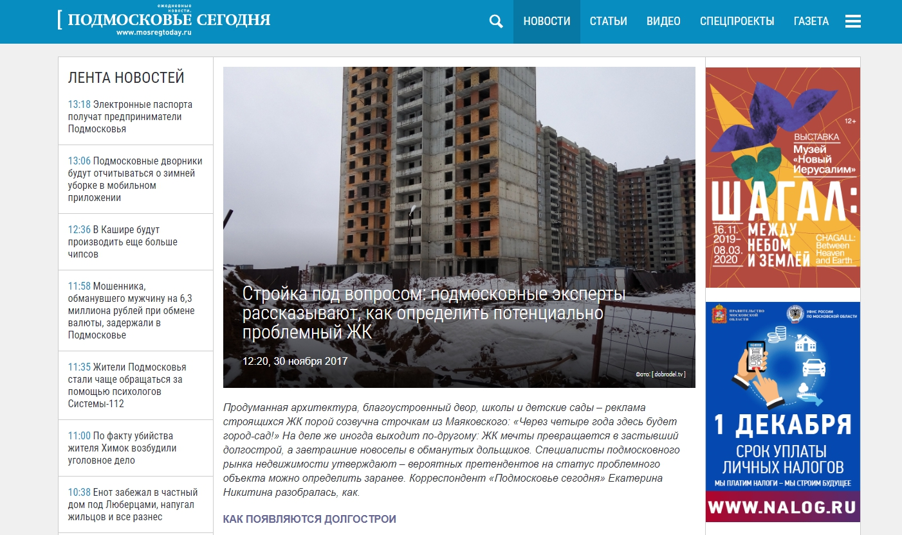
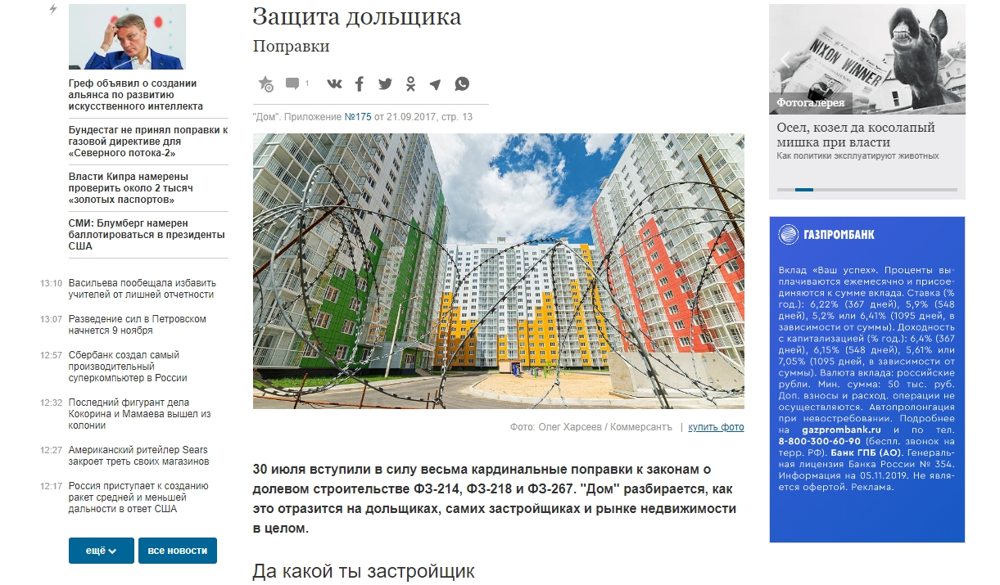
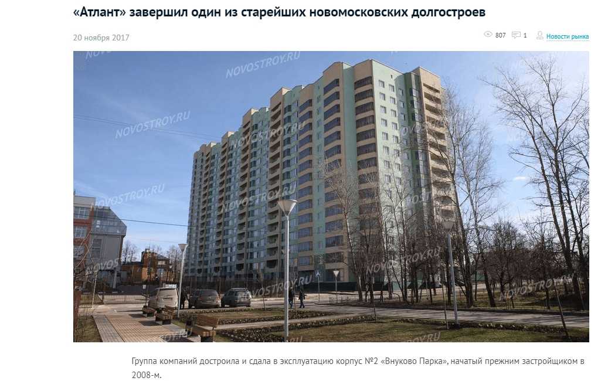
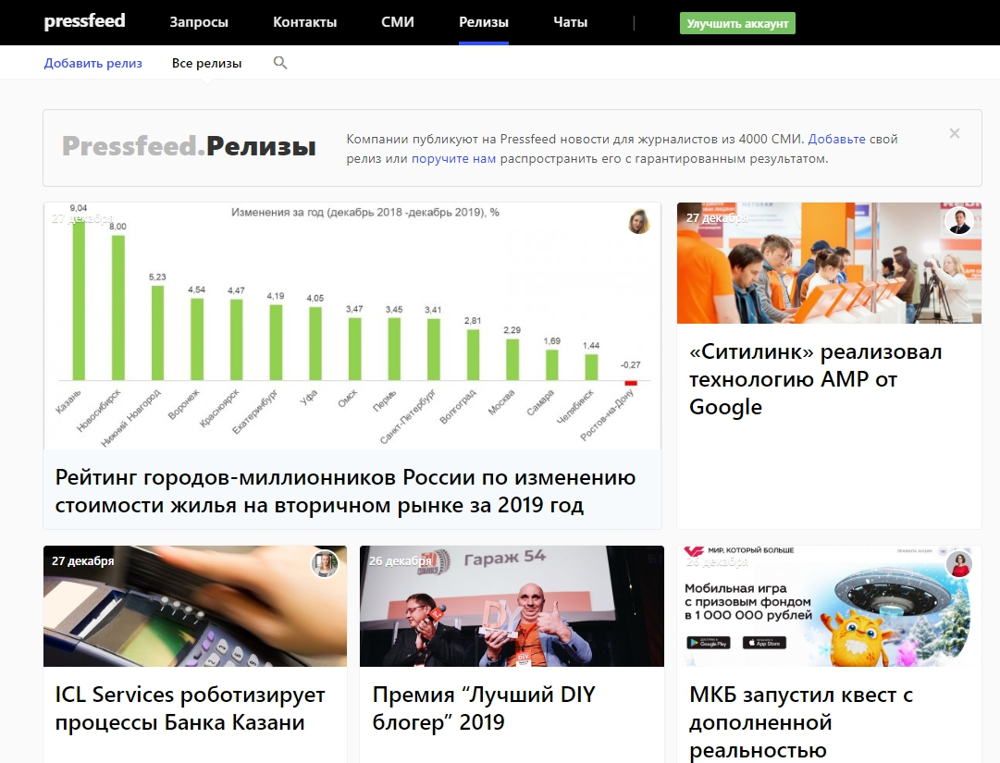
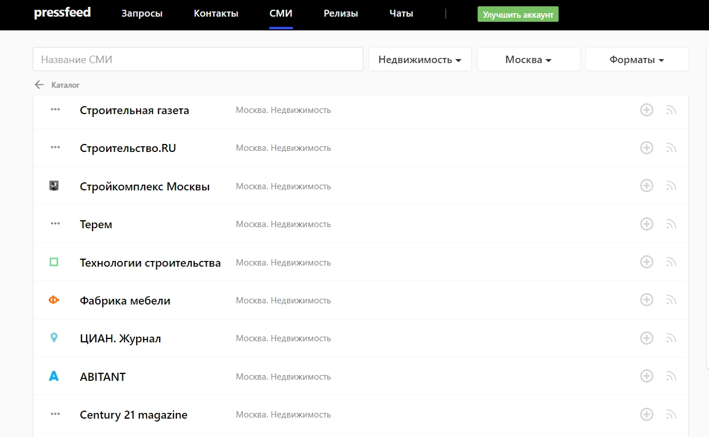

## Проблема

В 2017 году девелоперский холдинг «Атлант», который занимается строительством домов в Московском регионе, оказался в кризисной ситуации: в связи с общей экономической ситуацией после 2014 года стройка шла очень медленно, сроки по сдаче объектов затягивались, а дольщики не могли получить свои квартиры вовремя. В это же время СМИ и социальные сети были переполнены негативной повесткой, связанной с девелопером: различные издания писали о том, что компания банкротится, не несет никакой ответственности, что обманутые дольщики останутся без жилья и тому подобное.

Продажи компании упали до нуля: разумеется, из-за подобных слухов новые клиенты не хотели покупать квартиры в ЖК этого застройщика. В реальности же новости не соответствовали действительности: строительство шло, хоть и отставало от запланированных сроков, а ГК «Атлант» не собирался банкротится и обманывать ни дольщиков, ни будущих покупателей.

## Решение проблемы

Чтобы восстановить репутацию и вернуть продажи, необходимо было действовать через те же самые каналы, через которые распространяется негатив, то есть сотрудничать со СМИ и проводить работу в социальных сетях. Другими словами, подключать инструменты антикризисного пиара и с их помощью изменить мнение дольщиков и потенциальных покупателей о ГК «Атлант».

Цели антикризисной кампании:

* снять напряжение среди дольщиков и убедить их, что они обязательно получат свои квартиры;
* снять негатив в медиа и обществе, доказать потенциальным покупателям, что дома строятся и в ЖК можно покупать квартиры, тем самым возобновить продажи.

Между тем, в сложившейся ситуации девелоперу никто не верил, потому бессмысленно было просто говорить: «Не переживайте, мы все сделаем».

Поэтому было необходимо убеждать аудиторию в честности застройщика только реальными фактами, цифрами, статистикой.

Комплексная работа по выходу из кризиса началась в середине 2017 года. Во время пиар-кампании у ГК «Атлант» было три жилых комплекса, которые были на стадии стройки.

## Что было сделано

В рамках каждой цели был определен список задач и подзадач. Например, цель — снизить напряженность среди дольщиков, задача — показать, что дома сдаются, подзадача — сообщить, что завершено строительство конкретной очереди ЖК.

Под каждую задачу делался комплексный план, включающий разные виды контента.

В целом работу можно поделить на **шесть** **направлений**.

**1. Регулярная публикация новостей на сайте и в социальных сетях**

До старта пиар-кампании новости на сайте звучали примерно так: «Стройка завершена на 76%», «Стройка завершена на 85%». Эти новости не были конкретными и выпускались довольно редко, так как строительство шло медленно. Дольщики и потенциальные покупатели не понимали, что на самом деле происходит на площадке, сколько еще ждать сдачи дома.

Мы стали делать другие новости — очень подробные и понятные:

«В первой секции завершено бетонирование стен и пилонов на 8 этаже. Также строители выполнили армирование плиты перекрытия и в ближайшее время приступят к ее бетонированию. Во второй секции уже готовы стены и пилоны на 4 этаже, в настоящий момент ведется армирование плиты перекрытия. В третьей секции на 50% завершено бетонирование фундаментной плиты и на 40% армирование стен и пилонов 1 этажа...»

_Пример новости_

То есть описывалась каждая мелочь, каждая деталь, а новости на сайте появлялись каждый день или через день. Так мы могли держать аудиторию в курсе событий. Они понимали, что стройка идет.

Помимо этого, среди дольщиков были инициативные люди, которые вели специальные группы в социальных сетях (такие обычно создают будущие жители ЖК, чтобы общаться с соседями и решать какие-то вопросы, связанные с домом). Они находили информацию с новостями стройки и распространяли ее в своих группах. Так, многие дольщики узнавали о происходящем не от лица застройщика, а от лица таких же дольщиков, и, конечно, это вызывало больше доверия.

**2. Публикация видео в социальных сетях**

Отдельно мы вели социальные сети каждого жилого комплекса: мы тоже выкладывали в них новости, но еще более конкретные — в формате видео с комментариями представителя ГК «Атлант».

Это были не какие-то рекламные ролики, а подробные видеоотчеты со стройки с объяснениями, как движется процесс.

_Пример поста в соцсети_

Это был способ более наглядно продемонстрировать, что стройка не заморожена, что у девелопера есть средства, чтобы продолжать строительство. Такие видео имели значение и для потенциальных клиентов и вселяли в них уверенность, что здесь можно покупать квартиры.

**3. Публикации, посвященные делам компании, в больших федеральных и региональных СМИ**

Одна из самых важных задач заключалась в том, чтобы изменить сложившийся благодаря СМИ образ ГК «Атлант» — из недобросовестного застройщика, который обманывает дольщиков (что не являлось правдой), превратить его в профессионального девелопера, который несет ответственность за свои проекты и собирается довести начатое до конца.

Очевидно, что федеральные и региональные СМИ не стали бы публиковать хвалебные статьи о компании, а статьи «на правах рекламы» вызвали бы еще большее раздражение дольщиков и точно бы не вызвали доверия потенциальных покупателей. Поэтому мы встраивали комментарии от имени директора ГК «Атлант» в текущую повестку и освещали общую ситуацию на строительном рынке, ссылались на разные исследования и вставляли примеры из практики компании.

На тот момент около 70% домов в Московском регионе сдавались с задержками, и мы пытались объяснить причины переносы сроков и то, что если девелопер сдвинул сдачу дома — это не значит, что стройка встала навсегда и застройщик обанкротился. В этих же материалах могли аккуратно упомянуть свои проекты в формате комментариев «в этом месяце завершили строительство дома X. Изначально планировали, что стройка займет Y месяцев, кризис увеличил этот срок на Z%».

Например, в издании «Подмосковье сегодня» говорили о том, что спрогнозировать сроки на начальном этапе реализации проекта удается не всегда.

  
[_Публикация в «Подмосковье сегодня»_](https://mosregtoday.ru/econbiz/strojka-pod-voprosom-podmoskovnye-eksperty-rasskazyvayut-kak-opredelit-potencialno-problemnyj-zhk/)

Или же участвовали в материале «Коммерсанта», который был посвящен поправкам к законам о долевом строительстве.

  
[_Публикация в «Коммерсанте»_](https://www.kommersant.ru/doc/3414879)

Со знакомыми журналистами, с которыми уже были налажены контакты, общались напрямую, в то же время мониторили запросы, касающиеся недвижимости и строительства, на сервисе [журналистских запросов Pressfeed](https://pressfeed.ru/?utm_source=delovoy-mir&utm_medium=content&utm_campaign=case&utm_content=pr-stil). Это платформа, на которой бесплатно регистрируются сотрудники изданий и эксперты или пиарщики компаний. Журналист выкладывает запрос с информацией — комментарий какого эксперта ему нужен для статьи либо какой герой нужен для съемок телесюжета или эфира на радио. Пиарщик / эксперт отвечает в установленный срок, а дальше журналист сам решает, с кем он будет работать, чей комментарий попадет в финальную публикацию. Поэтому задача пиарщика – сделать хороший экспертный комментарий, который действительно поможет журналисту в подготовке материала.

Регистрация на сервисе бесплатная для всех, но базовый аккаунт имеет значимые ограничения — можно отвечать всего на 3 запроса в месяц, нельзя общаться с журналистами во внутренних чатах. Для эффективной работы со СМИ лучше подключить PRO-аккаунт (цена тарифа «Эксперт» — около 3,5 тыс. рублей в месяц).

На Pressfeed нас интересовали любые запросы от общественно-политических, деловых, отраслевых площадок (всего на сервисе работают около 5 тысяч изданий, включая «Коммерсатъ», Forbes, «Ведомости» и так далее), которые даже косвенно связаны с новостройками, ипотеками и так далее. Это был еще один способ получить позитивное упоминание компании «Атлант» в СМИ.

Например, вот запрос от «Российской газеты» — журналист собирал информацию и мнения экспертов о страховании дольщиков.

[_Пример запроса от «Российской газеты»_](https://pressfeed.ru/query/31629)

**4. Публикация новостей проекта в отраслевых изданиях**

Параллельно мы рассылали основные новости проектов в отраслевые площадки (сайты о новостройках, ресурсы по выбору недвижимости и т. д.). Например, делали пресс-релизы о завершении строительства конкретного дома, релизы о том, что компания за полгода построила столько-то метров жилья (домов/квартир).

  
[_Публикация в «Риа Новости. Недвижимость»_](https://realty.ria.ru/20180710/1524296146.html)

Эти публикации были направлены в первую очередь на тех, кто планирует покупку квартиры, ищет подходящий жилой комплекс, интересуется новостями новостроек в Московском регионе. С одной стороны, такие тексты интересны отраслевым СМИ, поскольку они освещают события на рынке. С другой потенциальные покупатели убеждаются в том, что проекты живут, что с застройщиком все в порядке.

[_Публикация на сайте Novostroy_](https://www.novostroy.ru/news/market/atlant-zavershil-odin-iz-stareyshikh-novomoskovskikh-dolgostroev/)

Кстати, на Pressfeed тоже можно размещать пресс-релизы в [специальном разделе ](https://pressfeed.ru/releases)— и они сразу будут доступны всем журналистам и редакторам, которые используют сервис. Это еще один способ получить дополнительную публикацию в медиа.

  
_Раздел «Pressfeed.Релизы»_

**5. Публикации с советами общего характера на отраслевых сайтах или рубриках, посвященных недвижимости**

Также мы писали материалы и давали комментарии для профильных площадок, в которых были перечислены общие советы для тех, кто собирается покупать жильё в новом доме.

Например, как заранее понять, что застройщик добросовестный, что делать, если сроки сдвинулись, в каких случаях не стоит паниковать, что требовать от девелопера в случае задержки и так далее.

  
[_Публикация в «Интерфаксе недвижимость»_](https://realty.interfax.ru/ru/analytics/comments/90054/)

Публикации делали и напрямую через редакции, и через сервис Pressfeed. Например, сотрудничали с площадкой ProNovostroy.ru.

  
_Пример запроса на Pressfeed от сайта ProNovostroy_

Более того, в данном проекте сервис Pressfeed часто помогал нам выходить на новые профильные площадки — ресурсы о недвижимости появляются постоянно, и даже если изначально они небольшие, их нужно иметь в виду и поддерживать с ними связь.

Можно зайти в базу СМИ, установить фильтры (например, отрасль и город — для нас это были «Недвижимость» и «Москва») и выбрать несколько площадок. Затем написать в редакцию прямо на Pressfeed через внутренние чаты (эта функция доступна только пользователям Pro-аккаунта).

  
_СМИ о недвижимости в Москве_

Так или иначе, чем больше упоминаний ГК «Атлант» появлялось на различных сайтах о недвижимости, тем проще было доказать общественности, что застройщик жив, он готов быть открытым и честно рассказывать о том, что происходит в строительной отрасли.

**6. Интервью с руководителем компании**

Еще одно направление работы — выпуск интервью с генеральным директором ГК «Атлант» как в федеральных, так и в отраслевых изданиях.

В интервью важно было честно рассказать о том, как девелопер преодолевает нагрянувший кризис, какие действия он предпринимает, чтобы выполнить обязательства перед дольщиками, откуда он сейчас берет средства на строительство.

  
[_Интервью с Романом Лябиховым_](https://finance.rambler.ru/realty/41120447-roman-lyabihov-gk-atlant-mnogie-iz-uspeshnyh-developerov-uzhe-nauchilis-effektivno-rabotat-dazhe-v-usloviyah-ogranichennogo-sprosa/)_, которое вышло в «Едином реестре застройщиков» и на «Рамблер. Финансы»_

Интервью делали по договоренностям с определенными редакциями, а один раз увидели актуальный запрос на Pressfeed от деловой площадки «Первый неофициальный» и поработали с ними.

  
[_Запрос на Pressfeed_](https://pressfeed.ru/query/41160)

Во всех интервью необходимо было также сосредотачиваться на фактах и не скрывать правду, только так мы могли добиться результата.

## Итоги работы за год

Напомним, что в середине 2017 продажи упали практически до нуля. В каких-то проектах даже пришлось вообще отказаться от продаж.

Но благодаря комплексу пиар-действий, регулярным публикациям в социальных сетях и СМИ (мы делали более 100 упоминаний в медиа ежемесячно), компания смогла выйти из кризиса и восстановила репутацию среди дольщиков и покупателей. При этом такой результат невозможно было бы получить без хорошего взаимопонимания с руководством ГК «Атлант» и без его активного участия. Это результат коллективной работы компаний PR-стиль и ГК «Атлант».

Осенью 2018 года продажи возобновились во всех проектах, а к 2019 году они выросли до среднерыночных показателей. После этого мы стали вести стандартную кампанию по пиар-поддержке продаж и репутации.