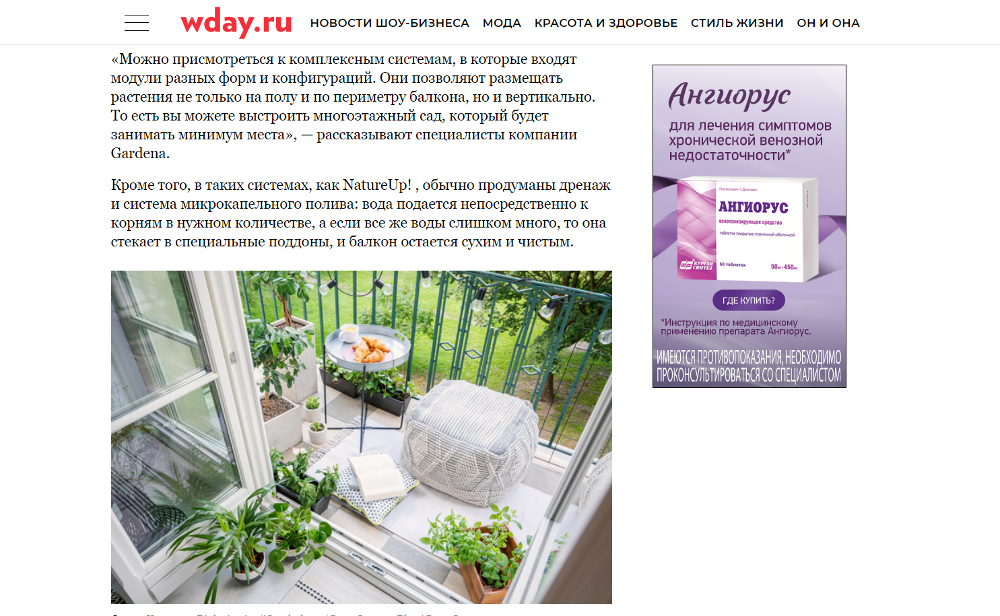
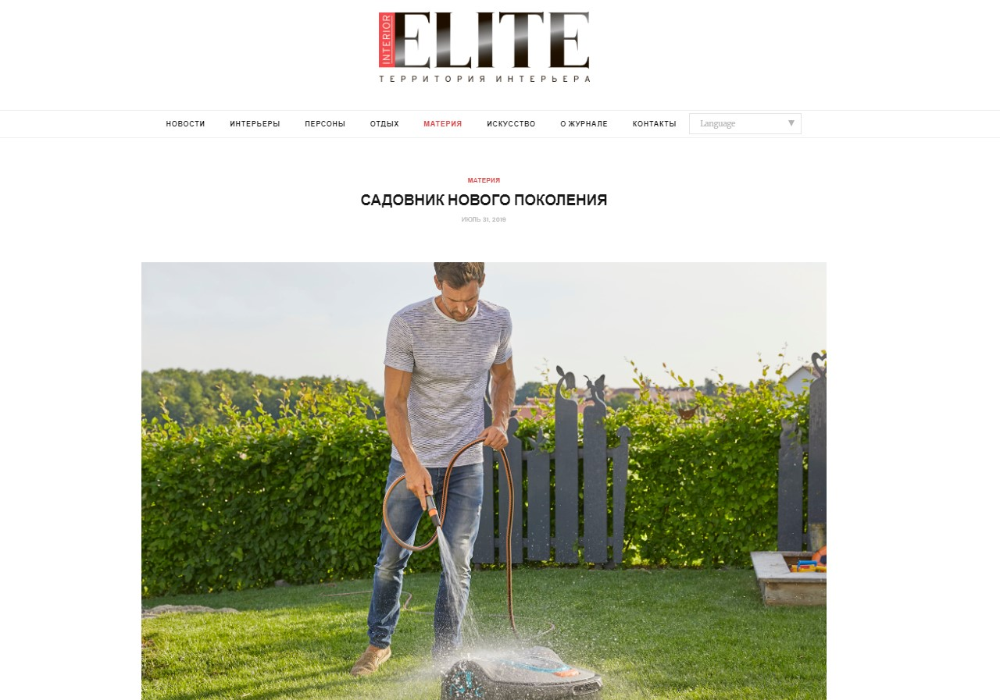
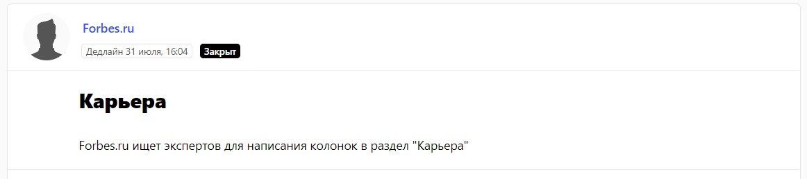
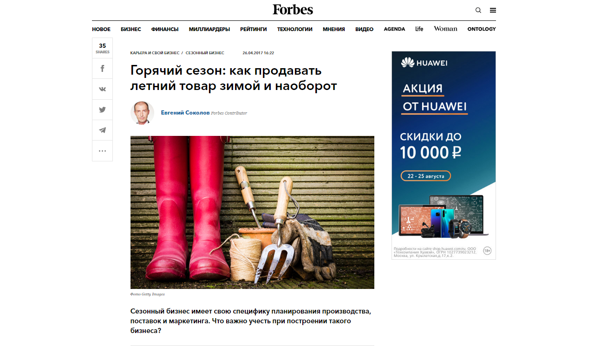
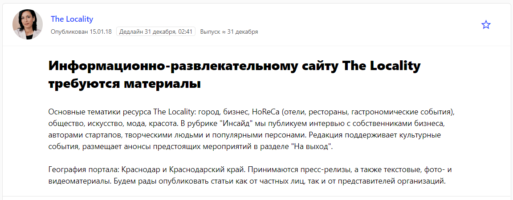
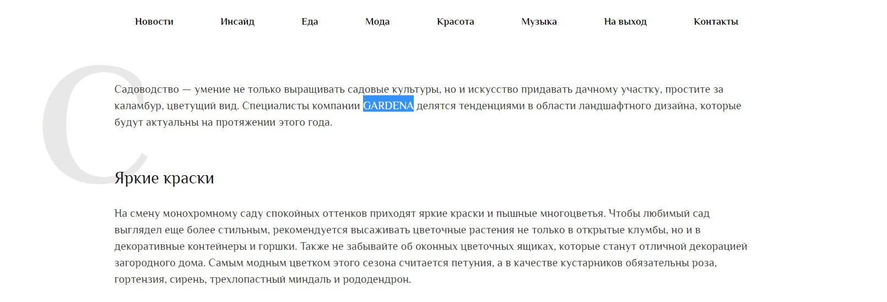
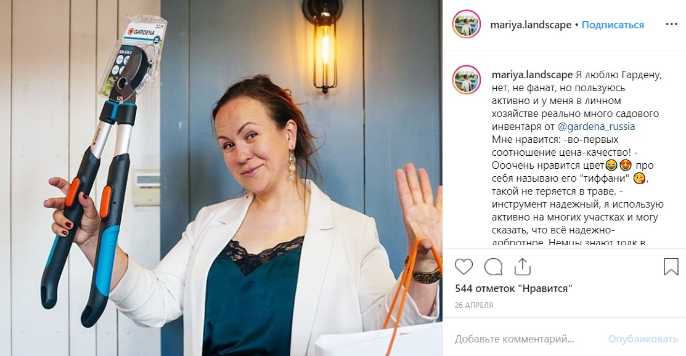
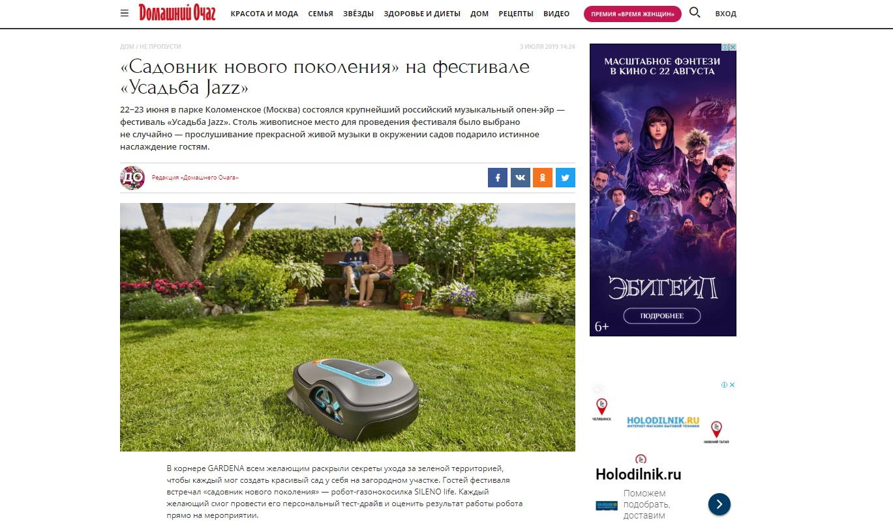

Наше коммуникационное агентство Redline уже более 3 лет работает с брендом GARDENA ㅡ немецким производителем оборудования для сада. Мы занимаемся комплексным пиаром компании на территории России. Среди основных задач агентства сделать так, чтобы о бренде узнало как можно больше представителей целевой аудитории, то есть тех людей, которые занимаются садоводством, имеют загородный дом, любят проводить время на даче и так далее.

Все пиар-активности направлены на то, чтобы у потребителя появилась ясность в отношении продукта. Стоит иметь в виду, что при продвижении зарубежного бренда на российском рынке необходимо обязательно адаптировать все ключевые сообщения под местные реалии. Здесь не обойтись переводом пресс-релизов, которые нам присылает головной офис компании. Нужно выцеплять из этих материалов то, что точно не вызовет сомнения нашего пользователя, а наоборот, заинтересует его. Нельзя закрывать глаза на экономическую ситуацию в стране и в целом на бэкграунд жителя России. Поэтому нам как команде, которая занимается продвижением бренда, важно не просто сообщить о новинке, а доказать целевой аудитории, что использовать, например, робот-газонокосилку GARDENA — это удобно, безопасно, экономит время.

Благодаря пиару потенциальный клиент уже сам сделает правильный вывод и выбор. И мы однозначно можем сказать, что PR влияет на продажи, даже если это не так очевидно, как с классической рекламой. Человек всегда более охотно принимает решение о покупке, когда он доверяет бренду и знает о продукте от и до. А доверие и знание появляются у него благодаря хорошему пиар-продвижению.

## PR-инструменты для продвижения бренда GARDENA

PR-инструментов крайне много, но лучше выбрать 3-4 основных и вложить силы в них. Ведь формат подачи, настроение и интонации, оригинальность идеи, канал коммуникации — все будет влиять на финальный результат.

Для продвижения GARDENA мы определили три главных способа взаимодействовать с целевой аудиторией:

1. классический инструмент в онлайн/офлайн формате: **публикации в интернет-медиа и печатных СМИ**. Мы выпускаем нативные материалы с упоминанием бренда на лайфстайл, на отраслевых (сад, архитектура, дизайн) и бизнесовых площадках;
2. оригинальный онлайн-формат: **реалити-шоу с участием блогеров**-профессиональных садоводов. Они тестируют продукцию бренда и участвуют в соревнованиях, а победитель получает технику от GARDENA;
3. классический инструмент в офлайн-формате: **тест-драйв новинки** от GARDENA для всех желающих на масштабном музыкальном фестивале в Москве. В 2019 году эта была интеграция в фестиваль «Усадьба Jazz».

Так, благодаря контенту различного формата и нескольким каналам коммуникации, пиар обеспечивает бренду максимальный охват целевой аудитории. Все действия направлены на достижение одних и тех же целей: создание имиджа бренда, знакомство потребителей с продуктами компании и создание мотивации у ЦА купить определенный продукт.

Теперь расскажем о каждом инструменте подробнее.

## Публикации в СМИ — основа пиар-продвижения

Работа со СМИ — основа основ PR-коммуникации. Да, сейчас социальные сети конкурируют с классическими медиа, но все же это разные инструменты: нельзя забывать ни об одном из них. Публикации в СМИ лучше всего работают на узнаваемость и репутацию бренда и будут работать, если и не всегда, то на наш век хватит.

Мы, как и положено PR-агентству, годами работаем со СМИ и налаживаем отношения с журналистами. Они обращаются к нам сами, мы предлагаем им темы для статей, а также параллельно обязательно следим за актуальными запросами на [сервисе журналистских запросов Pressfeed](https://pressfeed.ru/).

В целом, есть два правила, которые помогают любой компании успешно взаимодействовать с разными изданиями:

1. надо правильно выбирать СМИ под каждый инфоповод. Бессмысленно рассылать релиз о том, что у нас обновилась линейка ручного инструмента, по деловым СМИ;
2. залог успеха — это индивидуальный подход. Важно уточнять у редакций приоритетные темы, предлагать креативные интеграции и материалы (а не шаблонные продуктовые релизы, хотя и они имеют право на жизнь, но только если продукт очень инновационный).

При работе со СМИ мы делим все издания на три эшелона по приоритетности для каждого бренда, где первый эшелон — ключевые для нас медиа. Прежде чем обратиться в новое издание, мы определяем его место в одном из трех эшелонов: смотрим на его рейтинг среди конкурентов, посещаемость или тираж (в зависимости от того, принт это или онлайн), среднее количество просмотров, комментарии (если есть возможность комментировать) и так далее. Если площадка относится к первому или второму эшелону, то мы пишем в редакцию, пытаемся определить такие темы, которые будут актуальны для издания и полезны для бренда. Обычно мы не платим за публикации, хотя бывают и рекламные материалы.

Например, публикация в лайфстайл-издании для женщин Wday.ru. В ней ландшафтный архитектор рассказал о том, как обустроить мини-сад на балконе, при этом автор советовал использовать систему микрокапельного полива, которая есть в линейке GARDENA.

[_Статья на сайте Wday.ru_](https://www.wday.ru/dom-eda/dacha/travy-ovoshi-cvety-kak-ustroit-mini-sad-na-balkone/)

Также мы активно сотрудничаем с отраслевыми площадками о дизайне, интерьере, дачной жизни. Вот материал в издании ELITE — это в большей степени рекламная статья о роботе-газонокосилке.

  
[_Публикация на сайте ELITE_](http://elite-mag.ru/materiaa/6681-sadovnik-novogo-pokolenija.html)

Для повышения репутации важны статьи и в крупных деловых изданиях. Даже если публикация не рекламирует какой-то продукт напрямую, а, например, управляющий партнер рассказывает о самом бизнесе в Forbes, это привлекает внимание других предпринимателей к бренду. Они могут захотеть заниматься дистрибьюцией товаров бренда или при покупке для своих домашних нужд вспомнят именно о GARDENA.

На тот же самый Forbes, куда мечтают попасть, пожалуй, все эксперты, мы вышли через [сервис журналистских запросов Pressfeed](https://pressfeed.ru/). С Pressfeed работа идет так: журналист или редактор размещает на платформе запрос на комментарий или на поиск автора для полноценной статьи. Если запрос подходит по тематике, то мы отвечаем, что хотим участвовать. Дальше договариваемся о деталях. Изначально регистрация на сервисе бесплатная, но функционал на нем сильно ограничен: на базовом аккаунте можно отвечать всего на 3 запроса в месяц. Откровенно говоря, этого недостаточно, чтобы получить результаты от публикаций в СМИ. Лучше подключить платный аккаунт — в нем больше удобных возможностей, например, можно отвечать на неограниченное количество запросов. У нас в Redline подключен самый продвинутый аккаунт «Агентство», ведь Pressfeed помогает нам делать публикаций для всех клиентов агентства, а не только для GARDENA.

  
[_Запрос от Forbes_](https://pressfeed.ru/query/32265)

Редактор издания искал экспертов для написания полноценных колонок. Конкретной темы указано не было. Мы связались с изданием, представили спикера от бренда GARDENA, предложили написать о специфике продаж сезонного продукта. Затем составили план публикации, согласовали с редакцией. В итоге вышла статья «Горячий сезон: как продавать летний товар зимой и наоборот».

  
[_Статья в Forbes_](https://www.forbes.ru/karera-i-svoy-biznes/343417-goryachiy-sezon-kak-prodavat-letniy-tovar-zimoy-i-naoborot)

> На Pressfeed зарегистрировано более 4,5 тысяч изданий, поэтому порой только через платформу получается выйти на новые, незнакомые ранее отраслевые или lifestyle-ресурсы. Так было с площадкой The Locality, редакция которой находится в Краснодарском крае.

Мы подумали: так, Краснодарский край — это лучшее место в России для жизни за городом, целевая аудитория наша, наверняка, жителям региона будет полезно узнать о садовой технике GARDENA.

  
[_Запрос от The Locality_](https://pressfeed.ru/query/39216)

Опять же договорились, отправили материал, текст вышел в рубрике «Инсайд».

  
[_Статья с упоминанием бренда_](https://the-locality.ru/gardena/)

Еще один эффективный способ получить десятки публикаций о компании — организовать пресс-конференцию. В последний раз мы сделали fashion-показ с участием моделей, которые демонстрировали оборудование GARDENA.

Всего с начала 2019 года в свет вышло около 500 публикаций с упоминанием бренда GARDENA (на август 2019 года).

## Реалити-шоу «Мой сад» с участием блогеров

Мы организовываем реалити-шоу «Мой Сад» GARDENA уже три года подряд, то есть в 2019 году успешно закончился III сезон. В нем приняли участие 5 инстаграм-блогеров — все они профессиональные садоводы или ландшафтные дизайнеры.

Блогерам нужно было тестировать продукцию GARDENA, выкладывать честные отзывы, постить сториз и так далее. За каждое действие начислялись баллы, сумма которых в итоге определяла победителя.

  
_Публикация блогера_ [_@mariya.landscape_](https://www.instagram.com/mariya.landscape/)

Общий охват по проекту составил более 400 тыс. человек, было сделано более 60 постов и 120 сториз в аккаунтах блогеров. Кроме того, реалити-шоу поддерживали онлайн-СМИ, которые размещали новости о старте и итогах проекта — было выпущено 20 публикаций. Таким проектом мы привлекли внимание подписчиков популярных блогеров, а это те люди, которые однозначно интересуются всем, что связано с жизнью за городом. Тем более, аудитория инфлюенсеров доверяет их мнению, а значит, будет доверять и качеству продукции GARDENA.

## Офлайн-продвижение: тест-драйв техники на фестивале в Москве

Бренд GARDENA был партнером музыкального фестиваля «Усадьба Jazz» в парке Коломенское в июне 2019 года.

На фестивале был установлен специальный корнер бренда, где гостей встречал «садовник нового поколения» — робот-газонокосилка SILENO life. Каждый желающий мог провести тест-драйв, посмотреть, как работает робот прямо на траве парка и также послушать рекомендации от представителей бренда о секретах создания сада и ухоженного газона на своем загородном участке.

В этом проекте мы отвечали за коммуникацию со СМИ — приглашали на фестиваль и в корнер журналистов, общались с ними, чтобы в дальнейшем в целевых изданиях вышли пост-релизы о мероприятии.

Например, вот одна из вышедших публикаций на сайте «Домашний очаг»:

[_Публикация на сайте «Домашний очаг»_](https://www.goodhouse.ru/home/ne-propusti_3/sadovnik-novogo-pokoleniya-na-festivale-usadba-jazz/)

## Итоги: что пиар дает бренду

PR-результаты по итогам 2019 года будут подсчитаны только в конце ноября. Если говорить о показателях 2018 года, суммарно в прошлом году агентство инициировало 518 публикаций с упоминанием бренда GARDENA, общий PR Value составил более 14,4 млн рублей, а охват аудитории — более 183 млн человек.

Но даже уже сейчас (сентябрь 2019) мы можем сказать, что итоговые показатели 2019 года будут выше: на данный момент мы уже сделали больше публикаций в медиа, чем в прошлом году.

> За последние несколько лет узнаваемость GARDENA среди целевой аудитории России выросла, и во многом это и есть главная заслуга PR. В дальнейшем мы планируем продолжать работу с отраслевыми СМИ и блогами и при этом делать упор на лайфстайл-издания, чтобы охватывать еще больше представителей целевой аудитории. Думаем, что выйти на многие из них нам поможет сервис Pressfeed.

Все-таки нужно помнить, что инструменты PR не предназначены для прямого влияния на продажи. Достаточно сложно оценить финансовую прибыль от конкретной публикации в СМИ или от мероприятия на фестивале. Ключевой финансовый показатель, который используется для оценки эффективности вложений в PR, — ROI или возврат инвестиций. В случае с GARDENA инвестиции в пиар возвращаются в виде прибыли компании. Первостепенная цель PR — сформировать правильный имидж, проинформировать потребителей о товарах, новинках, услугах и сформировать спрос. И с этим он справляется на отлично.