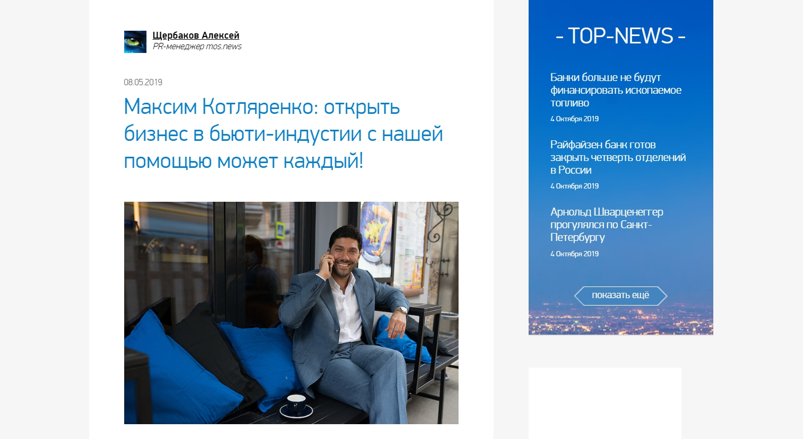
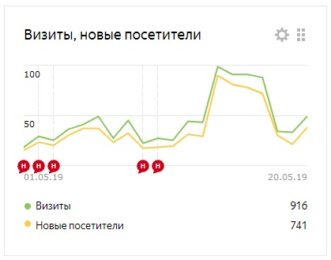
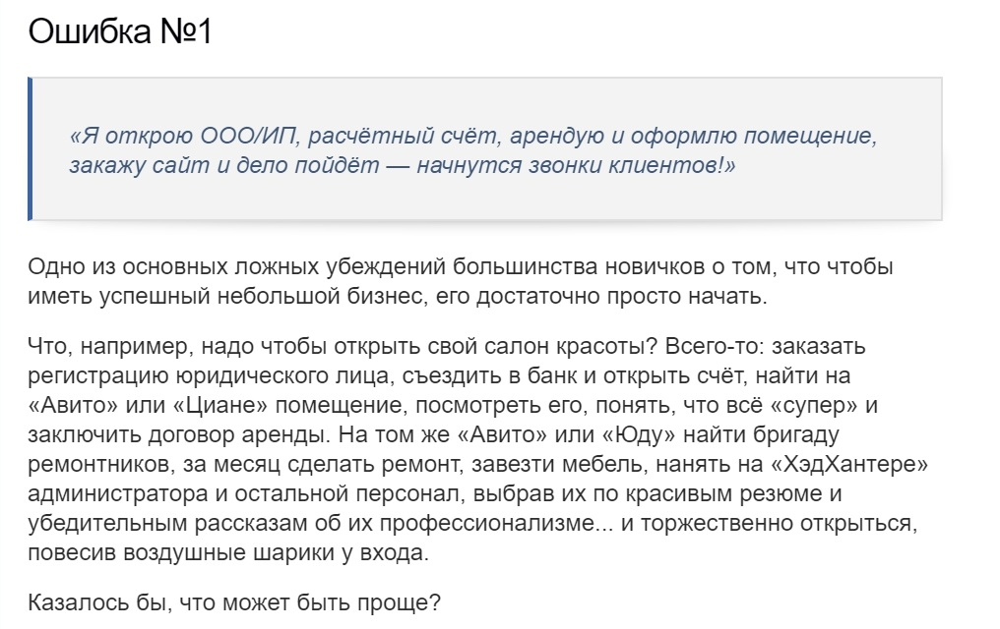
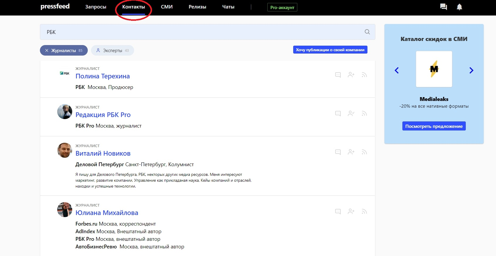
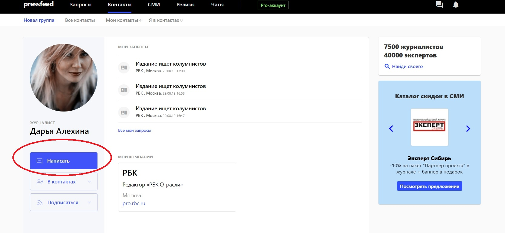
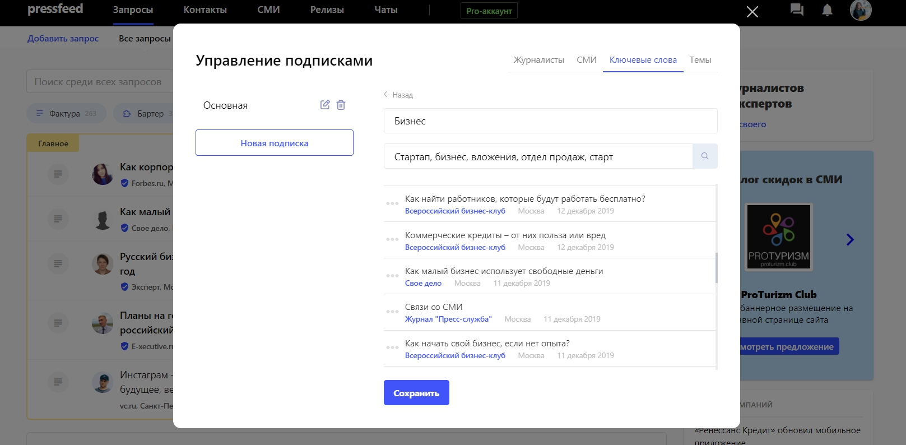

## Как работает маркетинг в компании

Мне не придется долго объяснять, чем мы занимаемся, так как название компании «Стартап под ключ» отвечает на этот вопрос. Мы запускам малый и средний бизнес с нуля и ведем его до печати первого кассового чека. Наши клиенты — это люди, которые имеют желание и финансовую возможность запустить бизнес, но у них либо нет опыта, либо нет времени. Мы же делаем все за них от и до. Отдельно мы оказываем маркетинговые услуги для уже существующих компаний.

Для продвижения бренда «Стартап под ключ» мы всегда использовали комплекс маркетинговых инструментов. Это и оптимизация сайта, и работа с блогерами, и реклама в социальных сетях, и офлайн-выступления. Однако контент-маркетингу внимания практически не уделяли, для нас это был один из каналов в рамках SERM (управление репутацией) и PR.

Мы знали, что контентом нужно заниматься, чтобы развивать лояльность потенциального покупателя, повышать узнаваемость и все в таком духе. Это работает так: потенциальные клиенты натыкаются на статьи на просторах интернета, читают, дополнительно убеждаются в экспертности компании. Мы выпускали материалы в СМИ время от времени, но не продумывали конкретные планы, не ставили KPI, не следили за трафиком. В общем, делали что-то в этом направлении, но без особого энтузиазма.

## Когда мы решили делать больше контента и почему

В мае 2019 года маркетолог «Стартап под ключ» договорился (по своим контактам), что московский портал mos.news опубликует интервью с моим участием.

[_Интервью в mos.news_](https://mos.news/blog/maksim-kotlyarenko-otkryt-biznes-v-byuti-industii-s-nashey-pomoshchyu-mozhet-kazhdyy/)

Интервью сделали, выпустили. И при следующем анализе статистики сайта было видно, что посещаемость сайта компании после выхода этого интервью выросла в 2 раза, отдельно мы вычислили переходы на сайт из внешних источников, то есть по ссылкам из этого материала.

  
_Статистика посещений сайта в мае 2019 года_

С того момента было решено: стоит уделять контент-маркетингу, то есть публикациям на внешних площадках, больше внимания и серьезно заняться проработкой этого направления.

> Стало понятно, что материалы с участием как руководителей, так и других экспертов компании, помогут нам не только формировать положительную репутацию, но и привлекать дополнительный «прогретый» трафик на сайт, а порой и сразу приводить новых клиентов, которые уже готовы заключить договор.

## Дальнейшие действия: о чем писать, где публиковать тексты

Первый шаг по внедрению контент-стратегии — составить список тематик, на которые нужно и важно рассуждать в СМИ от лица компании. Наша основная тема — все, что касается открытия и масштабирования офлайн-бизнеса в России.

Говорим о том, как составить бизнес-план, что лучше — собственный бренд или франшиза, как разобраться с налогами, сколько прибыли приносят компании в разных отраслях и о многом другом. Мы много лет работаем с начинающими бизнесменами и знаем их боли, проблемы, желания — и пытаемся отразить их в текстах и комментариях от лица экспертов «Стартап под ключ».

Что касается изданий, то в приоритете стоят сайты с бизнес-тематикой, при этом пока мы не ставим ограничений и пытаемся зайти как в крупные площадки (Forbes, «РБК»), так и в небольшие («Бизнес.ру», «Бизнес Инсайт» и т. д.). На первых этапах нужно публиковаться как можно чаще, работать на максимум материалов, а затем уже подходить к выбору площадок более тщательно.

## Как делать публикации почти бесплатно

Мы стали действительно серьезно заниматься контентом чуть более 3 месяцев назад. Стартовать хотелось быстрее и скорее начать выпускать как можно больше публикаций с участием компании. При этом не тратить на производство и дистрибуцию какие-то баснословные суммы.

Всем известно, что выстраивать хорошие отношения с редакциями — это дело не одного дня, а иногда переговоры с журналистами ведутся месяцами, особенно, если вас интересует бесплатное сотрудничество. Поэтому мы решили, что классическая пиар-схема по общению со СМИ будет подключена чуть позже, а сейчас эффективнее прибегнуть к технологическим средствам для коммуникации с изданиями — а именно использовать сервисы журналистских запросов.

На данный момент на [сервисе Pressfeed](https://pressfeed.ru/) больше всего подходящих для нас запросов (в среднем на сервисе размещается около 500 запросов ежедневно). Подобные платформы удобны тем, что компании не нужно рассылать письма по редакциям, предлагать темы и экспертов, долго ждать ответа или вообще не получить его. Здесь все прозрачно и понятно: журналист выложил запрос с темой и вопросами, обозначил требования и сроки. Тот, кто пришлет лучший ответ, — развернутый и по делу — и попадет в итоговую публикацию.

На Pressfeed регистрация бесплатная, но на базовом аккаунте много ограничений: отвечать можно всего на 3 запроса за месяц, новые запросы отображаются не сразу. Мы нацелены делать 5-6 публикаций ежемесячно, так что подключили аккаунт «Эксперт», его цена — около 43 тысяч рублей за год. Для маркетинговых бюджетов это смешные деньги.

> Только мы начали использовать сервис, буквально один из первых комментариев — и мы уже в Forbes. Журналист издания интересовался, как живет рынок услуг по отбеливанию зубов.

[_Запрос от Forbes_](https://pressfeed.ru/query/57608)

Я дал комментарий, в котором оценил объемы рынка, а также рассказал, почему спрос на отбеливание зубов только растет.

  
  
[_Фрагмент публикации в Forbes_](https://www.forbes.ru/karera-i-svoy-biznes/379873-gollivudskaya-ulybka-za-3000-rubley-kak-zarabatyvat-milliony-na-bystrom)

Несмотря на то, что комментарий был небольшим, теперь у нас есть выход на Forbes и контакт корреспондента издания.

В другой раз с помощью сервиса мы сделали объемную статью об ошибках при открытии бизнеса. Она вышла на площадке hiterbober.ru — это бизнес-журнал для начинающих предпринимателей, на 100% наша целевая аудитория.

  
[_Запрос от издания_](https://pressfeed.ru/query/58812)

Сайт (его посещаемость — около 600 тыс. визитов в месяц, по данным Spymetrics) не такой именитый как тот же Forbes, однако материал, который мы разместили там, стал решающим фактором для заключения договора с новым клиентом.

  
[_Фрагмент публикации_](https://hiterbober.ru/businessmen/6-oshibok-na-starte-biznesa-kotorye-luchshe-ne-dopuskat.html)

> Один из потенциальных клиентов, который мы уже обрабатывали на тот момент, прочитал эту статью. Она убедила его в том, что «Стартап под ключ» разбирается в том, о чем говорит. Именно статья подтолкнула его к решению о покупке наших услуг. По итогу сейчас запускаем для клиента полноценный магазин автозапчастей.

В другой раз я рассказывал изданию «Бизнес.ру», о чем нужно знать при открытии шоу-рума с одеждой.

  
[_Запрос от «Бизнес.ру»_](https://pressfeed.ru/query/59508)

Это не так просто, как кажется. Недостаточно просто снять помещение, а затем закупать модную одежду. Важен сервис, атмосфера и многое другое.

  
[_Комментарий в «Бизнес.ру»_](https://www.business.ru/article/2175-kak-otkryt-shourum-s-odejdoy-s-nulya)

Пока Pressfeed — это основной инструмент для налаживания связей с медиа-площадками. Это лучший вариант, чтобы стартовать быстро и эффективно.

Кроме того, PRO-аккаунт дает множество других возможностей, кроме неограниченных ответов на запросы:

1) можно искать журналистов через раздел «Контакты» и писать им напрямую с предложениями через внутренние чаты.

  
Заходите в «Контакты» — вводите название издания, куда хотите попасть (например, «РБК») — выбираете нескольких журналистов (можно найти таких, кто пишет сразу для 2-3 СМИ) — пишете каждому во внутреннем чате.

  
_Пример профиля журналиста_

Будьте готовы, что ответят не все, но кто-то из журналистов обязательно отреагирует и даст обратную связь. Вы сможете договориться о совместном материале.

2) Формировать подписки по ключевым словам, чтобы не пропустить ни одного актуального запроса.

  
_Пример подписки_

Конечно, мы мониторим сервис каждый день и внимательно смотрим общую рассылку, но удобно еще и отдельно получать запросы только по нашим темам.

Более того, мы даже сами размещали на Pressfeed один запрос, чтобы найти экспертов для нашего YouTube-блога.

  
[_Запрос от компании_](https://pressfeed.ru/query/58739)

В итоге нам прислали 16 ответов, и 6 экспертов нам подошли. В общем, теперь используем сервис и как эксперты, и как журналисты :)

## Что мы поняли через 3 месяца с контент-маркетингом

За 3 месяца продвижения через контент мы разместили в медиа около 30 публикаций. 70% сделали через Pressfeed, остальное — через другие платформы или прямые контакты. Планируем продолжать в том же духе и выпускать до 10 материалов с нашим участием ежемесячно.

> Какие выводы можем сделать на данный момент. Контент-маркетинг начинает работать на бизнес практически моментально. Прошел 1 квартал, но мы уже имеем одну подтвержденную конверсию в сделку. Общий трафик на сайт вырос примерно на 15%. Иногда трудно проследить, с какой именно площадки были переходы, но можно увидеть, чтобы они были с внешних ресурсов.

Разумеется, это только то, что мы можем выразить в цифрах. Но никто не отменяет пиар-эффект, влияние контента на имидж, репутацию — как компании, так и меня в качестве руководителя. Ведь в любом случае, даже если мы втянули потенциального клиента в воронку продаж с помощью, например, контекстной рекламы, то он начинает гуглить «Стартап под ключ» в интернете. Видит статьи, комментарии, в итоге доверие растет.

Упоминания в СМИ также влияют на SEO-сайта, цена за клик в контекстной рекламе становится дешевле, растет количество брендовых запросов по компании. Но за такое короткое время пока не можем увидеть все изменения, будем оценивать примерно через год. В это время мы хотим продолжить развивать контент-маркетинг, но уже в другую сторону — недавно запустили видеоблог, а также продумываем обучающий курс для людей, которые хотят открыть свой бизнес в России.