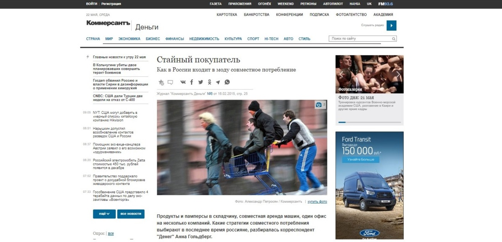
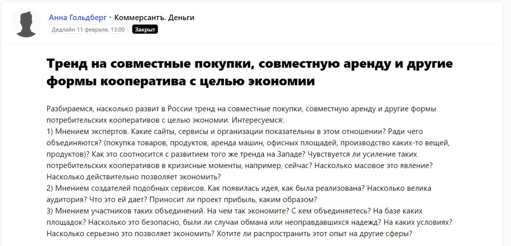

Итак, [Российский университет кооперации](http://www.ruc.su/), я — руководитель пресс-службы.

Мытищи. Москва занята своими делами. До регионов еще дальше. Ничего крутого у нас в целом не происходит. Вернее, наши события кажутся крутыми многим коллегам, но не мне. И не журналистам. Для сайта — да. Для соцсетей — ну как-то скорее да. Внешние ресурсы — уже нет.

Очень правильно кто-то сказал на конференции у главреда журнала «Пресс-служба» Тимура Асланова: если нет продукта, нужно «продавать» экспертное мнение. Тогда эта мысль во мне еще не оформилась, но «эстрадного комментатора» я тем не менее нашла.

> Никто даже не надеялся, что мы получим публикации в солидных изданиях. Мытищинское информагентство было пределом мечтаний.

Зато наш спикер Андрей Арно, руководитель центра научно-исследовательской работы, ведущий научный сотрудник Российского университета кооперации полностью соответствовал требованиям, которые предъявляет сервис [Pressfeed](https://pressfeed.ru/):

* отвечал быстро;
* отвечал по делу;
* отвечал так, что хотелось читать.

Чтобы вы понимали, изначально никто даже не надеялся, что мы получим публикации в солидных изданиях. [Мытищинское информагентство](http://inmytishchi.ru/) было пределом мечтаний (без обид, пожалуйста). Но мы с Андреем быстро сработались и поняли, что со всем этим делать.

Начали мы с небольших изданий. [Статья про импортозамещение на Кубани](http://agro2b.ru/ru/news/20272-APK-Kubani-obeshtaet-vzryvnoj-rost-fone.html) на агропромышленном портале Agro2b. В крупные СМИ легче заходить, если уже есть медийная история. Для этого вполне подойдут отраслевые или региональные СМИ. Накопите портфолио и штурмуйте федеральные медиа.

Потом случился «Коммерсантъ» с материалом «[Стайный покупатель](https://www.kommersant.ru/doc/2659990)».

###### [_Публикация в «Коммерсантъ»_](https://www.kommersant.ru/doc/2659990)

Мы ответили на [запрос](https://pressfeed.ru/query/493) корреспондента «Коммерсантъ.Деньги» Анны Гольдберг. Она готовила материал о тренде на совместные покупки, совместную аренду и другие формы объединения покупателей с целью экономии.

###### [_Запрос издания «Коммерсантъ» на Pressfeed_](https://pressfeed.ru/query/493)

Затем были Ведомости со статьей «[Хвастаться надо так, чтобы показать себя с неожиданной стороны](https://www.vedomosti.ru/management/articles/2015/04/08/hvastatsya-nado-tak-chtobi-pokazat-sebya-s-neozhidannoi-storoni)».

###### _Комментарий Андрея Арно «Ведомостям»_

Дважды — «Коммерсантъ. Юг России» с публикациями «[Стоит ли учить бизнес бизнесу?](https://www.kommersant.ru/doc/2708597)» и «[Франчайзи могут сэкономить на роялти](https://www.kommersant.ru/doc/2733086)».

Затем «Гудок», статья «[Государство всех накормит](http://www.gudok.ru/newspaper/?ID=1304930)».

Еще были «Лента.ру», журналы «Босс» и «Компания», «ФедералПресс», «Секрет фирмы», ИД «Имидж-Медиа».

Результативность нашей работы с журналистами составила 63% — в публикации превратилось две трети от всех предоставленных журналистам комментариев. Это отличный результат.

Кажется, еще немного и помимо наших основных тем — теорий лидерства и импортозамещения, мы стали бы комментировать все актуальные вопросы управления и экономики. Просто потому, что ученый может комментировать практически все.
