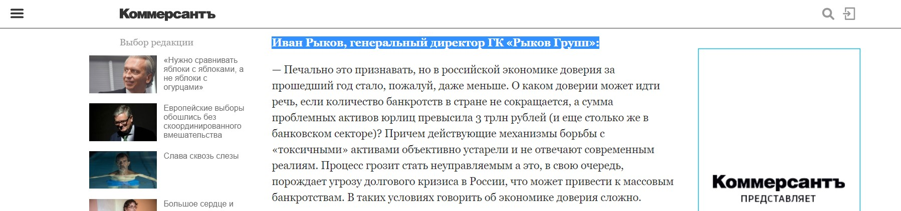

ГК «Рыков групп» работает с собственниками и топ-менеджерами среднего и крупного бизнеса и предлагает сложный b2b-продукт ― юридические услуги, связанные с банкротством, антикризисным управлением и разрешением вопросов с проблемной задолженностью. Головной офис находится в Москве, но по всей России расположены более 50 представительств.

## Продвижение компании: как у всех, но с одним нюансом

Что мы делаем для продвижения бизнеса? На самом деле, вряд ли открою здесь что-то новое. Все инструменты известные и понятные. У нас есть основной сайт Rykov.group ― это центр нашей маркетинговой паутины, который собирает все лиды. Запущены сайты-сателлиты, посвященные конкретным проблемам, успешно функционирует сайт rykov.pro ― персональный сайт нашего управляющего партнера. Мы пользуемся и рассылками, и социальными сетями, и блог-платформой «Яндекс.Дзен». У нас есть свой канал на Youtube с еженедельными online-трансляциями и видео по конкретным проблемам.

> Наконец, last but not least ― это взаимодействие со СМИ. Один из самых значимых для нас пиар-инструментов как с точки зрения продвижения компании, так и со стратегической точки зрения. Дело в том, что у нашей компании есть «миссия» ― добиться реформирования законодательства в области работы с «токсичными» активами. Именно публикации СМИ помогают нам двигаться к достижению этой, поверьте мне, непростой цели.

## Как публикации в СМИ продвигают компанию и заодно меняют отрасль

Изначально мы начали заниматься пиаром в СМИ по той же причине, по которой это делают тысячи других компаний, ― ради узнаваемости, репутации, повышения экспертности в глазах целевой аудитории. Мы прекрасно понимаем, что собственники бизнеса, скорее всего, обратятся за услугами к той компании, которая постоянно появляется в СМИ и в которой работают авторитетные эксперты, чем к «ноу нейму». Особенно по такому щепетильному вопросу, как взыскание многомиллионной задолженности.

Наши публикации в СМИ не заточены на продажи. Любой текст от лица компании должен быть в какой-то мере «продающим», но смешно думать, что вы дали комментарий, допустим, «РБК», и завтра все телефоны будет обрывать «Роснефть» с просьбой подписать договор на обслуживание дебиторки. Пиар ― это игра в долгую почти как SEO. Ваш эксперт дал один комментарий, затем вышел другой текст, и вот уже у потенциального лида закрепляется связь по проблеме с вашей компанией, и шансы, что он примет решение обратиться именно к вам, вырастают в разы.

Однако это только часть того, что мы хотим получить от публикаций в медиа. Руководство нашей компании активно занимается общественной деятельностью. В стране складывается печальная ситуация с просроченной задолженностью. Три триллиона по долгам корпораций, еще три по банковским долгам, а потом когда в стране (тьфу-тьфу-тьфу) грянет долговой кризис, все будут сидеть и удивляться «почему же это случилось».

Как раз для того, чтобы такого никогда не случилось, мы активно поднимаем проблему «токсичных» активов на разных уровнях. Чтобы проблема нашла решение и не превратилась в неуправляемую, необходимо, чтобы о ней заговорили. Как государственные органы, так и другие предприниматели. Мы мечтаем о том, что в России заработают механизмы финансового оздоровления и появятся качественные инструменты для работы с долгами.

> Публикации в СМИ ― наиболее эффективный канал для связи с общественностью в целом и лучший способ достучаться до представителей финансовой отрасли в частности.

## Как общаться со СМИ, чтобы вас услышали

Чтобы нас услышала общественность, для начала важно подружиться с журналистами из различных СМИ: они в первую очередь должны понять, что проблема заслуживает внимания их читателей, слушателей, зрителей. При этом мы не выделяем ключевые и приоритетные медиа, не пытаемся попасть исключительно в федеральные СМИ, потому что никогда не знаешь, где тебе повезет и к чему это приведет. Тем более, ГК «Рыков групп» работает с клиентами по всей России. Ограничиваемся только тематикой запроса (все-таки мы говорим о финансах) и руководствуемся правилом «не бывает плохих СМИ, бывают плохие комментарии и тексты».

Дружить со СМИ можно и нужно двумя способами: первый ― современный и автоматизированный, второй ― традиционный и «ручной». Эти способы никак не взаимоисключают друг друга, и чтобы получить желаемый результат, использовать нужно и то, и то.

  
**Автоматизированный подход: сервис журналистских запросов Pressfeed**

В конце 2018 года мы создали аккаунт компании на сервисе Pressfeed. Это специальная платформа для общения между журналистами и экспертами. Сотрудники редакции публикуют там запросы: в них они объясняют, какой именно эксперт нужен им для готовящегося материала и на какие вопросы нужно ответить. Также к каждому запросу ставится дедлайн, значит, журналист принимает ответы только до указанного дня. Можно пользоваться базовым бесплатным тарифом, но проще сразу подключить тариф «Эксперт», тогда вы сможете отвечать на неограниченное количество запросов и видеть новые заявки раньше тех, кто находится на базовом аккаунте.

  
[_Возможные тарифы_](https://pressfeed.ru/s-plans.html)

С помощью Pressfeed мы обычно предоставляем журналистам экспертные комментарии на заявленные темы, хотя время от времени редакторы ищут там авторов для полноценных текстов.

Когда мы начали активно заниматься комментариями в СМИ, мы выработали четкую стратегию, какой комментарий давать, чтобы журналист точно поставил его в публикацию. Это относится и к запросам на Pressfeed, и к прямым запросам от журналистов.

Итак, комментарий должен:

1) нести какую-то идею, в противном случае журналисты скоро перестанут к вам обращаться, ведь налить воды в текст они и без вас сумеют;

2) быть профессиональным, то есть спикер должен разбираться в том, что он говорит;

3) быть оперативным. Мы живем в быстром мире, информационная повестка устаревает со страшной силой. И ваш гениальный комментарий, который как воздух нужен был вчера, никому уже будет не нужен завтра;

4) быть раскрытым. Я сам был журналистом и помню, как я ругался, когда на свои вопросы получал ответы в стиле «да, нет, не знаю, компания продолжит осваивать новые рынки». Никто не просит вас писать «простыни» текста, но всегда лучше, если у вас будет нормальный развернутый ответ. В конце концов, журналисту всегда проще сократить его или выбрать нужный абзац, чем за полчаса до дедлайна понять, что комментария эксперта у него по сути нет.

С ноября 2018 года до июня 2019 года мы уже отправили журналистам 54 комментария на Pressfeed, а 32 из них были приняты и опубликованы.

Например, через Pressfeed мнение ГК «Рыков групп» появилось в приложении «Коммерсантъ» к ПМЭФ 2019. Журналист спрашивал, поменялось ли доверие к экономике страны за прошедший год.

[_Запрос_](https://pressfeed.ru/query/54677) _от издания «Коммерсантъ»_

Иван Рыков оценил текущую ситуацию печально: доверие не то чтобы улучшилось, а наоборот ухудшилось.

  
[_Фрагмент публикации_](https://www.kommersant.ru/doc/3989992) _в издании «Коммерсантъ»_

С помощью сервиса мы 6 раз отправляли ответы на запросы в деловое издание E-xecutive, все комментарии вышли в разных статьях.

  
[_Запрос от E-xecutive_](https://pressfeed.ru/query/52888)

Одна из них была посвящена объему теневой экономики РФ. Иван Рыков высказал мнение, что теневая экономика будет только расти из-за увеличения НДС.

  
[_Фрагмент публикации_](https://www.e-xecutive.ru/finance/business/1990224-pochemu-rossiiskii-biznes-ne-hochet-vyhodit-iz-teni) _на E-xecutive_

В другой раз мы озвучили проблему огромных долгов в материале по угрозам российской экономике на сайте Banki.ru.

  
[_Запрос от Banki.ru_](https://pressfeed.ru/query/50077)

> Этот материал прочитали более 130 тыс. посетителей сайта. Как вы понимаете, все эти люди так или иначе интересуются финансами и экономической ситуацией в стране.

  
[_Материал на Banki.ru_](https://www.banki.ru/news/daytheme/?id=10760887)

На сервисе удобно формировать подписки на запросы по ключевым словам. Если у вас нет времени постоянно мониторить ленту с запросами, то это некая гарантия, что вы не пропустите профильный запрос. Могу сказать, что нас такая подписка с ключевыми словами выручала несколько раз. Наши ключи: «просроченная задолженность», «антикризисное управление», «банкротство» и т. д.

  
_Пример поиска по ключевым словам_

Кстати, еще одна хорошая функция, которая действует именно на платном аккаунте, ― сразу видеть, сколько ответов уже дано на запрос. Потому что если под вопросом уже есть десять принятых ответов, то, скорее всего, ваш комментарий уже не пригодится журналисту.

  
_На запрос отправили 9 ответов, а 5 были приняты, ― эту статистику видят только владельцы платных аккаунтов_

**Традиционный подход: прямое общение с журналистами**

У каждого опытного пиарщика на видном месте лежит записная книжка с контактами всех знакомых ему журналистов. Правда в последние несколько лет эта книжка превратилась в список друзей на Facebook. Дальше пиар-специалист предлагает редакциям готовые тексты или обсуждает с журналистами выпуск совместных материалов. Схема в общем-то известная.

Нам удается регулярно публиковать в СМИ комментарии и тексты, которые призваны привлечь внимание и к экспертам компании, и к общероссийской проблеме «токсичных» активов.

Например, в начале марта в РСПП (Российский союз промышленников и предпринимателей) обсуждали возможность появления частных судебных приставов ― это был громкий инфоповод в нашей отрасли. Мы смогли успешно отработать эту тему и заодно высказать опасения ГК «Рыков групп» по поводу происходящего в стране в нескольких изданиях.

Сначала отправили [комментарий в «Санкт-Петербургские Ведомости»](https://spbvedomosti.ru/news/country_and_world/pristavam_podnimut_motivatsiyu/), а затем Ивана Рыкова, управляющего партнера ГК «Рыков групп», пригласили в эфир «Авторадио», где в прайм-тайм он рассказывал о проблеме роста долгов и почему мы поддерживаем идею создания частных приставов. А после этого руководитель компании дал большое интервью на сайте «Долг.рф».

  
[_Интервью на сайте «Долг.рф»_](https://xn--c1abvl.xn--p1ai/articles/intervyu/chastnye-vzyskateli-pomogut-fspp/)

Кстати, на различные рынки получается эффективно влиять через узкоотраслевые СМИ. Нас интересует сфера энергетики, у нас много партнеров из этой отрасли, а в самой энергетике проблема с долгами стоит весьма остро. Мы провели анализ и выбрали для нашей медиактивности газету «Энергетика и промышленность России». Это одно из крупнейших изданий отрасли, они являются информационными партнерами практически всех крупных мероприятий в этой сфере, не говоря уже о том, что номера их газеты всегда можно найти в Минэнерго. Издание имеет реальный вес среди профессионалов отрасли.

Мы вышли на газету и [предложили проблемную статью](https://www.eprussia.ru/epr/361/1510614.htm). В этом материале не было никакой рекламы (потому что СМИ очень не любят бесплатно кого-то рекламировать), а управляющий партнер был упомянут лишь как аналитик долговых рынков и эксперт по долгам. При этом статья не только транслировала как наши идеи на проблему долгов, так и пути ее решения. В тексте не было упомянуто название бренда, но публикация все равно повлияла на репутацию руководителя компании как эксперта отрасли. В общем, это успех.

## Эффект от публикаций в СМИ, который видим мы

Реально ли то, что публикации в СМИ могут достучаться до представителей финансовой отрасли и каким-либо образом повлиять на законодательство?

> Мы считаем, что результаты уже есть: о проблеме говорить стали больше. Когда мы только начинали эту кампанию, то «токсичные» активы нигде даже не упоминались, их не рассматривали как серьезный риск для экономики страны.

Сейчас о том, что изменения в отрасли необходимы, говорят везде. Создается «Ассоциация по консолидации долгового рынка», которая объединит представителей профессионального сообщества и займется работой по формированию в РФ системного подхода к управлению дебиторской задолженностью. И самое главное, что проблему уже обсуждают на уровне профильных министерств. Все медленно, но верно движется в правильном направлении.

Что касается продвижения «Рыков групп», то наших специалистов все чаще приглашают в качестве экспертов по проблемным активам. В остальном же это игра в долгую, важно помнить, что каждый комментарий, каждая публикация ― это маленький кирпичик в укреплении вашей репутации на рынке. Бывает, нам звонят из СМИ и говорят: «Мы видели, что вы прокомментировали тему в таком-то издании, и хотим, чтобы вы и нам дали комментарий», или когда на конференции в разговоре с тобой вспоминают: «Читали статью вашего руководителя в Forbes, очень интересно». Логично думать, что публикация работает на нашу узнаваемость, имидж компании.

> Чтобы держаться на плаву в плане репутации, пиарщику нужно быть как лягушка в банке со сметаной. Если перестанешь двигаться ― утонешь, а если действовать без остановок, есть шанс сбить масло. В среднем за первые пять месяцев года 2019 года у нас выходило около 50 публикаций в месяц, из них более 10 публикаций ― это публикации в крупнейших СМИ. Порядка 30% мы сделали через Pressfeed, остальные 70% ― по личным связям.

## Все-таки влияет ли пиар на рост компании

Нельзя однозначно говорить об этом. Рост компании зависит от множества факторов: от решений каждого сотрудника, от каждого выступления, от любой успешно проведенной сделки. В том числе и от доверия целевой аудитории к нам. На доверие, в свою очередь, во многом влияют вышедшие в СМИ публикации. По результатам исследования Pravo.ru рынка литигаторов-юрфирм, лидирующих в области судебной практики, за 2018 год ГК «Рыков групп» вошла в десятку юридических компании с самой большой средней суммой иска. Думаем, это один из основных показателей прогресса. Наша цель ― стать флагманом корпоративных долгов в России. Может, это звучит нескромно, но судите сами: несколько лет назад нас было всего 7 человек, сейчас нас больше 50, и мы не собираемся останавливаться.
