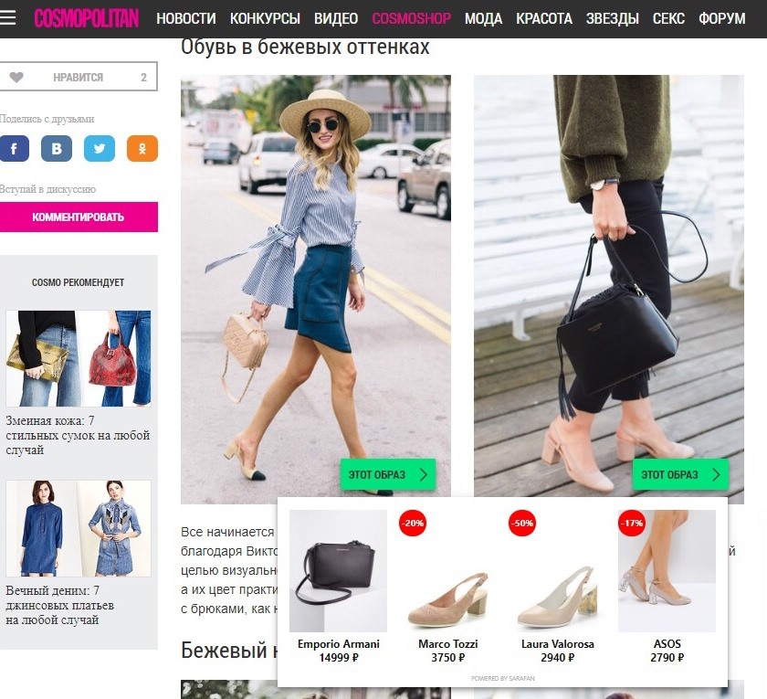

Продукт нашей компании ㅡ [Sarafan](https://sarafan.tech/ru) ㅡ инструмент для монетизации медиасайтов и digital-маркетинга брендов. В основе всех решений ㅡ искусственный интеллект Sarafan.AI. Технология «считывает» объекты на фотографиях, анализирует текст публикации и встраивает в контент нативную рекламу. Так, например, Sarafan.AI может распознать одежду, аксессуары и обувь на фото и найти эти или похожие товары в интернет-магазинах.

_Виджет Sarafan на сайте cosmopolitan.ru_

Наш продукт интересен, прежде всего, крупным медийным домам, владеющим сайтами о моде (мы уже сотрудничаем с Cosmopolitan, Glamour, Playboy, «Лиза»), и просто fashion-порталам (помимо гигантов, в сети существует множество сайтов о моде). Также мы предлагаем Sarafan непосредственно fashion-ритейлерам (те, кто заинтересован в продвижении своего товара или услуги онлайн).

## Зачем стартапу PR-продвижение, и какими инструментами мы пользуемся

Основная цель PR-продвижения ㅡ рассказать о продукте и технологии нашей основной целевой аудитории. Прямые продажи силами отдела продаж ㅡ это одно дело, PR же должен поддерживать и помогать продажам. Потенциальному клиенту проще вникнуть в продукт, если он уже слышал/читал о нем. Второстепенная цель ㅡ укрепить репутацию в ИТ-сфере, чтобы наши коллеги из индустрии знали о технологии Sarafan, понимали ее назначение и систему работы.

Основных **каналов продвижения два**:

1) участие в отраслевых конференциях и выставках, связанных как с ИТ-индустрией, так и с рекламным бизнесом;

2) публикации с экспертами компании в СМИ.

Такие PR-активности помогают нам формировать знание о Sarafan, объяснять преимущества программы и схему монетизации. Все служит одной бизнес-цели: привлечь новых партнеров для подключения.

Конференции и выставки работают точечно ㅡ только на их участников, однако это узкая и самая важная для нас аудитория. А вот публикации в СМИ охватывают широкую аудиторию: среди них всегда находятся те, кто заинтересован в продукте компании, но еще не знал о нем, или те, кто уже слышал о Sarafan, но хочет узнать больше. Чтобы привлечь больше потенциальных партнеров, действовать нужно по двум фронтам. Уделять внимание и время на конференции, и на сотрудничество со СМИ.

Сейчас мы поставили перед PR-отделом задачу делать 3-4 публикации в СМИ в месяц. Больше делать пока не получается, так как постоянная подготовка к мероприятиям также занимает много времени.

## Как сотрудничать со СМИ: способы и схемы работы

На старте PR-продвижения в СМИ мы поделили все медиа по трем направлениям в зависимости от наших целей.

Где публикуем тексты:

* бизнес-издания, которые читают предприниматели: «РБК», «Коммерсантъ», «Секрет фирмы» и так далее. Это информационные площадки с миллионной посещаемостью и авторитетом. Для нас они важны с точки зрения укрепления репутации компании в бизнес-среде, для привлечения инвесторов, партнеров;
* отраслевые сайты об ИТ и стартапах. Пишем туда, чтобы делиться опытом с другими стартаперами;
* отраслевые сайты о ритейле с уклоном в fashion, рекламе и маркетинге. Наш главный партнер ㅡ площадка Fashion United Russia. Пишем конкретно о том, какую пользу Sarafan приносит fashion-бизнесу.

Теперь подробнее о том, как мы работаем с каждым изданием.

**Бизнес-издания.** Издания, в которые хотят попасть, пожалуй, все компании. Возьмем к примеру «РБК». Ежедневная посещаемость сайта около 1,5 млн. Журналисты издания каждый день получают десятки пресс-релизов и предложений написать новость, колонку, заметку о компании. Им всегда есть, из чего выбрать.

Между тем, издание выпустило уже 3 статьи с участием Sarafan. Чтобы попасть в «РБК» или в любое крупное федеральное издание, мы мониторим запросы редакций на сервисе журналистских запросов [Pressfeed](https://pressfeed.ru/). Схема работы: регистрируетесь на сайте, выбираете запросы по нужным тематика (для нас это стартапы, ИТ, fashion, управление бизнесом). Фильтр по тематике можно сделать прямо на сайте. Затем отвечаете журналисту до окончания дедлайна.

_Запросы по тематике_

Мы создали аккаунт на Pressfeed в апреле 2018 года, и один из первых запросов, на который мы ответили, был от «РБК» о корпоративном изучении английского языка.

[_Запрос_](https://pressfeed.ru/query/44219) _от «РБК» на Pressfeed_

В этом материале генеральный директор Sarafan.Tech Андрей Корхов рассказал, что компания открыла офис в Нью-Йорке,  и английский стал необходимым для всех сотрудников.

  
[_Материал_](https://www.rbc.ru/own_business/25/06/2018/5b2cd4b39a794780497a3284) _с участием компании_

При этом текст вышел как в печатной версии, так и в онлайн-версии издания (на сайте он набрал более 15 тыс. просмотров). Эта и подобные публикации укрепляют нашу репутацию как работодателя: ИТ-компании важно привлекать лучших специалистов отрасли.

Также мы сотрудничали с интернет-журналом о бизнесе «ПОнедельник».

[_Запрос_](https://pressfeed.ru/query/42258) _на Pressfeed_

В публикации Андрей Корхов честно сказал о тех провалах, которые в итоге подтолкнули его бизнес к успеху.

[_Публикация_](https://ponedelnikmag.com/post/upal-potom-podnyalsya) _в издании «ПОнедельник»_

**Совет:** чтобы попасть в хорошее издание, вам следует связаться с журналистом конкретной рубрики и заинтересовать его, действительно, интересной темой и уникальностью вашего продукта. Докажите, что продукт «нескучный», а его история обязательно привлечет читателей.

Например, так мы наладили отношения с изданием «Деловой Петербург». Особенно хочется отметить журналиста проекта Анастасию Жигач, мы сразу общались с ней напрямую, потому что знали, что она большой профессионал в сфере технологий и стартапов. Анастасия написала о стартапе текст [«Сарафанные фотографии. Участник "Биржи стартапов" Sarafan.AI запустил сервис распознавания одежды по фото»](https://www.dp.ru/a/2018/09/05/Sarafannie_fotografii) и всегда сама обращается за комментариями.

_Публикация в издании «Деловой Петербург»_

Между тем, Анастасия Жигач размещает запросы и на Pressfeed. Вообще это еще одна удобная функция: всегда можно найти нужные контакты или обратиться к журналисту через сервис. Это эффективнее и быстрее, чем писать на общую почту редакции или главному редактору, которому точно будет не до вас. Нужному журналисту просто написать в чат и предложить темы для совместных публикаций.

  
[_Профиль журналиста_](https://pressfeed.ru/people/8030) _«Деловой Петербург» на Pressfeed_

**Отраслевые издания об ИТ.** В общении c профильными изданиями, посвященным ИТ и стартапам, необходимо сменить акценты: больше говорить о разработке, способах монетизации, перспективах развития, продвижении, команде.

На страницы ИТ-изданий также легко попасть через Pressfeed: на сервисе зарегистрировано более 150 изданий с тематикой «Технологии». Мы сотрудничали с «Инвест-Форсайт» ㅡ это деловое издание, но с уклоном в стартапы и аналитику.

[_Запрос_](https://pressfeed.ru/query/45335) _от издания «Инвест-Форсайт»_

Площадке мы рассказали о создании и развитии Sarafan в статье «Искусственный интеллект для модниц».

[_Публикация_](https://www.if24.ru/iskin-dlya-modnits/) _в издании «Инвест-Форсайт»_

Также мы самостоятельно размещаем на известной площадке vc.ru наши истории о пути компании к успеху, личное мнение директора о каких-либо вопросах отрасли и так далее. Площадка открыта для всех желающих, но она имеет правила публикации, которые стоит прочитать перед началом работы над текстом.

_Публикация на_ [_vc.ru_](https://vc.ru/tribuna/37156-taymlayn-sarafan-tech)

**Отраслевые издания о fashion-бизнесе.** Как было сказано выше, портал Fashion United Russia ㅡ один из немногих игроков в сфере b2b и модной индустрии. Посещаемость сайта около 100 тыс. читателей в месяц. Может показаться, что это мало, но это люди, которые напрямую связаны с fashion-бизнесом. С редакцией работаем напрямую, изначально просто предложили им варианты сотрудничества и договорились о том, чтобы наш исполнительный директор Ксения Широкова вела собственную колонку.

Один из последних выпусков «Как увеличить продажи при помощи искусственного интеллекта: 3 проверенных инструмента для fashion». Мы сделали небольшую подборку, в которую включили несколько полезных технологий для fashion-бизнеса, в том числе и Sarafan. Получилось полезно, а не рекламно. В другом материале рассуждали о поколении Z, которое привыкло жить в Интернете. Разбирали, как с ним работать, почему программы с технологией искусственного интеллекта в fashion ㅡ это то, что близко современным молодым людям.

## Что нам дают публикации в СМИ

Всего в 2018 году мы выпустили около 40 публикаций, примерно 20% сделали через Pressfeed, остальные ㅡ через личные договоренности.

За 2018 год число медиапартнеров компании Sarafan.Tech выросло в 15 раз (январь 2018 ㅡ 23 площадки, октябрь 2018 ㅡ более 330 площадок). Число партнеров-ритейлеров увеличилось в 3 раза (январь 2018 ㅡ более 50 магазинов, октябрь 2018 ㅡ более 150 онлайн-магазинов). Нужно понимать, что это заслуга отделов маркетинга, PR и продаж. Сложно поделить этот результат на доли: как и в любой компании каждый выполняет свои функции, и бизнес растет.

> Наши менеджеры по работе с партнерами при проработке каждой заявки задают стандартный вопрос: «Откуда вы о нас узнали». Так мы отслеживаем эффективность наших PR-активностей. После практически любой публикации мы наблюдаем рост трафика на сайт, и обязательно приходят 2-3 заявки на подключение. Потом идут переговоры, непосредственно продажа, так что до подключения доходят не все лиды, но это нормально. Так или иначе, публикации влияют на продажи и развитие компании.
