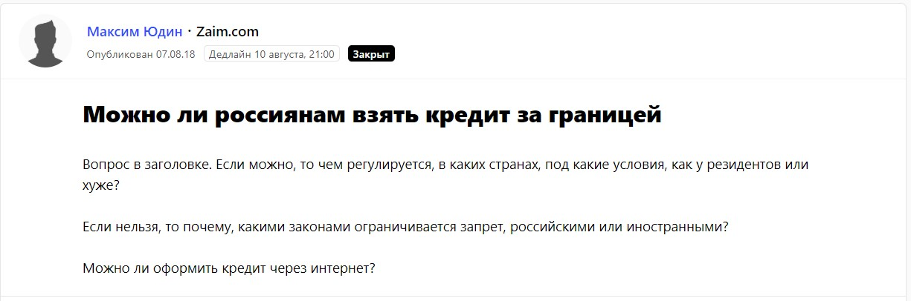
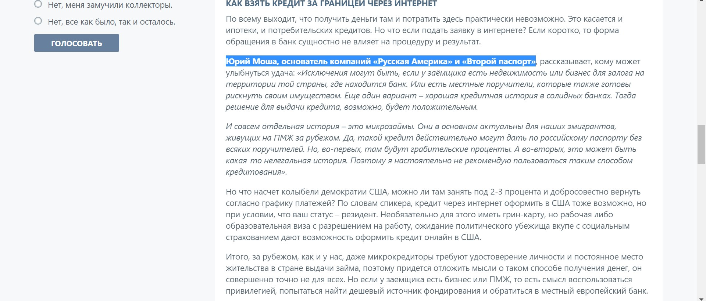
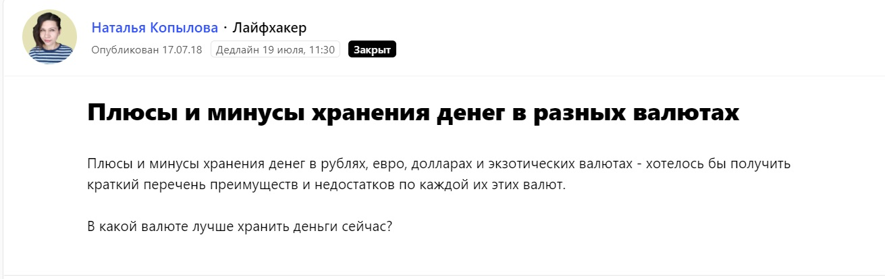
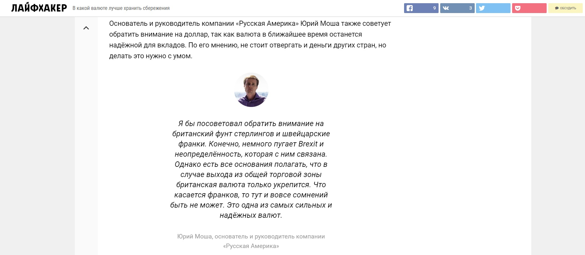
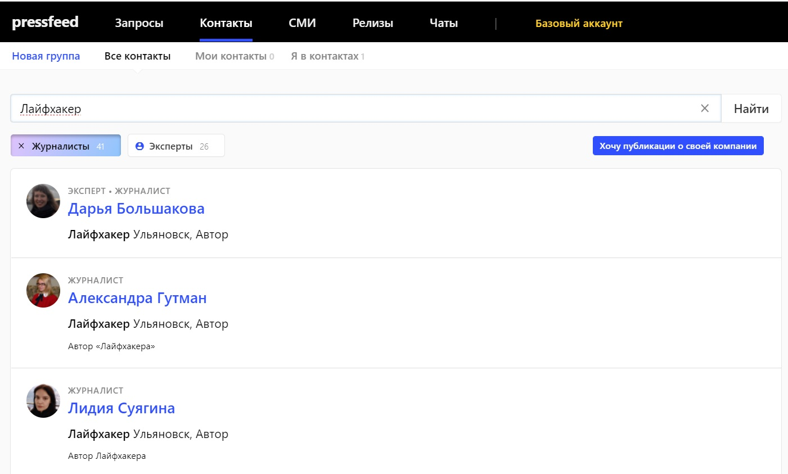
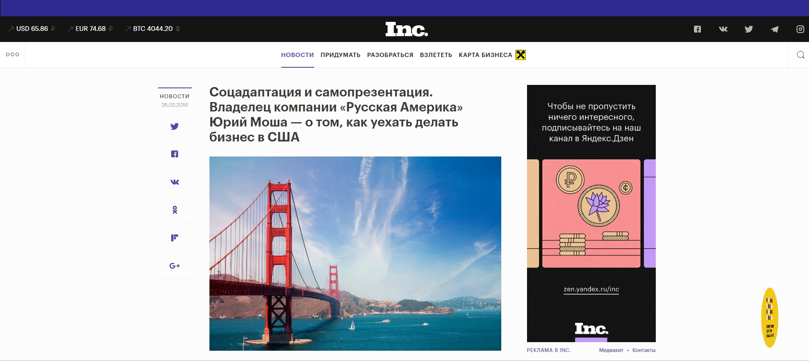

К 2011 году я уже несколько лет прожил в Америке, и у меня появилась идея открыть компанию «Второй паспорт», которая будет помогать гражданам России и СНГ переезжать за границу и адаптироваться в новых странах. Теперь мы занимаемся «эмиграцией под ключ». Мы даем рекомендации, как выбрать страну, открыть долгосрочную визу, найти жилье, собрать документы для трудоустройства, затем получить разрешение на ПМЖ. Работаем с 60 странами мира. Кроме того, продаем франшизы по всем крупным городам России и СНГ. Задача филиалов, открытых по франшизе, ㅡ привлекать и консультировать новых клиентов, а вся бумажная работа остается в компетенции главного офиса.

Целевая аудитория компании «Второй паспорт» ㅡ это, во-первых, все, кто всерьез задумывается о переезде в другую страну на долгое время или навсегда. Во-вторых, меня интересуют предприниматели на постсоветском пространстве, которые могут открыть филиал компании в своем городе на условиях франшизы.

## Как я начал заниматься контент-маркетингом

До начала 2018 года основными инструментами продвижения бренда «Второй паспорт» были социальные сети, контекстная реклама и рекомендации. Однако в середине 2017 года я подумал, что у меня накопился большой опыт работы с мигрантами в рамках «Второго паспорта», а за спиной было более 10 лет жизни в Америке.  Изначально я хотел писать тексты в СМИ для «просвещения», быть полезным для тех, кто задумывается об эмиграции. Ведь когда я переехал в США, мне пришлось со всеми сложностями разбираться самому, мне некому было помочь. Я не ставил цели, чтобы публикации в СМИ привлекали новых клиентов и обеспечивали мне поток заказов. Да и не верил, что такое возможно. 

> Однако «просветительская миссия» превратилась в инструмент продаж. Примерно через 2 месяца после старта активного сотрудничества с медиа, стало понятно, что мои публикации будут приводить клиентов так же, как это делают социальные сети или рекомендации.

Первым «звонком» стало то, что ко мне стали обращаться просто за консультациями те, кто прочел одну или несколько моих публикаций. Люди писали мне в личные сообщения и задавали конкретные вопросы о миграции. Конечно, не все консультации такого формата переходят в реальные заявки, но все-таки определенная конверсия существует. Более того, клиенты, которые обращались на почту или по телефону (и мы уже вели с ними нормальные переговоры), в ходе беседы говорили: «Мы же читали у вас в статье…». Оказалось, что мои статьи не только помогают людям, но и работают на мой бизнес.

Раз публикации в СМИ начали приносить плоды, то я поставил перед собой задачу выпускать как можно больше полезных текстов от моего имени или с моим участием. Если говорить в цифрах, то это минимум 50 публикаций в месяц (с учетом всех перепечаток и материалов в блоге на сайте компании). Я нанял PR-специалиста: он помогает мне доводить тексты до ума, общаться с площадками и договариваться о сотрудничестве.

## О чем пишу, где размещаю статьи и как попасть в нужные издания

Прежде всего, мне интересны деловые и lifestyle СМИ. В первых я рассказываю о том, как инвестировать деньги в недвижимость за рубежом, открывать счета за границей, создать филиал своей компании и так далее. В lifestyle-издания заходят темы, как живет за границей российская диаспора, как устроен американский спорт, чем может привлекать и отталкивать Америка людей со всего мира, в частности из России. Проще говоря, я описываю реалии американской жизни глазами российского мигранта.

Я пишу для СМИ как полноценные большие тексты, так и даю небольшие комментарии в ответ на запросы журналистов. Нельзя сказать, что большие тексты всегда работают, а комментарии не приносят эффекта. Важно делать и то, и другое. Ведь многое зависит и от темы, и от целевой аудитории издания, от того, как публикацию воспримут в соцсетях. Расскажу обо всем по порядку.

**Комментарии в крупных изданиях**

Комментарии в СМИ ㅡ возможность попасть в крупные издания с огромной аудиторией. Журналистам часто требуется мнение экспертов по какому-либо вопросу. Я как раз могу выступить экспертом в любых темах, которые касаются переезда за границу.

Комментарии я делаю через специальную платформу Pressfeed. Это сервис, где редакции публикуют запросы на поиск героев для статей. Запросы можно мониторить на сервисе, но мне удобнее изучать ежедневную рассылку Pressfeed ㅡ она приходит в 10 и 15 часов по московскому времени. Просматриваю все новые запросы и выбираю самые интересные. И это необязательно запросы, связанные исключительно с миграцией или жизнью за границей. Я смотрю на издание, на тему, и если у меня есть ответы на вопросы журналиста, то я пишу комментарий.

Например, был запрос от Lenta.ru (почти 5 млн читателей ежедневно!): журналист спрашивал, почему вредно брать ипотеку в раннем возрасте. Я написал, что думаю: сравнил отношение молодежи к кредитам в Америке и России. Иногда молодые люди не понимают ответственности, которая появляется у них вместе с кредитом.

  
[_Запрос от Lenta.ru_](https://pressfeed.ru/query/50353)

Журналист взял мой комментарий практически без сокращений, а я получил еще одно упоминание в СМИ. Еще несколько лет назад я был уверен, что не могу попасть в Lenta.ru без связей с нужными людьми. Оказалось, что нет, через Pressfeed это может сделать каждый. Нужно всего лишь оперативно предоставить журналисту адекватный и подробный ответ.

  
[_Публикация на Lenta.ru_](https://lenta.ru/articles/2018/12/03/killermortgage/)

В другой раз я общался с отраслевым изданием о финансах Zaim.ru. Тут тема была близкой моей деятельности:

  
[_Запрос_](https://pressfeed.ru/query/46253) _от Zaim.com_

Взять кредит иностранцу возможно, но все не так просто.

  
[_Фрагмент публикации на Zaim.com_](https://zaim.com/poleznye-sovety/mikrofinansy/kak-poluchit-kredit-v-inostrannom-banke/)

Еще один пример ㅡ был запрос от «Лайфхакера» (20 млн читателей в месяц). Автор издания хотел разобраться, в какой валюте лучше хранить деньги.

  
[_Запрос от «Лайфхакера»_](https://pressfeed.ru/query/45583)

Я поделился своим мнением на этот счет и дал читателям издания совет ㅡ надежнее всего держать деньги в швейцарском франке или британских фунтах.

  
[_Комментарий для «Лайфхакера»_](https://lifehacker.ru/kak-xranit-dengi/)

> Pressfeed мне нравится еще и потому, что на нем можно найти профиль нужного журналиста, написать ему напрямую через сервис и предложить темы для совместной публикации. Редакционная почта часто не отвечает, а запросы в соцсетях могут просто затеряться, так что сервис ㅡ еще один удобный канал для коммуникации с редакцией.

Возьмем тот же «Лайфхакер», на сервисе зарегистрирован 41 автор, пишущий для этой площадки. Можно связаться с каждым и предложить сотрудничество.

_Поиск журналистов «Лайфхакера»_  
  
Конечно, ответят не все, но с кем-то точно получится договориться и выпустить совместную статью.

**Экспертные тексты**

Если я хочу написать какой-то экспертный материал как автор, я обращаюсь в издание напрямую: пишу на почту в редакцию или в соцсети кому-то из сотрудников ресурса.

Мой главный лайфхак ㅡ я предлагаю изданиям стать их внештатным и совершенно бесплатным корреспондентом в Америке. Я готов писать тексты или снимать видео, в которых они увидят Америку моими глазами со всеми ее достоинствами и недостатками.

Я ведь не просто хочу порассуждать об Америке, я в ней живу, я честно говорю обо всем происходящем за океаном. Например, как открыть свой бизнес в США ㅡ удачная и интересная тема. Об этом я писал для Inc., Rusbase, «Делового Петербурга».

  
[_Публикация в Inc._](https://incrussia.ru/news/kak-uehat-delat-biznes-v-ssha/)

Во всех материалах подобного формата я даю советы тем, кто планирует открывать бизнес в Америке ㅡ предостерегаю о возможных трудностях, говорю, как нужно действовать, чтобы все получилось.

Если говорить о lifestyle-площадках, то моя основная тематика ㅡ зачем россиянам переезжать за границу. Какие плюсы и минусы у такого решения. Я объясняю людям, что они получат после переезда, и хочу предупредить о том, что они могут потерять. Одна из недавних таких статей ㅡ [материал для мужского издания Brodude](https://brodude.ru/5-tselej-kotorye-ty-mozhesh-dostignut-posle-pereezda-za-granitsu/).

Словом, на Pressfeed редакторы изданий тоже ищут авторов для написания больших полноценных материалов. Важно только не «прозевать» такие запросы и постараться ответить на них в числе первых. В этом смысле помогает платный аккаунт (цена ㅡ около 3,5 тысяч рублей в месяц), так как он дает возможность видеть все запросы раньше чем те, кто пользуется базовым тарифом.

## Эффект от контент-маркетинга за год работы

  
Ежемесячно на различных площадках выходит около 100 публикаций с моим комментарием или от моего имени: примерно 20 уникальных материалов, а остальное ㅡ это перепечатки и тексты в блоге. Примерно 70% я делаю напрямую по связям с редакциями, а еще 30% ㅡ через сервис Pressfeed.

Cчитаю, что отдельная публикация не приводит к взрывному росту продаж, контент-маркетинг подразумевает долгую и комплексную работу. Представляю это так: потенциальный клиент читает о моем проекте сначала в одном издании, затем натыкается на мою статью в другом, и после 3-5 таких «точек контакта» он начинает воспринимать меня как эксперта и решает обратиться ко мне.

> По моим оценкам, в 2018 году я продал почти половину своих франшиз (всего было 17 продаж) благодаря контент-маркетингу. И если в начале 2018-го ко мне обращались 3-5 человек в месяц за консультацией, то сейчас их количество исчисляется десятками. 

Как я уже сказал, клиенты напрямую ссылаются на мои тексты, иногда прямо сразу говорят, что и где читали, и какой вопрос у них возник после прочтения конкретного материала.
