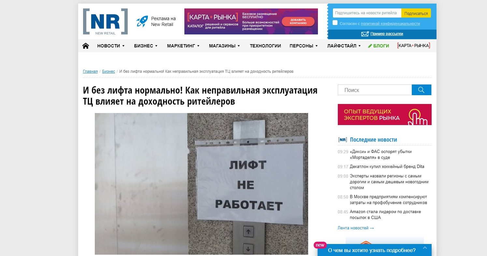
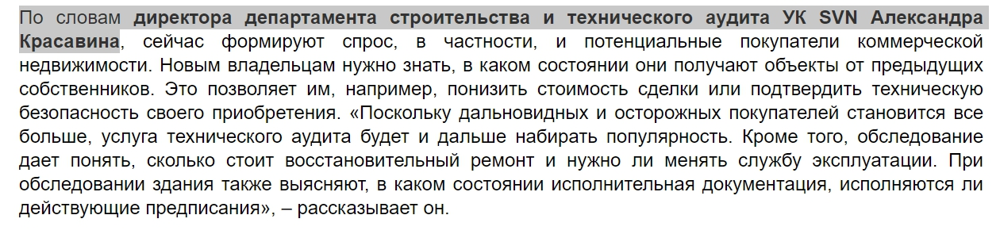
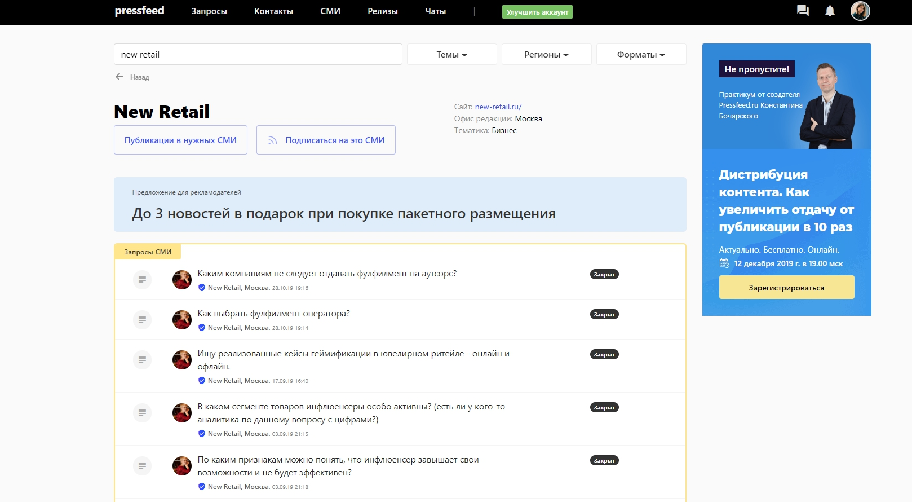
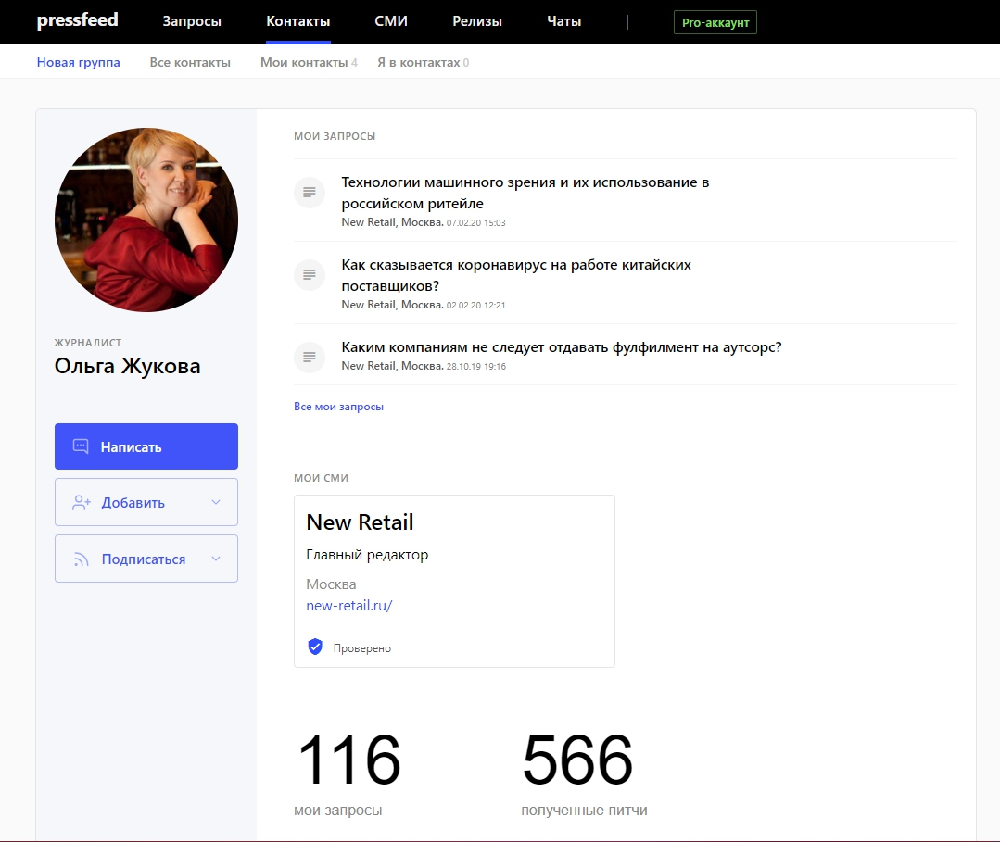
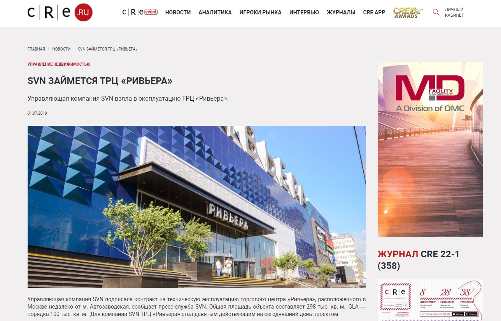
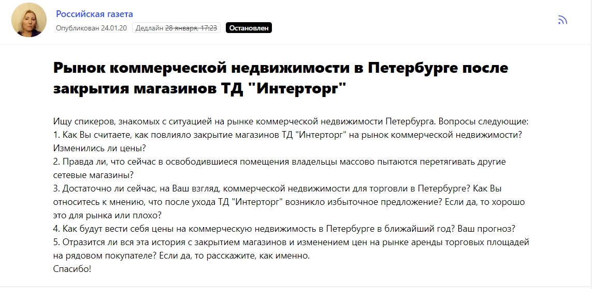
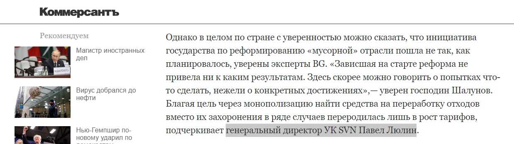

## Какую роль пиар играет в b2b-сфере

Компания SVN занимается технической эксплуатацией коммерческой недвижимости. Проще говоря, мы следим за состоянием инженерного оборудования, делаем ремонт, оказываем разную административную поддержку в бизнес-центрах, ТЦ и складах. Есть объекты, на которых компания отвечает за клининг и охрану. Всего в обслуживании около 700 тыс. кв.м. коммерческих площадей.

Так как SVN работает в узкой b2b-сфере, то все активности по продвижению направлены на довольно конкретных людей — это собственники коммерческой недвижимости и те руководители, которые принимают решение по выбору подрядчиков. Также нам интересны управляющие торговых центров и бизнес-центров.

Мы не запускаем рекламу на ТВ или радио или контекстную рекламу в Директе — для нашего бизнеса это неэффективные инструменты.

> Для нас не важны большие охваты, для нас играет роль, в первую очередь, точечное попадание в ЦА. Более того, продажа в b2b — это всегда долгая история. С момента, как потенциальный клиент впервые узнал о компании, до того, как он заключит с нами договор, может пройти год или около того. И в течение этого времени мы должны постоянно «прогревать» клиента, доказывать ему, что именно SVN — надежная компания, которой можно доверить свою недвижимость.

В идеале, чтобы у руководителя возникла потребность в именно в наших услугах, чтобы он понимал, что мы как никто другой знаем, как ему помочь, что у нас большой опыт и экспертиза в отрасли коммерческой недвижимости.

Как же доказать свою экспертизу и сформировать потребность потенциального клиента? Мы считаем, что лучше всего эти задачи решают пиар-инструменты, именно поэтому мы вкладываем много времени и сил в пиар-продвижение.

> Цель пиара — создать такую репутацию, чтобы представители отрасли ассоциировали компанию SVN с такими понятиями, как «профессионализм», «качество услуг», «порядочность», «опыт». Мы хотим, чтобы еще до обращения к нам, профессионалы рынка недвижимости знали о том, что есть такая компания, чем она занимается и какие у нее знаковые объекты в портфолио.

Таким образом, пиар отвечает за первые этапы воронки продаж:

* первая возможная ситуация — когда клиент ищет подрядчика, он выбирает несколько компаний, а затем начинает подробно изучать каждую, чтобы сделать финальный выбор и обратиться к одной из них за коммерческим предложением. Мы знаем, что заказчики всегда мониторят информационный фон, который сложился вокруг компании. И если о бренде говорят, если в сети легко найти подтверждение экспертности компании, то ей автоматически доверяют больше, а клиенту гораздо проще принять решение в нашу пользу.
* вторая возможная ситуация — когда мы высылаем коммерческое предложение потенциальному клиенту, который, увы, не слышал о нас. Он начинает искать информацию об SVN в интернете — видит, что мы на слуху, участвуем в главных мероприятиях отрасли, о нас пишут уважаемые профильные СМИ и известные деловые медиа. Значит, мы заслуживаем доверия.

> Если компания имеет «имя» в своей отрасли, если она постоянно в информационном поле (конечно, инфоповоды должны быть только позитивные), то в итоге привлекать новых заказчиков становится гораздо проще. Пиар — это не прямые продажи, это то, что помогает продажам, то, что направляет клиента к покупке.

Отмечу, что осенью 2019 года мы все-таки решили подключить медийную рекламу и разместили баннер на крупном нишевом сайте. Пока о результатах судить сложно, так как на момент создания этого материала рекламная кампания еще не завершилась. При этом мы уверены, что баннер не имел бы смысла, если бы мы параллельно не занимались пиаром. Узнаваемость бренда влияет на конверсию рекламы: допустим, собственник заходит на профильный сайт и видит баннер с нашим предложением. Намного больше шансов, что он кликнет на баннер и перейдет на сайт, если он уже знает нас.

## Какие пиар-инструменты используем

Все пиар-активности SNV можно поделить на три больших направления:

1. участие в отраслевых мероприятиях — в конференциях, круглых столах, форумах. Выступает в основном генеральный директор Павел Люлин;
2. сотрудничество с профильными СМИ, пишущими о коммерческой недвижимости, и деловыми изданиями.
3. организация проперти-туров — это экскурсии по торговому или бизнес-центру. Это формат, который позволяет лично познакомиться и с собственниками недвижимости, и с журналистами, которые пишут для отраслевых сайтов.

Каждая из пиар-активностей помогает нам достигнуть единой цели — создать безупречную репутацию, а именно донести до целевой аудитории ценности компании, показать наш подход к работе.

При этом мы бы хотели подробнее рассказать о публикациях в СМИ. Это классический пиар-инструмент, который имеет несколько весомых преимуществ в сравнении с выступлениями и проперти-турами.

**Во-первых**, в наше время основная информация о компании живет в интернете, и потенциальный клиент обязательно посмотрит то, что о нас говорят в сети, в том числе в значимых для рынка медиа.

**Во-вторых**, публикации в СМИ не исчезают, любую статью с нашим участием можно прочитать даже через 5 лет после ее выхода.

**В-третьих**, тексты индексируются поисковиками, и заказчик может выйти на интересный материал, который мы написали, просто потому что он ввел поисковый запрос с определенными ключевыми словами.

**В-четвертых**, значимые конференции и форумы проходят несколько раз в год, а публикации можно выпускать в неограниченном количестве и всегда быть на слуху.

## Публикации в отраслевых СМИ: как делать много и бесплатно

Чаще всего мы сотрудничаем с профильными изданиями, которые пишут о коммерческой недвижимости и ритейле. Это наш пиар-приоритет, потому что именно такие ресурсы читают люди, которые являются непосредственными заказчиками услуг SNV. Мы пишем статьи и даем комментарии для изданий CRE, Development Estate, «Строительный еженедельник», MarketMedia, ShopAndMall.ru,ComEstate.ru и так далее. Говорим об особенностях тех. эксплуатации зданий, пожарной безопасности и последних изменениях в законодательстве, сокращении издержек на техобслуживание, о клининге и многом другом.

Практически все публикации мы делаем на безбюджетной основе, так как годами налаживаем отношения с отраслевыми медиа и знаем, какую информацию им предлагать и в каком формате, чтобы ее точно взяли «в печать».

Выйти на журналистов разных нишевых изданий можно так:

* не упускать возможность познакомиться лично — обычно это удается сделать на отраслевых мероприятиях и форумах (мы также знакомимся на проперти-турах), тогда можно сразу обсудить варианты сотрудничества и предложить темы для публикаций;
* отмечать для себя журналистов, которые пишут на близкие вам темы, а затем находить их на Facebook или на сервисе журналистских запросов Pressfeed (если у вас PRO-аккаунт, то любому сотруднику практически любой редакции можно написать во внутреннем чате платформы), писать там и сразу дать журналисту четкое понимание — чем вы можете быть полезны, о чем уникальном можете рассказать.

Например, напрямую с редакцией писали большую колонку для издания New Retail — она была посвящена обслуживанию торговых центров, а именно говорили о такой проблеме, как неработающие лифты и эскалаторы в ТЦ. Эти, на первый взгляд, мелочи могут существенно отразиться на бизнесе арендаторов здания.

[_Статья в New Retail_](https://new-retail.ru/business/i_bez_lifta_normalno_kak_nepravilnaya_ekspluatatsiya_tts_vliyaet_na_dokhodnost_riteylerov9857/)

Параллельно с персональным общением с редакциями, мы постоянно мониторим запросы на [сервисе журналистских запросов Pressfeed](https://pressfeed.ru/). Это специальная платформа, на которой представители изданий публикуют своего рода «объявления» — в них указано, какую статью готовит редакция, мнение каких экспертов требуется для материала, на какие вопросы нужно ответить и когда выйдет публикация. Экспертам или пиарщикам от компаний необходимо просто ответить на запрос, соблюдая требования и дедлайн. Если ответ подходит, то комментарий появится в статье издания.

На сервисе работают более 4,5 тысяч редакций, в том числе запросы выкладывают те профильные СМИ, которые нам интересны. Бывают такие случаи, когда мы уже сотрудничали с изданием и знакомы с какими-то журналистами, но видим запрос от них на Pressfeed — тогда легче и оперативнее будет отправить ответ через сервис и там же уточнить все детали будущей статьи.

Регистрация на сервисе бесплатная для любого пользователя, но на базовом тарифе есть ограничения — можно отвечать всего на 3 запроса в месяц. Для продуктивной работы этого недостаточно, так что лучше сразу подключить pro-аккаунт.

Вот пример запроса от газеты «Строительный еженедельник». Издание готовило материал о техническом аудите зданий.

[_Запрос от «Строительного Еженедельника»_](https://pressfeed.ru/query/58285)

Мы подготовили комментарий и отправили его в ответе на запрос. В итоге мнение эксперта SVN появилось и в печатной газете, и в интернет-версии.

  
[_Комментарий эксперта SNV_](https://asninfo.ru/techmats/82-trebuyetsya-proverka)

Как я уже упоминала, через сервис можно выйти на практически любое издание. Найти нужного журналиста, написать ему во внутреннем чате платформы. Приведу в пример New Retail — сайт о ритейле. Мы работаем с ними напрямую и знаем редакцию, но пиарщики компаний или эксперты, которые еще не имеют выходов на эту площадку, могут без проблем «постучаться» в издание через сервис, предложить темы для публикаций.

Чтобы связаться с изданием, нужно найти его в разделе «СМИ» по поиску.

  
[_Профиль издания New Retail_](https://pressfeed.ru/smi/259) _на Pressfeed_

Затем посмотреть список авторов издания, которые зарегистрированы на платформе и чаще всего публикуют запросы. В случае с New Retail можно написать главному редактору во внутреннем чате платформы и обговорить возможные варианты сотрудничества, представить спикеров компании и так далее.

  
_Профиль главного редактора New Retail_

Чтобы регулярно получать как можно больше публикаций, действовать нужно параллельно по трем фронтам — и писать в СМИ напрямую, и ежедневно мониторить запросы, и рассылать пресс-релизы.

Кстати, хочу отдельно сказать про пресс-релизы. Несмотря на то, что рынок твердит, что они релизы давно неэффективны, это не совсем так. Если отправить их в правильные площадки с «вашей» целевой аудиторией, то релиз может сработать и даже привести нового клиента.

Пример из практики компании — летом 2019 года SVN начала сотрудничество с московским торговым центром «Ривьера». Мы сделали рассылку пресс-релиза с этой новостью по изданиям-партнерам. В итоге получили 10 публикаций на отраслевых ресурсах.

  
[_Пример публикации_](https://www.cre.ru/news/76740)

Не можем точно сказать, какое медиа оказалось для нас самым выигрышным, однако что мы увидели в день (и 2-3 дня после) выхода новости:

1. рост поисковых запросов в Яндексе по фразам «SVN Ривьера», «СВН взяла в эксплуатацию Ривьеру» и подобным;
2. всплеск заходов на сайт после выхода публикаций:

_Рост трафика на сайт в дни публикации_

Поскольку никаких других событий в эти дни не было, других крупных статей не выходило, мероприятий не проводилось, мы считаем, что свое дело сделал именно этот релиз.

> Cамое главное, что примерно через три месяца к нам обратился очень крупный заказчик. При выборе подрядчика лица, принимающее решения в этой компании, опирались в том числе и на публикации: их качество и количество. В том числе они ссылались на новости про «Ривьеру». Сейчас мы находимся на стадии переговоров с этим клиентом.

Эта история подтверждает, что публикации в СМИ могут приводить лиды и действительно влияют на то, выберет вашу компанию клиент или нет.

Пресс-релизы можно размещать и на Pressfeed — в специальном разделе. Тогда релиз сразу смогут увидеть все журналисты сервиса.

## 

## Публикации в деловых медиа влияют на имидж компании

С точки зрения охвата аудитории такие крупные и популярные деловые издания, как «Российская газета», «Коммерсантъ», «Ведомости», конечно, выигрывают у отраслевых площадок, но я еще раз уточню, что у нас нет цели охватить всех. Наше продвижение нацелено на конкретных людей, и можно сказать, что пытаться привлечь клиентов с помощью публикаций в СМИ первого эшелона, это то же самое, что стрелять из пушки по воробьям. При этом мы все равно участвуем в материалах этих изданий и даем комментарии всегда, когда есть такая возможность. Почему?

Любое появление в крупном медиа — это большой плюс для репутации. Когда компания пишет на своем сайте и в группах в социальных сетях: «Прокомментировали такой-то вопрос о рынке недвижимости в “Ведомостях”», то это автоматически вызывает доверие, уважение к бренду. В бизнес-сообществе так принято: если о вас пишут главные деловые медиа, следовательно, вы заслуживаете внимания.

Например, «Ведомости» опубликовали отчет о прошедшем роуд-шоу «Инвестиционное трио». В этом мероприятии участвовала и наша компания.

[_Упоминание в «Ведомостях»_](https://www.vedomosti.ru/press_releases/2019/08/15/ot-autleta-do-light-industrial-eksperti-obsudili-predstoyaschuyu-kommercheskuyu-zastroiku-territorii-zil)

Также если мы видим запрос на Pressfeed по теме коммерческой недвижимости от кого-то из топовых изданий, обязательно высылаем комментарий от эксперта SNV. Публиковались и в «Коммерсанте», и в «Российской газете», и в «МИР 24».

Для «Российской газеты» мы давали комментарий о рынке коммерческой недвижимости в Санкт-Петербурге.

[_Запрос от «Российской газеты»_](https://pressfeed.ru/query/65025)

Тогда мнение генерального директора было размещено в материале [«Метры простоя»](https://rg.ru/2020/02/04/reg-szfo/v-peterburge-upali-ceny-na-arendu-kommercheskih-ploshchadej.html).

В другой раз общались с «Коммерсантом» по поводу мусорной реформы в России.

  
[_Запрос от «Коммерсантъ. Санкт-Петербург»_](https://pressfeed.ru/query/63834)

Руководитель компании SVN сказал, что пока мусорная реформа не привела к желаемым результатам, а лишь повлияла на рост тарифов.

  
[_Комментарий в «Коммерсанте»_](https://www.kommersant.ru/doc/4233194)

> Мы продолжаем инициировать публикации в больших медиа, потому что считаем, что это играет роль в формировании имиджа компании. Всего же в 2019 году (на начало декабря) в различных отраслевых и деловых СМИ вышло около 80 публикаций о компании. Для нашего узкопрофильного рынка это хороший показатель.

## Как мы оцениваем эффективность пиара

Посчитать эффективность пиар-активностей в цифрах не так просто, как это можно сделать с более понятными маркетинговыми каналами. В случаем с пиаром следует смотреть на ряд косвенных показателей.

У нас есть инструменты веб-аналитики, с выходом очередного материала в СМИ мы видим всплески активности, а именно увеличение трафика на сайт. На графике видны всплески активности. Минимум пять из них связаны с новостями о компании: новый объект в обслуживании, комментарий к резонансной теме, колонка в нишевом издании.

_Всплески трафика на сайте_

> Брендовые запросы выросли примерно на 18% по отношению к прошлому году. Конечно, с точностью сказать, что именно стало катализатором для роста брендовых запросов, невозможно, но пиар точно сыграл в этом не последнюю роль.

Кроме того, в этом году мы отметили интересную тенденцию: раньше мы сами обращались к организаторам выступлений, и приходилось вести долгие переговоры, а сейчас всё ровно наоборот — нас начали активно приглашать на конференции в качестве спикеров. Это тоже показатель, что узнаваемость SNV вышла на новый уровень.

Плюс ко всему, когда к нам в компанию обращаются по поводу услуг, нужно обязательно спрашивать, откуда вы о нас узнали. Клиент может не помнить конкретную статью или выступление, но он наверняка скажет «Я много слышал о вас» — значит, репутация работает на бизнес.

В целом же правильнее всего оценивать эффект от всего того, что вы делаете в рамках продвижения, в конце года — подводить итоги, смотреть, что изменилось за последний год. Если прибыль растет, упоминаемость в медиа растет, клиенты все чаще приходят к вам сами, вероятно, вы действуете правильно. В SNV за 2019 год почти вдвое вырос оборот и дополнительно появилось 200 тыс. кв. метров в управлении. Это заслуга всей команды — и пиарщиков, и менеджеров по продажам, и руководителей.