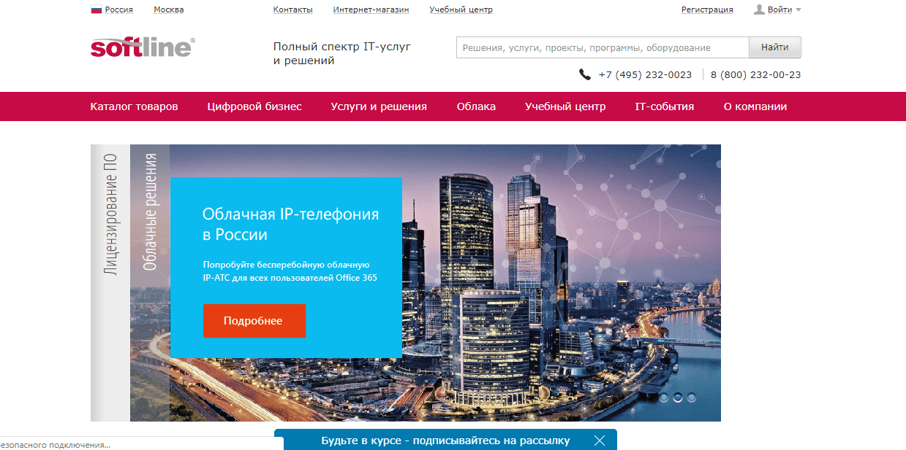
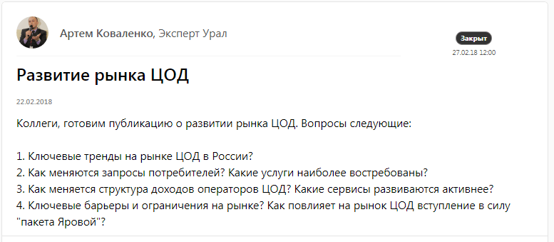
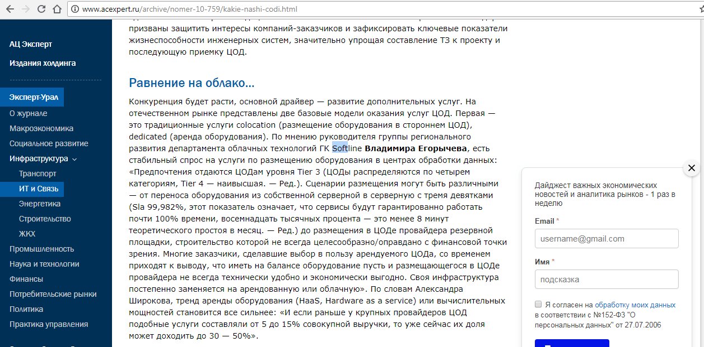
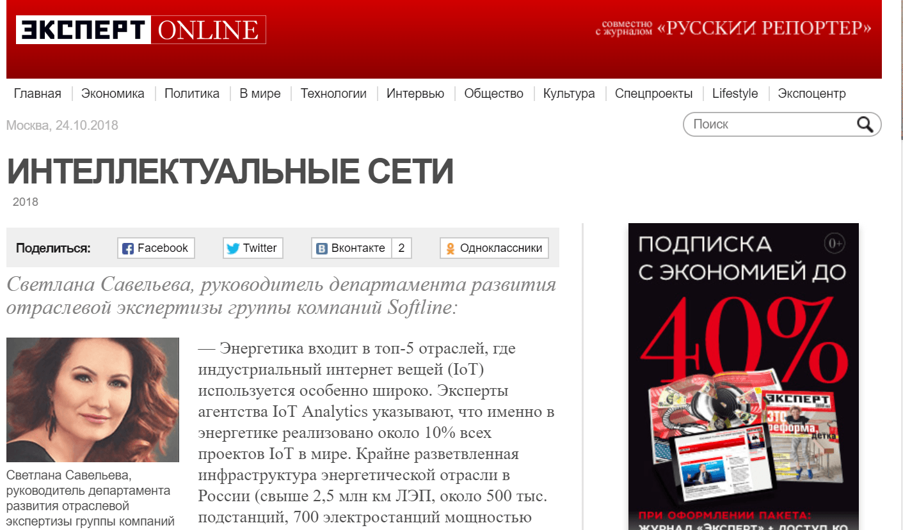
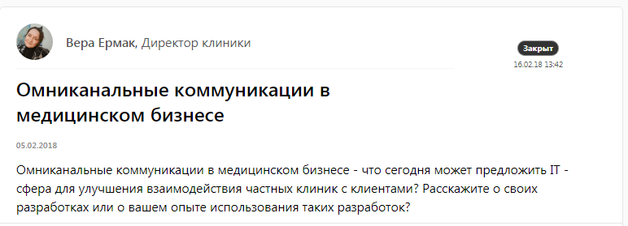
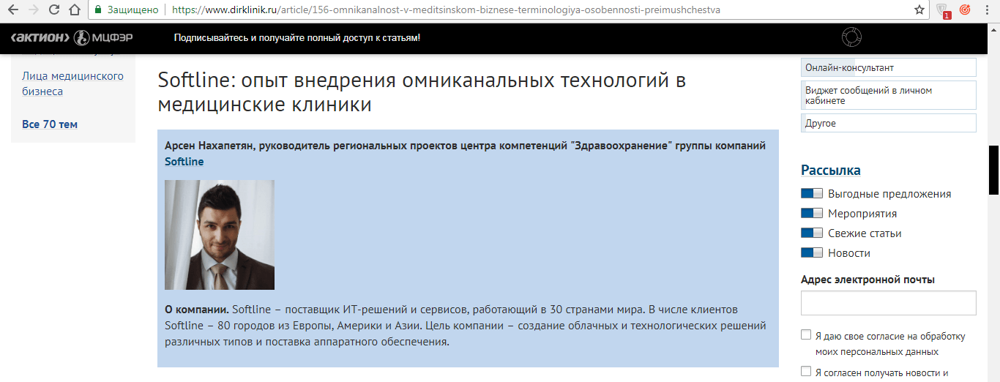
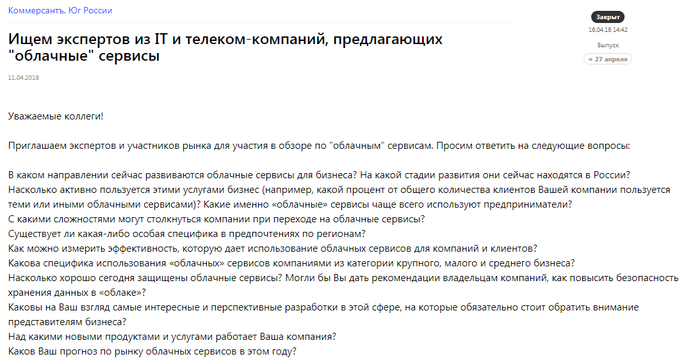
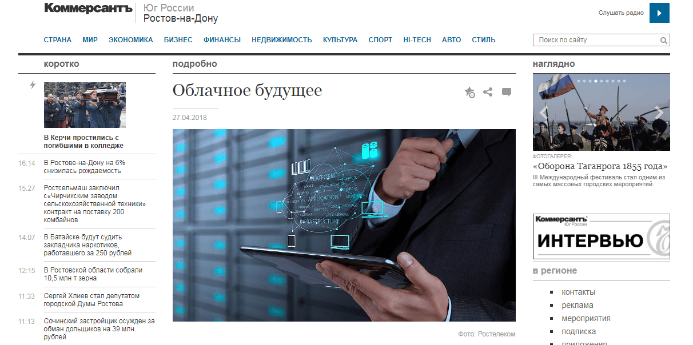

Softline – крупная IT-компания, работающая в 50 странах мира. Корпорация предлагает бизнесу комплексные технологические решения, облака, программное и аппаратное обеспечение и другие IT-услуги.

Головной офис российского отделения Softline расположен в Москве, при этом компания имеет 30 филиалов в 30 городах России. В столице работает и PR-департамент компании: специалисты долгие годы формировали репутацию бизнеса и успешно продвигали IT-услуги в федеральных деловых медиа.

## Почему мы пошли в региональные СМИ: филиалы оставались без внимания

В первом квартале 2017 года руководитель компании проанализировал развитие бизнеса в регионах и понял, что медийный вес Softline в региональных СМИ находится на недостаточно высоком уровне. Хотя при наличии крупной сети филиалов региональные рынки интересуют Softline ничуть не меньше, чем рынок Москвы и центральной России.

> «Федеральные СМИ не могли обеспечить нам охват региональной целевой аудитории. Предприниматели Екатеринбурга, Новосибирска, Перми читают и федеральные страницы "Коммерсанта", и "Ведомостей", но также им интересны местные проблемы и вопросы», – говорит PR-специалист по регионам Softline Ирина Вольская.

Летом 2017 года в Softline приняли решение нанять отдельного PR-специалиста, который будет заниматься исключительно региональным продвижением. Ему нужно было выводить репутацию компании в 30 городах страны на новый уровень: выстраивать отношения с местными СМИ, договариваться о публикациях, давать комментарии от экспертов Softline и работать на увеличение медиадавеса.

Так как Softline работает на b2b-рынке, продвижение в регионах должно было охватывать **два формата медиа**:

1. деловые СМИ,
2. узкоотраслевые СМИ (с медицинской, строительной, энергетической тематикой – любой, которая подразумевает крупный бизнес).

## Как начать работать с региональными медиа: отвечать на запросы и знакомиться с журналистами

Продвижение в регионах нужно было начинать почти с нуля. За пример возьмем Уральский федеральный округ. У компании не было ни выходов на уральские СМИ, ни понимания, какие темы для них особенно интересны.

По данным «Медиалогии» в первом полугодии 2017 года (январь-июль) в УрФО вышло 22 текста с упоминанием Softline, суммарный МедиаИндекс составил 30,3 (напомним, МедиаИндекс – показатель системы «Медиалогия», позволяющий качественно проанализировать эффективность PR. Складывается из трех показателей: индекс цитируемости, характер упоминания, заметность сообщения. Подробнее о системе: [mlg.ru](http://www.mlg.ru/about/technologies/#mediaindex)).

Для понимания ситуации, суммарный за полгода МедиаИндекс в 30,3 – это значит, что ваша компания практически не представлена в СМИ или лишь изредка появляется в мелких изданиях с аудиторией в несколько сотен человек. В Softline решили, что будут работать на планомерное увеличение МедиаИндекса, чтобы через год превысить первоначальный показатель хотя бы в 10 раз.

МедиаИндекс – это не конечная цель, с его помощью нельзя измерить рост бизнеса, но эта цифра отлично демонстрирует медиа-присутствие компании в регионе.

С чего начинать общение с местными изданиями? Классический способ выстраивания отношений со СМИ – знакомство с журналистами, звонки в редакцию, рассылка пресс-релизов. Но есть нюанс: PR-специалист Softline находится на расстоянии тысячи километров от многих целевых городов и далеко не всегда может лично познакомиться с журналистом и обсудить темы для публикаций, или пригласить представителей СМИ в офис компании на экскурсию.

Простое и эффективное решение в такой ситуации – выходить на журналистов целевых региональных изданий с помощью сервиса журналистских запросов [Pressfeed](https://pressfeed.ru/), на котором СМИ сами обозначают, какие темы интересуют их сегодня и каких экспертов они ищут.

> На сервисе Pressfeed запросы оставляют издания из 29 городов присутствия Softline. Если говорить только о Екатеринбурге: 60 СМИ из столицы Урала, 7 из них специализируются только на бизнес темах, еще 33 освещают различные общественные повестки. В итоге около 40 медиа, для которых Softline может дать комментарий.

Через Pressfeed Ирина вышла на связь с журналистом делового издания «Эксперт Урал». Одна из публикаций была посвящена рынку ЦОД (центр обработки данных) – то направление, по которому работает Softline.

[_Запрос_](https://pressfeed.ru/query/40685) _от журналиста «Эксперт Урал»_

Ирина ответила на все вопросы журналиста, он принял комментарий и добавил его в свой материал.

_Публикация в_ [_«Эксперт Урал»_](http://www.acexpert.ru/archive/nomer-10-759/kakie-nashi-codi.html)

После выхода нескольких публикаций через сервис журналисты «Эксперт Урал» начали сами связываться с Ириной и запрашивать комментарии компании. Позже эксперты Softline рассказывали изданию про [интернет вещей](http://expert.ru/ural/2018/26/intellektualnyie-seti/), об [IT-аутсорсинге](http://expert.ru/ural/2018/22/ostaetsya-zhat-na-knopku/) и других темах из мира IT-технологий.

_Публикация с участием эксперта Softline_

Таким же образом Ирина познакомилась с журналистом профильного издания «Директор клиники». Этот медицинский журнал считается федеральным, но имеет редакцию как в Москве, так и в Екатеринбурге. Общение началось именно с уральской редакции.

[_Запрос_](https://pressfeed.ru/query/40048) _от журналиста издания «Директор клиники»_

«С этим изданием мы выстроили особо плотные отношения, мы публикуемся там регулярно. Один из наших экспертов уже по праву может считаться их внештатным корреспондентом».

## 

## Что в итоге: рост МедиаИндекса в 14 раз

В августе 2018 года PR-служба Softline имеет успешные взаимоотношения с основными деловыми СМИ Урала. Компания продолжает работать с частью изданий через Pressfeed (в эту группу попадают те издания, с которыми Softline еще не успел наладить контакт или они в первый раз публикуют запрос, который актуален для компании).

> Всего за период январь-июль 2018 года Softline получил 121 упоминание в Уральском федеральном округе, а МедиаИндекс вырос до 425, то есть в 14 раз.

То есть меньше, чем за год, компания увеличила свое медиа-присутствие в 14 раз. Как именно выросли продажи в этом регионе России, компания посчитает позже, в конце 2018 года. К слову, уже на конец 2017 года общий оборот компании достиг 1,19 млрд долларов, и Softline попала в топ-5 IT-компаний в России.

## Выход в другие регионы: текущая работа

Параллельно с продвижением Softline в Уральском регионе, компания начала сотрудничество с изданиями Южного федерального округа. Работа идет по проверенной схеме. Например, через Pressfeed удалось опубликовать комментарий компании в издании «Коммерсантъ. Юг России».

[_Запрос_](https://pressfeed.ru/query/42384) _на Pressfeed_

Рассказывали об облачных сервисах, как они применяются и зачем внедрять их в бизнес.

  
[_Публикация_](https://www.kommersant.ru/doc/3614570?query=softline) _с участием компании_

> «Чтобы выходить на региональные издания, нужно мониторить запросы и готовить исчерпывающие ответы на вопросы журналистов. Большинство наших первых публикаций в новых регионах я делаю через сервис», – говорит Ирина Вольская.

Кроме того, PR-служба компании отмечает, что Pressfeed помогает выявить специфику каждого города / области. Она связана не столько с особенностями журналистов, сколько с разными тематиками для того или иной части России. Так в Уральском округе часто появляются вопросы, связанные с металлургическим бизнесом, а на юге страны – говорят о туризме и сельхозпроизводстве. А дальше PR-специалист компании подключает фантазию и думает, как встроить свою тему в актуальную для региона повестку.
