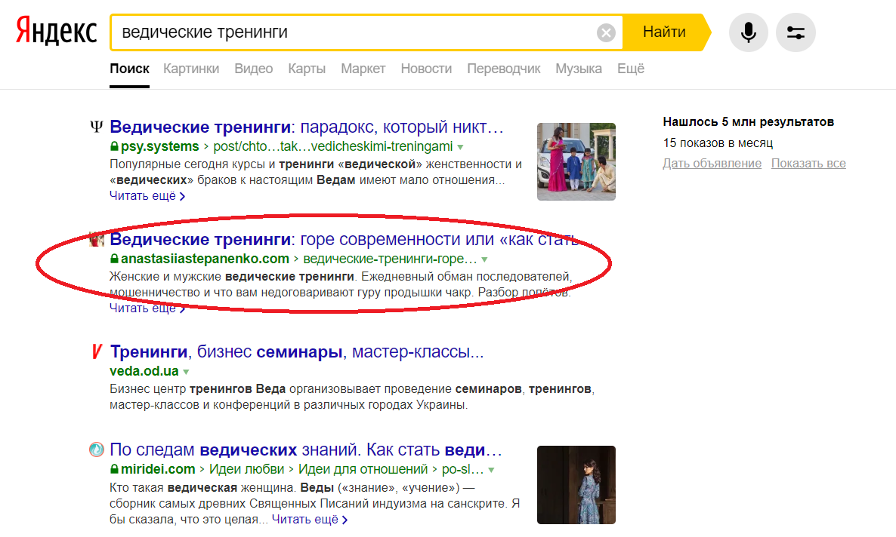
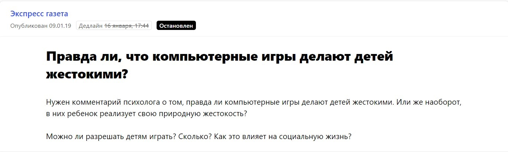
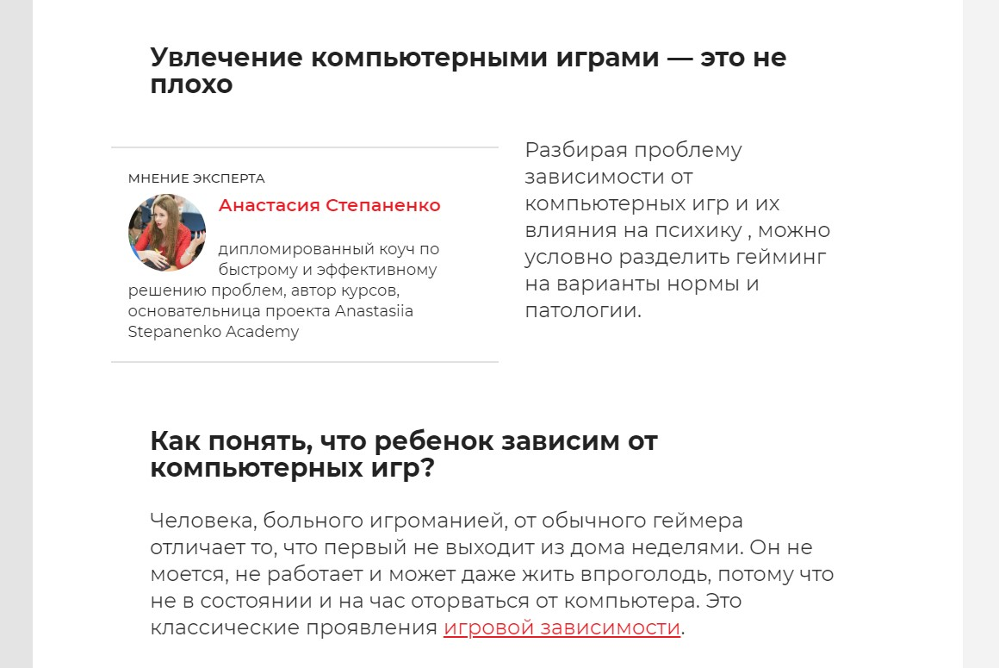
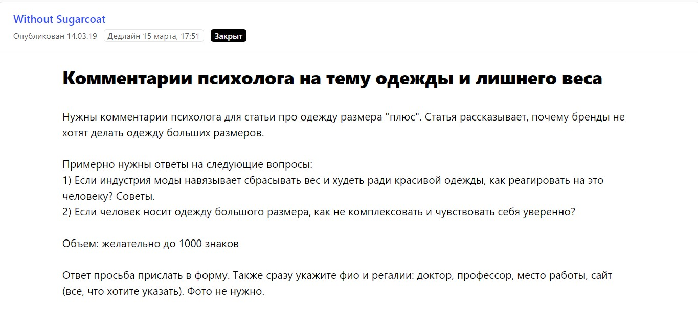
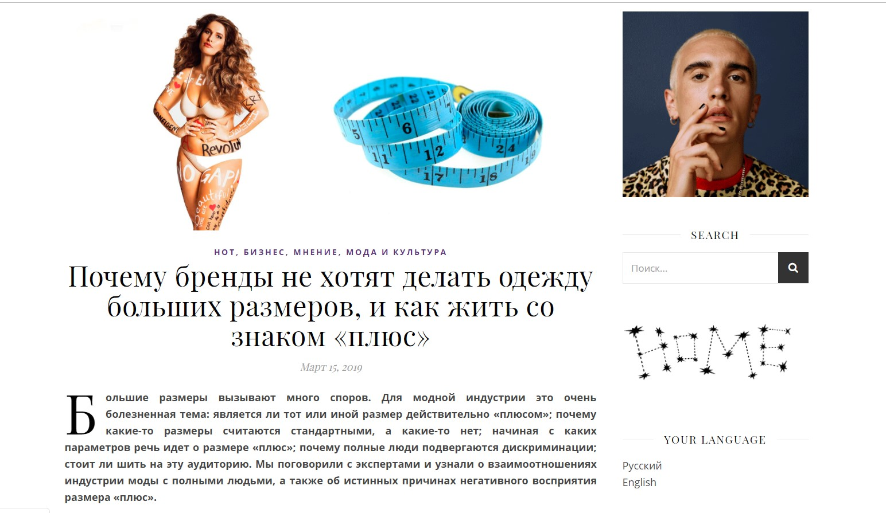
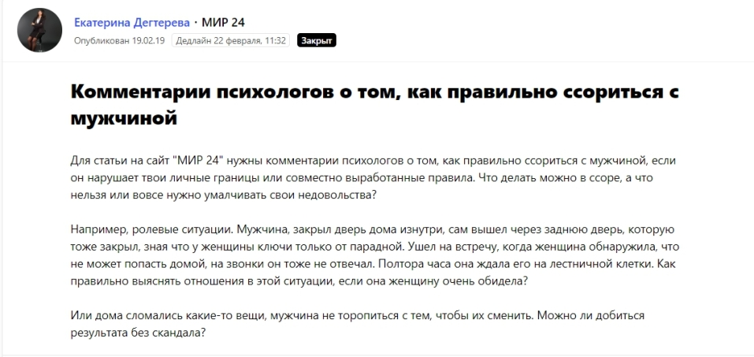
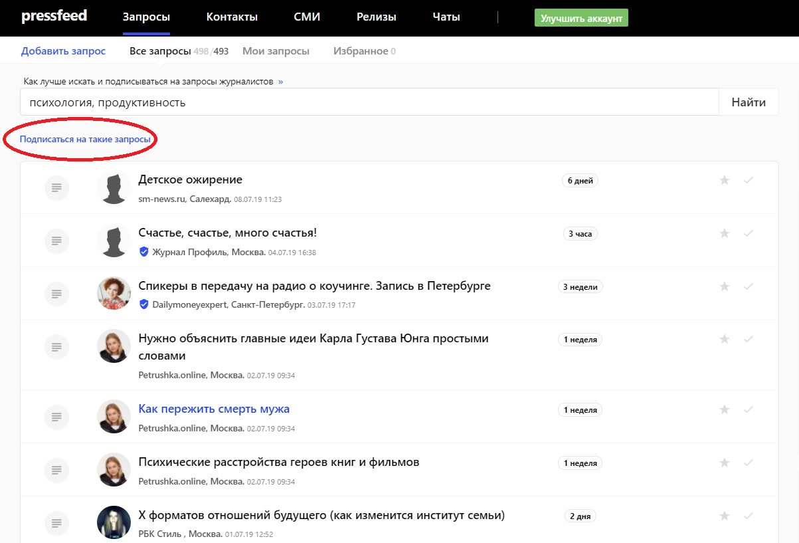
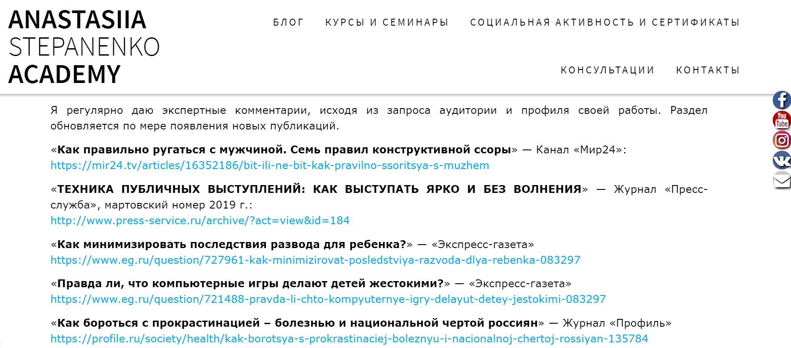
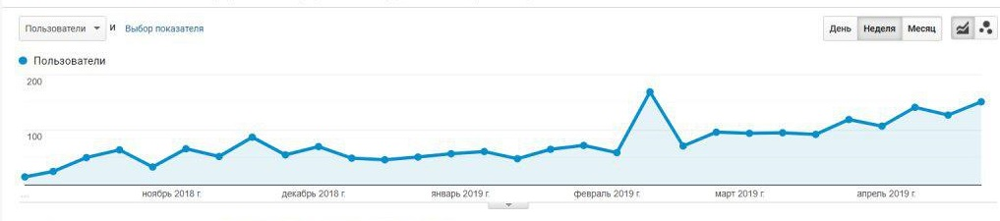
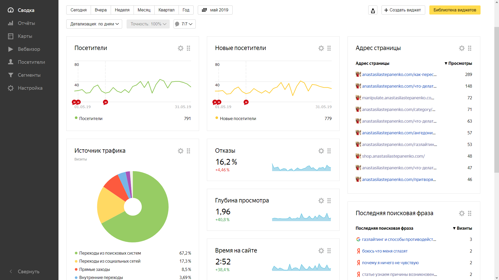

Меня зовут Анастасия Степаненко, я дипломированный коуч, автор и преподаватель онлайн-курсов и тренингов по лидерству и личной эффективности. Например, веду тренинги «Как перестать много думать и начать действовать», «8 шагов к здоровой самооценке» и так далее. На данный момент у меня насчитывается 11 образовательных продуктов. Я продаю как онлайн, так и офлайн услуги — в основу курсов и консультаций ложится информация из научных исследований, посвященных личной эффективности.

Я считаю контент-маркетинг одним из самых эффективных способов продвижения именно для тех, кто работает только на себя. Объясняю, почему я так думаю, на своем примере.

## Почему я выбрала для продвижения контент-маркетинг

Есть три основных причины, почему я стала активно заниматься контент-маркетингом, вкладывать в этот инструмент свои силы и время (а времени на это дело требуется действительно много).

**Во-первых**, мои продукты сложные, ведь курсы — это не спонтанная покупка. Потенциальные клиенты долго выбирают, сравнивают коучей, анализируют содержание тренингов. Люди не смогут доверять человеку, если не убедятся в его экспертности. Бесплатный контент, который я транслирую в свою целевую аудиторию, помогает ей ответить на вопросы: что знает этот коуч? В какой стилистике он преподает? Что он думает по той или иной проблеме? Разбирается ли он в моей конкретной проблеме? Человек читает мои тексты в блоге, находит обо мне информацию в интернете, изучает мои статьи в СМИ, смотрит видео на Youtube. Так у него складывается доверие ко мне и понимание, что я знаю, о чем говорю, и смогу помочь ему.

**Во-вторых**, при подключении большинства платных рекламных инструментов результат зависит исключительно от бюджета. Вот та же таргетированная реклама — сколько денег дадите, такие итоги и получите. Бюджет закончится, продвижение тоже. С контент-маркетингом по-другому. Он имеет долгосрочный эффект, пользователи могут читать ваши тексты через месяц, год, даже 5 лет после того, как вы их опубликуете. Да и таргетинг никогда не даст таких же результатов для узнаваемости компании и для формирования личного бренда. Он может привлечь только «холодные» лиды, которые не факт, что когда-то превратятся в реальных покупателей.

**В-третьих,** контент-маркетингом можно заниматься очень бюджетно или вообще полностью бесплатно. Публиковать тексты в СМИ, выкладывать видео на Youtube получается и без вложения денег. Согласитесь, это существенный фактор, когда специалист работает на себя и его бюджет на продвижение весьма ограничен.

**В-четвертых,** уникальные тексты на сайте эксперта + ссылки на сайт, размещенные на внешних ресурсах, сильно влияют на позиции сайта в поисковой выдаче. Контент-маркетинг дает эффект и с точки зрения SEO-продвижения.

## Какие инструменты использую для продвижения

Главные инструменты контент-маркетинга, в развитие которых я вкладываю больше всего времени:

* публикации и комментарии от моего имени на внешних медиа-площадках;
* статьи в личном блоге на моем официальном сайте.

Конечно, работа по построению эффективного контент-маркетинга включает и другие каналы для коммуникации с целевой аудиторией: я также запустила Youtube-канал и выкладываю там видео и записи вебинаров, и, разумеется, использую все социальные сети — веду прямые эфиры, пишу полезные посты и снимаю сториз с ответами на вопросы подписчиков. Однако сейчас я сделаю акцент на текстовые форматы и подробнее расскажу о продвижении с помощью публикаций как в моем собственном блоге, так и в СМИ. Пока я считаю их основными и внимательно слежу за эффектом от всех моих действий в этом направлении.

## Блог на сайте: пишите просто, чтобы цеплять аудиторию

[Статьи в блоге](https://anastasiiastepanenko.com/category/%d0%b1%d0%bb%d0%be%d0%b3-anastasiia-stepanenko/) — первостепенный бесплатный контент, который получает потенциальный клиент, когда он попадает на официальный сайт коуча. Статьи показывают читателю: о чем я говорю, в каком формате подаю информацию, какой у меня опыт в психологии, как я раскрываю тот или иной вопрос.

Ценность моих материалов в том, что я объясняю сложные вещи простыми словами. Нет смысла разбрасываться направо и налево профессиональными терминами, потому что неподготовленный человек не сможет переварить такую информацию.

Кроме того, поисковики отдают предпочтение именно простым текстам: алгоритмы распознают «живой» контент и лучше продвигают его в поисковой выдаче.

Например, моя статья о вреде ведических тренингов долгое время занимала первую строчку в «Яндексе» по запросу «ведические тренинги». Тема сложная сама по себе, но я постаралась раскрыть ее через понятные ассоциации. Сейчас текст переместился на второе место, но трафик на статью практически не снизился.

Статьи в блоге выкладываю по графику одна статья раз в две недели. Не собираюсь выкладывать чаще, так как делаю все самостоятельно без помощи копирайтера и редактора, а качественный материал невозможно написать за пару дней, особенно с учетом основной занятости на курсах.

## Публикации в СМИ вызывают доверие целевой аудитории

Во времена популярности контент-маркетинга блог ведет практически каждый эксперт. Если не на сайте, то хотя бы в Инстаграме. А вот публикации в крупных медиа — это уже следующий уровень. Очевидно, что редакции хороших СМИ не будут сотрудничать с непроверенными экспертами, и если вы часто появляетесь на страницах разных изданий, значит, вы уже имеете профессиональный вес в обществе.

Всего с начала 2019 года вышло 11 материалов в СМИ с моим участием. На момент написания этого текста еще 3 статьи на подходе, то есть уже на проверке у редакторов изданий. И даже после выхода небольшого, на первый взгляд, количества публикаций, я вижу результаты в рамках развития личного бренда и узнаваемости.

Медиа-площадки, в которые хочется попасть, я выбираю по принципу «читает ли этот ресурс моя ЦА». С журналистами интересных мне изданий я чаще всего общаюсь через [сервис журналистских запросов Pressfeed](https://pressfeed.ru/).

С Pressfeed работа идет так: журналист размещает на сервисе запрос на комментарий или на поиск автора для полноценной статьи. Если мне нравится издание и тема соотносится с моей деятельностью (психология, личная эффективность и т. д.), то я предлагаю журналисту свою кандидатуру. Сотрудник редакции дает добро — я пишу комментарий и отправляю ему. Через некоторое время комментарий появляется в статье, а я благодарю журналиста и обязательно делюсь ссылкой на текст в своих социальных сетях.

Регистрация на сервисе бесплатная, но на базовом аккаунте есть некоторые ограничения — можно отвечать всего на 3 запроса в месяц, запросы появляются с задержкой. Для более эффективной работы стоит подключить аккаунт «Эксперт» и отвечать на неограниченное количество запросов, тем самым выпускать больше хороших публикаций.

Так благодаря Pressfeed я два раза писала для «Экспресс газеты». В одном из запросов редакция спрашивала о вреде компьютерных игр для детей.

[_Запрос от «Экспресс газеты»_](https://pressfeed.ru/query/51323)

Я дала рекомендации, как выявить игровую зависимость у ребенка, как с ней бороться.

  
[_Публикация в «Экспресс газете»_](https://www.eg.ru/question/721488-pravda-li-chto-kompyuternye-igry-delayut-detey-jestokimi-083297/)

Принято считать, что публикации в СМИ влияют, прежде всего, на узнаваемость и репутацию, и после выхода статьи с вашим участием не следует ждать, что к вам сразу придут клиенты и выложат деньги за ваш продукт. Однако в моей практике была обратнная ситуация.

> Несколько клиентов, которые впоследствии купили семинары, перешли на мой сайт из публикации на портале Without Sugarcoat. В статье была размещена прямая ссылка на проект, и пользователям не нужно было дополнительно искать меня в интернете. Они прочитали текст в уважаемом ими издании — заинтересовались — зашли на сайт — посмотрели сайт — окончательно поверили мне — купили семинар. Так действует идеальный контент-маркетинг.

Комментарий попал в материал также с помощью Pressfeed. Without Sugarcoat — проект о моде, стиле и культуре разных стран, особенность портала в том, что редакция уделяет большое внимание проблемам психологии и поведению человека.

  
[_Запрос от Without Sugarcoat_](https://pressfeed.ru/query/53521)

Тема была «больной» для всех людей с лишним весом. Я написала развернутый комментарий о том, как полюбить себя и при этом мотивировать себя на изменения не из-за гнета общественности, а из-за собственного желания сделать свое тело красивее.

  
[_Статья на Without Sugarcoat_](http://withoutsugarcoat.com/ru/plus-size-issue/)

Также по запросу журналиста я давала советы, как [правильно ругаться с мужчиной](https://mir24.tv/articles/16352186/bit-ili-ne-bit-kak-pravilno-ssoritsya-s-muzhem) для портала «Мир 24».

  
[_Запрос от площадки МИР 24_](https://pressfeed.ru/query/52756)

Для сайта «Что делать обозрение» [написала статью](https://www.4dk.ru/news/d/20181022121217-maksimum-produktivnosti-sovety-dlya-sov-i-zhavoronkov) о продуктивности для сов и жаворонков.

> Большую часть публикаций мне обеспечивает сервис Pressfeed, остальные делаю самостоятельно через прямые контакты с журналистами. Все же удобнее работать на платформе, потому что там все собрано в одном месте: и издания, и контакты журналистов, и их запросы. Кроме того, рассылка со свежими запросами приходит на почту два раза в день, и я знаю, что точно не пропущу ничего важного.

Дополнительно можно настроить отдельную подписку на запросы по ключевым словам. Например, «психология», «продуктивность»:

  
_Пример поиска релевантных запросов_

Как только появляется запрос по нужной теме, он моментально «прилетает» на почту.

Важный совет: обязательно дублируйте ссылки на любую публикацию с вашим участием на официальном сайте. Не факт, что потенциальный клиент наткнется на них в СМИ, но он точно обратит внимание на этот раздел при изучении сайта. И в очередной раз убедится в вашей экспертности.

_Раздел на сайте с публикациями_

## Что мне дает контент-маркетинг

Чтобы оценить результаты от контент-маркетинга, я в первую очередь смотрю на посещаемость сайта. С октября 2018 года она выросла более чем в 2 раза, хотя я практически не вкладывала денег в платное продвижение и начинала с нуля.

  
_Посещаемость сайта с октября 2018 по май 2019_

Основной трафик идет из поисковых сетей (почти 67%). Представители целевой аудитории, во-первых, ищут статьи на темы психологии и личной эффективности и затем попадают на мой блог. Во-вторых, после прочтения публикаций в СМИ меня ищут по имени и фамилии и опять же переходят на официальный сайт. Затем потенциальный клиент изучает мои другие материалы, смотрит курсы и выбирает то, что нужно ему. В конце концов, покупает продукт.

  
_Статистика сайта в мае 2019_

Я провела аналитику и заметила, что с тех пор как я начала активно выпускать публикации на внешних площадках, увеличилось количество брендовых запросов по моему имени и фамилии в «Яндексе» и Google, что говорит об интересе аудитории к моим услугам. Меня ищут по фразам «Анастасия Степаненко коуч», «Анастасия Степаненко блог психология» и тому подобное.

Подведу итоги. Контент-маркетинг — способ продвижения, с помощью которого вы убиваете сразу двух зайцев:

1. рекламируете себя и свои продукты;
2. формируете образ эксперта.

**Но!** Это очень ресурсозатратный процесс. Для любителей быстрых результатов и «волшебных таблеток» контент-маркетинг не подойдет.

Работа в рамках контент-маркетинга длится несколько лет, быстрого результата здесь не может быть в принципе. Даже с точки зрения SEO поисковым системам нужно «подружиться» с вашим сайтом, оценить, насколько у вас полезный контент, проанализировать показатели средней продолжительности просмотра вашего сайта, только чтобы затем поднимать позиции сайта в поиске. А уж репутация и узнаваемость точно не появляются за один месяц.

> Однако, вспоминая историю о том, как я потратила деньги на контекстную рекламу и не получила ни одного клиента, я точно знаю, в некоторых сферах без формирования экспертности и личного бренда достигнуть успеха не получится. Коучинг и тренерство — как раз такие сферы.

Придется работать долго и упорно, чтобы достичь цели. Мне самой еще предстоит огромный пласт работ: я буду писать тексты и снимать видео, подключать платное продвижение контента и продолжать налаживать связи с журналистами.
