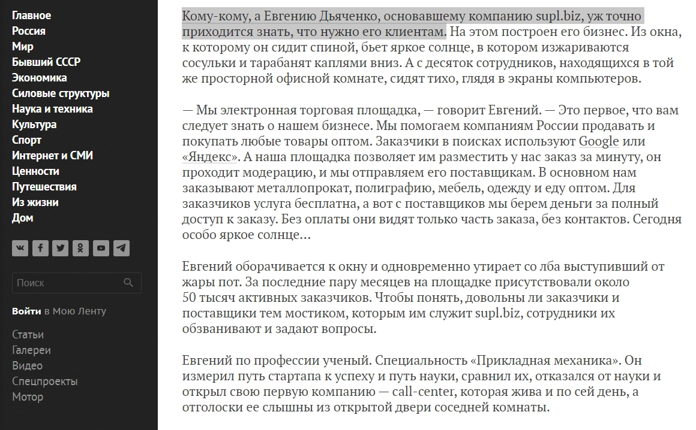
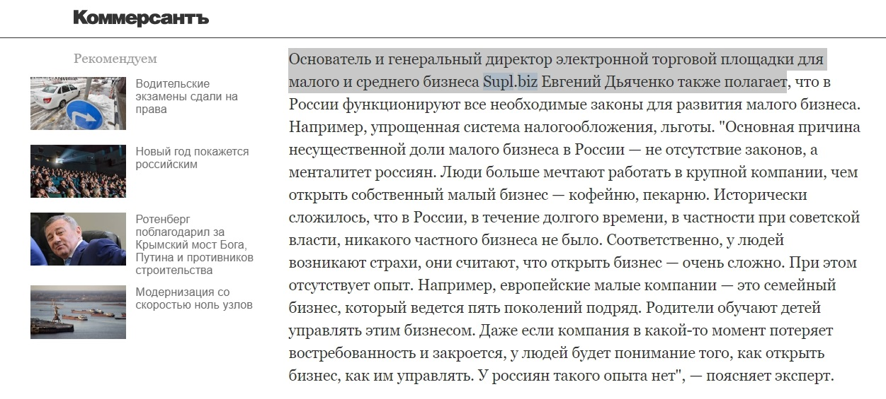
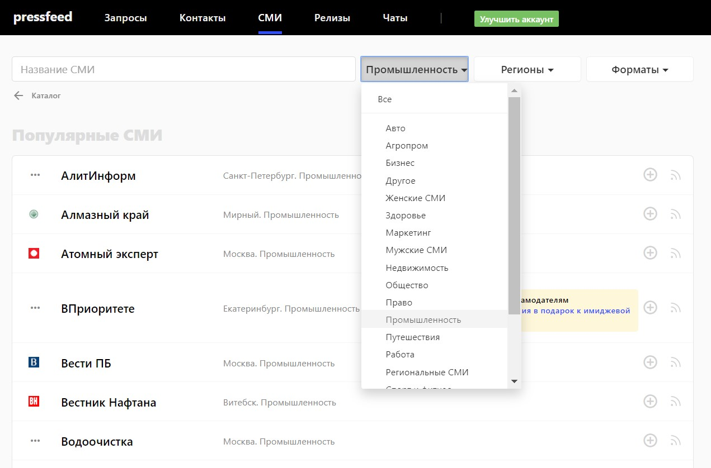
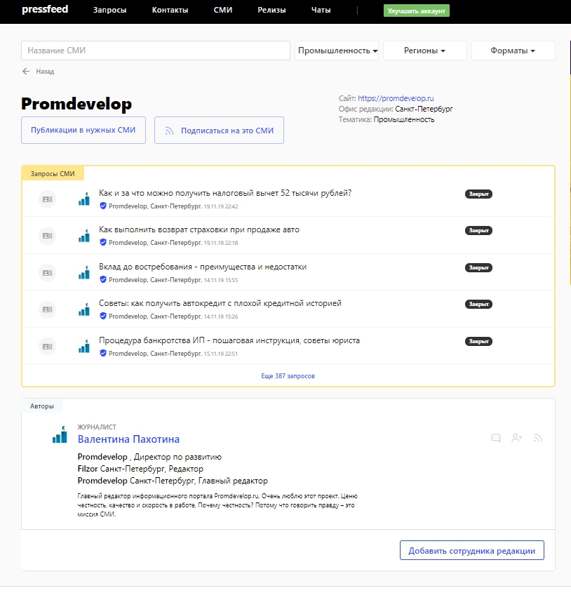

Supl.biz — это платформа, которая помогает компаниям России и СНГ покупать и продавать любые товары и услуги оптом. Наши пользователи — это малый и средний бизнес, основные отрасли — металлы, строительные и отделочные материалы, продукты питания, промышленное оборудование.

Кратко о бизнес-модели Supl.biz — мы предлагаем пользователям-поставщикам платные подписки. Есть три тарифа, возможности которых варьируются в зависимости от пакета услуг. Пользователи на платном тарифе могут получить приоритет по получению заказов с сайта, контакты покупателей, загрузку неограниченного числа товаров в каталог, профильный сайт на поддомене и так далее. Также мы размещаем в некоторых разделах сайта баннерную рекламу.

## Какие инструменты продвижения используем

Аудиторию Supl.biz можно разделить на две большие группы. Это заказчики — они приходят на сайт, чтобы найти поставщика или купить какую-либо продукцию для своего бизнеса. И поставщики — они используют сервис, чтобы продать свои товары или услуги. Мы заинтересованы в том, чтобы на нашей платформе было как можно больше и тех, и других, поэтому маркетинговые активности равномерно направлены на обе группы.

Основные инструменты, с помощью которых мы рекламируем Supl.biz — это телемаркетинг, email-рассылки и контекст. Они показывают хорошую эффективность, но только их недостаточно, чтобы постоянно привлекать новых пользователей и мотивировать их совершать сделки на нашем сервисе. Объясню почему.

Дело в том, что мы предоставляем платформу для взаимодействия компаний, и должны убедить тех, кто впервые узнал о Supl.biz, что наш сервис надежный, прозрачный и понятный. Мы работаем в b2b-сегменте, традиционно на принятие решения здесь уходит много времени, а на финальный выбор влияет множество факторов. Один из таких факторов — понимание будущих пользователей, кто мы вообще такие, почему именно у нас легче найти поставщика и покупателя, а не пойти на более мелкую, но профильную площадку или другие сервисы.

> Маркетинговые каналы, которые перечислены выше, могут «зацепить» потенциального пользователя, то есть вовлечь его в воронку продаж, а дальше им нужна «поддержка» со стороны других инструментов. Таких, которые способны дополнительно убедить целевую аудиторию использовать для продаж/покупок именно Supl.biz. Под этими инструментами я подразумеваю пиар и контент-маркетинг.

Мы участвуем в отраслевых выставках, делаем публикации в крупных СМИ с участием экспертов компании и ведем собственный блог — и все эти действия помогают нам привлекать новых пользователей и вызывать доверие к компании.

## Зачем делать публикации в СМИ

Выступления на профильных мероприятиях играют важную роль в пиар-продвижении, но они нацелены только на узкий круг участников. С одной стороны, это их плюс, но, с другой, минус, так как они охватывают только ограниченное число представителей ЦА, да и проходят не каждый день. А вот с помощью полезных статей в блоге и публикаций в СМИ с участием компании можно охватить бОльшую аудиторию, при этом донести до потенциальных клиентов все преимущества платформы или, как минимум, повысить узнаваемость на рынке.

Если говорить о более конкретных результатах, к которым может привести любая публикация — на внешней площадке или в блоге, то мы видим это так:

* даже короткое упоминание в отраслевом или деловом издании делает свой вклад в развитие компании, например, растет ссылочная масса, которая влияет на поисковую выдачу сайта;
* экспертные комментарии генерального директора, вышедшие в крупных СМИ (таких как «Секрет фирмы» или «Коммерсантъ»), повышают уровень лояльности и доверия к компании со стороны представителей бизнеса, которые работают на нашей платформе или только планируют на ней зарегистрироваться;
* иногда одна статья в СМИ на актуальную тему, посвященная компании, может выстрелить и принести десятки и сотни новых клиентов. У нас была такая история несколько лет назад, после публикации в одном крупном СМИ о бизнесе (расскажу о ней ниже);
* чем больше публикаций, тем «громче слышно» Supl.biz, то есть благодаря пиар-активностям наша компания находится на слуху в тех отраслях, которые нам интересны с точки зрения продаж (промышленность, продукты питания и так далее).

## В каких СМИ делаем публикации и как связываемся с журналистами крупных медиа

Ответ на вопрос «В каких изданиях публиковаться» кроется в целевой аудитории. Мы работаем с бизнесом и для бизнеса, соответственно, первый приоритет — это все **деловые медиа**. Конечно, хочется как можно чаще давать комментарии для топовых СМИ — «Ведомости», «Коммерсантъ», «РБК», Lenta.ru, «Российская газета» и так далее. Хотя актуальны и другие площадки — «Секрет фирмы», «Деловой мир», «Профиль», vc.ru. В изданиях такого уровня мы стараемся освещать нашу деятельность в рамках госпрограмм, говорим о нашем взаимодействии с фондами и привлечении инвестиций, о развитии бизнеса и стартапов в России.

Попасть в крупные издания (да и в принципе в любые) можно двумя способами.

Первый — связываться с редакцией напрямую, по почте или в Facebook, рассказывать о компании, предлагать спикеров, темы и так далее. Следует спокойно относиться к тому, что редакция может вовсе отказать, долго отвечать. 

Второй — мониторить запросы журналистов на [сервисе Pressfeed](https://pressfeed.ru/). Это специальная платформа, на которой сотрудники изданий (на Pressfeed работает около 4 тысяч СМИ) выкладывают запросы с указанием темы будущей публикации и вопросов, на которые нужно ответить экспертам из определенной отрасли. Собственно, задача спикера или его представителя (пиарщика компании) — вовремя отреагировать на запрос, прислать развернутый комментарий до дедлайна. Если ответ подходит, то журналист примет его и разместит мнение эксперта в своем материале.

> Чтобы получить больше хороших публикациях в известных и читаемых СМИ, лучше действовать и так, и так — то есть писать в редакции, а параллельно всегда отсматривать запросы на Pressfeed. Сервис присылает рассылку с новыми запросами (от 1 до 5 раз в день — частоту вы определяете сами), так что сложно пропустить что-то важное.

Например, Евгений Дьяченко, основатель компании Supl.biz, давал интервью Lenta.ru для большой статьи о российских стартапах. Этот материал мы делали напрямую, общаясь с редакцией.

[_Фрагмент публикации на Lenta.ru_](https://lenta.ru/articles/2017/05/15/klient/)

Или в другой раз Евгений делился своим мнением с «Коммерсантом». На журналиста вышли через Pressfeed, он оставил там запрос о жизни малого бизнеса в России.

  
[_Запрос от «Коммерсанта»_](https://pressfeed.ru/query/30566)

Написали ответ, отправили через сервис, в итоге вышла статья с упоминанием Supl.biz.

[_Фрагмент публикации в «Коммерсанте»_](https://www.kommersant.ru/doc/3311084?query=Supl.biz)

С Pressfeed мы работаем с момента запуска сервиса, я была, можно сказать, одним из его первооткрывателей. История началась в 2014 году. Я отправила новость в редакцию журнала «Секрет Фирмы», и мне ответил Константин Бочарский. На тот момент он был редактором отдела «Перспектива». Константин порекомендовал новый сервис Pressfeed. Мне тогда стало очень интересно, так как наши платформы были похожи — только мы объединяли оптовых покупателей и продавцов, а Pressfeed — пиарщиков и журналистов.

С тех пор и используем. Регистрация на сервисе бесплатная, но как и у нас, на базовом тарифе действуют некоторые ограничения — можно отвечать всего на 3 запроса в месяц, нельзя использовать чаты с журналистами, формировать подписки на ключевые слова. Все-таки для эффективной работы лучше подключить pro-аккаунт (цена подписки — 43 тысячи рублей в год).

> Об эффективных публикациях. Ранее я упомянула случай, когда одна статья в СМИ привела сотни новых клиентов. Еще в 2013 году, когда проект Supl.biz только-только запустился, Евгений Дьяченко рассказал о своем первом бизнесе и историю создания новой компании для журнала Олега Тинькова (tinkov.com). Этот материал имел взрывной эффект, после его выхода трафик на сайт подскочил и на платформе зарегистрировались несколько сотен пользователей. К сожалению, спустя 6 лет ссылка на публикацию неактивна, так как сайт tinkov.com позже трансформировался в «Тинькофф Журнал», а старые статьи были удалены.

О других изданиях, с которыми мы сотрудничаем. Даем комментарии и пишем колонки для **площадок, посвященных IT-тематике**, где рассказываем о «подводной части айсберга» Supl.biz — технических решениях и разработках.

Какое-то время вели блог на «Хабр», опубликовали там несколько статей — каждая набрала более 13 тысяч просмотров.

_Фрагмент публикации на Habr_

Эти статьи имели значение на этапе становления компании, так как нам хотелось заявить о себе не только среди предпринимателей, но и на IT-рынке.

Сейчас мы чаще всего отвечаем на запросы от IT-изданий на Pressfeed. Например, три раза участвовали в материалах сайта tproger.ru.

  
[_Запрос от tproger_](https://pressfeed.ru/query/45651)

> Для одной из публикаций наш разработчик честно рассказал, чем junior-специалист отличается от middle, и объяснил, что различие здесь не всегда в знаниях и умениях, а именно опыте. В итоге этот материал прочитали более 44 тысяч посетителей портала!

  
[_Комментарий для Tproger_](https://tproger.ru/experts/junior-middle-senior-developers-differences/)

Также мы не упускаем возможность написать что-то для разных **отраслевых изданий** — им всегда интересна статистика по определенному рынку, которую мы можем собрать с данных нашего сайта, а для нас важно просто рассказывать о Supl.biz на профильных ресурсах, чтобы предприниматели из той или иной отрасли узнавали о возможностях платформы.

Однажды собирали статистику по заказам на бетон для издания «Строительный еженедельник» (Агентство строительных новостей). C ресурсом связались через Pressfeed, отправили комментарий в ответ на запрос.

  
[_Запрос от «Строительного еженедельника»_](https://pressfeed.ru/query/28363)

Комментарий вышел в печатной версии издания, и на сайте.

  
[_Публикация с комментарием эксперта Supl.biz_](https://asninfo.ru/magazines/html-version/77-lo/16462-rynok-betona-v-ozhidanii-stabilnosti)

Кстати, практически любое отраслевое издание можно найти в базе СМИ Pressfeed, внимательно изучить все материалы ресурса, затем найти кого-то из редакторов сайта/газеты/журнала на платформе и написать ему во внутреннем чате сервиса. Рассказать, чем вы можете быть полезны, предложить конкретные идеи для статей.

Так, для нас актуальны издания о промышленности. Заходим во вкладку «СМИ», а потом выбираем тему «Промышленность». На сервисе работает более 65 изданий по этой теме:

  
_СМИ в категории «Промышленность»_

Допустим, вам хочется попасть в издание Promdevelop. Нужно кликнуть на название ресурса, и вы увидите все запросы, которые были опубликованы от лица редакции и сотрудников редакции.

  
Для начала можно изучить запросы — что вообще интересует редакцию, а потом написать конкретному человеку из редакции. В случае с Promdevelop это будет главный редактор.

## Эффективность публикаций в СМИ и полезного контента в целом

Сложно связывать рост компании и увеличение продаж с публикациями СМИ и в блоге. Контент-маркетинг и пиар однозначно влияют на развитие бизнеса, но не напрямую, а опосредованно. Они создают некий имидж бренда и в конце концов подталкивают клиента к правильному (для нас) решению. Пиар, прежде всего, влияет на репутацию и поддерживает другие маркетинговые инструменты — контекстную рекламу, телемаркетинг. Он не продает, а помогает продавать.

На сайте есть отдельная вкладка «СМИ о нас». Мы знаем, что новые посетители платформы заходят в нее и изучают статьи. Сам факт, что о нас пишут «Ведомости», «Коммерсант», Inc., это дополнительный аргумент в нашу пользу, это подтверждение, что мы большая и надежная компания.

_СМИ о нас_

Кроме того, после выхода каждой заметной статьи с участием экспертов Supl.biz на внешних площадках мы видим всплеск трафика на сайт, рост поисковых брендовых запросов.

В любом случае, мы знаем, что без пиара никак, даже если эффект от публикаций в СМИ не кажется таким очевидным, как хотелось бы.

> Мы ориентируемся на общие показатели компании: из томского стартапа с 5 сотрудниками мы превратились в крупную компанию с штатом в более чем 100 сотрудников и филиалами в других городах России и СНГ. За 2019 год выросли в два раза, а количество заказов на площадке перевалило за 600 тысяч, количество товаров — за 8 миллионов.

Эти цифры подтверждают, что мы движемся в верном направлении, и все, что мы делаем, включая каждый текст в блоге или материал в СМИ, помогает нам двигаться к большой цели — стать российским аналогом Alibaba.com (и даже перегнать его).