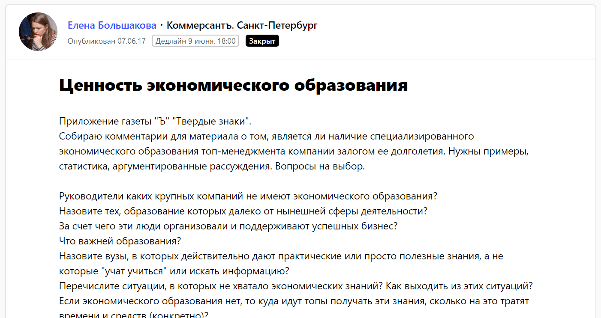
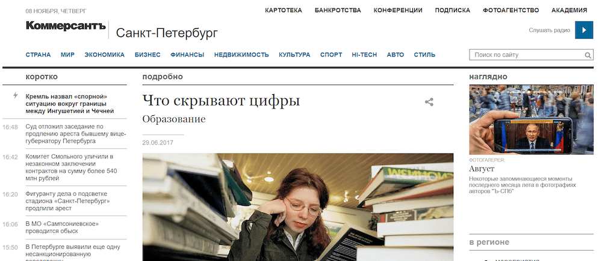
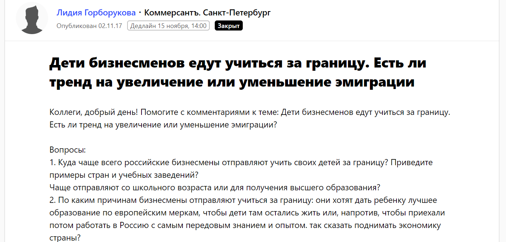
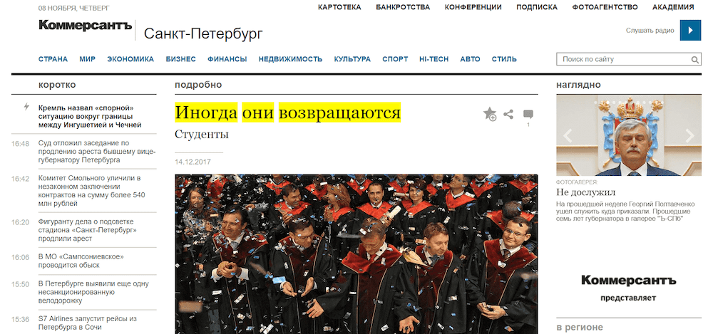
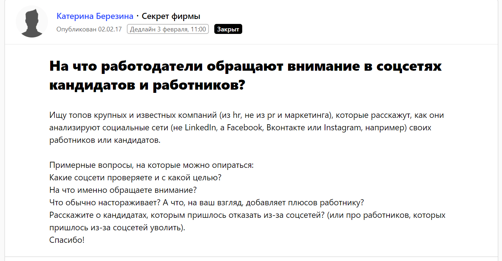
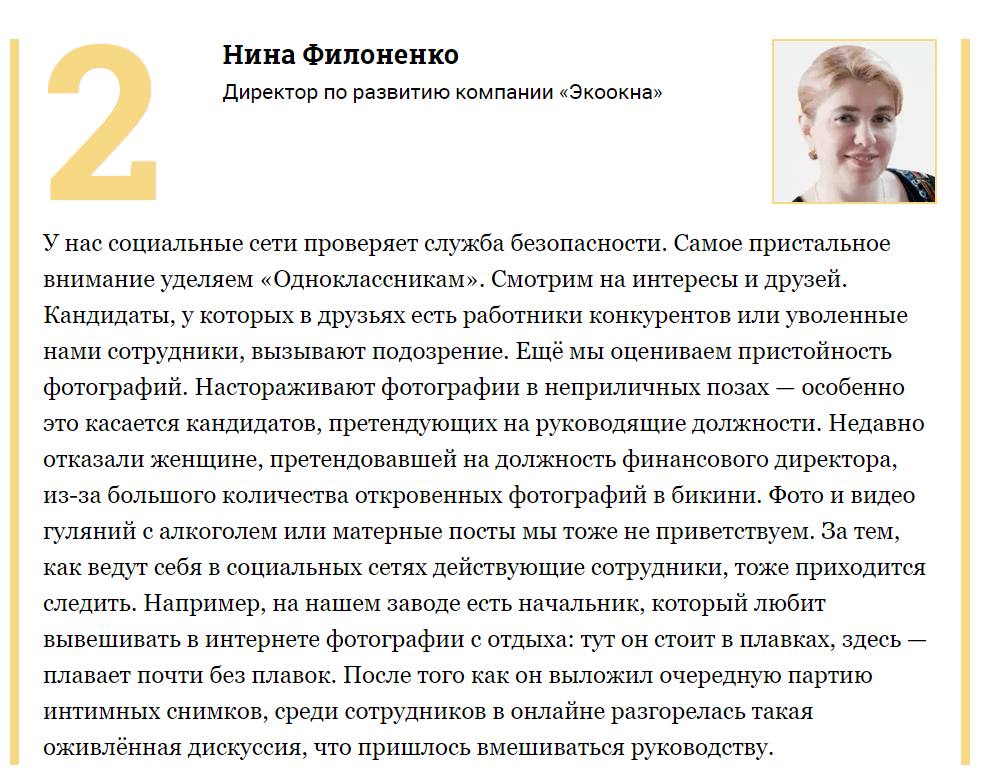
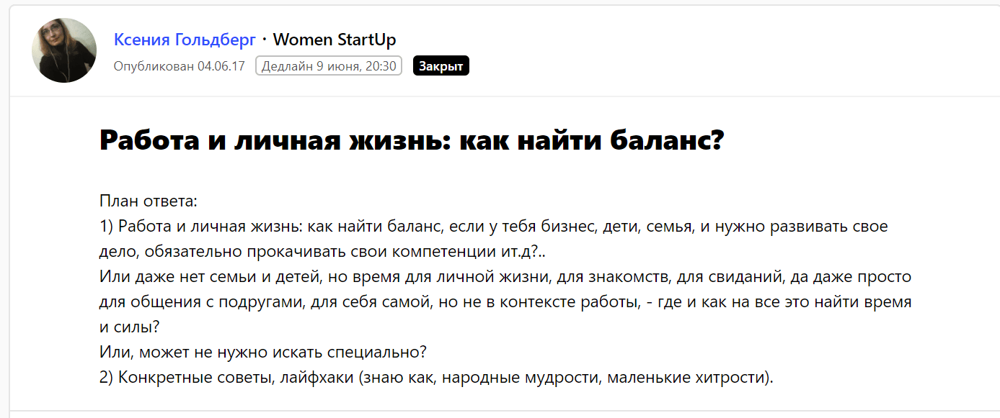
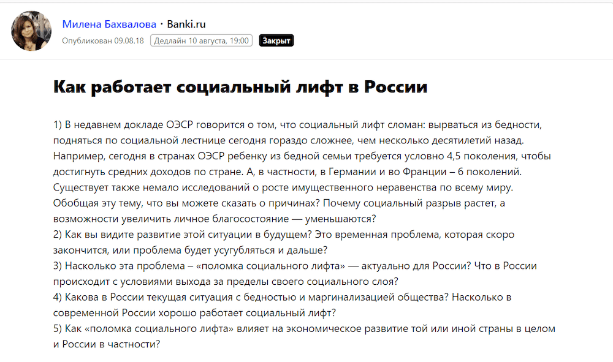

Агентство Tessa Agency занимается комплексными маркетинговыми коммуникациями, а одно из основных направлений компании — пиар-продвижение в СМИ. Наш давний клиент —  крупный холдинг по производству светопрозрачных конструкций «Экоокна». Совладелица и директор по развитию «Экоокна» — Нина Филоненко. Нина — один из тех редких руководителей, кто постоянно учится и много инвестирует в личное развитие. Естественно, это отражается на деятельности компании. Например, на базе холдинга «Экоокна» работает учебный центр, внедряются инновационные методики, связанные с подбором и обучением персонала, улучшается контроль качества продукции и сервиса, меняется система управления компанией.

## Почему в СМИ необязательно рассказывать о продукте компании

На старте работы с компанией, когда мы познакомились с Ниной, разобрались во всем, что происходит внутри бизнеса, и стали создавать PR-стратегию, появилась идея: чтобы продвигать «Экоокна», не нужно ограничиваться разговорами о продукте. Тем более, что основной продукт — «белое окно», что вообще о нем можно рассказать? Тема технологичности окон — узкая, довольно скучная, и может быть интересна лишь нескольким отраслевым СМИ. Мы решили сделать ставку на личность Нины Филоненко и специфику работы самой компании. Продвигать «Экоокна» и рассуждать от имени Нины об управлении бизнесом и производством.

Гипотеза же звучала так: наша аудитория работает / живет в разных отраслях, поэтому нужно продвигать компанию в разных отраслях. Мы не забывали о строительных изданиях, но и не собирались ограничиваться ими. Мы хотели переместить акценты на бизнес-темы.

Нужно сказать, что «Экоокна» работает как на как b2b, так и b2c рынках. К b2b сегменту относится большое количество партнеров, как действующих, так и потенциальных: поставщики, торговые сети, франчайзи и так далее. Основная задача PR-продвижения была сформулирована так: **повысить узнаваемости бренда в деловой среде.**

Какие советы Нина могла дать деловому сообществу, кроме совета «какие окна выбрать»? Первое, что приходит на ум: как управлять большим бизнесом и находить время на себя. Или как развивать бизнес в кризис, как мотивировать сотрудников. Какие системы использует компания для автоматизации процессов, почему именно такие. Предприниматель, который смог построить успешную компанию, — это всегда человек с громадным опытом, силой воли, качественным образованием, с десятками историй-кейсов. В 99% случаев ему есть что рассказать.

Говорите обо всем, что нравится, обо всем, в чем вы разбираетесь. Каждый год ездите в Тибет? Скажите, что это вам дает. Лучше, чтобы это хотя бы косвенно касалось бизнеса, но необязательно.

От лица Нины Филоненко и компании «Экоокна» мы предпочитаем «попадать» в темы о бизнес-трендах, менеджменте, образовании, управлении персоналом.

## Издания, которые читает ваша аудитория

От направлений тем, на которые вы будете выступать в СМИ, зависит список целевых изданий. Нам были интересны издания, которые читают представители среднего и малого бизнеса.

Во-первых, это классические крупные деловые медиа. «Коммерсантъ», «Ведомости», «Секрет фирмы», «РБК» и другие.

Во-вторых, отраслевые издания практической направленности, посвященные управлению бизнесом, управлению персоналом, социальным вопросам, образованию и так далее. Например, The Chief, «Генеральный директор», «Коммерческий директор», HR-TV, vc.ru, Business Story, banki.ru.

## Как работать со СМИ через сервис Pressfeed

Чтобы как можно быстрее и как можно чаще получать публикации в СМИ, мы пользуемся сервисом журналистских запросов [Pressfeed](https://pressfeed.ru/). СМИ выкладывает запрос — мы оперативно отвечаем. С этим сервисом первую публикацию можно получить уже через пару дней. С «Экоокна» работа идет по множеству тематик, так что актуальные для компании запросы всегда в наличии.

На Pressfeed работают почти 150 федеральных бизнес-изданий. Предположим, что каждое выкладывает по 1-2 запроса в неделю (по факту больше), мы видим около 300 запросов от целевых медиа. Дальше мы выбираем самые крупные издания или интересные для спикера темы. Чтобы ответить на запрос, нам нужно от 2 до 6 часов.

Увидели запрос — поговорили со спикером или написали готовые тезисы по теме, если глубоко знаете тему, и выстроены доверительные отношения с клиентом,  — отправили на утверждение или отредактировали его ответ — отправили журналисту.

Здесь очень важна скорость реакции, и нужно заранее настраивать клиентов, что «PR is now business». Журналист не будет ждать два дня пока вы найдете время, чтобы прочитать сообщение. Общественно-политические и деловые издания часто работают от текущей повестки, и второго шанса может не быть.

Сервис кажется удобным еще и потому, что работники изданий меняются. Предположим, у нас был телефон такого-то редактора, а он вдруг уйдет в медиа, которое пока не является для нас целевым.

## О чем писать: обо всем, что волнует предпринимателя. Примеры компании

Для издания «Коммерсантъ» Нина рассуждала, для чего предпринимателю экономическое образование, и почему образование в Европе и в США до сих пор считается более качественным, чем в России.

_Такой_ [_запрос_](https://pressfeed.ru/query/31903) _выложил журналист «Коммерсантъ» на сервисе_

Затем мы отвечали на [запрос](https://pressfeed.ru/query/36960) уже другого журналиста «Коммерсантъ», и Нина прокомментировала тему [обучения российской молодежи в зарубежных вузах](https://www.kommersant.ru/doc/3493993?query=%D1%8D%D0%BA%D0%BE%D0%BE%D0%BA%D0%BD%D0%B0).

  
И снова тема образования, только уже для младшего поколения. Говорили с изданием о ценах на обучение, о качестве, о возможностях после окончания зарубежного вуза.

Как-то раз был запрос на тему: [«Какую информацию о кандидатах работодатели ищут в социальных сетях»](https://secretmag.ru/business/management/kakuyu-informaciyu-o-kandidatah-rabotodateli-ishut-v-socialnyh-setyah.htm). Эта статья вышла в издании «Секрет фирмы», журналисты которого активно оставляют вопросы на Pressfeed.

Тема управления персоналом ― одна из самых обсуждаемых и тревожных для любого предпринимателя. Социальные сети ― это личная зона сотрудников или же работодателю стоит туда заглядывать? Нина считает, что стоит. Ради репутации компании.

[_Фрагмент публикации_](https://secretmag.ru/business/management/kakuyu-informaciyu-o-kandidatah-rabotodateli-ishut-v-socialnyh-setyah.htm) _с участием Нины Филоненко_

Через Pressfeed мы познакомились с бизнес-изданием о женщинах-предпринимателях Women StartUp. Нина поделилась жизненным опытом: [как совмещать работу и личную жизнь](https://women-startup.ru/live/nina-filonenko-doma-i-na-rabote-my-s-muzhem-vmeste-eshhe-so-studenchestva/). Согласитесь, не менее важная тема для бизнесменов.

[_Запрос_](https://pressfeed.ru/query/31785) _от Women StartUp_

С некоторыми изданиями можно обсудить тему жизни в России. Нина давала комментарий для banki.ru, почему [социальный лифт в России не работает](http://www.banki.ru/news/daytheme/?id=10615028).

[_Запрос_](https://pressfeed.ru/query/46325) _от banki.ru_

Темы разноплановые, но все вместе публикации создают образ Нины Филоненко, она показывает себя с разных сторон, а компания «Экоокна» остается на слуху.

## Сколько публикаций в месяц вы можете сделать

Люди дела — занятые люди. Точно определить, сколько публикаций в месяц вы выпустите, не получится. У нас есть прогноз и план по публикациям. Но бывает, что в какой-то месяц публикаций больше, в какой-то — меньше. Сейчас для «Экоокна» мы делаем примерно 6-8 комментариев в месяц и пишем 2-3 полноценных авторских колонки. Комментарии делаются за несколько часов, а на одну качественную статью иногда уходит несколько дней работы.

Tessa Agency как маркетинговое агентство имеет большой опыт работы с медиа, и мы годами нарабатывали свою базу контактов. Поэтому мы взаимодействуем со СМИ и через Pressfeed, и параллельно самостоятельно налаживаем связи с журналистами.

У нас есть связи и выходы на редакторов и журналистов таких изданий, как: «Генеральный директор», «Коммерческий директор», «РБК», Бизнес журнал, The Chief, Рамблер.Новости и так далее.

Схема работы над материалами простая: находим или инициируем тему — обсуждаем с клиентом — пишем тезисы — собираем фактуру — согласовываем — договариваемся с изданием (этот этап обычно идет до идеи, а может после окончания работы над текстом) — публикуем — анализируем результаты.

## Что публикации в СМИ дают бизнесу

За 1,5 года совместной работы с компанией «Экоокна» и Ниной Филоненко у нас вышло порядка 120 публикаций, не считая эфиров на радио и ТВ. По словам самого директора по развитию, такой подход к PR-продвижению отстраивает «Экоокна» от конкурентов, показывает, что это серьезная компания, которая сейчас формирует рынок пластиковых окон, что это не компания-однодневка.

За 2017 год рост по выручке составил 20%. В 2017 году «Экоокна» открыли еще один розничный офис продаж в Москве, всего на данный момент у компании 82 офиса в 13 городах Центральной России. При этом нужно понимать, что рынок пластиковых окон — падающий рынок. Спрос на них сейчас далеко не такой, как был 15 лет назад. Некоторая часть конкурентов давно закрылась, на рынке остаются только сильнейшие.

Собственники компании уверены, что продвижение в СМИ упрощает ведение бизнеса, им становится легче находить поставщиков, партнеров, договариваться с продавцами. Каждая публикация повышает доверие b2b-сегмента к ним и главное — узнаваемость компании.
