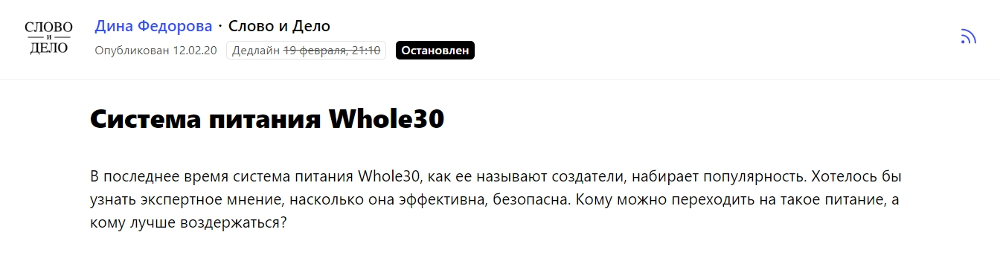
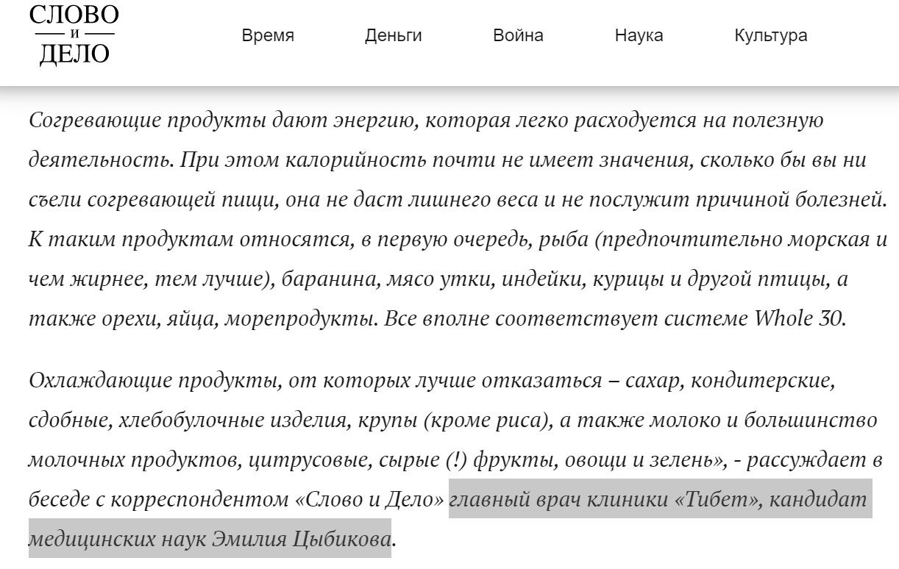

[Клиника восточной медицины «Тибет»](https://www.clinica-tibet.ru/) открылась в 2007 году, филиалы работают в Москве и Санкт-Петербурге. Клиенты клиники — люди, которые относятся к восточной медицине с интересом и без предубеждения. Возрастных практически ограничений нет. При этом если в первые годы существования клиники в основном к нам приходили пожилые люди с хроническими заболеваниями, разочаровавшиеся в «обычной» медицине, то со временем ситуация изменилась. За последние годы пациенты «Тибета» значительно «помолодели». Сегодня это все чаще люди 35+, но также к нам приводят и детей.

## Зачем нам нужен контент-маркетинг

Для продвижения клиники мы используем два маркетинговых инструмента. Первый — это классическая реклама в Яндекс.Директе. Второй — контент-маркетинг, а именно публикация статей о пользе и особенностях восточной медицины в различных СМИ, а также на сайте компании. Причем эти два рекламных канала отлично работают и по отдельности друг от друга, но в связке друг с другом они действуют еще эффективнее.

Сначала расскажу о контент-маркетинге. Пожалуй, это основа основ для продвижения клиники с «нестандартным» подходом к лечению. Дело в том, что самое важное для нас — привлечь людей на свою сторону, развенчать недоверие к восточной и вообще альтернативной медицине. Специфика восточных лечебных практик в том, что они не составляет конкуренции симптоматическим средствам. Наши врачи имеют дело с хроническими затяжными заболеваниями, при которых одноразовые средства, рекламируемые по ТВ, бесполезны. Мы пытаемся донести до целевой аудитории мысль, что лечить нужно не симптомы, а причину болезни. И в этом восточная медицина весьма эффективна. На это делается упор в том контенте, который мы создаем — и в СМИ, и в соцсетях, и на сайте.

> В итоге чем люди больше узнают о восточной медицине, о ее сути, о ее нюансах, тем больше доверяют ей, и в дальнейшем они готовы обратиться в клинику, чтобы попробовать вылечить свои старые болезни. То есть от «правильного» контента напрямую зависит поток клиентов в клинику.

Что касается объявлений в Директе. Конверсия контекстной рекламы повышается, если повышается узнаваемость компании. А узнаваемость и репутация компании формируется с помощью пиара и контент-маркетинга. Человек выбирает из нескольких предложений. В первую очередь, он кликает на предложения известных ему компаний. Если у потенциального клиента уже сложилось в голове представление о клинике, он слышал о ней, он неоднократно читал о ней, то, скорее всего, он обратит внимание именно на наше объявление. Причем он может сделать это даже бессознательно. Мозгу просто легче отреагировать на что-то знакомое. Вот почему контент и классическая интернет-реклама эффективнее всего работают вместе.

## Как работать с журналистами из разных СМИ

Публикации в различных СМИ — это одно из главных направлений контент-маркетинга, которое мы развиваем.

Когда клиника «Тибет» только открылась, мы выпускали газету «Тибетская медицина» (я был главным редактором). Он распространялась бесплатно по почтовым ящикам, тираж составляя 500 тыс. экз. в месяц. Газета на протяжении четырех лет была главной нашей рекламой. Но потом ситуация поменялась, пришлось прекратить выпуск, и мы решили идти в другие СМИ, в том числе интернет-издания.

Теперь регулярно выпускаем материалы с участием экспертов клиники «Тибет»

на интернет-площадках, посвященных восточной медицине, ЗОЖ, правильному питанию, профилактике заболеваний. Также нам интересны СМИ общего профиля с широким охватом (например, «Аргументы и факты»).

С журналистами СМИ обычно общаемся через [сервис Pressfeed](https://pressfeed.ru/). Это платформа, где сотрудники изданий (сайт используют более 5 тыс. редакций) ищут экспертов для будущих публикаций. Журналист выкладывает запрос по определенной теме и указывает, на какие вопросы нужно ответить спикеру до дедлайна. Дальше эксперты пишут свои ответы и высылают комментарии в редакцию. Журналист выбирает те ответы, которые кажутся ему самыми интересными и полезными, и включает мнение спикеров в свою статью. Через некоторое время выходит публикация с участием компании.

Регистрация на сервисе бесплатная для всех, но на базовом аккаунте действуют некоторые ограничения. Например, можно отвечать всего на 3 запроса в месяц. Для эффективной работы со СМИ этого, конечно, недостаточно. Лучше подключить pro-аккаунт, начать можно с аккаунта «Эксперт». Тогда вы сможете реагировать на неограниченное количество запросов, общаться с журналистами во внутренних чатах и формировать подписки по ключевым словам, медиа, темам.

_Варианты тарифов_

Мы отвечаем на те запросы, которые касаются медицины и здоровья. Чтобы ничего не пропустить, советую сформировать подписку по ключевым словам и темам, тогда все новые актуальные запросы будут сразу приходить к вам на почту.

  
_Подписка по темам_

Например, через Pressfeed мы несколько лет сотрудничаем с интернет-изданием о здоровом образе жизни Medaboutme. Редактор издания постоянно выкладывает запросы со списком тематик для будущих материалов. Удобно, что можно подготовить сразу несколько ответов и выслать в издание.

[_Пример запроса от Medaboutme_](https://pressfeed.ru/query/47943)

За все время использования Pressfeed мы ответили на 36 запросов от издания! Так что на Medaboutme вышли десятки публикаций с комментариями главного врача нашей клиники Эмилии Цыбиковой. Она рассказывала и о вредных продуктах, и об эффективном похудении, и о правильном питании. В среднем публикации набирали от 1000 до 5000 прочтений. Общий охват перевалил за сотни тысяч. И все это бесплатно.

[_Пример публикации на Medaboutme_](https://medaboutme.ru/obraz-zhizni/publikacii/stati/pitanie_i_diety/16_vrednykh_produktov_kotorye_izbegayut_uchenye_i_vrachi/)

Если вы хотите предложить какую-то свою уникальную тему, которая будет интересна аудитории конкретного СМИ, то всегда можно написать самому активному редактору издания (который оставляет больше всего запросов) во внутреннем чате сервиса.

  
[_Профиль редактора Medaboutme_](https://pressfeed.ru/people/16392)

Редактор подскажет, какие темы подходят, даст рекомендации.

Также мы сотрудничали с сайтом «Слово и Дело» — это портал общей направленности, там пишут и о политике, и о науке, и о здоровье. Мы ответили на запрос о популярной системе питания Whole 30.

[_Запрос от «Слово и Дело»_](https://pressfeed.ru/query/65722)

[В статье](https://slovodel.com/550298-vrachi-rasskazali-chto-dumayut-o-sisteme-pitaniya-whole-30) Эмилия Цибикова поделилась своим мнением о поводу системы питания и сказала, что советует тибетская медицина.

  
Всего в 2019 году в онлайн-СМИ вышло около 60 публикаций с участием главного врача клиники «Тибет», а в печатных медиа — 10 материалов. При этом стоит отметить, что все публикации в интернет-изданиях мы выпускаем на безбюджетной основе через Pressfeed, а вот в печатных изданиях статьи выходят только на правах рекламы.

Кроме того, специалисты клиники регулярно участвуют в радио-эфирах («Серебряный дождь», «Эхо Москвы» и так далее), телеэфирах (на «ТВЦ» и тому подобное).

## Выводы: что дает продвижение с помощью контента

Проследить четкую связь между выходом контента и новыми записями в клинику довольно сложно. Публикации в СМИ и в блоге формируют доверие, а доверие уже конвертируется в продажи.

Бывает и так, что в СМИ появляется наша статья о лечении остеохондроза, и начинают массово звонить люди с проблемами позвоночника или запрашивать на нашем сайте соответствующие разделы. После выхода хорошей статьи в медиа может вырасти трафик на сайт.

Порой контент вызывает резкий рост потока клиентов, но все же его главная задача — создавать репутацию клиники, повышать узнаваемость, доносить информацию о возможностях альтернативного лечения до аудитории.

Если говорить об общих успехах клиники «Тибет», то за 2019 год в клинике появилось несколько новых направлений (кардиология, педиатрия и др.), пришли новые врачи, было открыто два кабинета, так как прежних уже не хватало, чтобы принять всех желающих. Клиника развивается стабильно. Мы не стараемся форсировать этот процесс, а хотим делать упор на последовательность и планомерность.