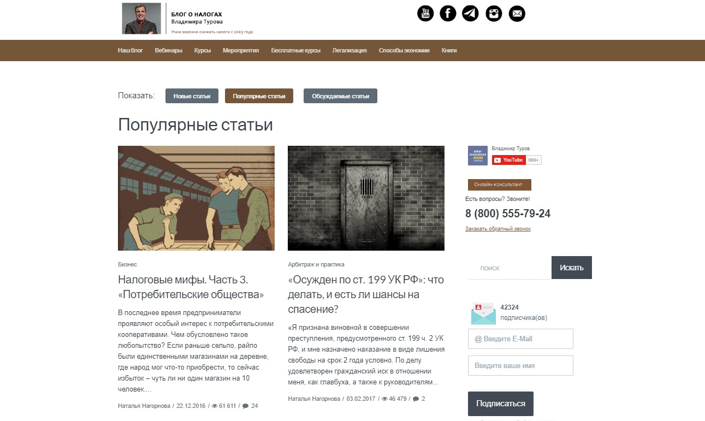
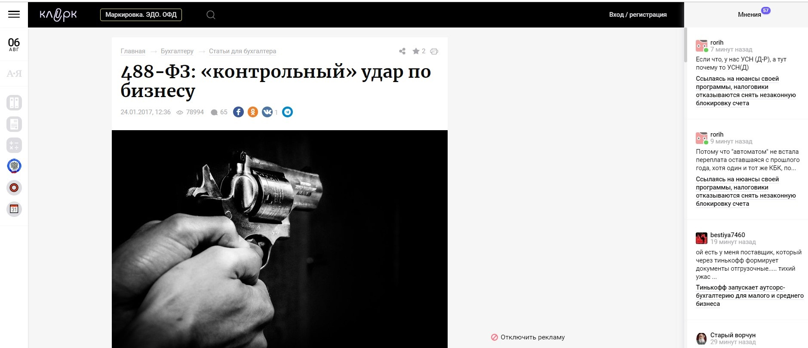
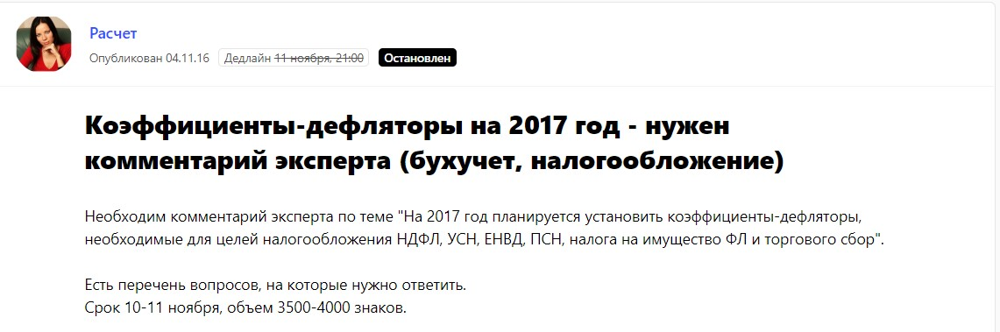
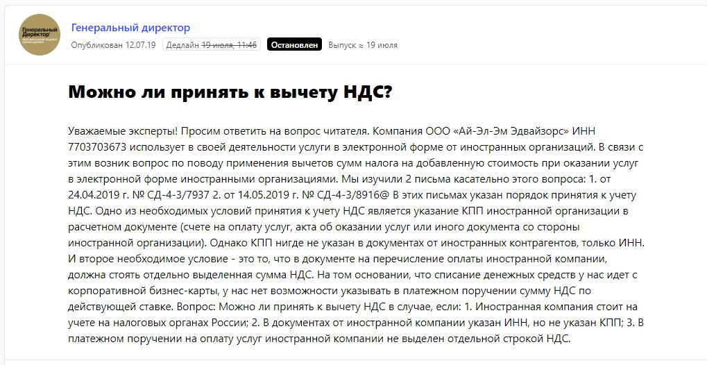
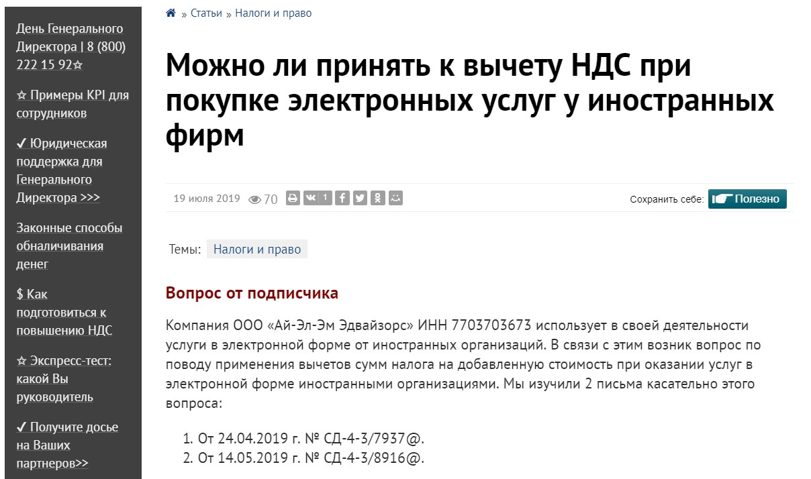
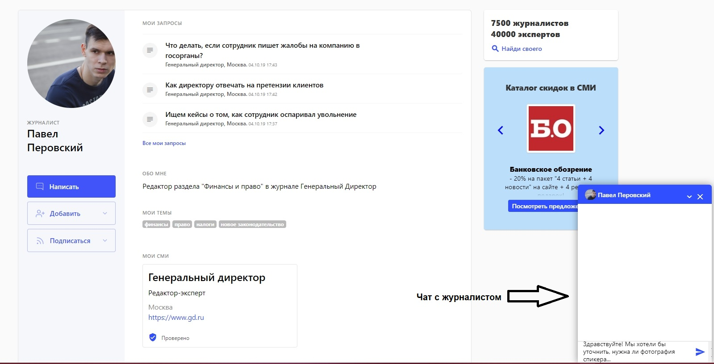
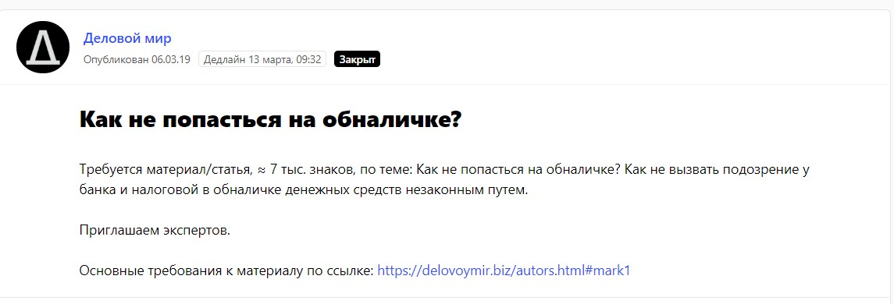
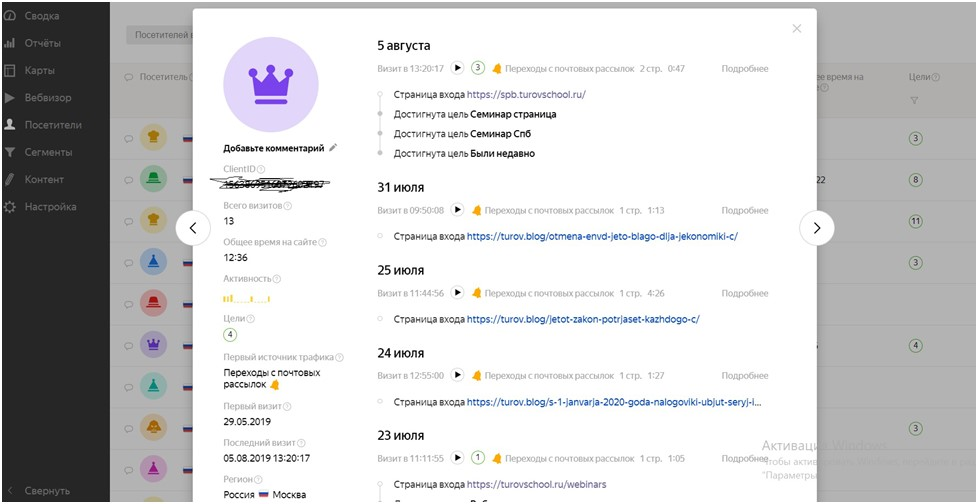

Компания [«Школа Бизнеса Турова»](https://turovschool.ru/) занимается организацией семинаров Владимира Викторовича Турова, эксперта в области легализации бизнеса и оптимизации налогов. Школа обучает финансовому планированию и контролю, способам защиты бизнеса от неправомерных действий со стороны государства и другим управленческим стратегиям. Целевая аудитория школы – собственники бизнеса, генеральные и финансовые директора, главные бухгалтеры. То есть те, кто управляет деньгами компании. Так сложилось, что предлагать продукты и услуги компании гораздо эффективнее с помощью контент-маркетинга.

## Почему именно контент-маркетинг стал главным инструментом продвижения

Полезный контент влияет не только на известность компании и экспертов в глазах бизнес-сообщества.

> Контент напрямую влияет на продажи. Чем чаще человек читает наш блог, социальные сети, статьи в СМИ, чем больше он узнает о школе, тем больше его желание посетить сайт компании, изучить услуги, курсы. А значит, его легче мотивировать на покупку.

Как выглядит воронка продаж в компании? Потенциальный клиент узнает о нас с помощью контекстной рекламы (идет его первое касание). Потом он переходит на наш блог, читает полезные статьи. Потом совершает покупку, потому что поверил опыту, который мы транслируем в блоге. Либо потенциальный клиент читает статью в одном из значимых для него профильных СМИ, потом переходит на наши ресурсы и подписывается на наш блог или сразу же совершает покупку. Либо человек видит рекламу в социальных сетях и опять-таки подписывается на наш блог, читает полезный контент и потом совершает целевое действие. Потому что снова поверил в нас и нашу экспертность.

Все происходит именно так, мы можем подтвердить это сотнями примеров из нашей практики. Именно контент заставляет пользователя доверять нам, вызывает желание подробно ознакомиться с нашими услугами и затем получить консультацию или пройти обучение, чтобы стать таким же экспертом, как и наши специалисты.

Мы используем практически все возможные инструменты контент-маркетинга, но больше всего сил вкладываем в следующее:

* ведем собственный блог о налогах – это сердце нашей контент-стратегии;
* делаем публикации на внешних площадках – преимущественно это статьи на отраслевых ресурсах;
* развиваем канал на YouTube.

Кроме того, мы ведем страницы в социальных сетях, делаем email-рассылки по базе подписчиков. Конечно, используем и другие маркетинговые инструменты – контекстную рекламу, рекламу в социальных сетях, но все же считаем контент главным источником лидов, которые затем превращаются в клиентов.

Теперь о каждом инструменте подробнее.

## Блог о налогах и email-рассылка работают в связке

Блог является сердцем нашей маркетинговой стратегии, мы уделяем ему примерно 50 % времени, которое тратится на продвижение. В блоге публикуем аналитические материалы, видеоролики, тесты, пишем об изменениях в законодательстве, даем советы, инструкции по финансовому планированию и контролю. А email-рассылки помогают нам распространять все материалы.

_Блог о налогах_

Пока максимальное количество прочтений одной статьи превысило 60 тысяч. Иногда для привлечения внимания к действительно масштабным инфоповодам мы используем желтые заголовки. Например, когда в СМИ прошла информация, что в одном из федеральных законов была приписка, мол, «все налоги отменить», мы написали в нашем блоге статью [«Путин отменил налоги. Ура!»](https://turov.blog/putin-otmenil-nalogi-ura-c/). После того, как мы опубликовали этот материал, его подхватили буквально все, кто пишет на эту тему. Было огромное количество перепечаток.

Новый контент в блоге выходит 6 раз в неделю. Как мы ведем трафик на блог? Главный канал – это email-рассылки. Сейчас у нас более 42 тысяч подписчиков, которые ежедневно или еженедельно получают полезные статьи и видео из блога. За июль 2019 года блог посетили 32 тысячи читателей.

> Блог о налогах – это основной источник привлечения лидов, на данный момент 70 % заказов у нас приходит из блога. Люди читают, получают полезный контент, верят в нашу экспертность, затем заказывают наши услуги.

Интересно, что изначально мы создавали блог не для того, чтобы он продавал. Мы хотели сделать собственный имиджевый продукт, который бы показывал нашу экспертность и был неким «справочником отрасли», помощником для целевой аудитории. Но в итоге он продает.

## Публикации на внешних площадках

Помимо собственного блога, мы активно общаемся с журналистами и регулярно публикуем статьи и комментарии в таких изданиях, как «Клерк», «Аудит-ИТ», «Генеральный Директор», «Учет. Налоги. Право», «Деловой мир», «Секрет фирмы» и так далее. В приоритете отраслевые издания, посвященные финансам и управлению бизнеса. Большинство статей и комментариев с участием «Школы Бизнеса Турова» связаны с темами в области оптимизации налогов, изменений в налоговом кодексе. Однако сейчас мы развиваем направление маркетинга, делимся с аудиторией еще и своим опытом в продвижении и продажах.

Взаимодействуем и договариваемся с журналистами о публикациях по-разному:

1. ежедневно мониторим обновления на специальном [сервисе журналистских запросов Pressfeed](https://pressfeed.ru/?utm_source=webpromoexperts&utm_medium=content&utm_campaign=case&utm_content=turov);
2. некоторые издания перепечатывают наши статьи из основного блога после разрешения;
3. часто работники редакций обращаются к нам напрямую и просят прокомментировать новый закон, например;
4. порой связываемся с редакциями сами и предлагаем актуальные для их читателей темы.

Поскольку наша основная сфера деятельности – это налоговый консалтинг и проведение семинаров по легализации бизнеса, наши самые популярные публикации появились благодаря моментальной реакции на важные изменения в области законодательства. Как только появляется новый закон или какое-то письмо с разъяснениями, мы должны как можно быстрее дать комментарий, выпустить статью с мощным новостным заголовком.

  
[_Статья в «Клерке»_](https://www.klerk.ru/buh/articles/456650/)

Тогда СМИ делают републикации наших статей, ссылаются на наш источник, запрашивают дополнительные комментарии по теме, и трафик на наших основных ресурсах заметно растет.

Кроме того, мы поддерживаем отношения с изданиями-партнерами и время от времени пишем статьи конкретно для них. Например, печатный журнал «Расчет» – мы познакомились с изданием через сервис Pressfeed еще в 2016 году, а затем стали работать напрямую.

[Сервис журналистских запросов Pressfeed](https://pressfeed.ru/) – это платформа, где сотрудники редакции ищут героев и экспертов для публикации. Журналист размещает на сервисе запрос на комментарий или на поиск автора для полноценной статьи. Мы смотрим на тему и на издание – если все подходит, то быстро генерируем комментарий и высылаем его журналисту. Через некоторое время (обычно 1-2 недели, но может и на следующий день) мнение эксперта «Школы Бизнеса Турова» выходит в статье на этой площадке.

[_Запрос от журнала «Расчет» на Pressfeed_](https://pressfeed.ru/query/25322)

Изначально регистрация на Pressfeed бесплатная для всех. Но на базовом аккаунте есть ограничения. Например, можно отвечать всего на 3 запроса в месяц. Такое количество ответов нас не устраивало, потому что эффективной работы со СМИ не получилось бы. Мы подключили аккаунт «Эксперт», чтобы давать комментарии на неограниченное количество запросов.

Так, с деловым ресурсом «Генеральный директор» работаем и напрямую, и через Pressfeed. Иногда удобнее контактировать с редакцией через почту, но если видим подходящий для нас запрос – оперативно отвечаем на сервисе.

  
[_Запрос от издания «Генеральный директор»_](https://pressfeed.ru/query/57921)

Мы неоднократно рассказывали ресурсу об НДС, о легальном снижении налоговых выплат для компаний, как налоговая обманывает бизнес и так далее.

[_Публикация_](https://www.gd.ru/articles/10359-mojno-li-prinyat-k-vychetu-nds-pri-pokupke-elektronnyh-uslug-u-inostrannyh-firm)

Если давать ответ на сервисе, то всегда можно что-то быстро уточнить через внутренние чаты, которые доступны только пользователям PRO-аккаунта.

  
_Пример страницы журналиста с чатом_

Несколько раз сотрудничали с бизнес-площадкой «Деловой мир». Давали советы для предпринимателей. Например, какие доказательства предоставить банку и налоговой, если компанию обвиняют в незаконном обналичивании средств. Также вышли на них через Pressfeed.

  
[_Запрос от «Делового мира»_](https://pressfeed.ru/query/53260)

На ресурсе вышла полноценная большая статья от лица эксперта «Школы Бизнеса Турова». Материал про обналичку прочитали более 5,5 тысяч человек.

  
  
[_Публикация в «Деловом мире»_](https://delovoymir.biz/kak-ne-popastsya-na-obnalichke.html)

Публикации в СМИ помогают нам дополнительно укрепить имидж компании и привести дополнительную аудиторию на наш официальный сайт. Кто-то прочитав статью в СМИ, подпишется на рассылку, чтобы потом читать блог. А через какое-то время захочет обратиться к нам как клиент.

> Мы считаем, что нельзя все силы тратить только на внутренние ресурсы, нужно уделять время и внешним: те представители ЦА, кто по каким-то причинам не попадет в наш блог, обязательно узнают о нас из СМИ. Лучше воздействовать на аудиторию с разных сторон.

Оптимально, если материалы в СМИ будут выходить 1-2 раза в неделю. На данный момент в компании стоит задача – делать не менее 8 публикаций в месяц.

В 2019 году у нас вышло более 300 публикаций (с января по август) на внешних площадках, но в планах увеличивать это число, в том числе хотим больше времени уделять мониторингу запросов на Pressfeed. Чтобы точно не пропустить запросы по нужным темам, лучше настроить подписки по ключевым словам. Для нас это «налоги», «бизнес», «бухгалтерия» и так далее.

  
_Так может выглядеть подписка по ключевым словам_

## YouTube-канал

В какой-то момент Владимир Туров понял, что видеомаркетинг – это тренд, и нам необходимо создать [собственный YouTube-канал](https://www.youtube.com/user/turovTV). Мы начали записывать ролики и выкладывать их, но поначалу значительного эффекта от этого канала не было. Тем не менее было четкое понимание, что рано или поздно наша работа принесет свои плоды. Так и произошло.

Сейчас на канале 65 тысяч подписчиков, а максимальное количество просмотров одного видео – 3,4 млн. По эффективности YouTube-канал не отстает от блога, причем канал привлекает клиентов с более высоким средним чеком. В день с YouTube приходит около 10 заявок, каждый вложенный рубль приносит примерно 5-8 рублей.

Кроме того, на рост подписчиков заметно влияют коллаборации с блогерами. Блогеры – новый формат СМИ, и они действительно ведут за собой аудиторию. Поэтому мы устраиваем с ними прямые эфиры на экономическую тематику, комментируем новые законы, рассказываем про изменения, с которыми предстоит столкнуться бизнесу в ближайшем будущем. При этом с блогерами мы сотрудничаем только на бесплатной основе. Им выгодно продвигаться за счет нас, нам – с их помощью.

В целом за этот год на YouTube мы выросли больше чем в 2 раза: с 32 477 (на 10.01.2019 г.) до 68 175 (на 09.08.2019 г.). Это колоссальный успех.

## Как мы отслеживаем эффективность контент-маркетинга

Мы совершенно не согласны с заявлениями некоторых предпринимателей, которые считают, что эффект от контент-маркетинга невозможно подсчитать в конкретных цифрах, объемах, продажах. Мы используем собственную программу с рабочим названием «Цифровой разведчик» (ее написали наши программисты).

> Программа отслеживает историю взаимодействия клиента с компанией: там можно увидеть все его движения по нашим сайтам, лендингам, блогу. Мы знаем, какой контент интересовал клиента, какие статьи он читал, во сколько, с каких рассылок он переходил, либо пришел с контекстной рекламы, либо с постов в соцсетях, либо после вебинара. И это регулярная ситуация: сначала клиент активно изучает полезный контент, а потом делает заказ.

Впрочем, для анализа эффективности иногда хватает и стандартных Яндекс.Метрики или Google Analytics. Если поставите UTM-метку в статье в СМИ, то будет видно, сколько читателей перешло по ней на сайт компании. Разница в том, что «Цифровой разведчик» устроен так, что он показывает конкретного пользователя, а метрика дает анонимные данные.

_Аналог «Цифрового разведчика» в Яндекс.Метрике_

> Новые клиенты приходят и с собственного блога, и с публикаций в СМИ, и с видео на YouTube, и с email-рассылки. До 2017 года компания «Школа Бизнеса Турова Владимира» каждый год росла в 2 раза, в 2018 году – на 50 %, в этом году – пока на 30 %, но планируем – минимум на 50 %. Так или иначе, рост не останавливается.

Такие успехи были достигнуты благодаря качественной маркетинговой стратегии, в которой полезный контент играет основную роль.

_На главном фото: Владимир Туров, основатель компании_