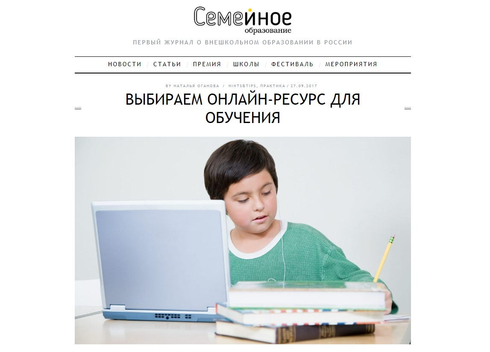

Онлайн-школа TutorOnline была запущена в 2011 году, за эти 8 лет выросли из сервиса, работающего по принципу быстрых консультаций, до полноценного образовательного проекта. Количество учеников увеличивается от года к году, обороты школы становятся больше, и всё это при том, что мы практически никогда не использовали платные инструменты для рекламы проекта.

Принцип продвижения, которые в нашем случае показывает отличную эффективность, ㅡ «контент-маркетинг без бюджета». Однажды мы приняли решение полностью отказаться от коммерческого размещения на сторонних площадках. У нас есть ценный интеллектуальный ресурс ㅡ это наши талантливые педагоги, которые обладают не только безупречными знаниями в своей области, но и культурным бэкграундом. У нас работают репетиторы из разных стран мира, и нам правда есть, о чем рассказать потенциальным ученикам, и тем самым убедить их начать заниматься именно у нас в школе.

_Справка о компании:_

_Сайт_ [_TutorOnline_](https://www.tutoronline.ru/) _ㅡ это онлайн-школа, на которой ученики совершенно разных возрастов занимаются с дистанционными преподавателями. Обучаться можно по различным направлениям ㅡ вся школьная программа, университетские курсы, IT-дисциплины, предметы из цикла «Хобби и творчество» и т. д. Площадка не является посредником между репетитором и учеником, это образовательный проект, который берет на себя решение всех организационных вопросов: от контроля качества работы педагогов до коммуникации с пользователями._

## Почему мы решили продвигаться только с помощью бесплатного контента

Несмотря на то, что заниматься у нас может любой желающий, всё-таки основная целевая аудитория площадки ㅡ школьники, а также их родители, которые платят за занятия и обычно принимают решение, где будет подтягивать знания их ученик. Следующая категория ㅡ студенты и люди, уже получившие высшее образование, но желающие, например, выучить какой-либо иностранный язык или освоить языки программирования.

Чтобы к нам шли учиться, нам должны доверять и ученики, и родители. За 8 лет работы мы убедились, что именно доверие клиента ㅡ главный ресурс компании, которая стремится приносить людям реальную пользу и при этом оставаться рентабельной.

Так, когда клиент постоянно натыкается на наш контент и видит, что мы даем знания, даем опыт и ценные советы, а не рассказываем, какие мы «хорошие и замечательные», он приходит к нам и не боится поделиться своей проблемой или доверить ребенка нашему репетитору.

> Методом проб и ошибок, после «слива» бюджетов, мы наконец-то поняли: для такого сложного сегмента, как образовательные услуги (да еще и полностью онлайн), лучший способ продвижения ㅡ долгоиграющий контент-маркетинг. Но это бомба замедленного действия: не стоит ждать от такого продвижения быстрой прибыли и мгновенного результата.

Так что теперь в первую очередь мы работаем над поддержанием нашей репутации и сохранением хорошего отношения к компании, которое показывают наши ученики и родители. Именно такая позиция позволяет нам активно развиваться.

Главные инструменты, которые помогают нам привлекать новых пользователей через контент.

* Публикации в СМИ: статьи наших преподавателей и руководителей для внешних площадок на темы образования, конкретных предметов и так далее.

Пару лет назад это был основной канал для продвижения, однако сейчас мы сместили акцент на блог и Youtube, хотя и продолжаем выпускать материалы (только бесплатно).

* Канал на Youtube: видео ㅡ любимейший формат молодого поколения, такой контент современные школьники и студенты воспринимают лучше всего.
* Блог на сайте: масса полезного контента ㅡ от советов по подготовке к ЕГЭ до рекомендаций для родителей от психологов.

## 2016-2018: формировали доверие к онлайн-образованию через публикации в СМИ

Работать с журналистами, чтобы выпускать статьи с участием экспертов TutorOnline в различных СМИ, мы начали еще в 2014 году, но в 2016-2018 годах это стало ключевой задачей в рамках продвижения школы.

> Мы хотели как можно больше и как можно доступнее рассказывать людям о том, что такое онлайн-образование и почему его не нужно бояться. На тот момент еще довольно сильно ощущалось недоверие родителей к обучению детей с репетитором через интернет.

Мы постоянно слышали от мам: «Ваш репетитор чудесный, но мы все-таки поищем “живого” преподавателя в нашем городе… нам так привычнее». Это была проблема, которая тормозила развитие онлайн-школы. Мы должны были доказать людям, что дистанционный репетитор ничем не отличается от обычного, а чаще всего такой формат обучения намного удобнее и выгоднее.

Так мы стали писать полноценные тексты и давать комментарии на темы среднего и высшего образования, детской психологии… Например, давали советы родителям, как помочь ребенку справиться с той или иной проблемой в школе, или объясняли, как лучше подготовиться к экзаменам.

В приоритете были издания для родителей и площадки, в целом посвященные образованию. Чтобы попасть на страницы интересных для нас ресурсов (интересных с точки зрения целевой аудитории), мы заходили к ним сразу с двух сторон.

**Во-первых**, писали в профильные издания напрямую с предложением о сотрудничестве, рассказывали о нашей школе и экспертах. 

**Во-вторых**, мониторили и отвечали на актуальные для нас запросы журналистов на [сервисе Pressfeed](https://pressfeed.ru/). Это платформа, на которой журналисты и редакторы ищут экспертов для публикаций. Всего там зарегистрировано более 4,5 тысяч изданий, которые ежедневно публикуют там запросы с информацией ㅡ какой эксперт им нужен для будущей статьи, на какие вопросы нужно ответить, до какого срока принимаются заявки. При этом обычно журналисты ждут комментарии, а редакторы ищут авторов для полноценных текстов. Регистрация на сервисе бесплатная, но на базовом аккаунте есть некоторые ограничения — например, запросы появляются позже, а также можно ответить всего на 3 запроса в месяц. Это очень мало, если вы хотите достигнуть каких-то значимых результатов с помощью выходов в СМИ.

Приведу примеры публикаций.

Для сайта «Семейное образование» наш специалист написал статью о том, как выбрать ресурс для домашнего обучения. С этой площадкой работали напрямую: заранее обсудили, какие тематики там ещё не освещали и сделали совместный материал.

[_Публикация на сайте «Семейное образование»_](http://semeynoe.com/magazine/practice/vybiraem-onlajn-resurs-dlya-obucheniya/)

Через сервис Pressfeed подружились с отраслевым изданием для родителей «Летидор», в дальнейшем площадка стала нашим постоянным партнером.

В одном из первых запросов, на который мы отреагировали, журналист спрашивал, насколько эффективна школа без оценок и домашних заданий.

[_Запрос на Pressfeed_](https://pressfeed.ru/query/18029)

Мы поддержали такой подход к обучению ㅡ действительно, маленький человек может постигать мир и без оценок.

  
_Комментарий в издании «Летидор»_

Также рассуждали о том, почему [в России нет доверия к дистанционному образованию](https://letidor.ru/obrazovanie/pochemu-k-distancionnomu-obrazovaniyu-v-rossii-net-doveriya.htm), почему [ребенок сторонится сверстников](https://letidor.ru/psihologiya/vopros-ekspertam-pochemu-rebenok-storonitsya-sverstnikov.htm), как [выбирать онлайн-сервисы для обучения](https://letidor.ru/obrazovanie/5-obuchayuschih-onlayn-servisov-kak-podgotovit-rebenka-k-shkole.htm). Только через Pressfeed мы выпустили на «Летидор» 6 материалов, также неоднократно сотрудничали с ними вне платформы.

> Хотя нам было более удобно работать с сервисом (да и сейчас ничего не изменилось), так как Pressfeed два раза в день (в 10 и 15 часов по московскому времени) присылает рассылку с актуальными запросами. Можно прямо в почте моментально выбрать подходящие запросы, затем оперативно подготовить комментарий и выслать его журналисту.

Если о чем-то не договорились и нужны какие-то исправления, можно связаться во внутреннем чате сервиса. Туда же можно написать, если у вас есть собственная тема для публикации.

  
_Страница активного журналиста «Летидор», которому можно написать в чате_

Иногда мы делали материалы не только непосредственно об образовании, но об онлайн-школе как бизнесе: руководитель TutorOnline Александр Пашков нередко давал интервью для деловых ресурсов. Например, благодаря Pressfeed мы организовали разговор с сайтом «ПОнедельник».

  
[_Запрос от площадки «ПОнедельник»_](https://pressfeed.ru/query/22953)

На портале вышло большое интервью о создании школы, о принципах работы TutorOnline, об отношении российского общества к онлайн-образованию.

  
[_Публикация в «ПОнедельнике»_](https://ponedelnikmag.com/post/uchitel-onlayn)

Практически все статьи мы выпускали совершенно бесплатно. Признаюсь, что у нас были попытки заказывать рекламные статьи, но все эти попытки были неудачными. Итоговая статистика показывала, что переходов на сайт ㅡ мизерное количество, ведь проплаченный текст (особенно с пометкой «на правах рекламы» или «партнерский материал»), как бы хорошо он ни был написан, все равно подсознательно воспринимается читателем с недоверием. То есть дополнительных переходов мы не получали, доверия к компании тоже. Так что мы быстро решили оставить эти эксперименты и делали только полезные тексты по договоренностям с редакциям. Выпустили более сотни публикаций, не заплатив за них ни рубля.

> Что касается эффективности такого формата продвижения, то результаты от публикаций в СМИ были впечатляющими. Лояльность аудитории значительно выросла. Мы видели это не только по цифрам (измеряли увеличение переходов на сайт примерно на 20-30%, были регистрации новых учеников и т. д.) 

Наша служба поддержки клиентов регулярно общается с каждым пользователем. И родители сами нам говорили, что пришли после такой-то определенной статьи, потому что раньше не воспринимали онлайн-формат, а теперь решили попробовать. Большинство затем становились нашими постоянными учениками.

Однако в начале 2019 года мы приняли решение немного снизить обороты, делать меньше публикаций на внешних площадках — теперь договариваемся о публикациях только через Pressfeed. Совсем недавно вышли на сайт «Нож», редакция хотела обсудить вопрос: правда ли, что домашнее обучение становится эффективнее, чем школьное образование?

[_Фрагмент запроса от издания «Нож»_](https://pressfeed.ru/query/59130)

  
[_Комментарий в издании «Нож»_](https://knife.media/homeschooling/)

Сейчас мы переключились на создание собственного СМИ ㅡ развивать блог на сайте школы. Но при этом полностью от публикаций на внешних ресурсах не отказываемся: понимаем, что внутренних площадок недостаточно, чтобы быть на слуху.

## 2018-2019: смена парадигмы и развитие собственных медиаресурсов

**Блог на сайте**

Главное преимущество собственного блога в том, что там нет никаких ограничений. Мы пишем на любые темы (связанные с образованием, конечно), в разных подачах, разных форматах. Это площадка для творчества. Публикуем там статьи по разным предметам, в планах выпускать больше контента для мотивации, вдохновения. Есть отдельная рубрика «Полезные советы для родителей».

  
[_Блог TutorOnline_](https://blog.tutoronline.ru/)

Цель блога ㅡ максимально реализовать наш внутренний потенциал. Когда в одном проекте работает такое количество специалистов в разных областях, глупо не использовать этот творческий и интеллектуальный ресурс.

И теперь мы вновь используем сервис Pressfeed, но уже как журналисты. То есть на платформе ищем экспертов для некоторых статей. Например, мы хотели собрать мнения на тему, как говорить с детьми о деньгах и с самого детства приучать их к финансовой грамотности.

  
[_Запрос на Pressfeed_](https://pressfeed.ru/query/40181)

3 эксперта высказали свою точку зрения — и мы взяли их комментарии в материал. Получилось интересно.

  
[_Статья в блоге с мнениями экспертов_](https://blog.tutoronline.ru/kak-govorits-s-rebenkom-o-dengah)

Возвращаясь к теме «маркетинг без бюджета». Все авторы блога ㅡ наши преподаватели, для них это методическая работа. Время от времени пользуемся услугами seo-оптимизатора и запускаем контекстную рекламу, которая ведет на блог или на определенную статью. Бюджет на продвижение есть, но он весьма скромный.

Конечно, мы рассчитываем на то, что блог станет инструментом для привлечения новых учеников. На практике это происходит так: родитель или сам будущий пользователь вбивают какой-то запрос в поисковике и попадают на материал в блоге. Изучают его, затем идут регистрироваться. Сейчас примерно 12-15% клиентов записываются на занятия после чтения статей в блоге. В наших целях планомерно увеличивать этот показатель.

**Канал на Youtube**

Канал TutorOnline был создан давно, но там ничего не происходило. До определенного момента мы просто не не понимали, что и как нужно делать, как ролики могут убедить аудиторию заниматься у онлайн-репетиторов.

Примерно 2 года назад мы начали несмелые попытки креативить какие-то видеоролики. Все делали своими силами, почти на коленке. Но эти попытки были, как говорится, пробой пера. Мы просто придумывали сценарий и сами все снимали, как-то монтировали, выкладывали. Затем понеслось! Примерно в середине 2018 года канал на Youtube стал нашим полноценным обучающим медиа. Сейчас стараемся выпускать один ролик в будний день. Всего за год активной работы у нас уже более 300 тысяч подписчиков, есть ролик, который набрал почти 1 миллион просмотров, остальные стандартно собирают по 20-30 тысяч зрителей. И это без каких-либо материальных вложений в платное продвижение, трафик органический.

> Мы не скрываем, что одна из целей ㅡ приводить учеников с канала на сайт, чтобы они продолжали уже углубленное изучение предмета индивидуально с репетитором. В среднем с одного видеоурока получаем 100 регистраций на сайте. Иногда больше. Например, после одного из прямых эфиров по математике получили более 300 регистраций!

Отдельно хочется сказать, что канал на Youtube ㅡ это еще одно доказательство нашей экспертности и большой плюс к узнаваемости, доверию учеников к школе TutorOnline.

## Контент-маркетинг без бюджета работает: результаты продвижения на сегодняшний день

Бюджет на контент-продвижение ㅡ это зарплаты наших штатных сотрудников. Мы не вкладываем деньги во внешнюю рекламу в медиа, но цифры по росту бизнеса доказывают: увеличивать число клиентов и обороты компании можно без огромных вливаний в маркетинг.

> Растем мы очень быстро. С 2016 по 2018 год мы выросли в 2 раза по количеству учеников (как постоянных, так и новых). Возрастает количество учеников, которые изучают у нас несколько предметов (2 и больше), а также тех, кто возвращается после перерыва (например, окончил школу, пошел в вуз и вернулся для занятий с репетитором уже по вузовскому предмету). В 1,5 раза увеличилось количество учеников, которые занимаются на сайте постоянно (от 3 месяцев и дольше).

Это заслуга и публикаций в СМИ, и блога компании, и Ютуб-канала. Теперь мы точно знаем, что важнейший ресурс любой компании и гарант успешности проекта ㅡ это доверие клиента. Если тебе доверяют, не нужны никакие сумасшедшие вложения в рекламу. Основа доверия к TutorOnline ㅡ качественный полезный контент, который мы создаем с минимальными тратами.