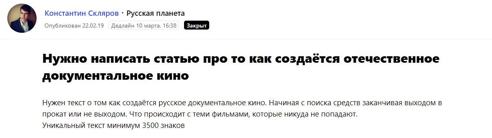
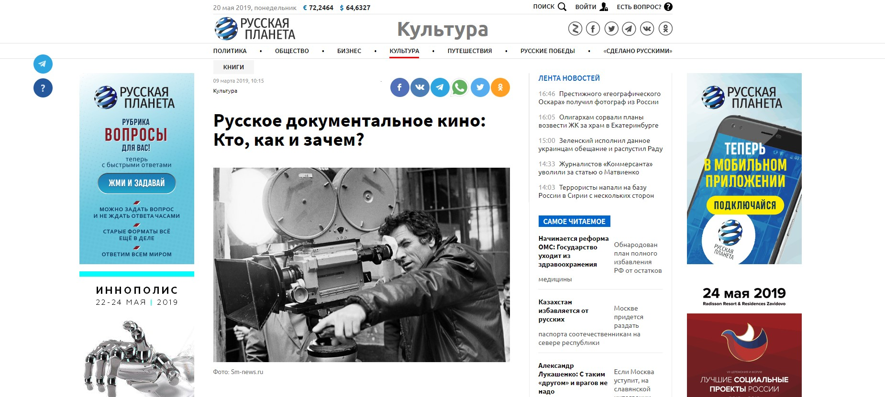
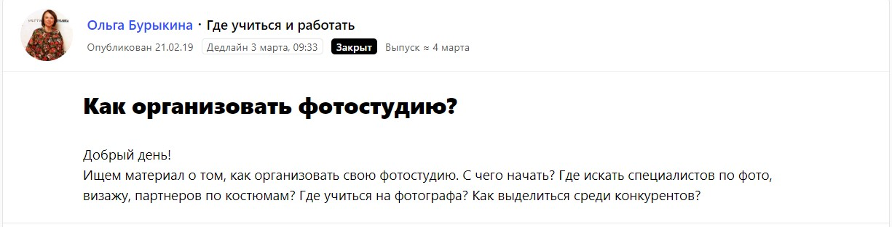
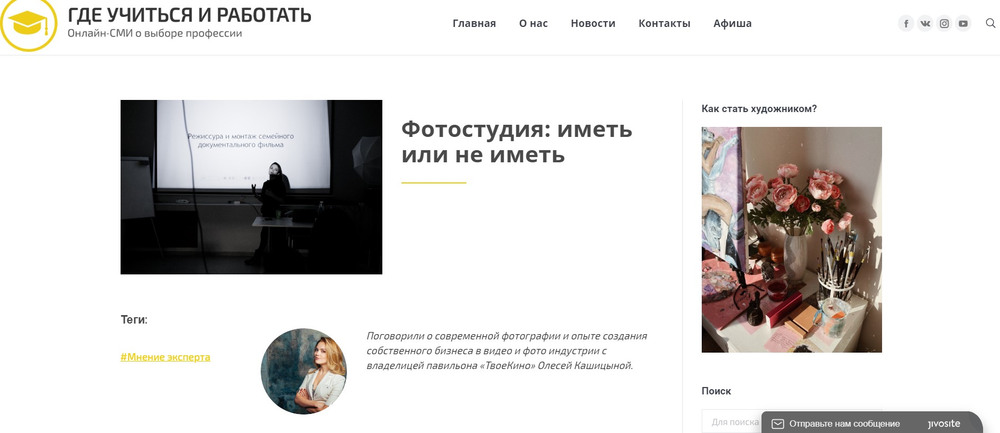
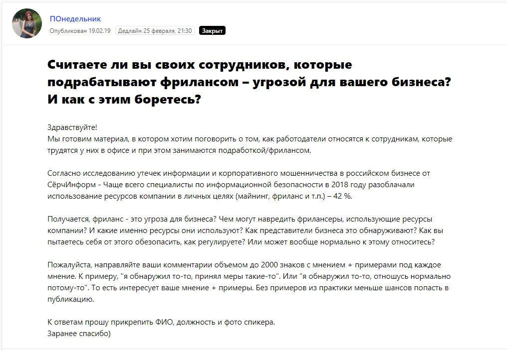
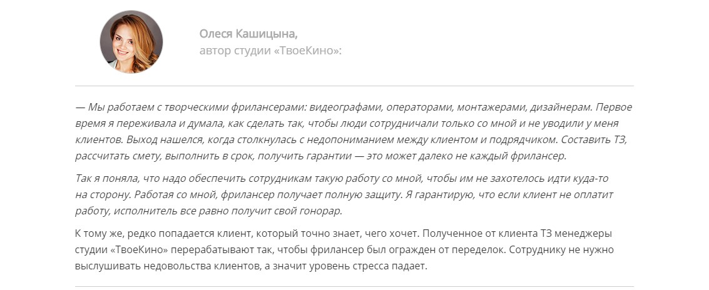
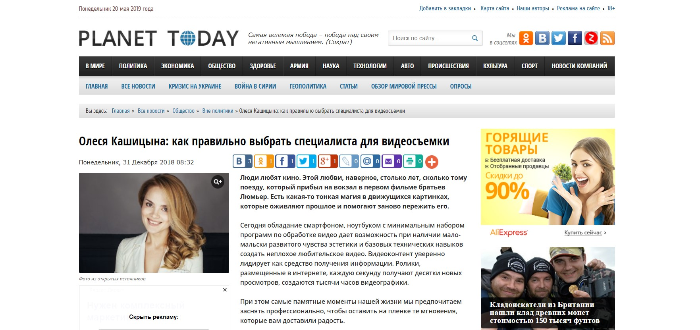
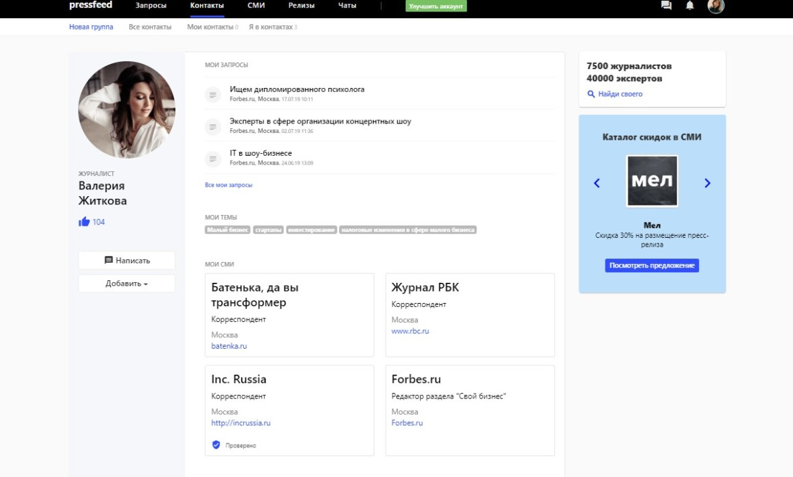
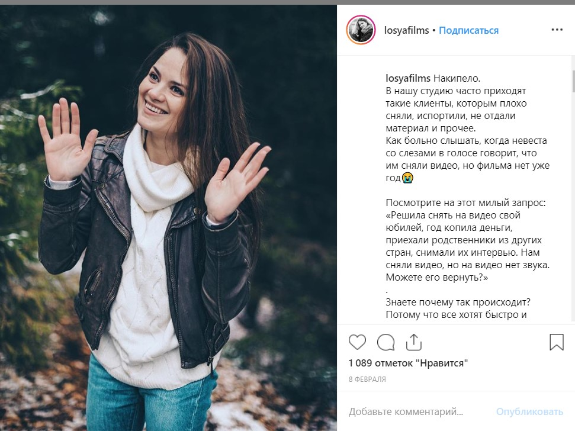

За свою жизнь я сменила около 20 профессий, но затем судьба привела меня в кино, и, наконец, я определилась, чем хочу заниматься. Сегодня у меня своя видеостудия «ТвоеКино» и штат из 35 сотрудников. Студия специализируется на создании семейных и памятных видео ㅡ это трогательные видео об истории большой семьи, о жизни одного из членов семьи и т. д. Обычно такие фильмы заказывают к юбилею, на годовщину свадьбы в качестве подарка. При этом мы делаем и другие фильмы: снимаем рекламные ролики, клипы для музыкальных звезд, видео для блогеров.

> За прошедшие три года я попробовала, пожалуй, все способы рекламы. Даже билборды. Разнообразные эксперименты, сотни тысяч рублей, потраченных в никуда, и в итоге я поняла, что в моем бизнесе лучше всего продают два инструмента: сарафанное радио и личный бренд.

Я использую и другие каналы продвижения, например, таргетированную рекламу, но все равно считаю, что «сарафан» и позиционирование себя как опытного эксперта в узкой сфере привлекают большую часть клиентов. При этом сарафанное радио обычно включается вне зависимости от предпринимателя (нужно просто хорошо делать свою работу), а вот для формирования личного бренда, который будет притягивать клиентов, нужно прилагать усилия. Рассказываю, как это делаю я.

## Формирование личного бренда: главные правила

Мой личный бренд строится благодаря активной работе в трех направлениях: публикации в СМИ, личный блог в Инстаграме, мастер-классы и выступления на мероприятиях. Я делюсь рекомендациями, советами, стараюсь быть откровенной с читателями и слушателями, и все это в конечном счете привлекает целевую аудиторию.

**Публикации в СМИ**

Мне хочется уделить особое внимание продвижению в СМИ, так как некоторые эксперты по незнанию считают, что попасть в хорошие издания сложно, а статьи с упоминанием компании могут публиковать только за деньги. Это не правда, размещать материалы и комментарии можно абсолютно бесплатно.

Я регулярно публикую статьи или комментарии на различных медиа-площадках. Основные темы для разговора ㅡ видеопродакшн, отношения между студией и клиентом, как открыть свое дело, управление командой и т. д.

Для кого писать статьи? В какие издания идти и как в них попасть? У меня нет жестких критериев по выбору площадки, но, так или иначе, выпустить публикацию практически в любом интернет-издании (да и в печатном тоже) можно двумя способами.

Первый ㅡ используете автоматизированный [сервис журналистских запросов Pressfeed](https://pressfeed.ru/), на котором журналисты ищут экспертов и героев для публикаций.

Второй ㅡ общаетесь с журналистами интересующих вас ресурсов, предлагаете темы, договаривайтесь о текстах. 

Я советую делать и то, и то, так будет эффективнее.

Если говорить о первом способе, то я давно зарегистрирована на сервисе журналистских запросов Pressfeed. Каждый день просматриваю рассылку (приходит в 10:00 и в 15:00) и изучаю, какие запросы появились. Выбираю самые релевантные по темам. Сразу пишу ответ или же сначала сообщаю журналисту о моих знаниях и опыте. В приоритете те запросы, по итогу которых я могу дать не маленький комментарий, а сделать полноценный текст.

Из примеров вспоминаю статью для сайта «Русская планета». Журналист искал эксперта по документалистике, и я могла ему помочь.

[_Запрос от сайта «Русская планета»_](https://pressfeed.ru/query/52838)

Написала материал, издание его опубликовало. С момента, как я ответила на запрос, до выхода текста прошло около 3 недель. Это довольно быстро, поверьте. На общение с журналистами напрямую, вне сервиса, бывает, уходит несколько месяцев.

  
[_Публикация в «Русской планете»_](https://rusplt.ru/kulturnaya-rossiya/russkoe-dokumentalnoe-kino-35665.html)

Похожая история случилась с ресурсом «Где учиться и работать». Редактор искал эксперта, который рассказал бы, как открыть фотостудию.

[_Запрос от издания_](https://pressfeed.ru/query/52814)

У меня не фотостудия, а собственный кинопавильон, но мы проводим там фотосессии в том числе. Получилось хорошее интервью.

_Публикация на площадке «Где учится и работать»_

Также я с радостью отвечаю на вопросы, связанные с управлением командой. Все-таки в «ТвоеКино» работает 35 человек, приходится учиться ладить с сотрудниками. Об этом я рассказывала для издания «ПОнедельник»: журналист спрашивал, нужно ли считать работников, которые параллельно занимаются фрилансом, угрозой для бизнеса.

Нет, я так не считаю, наоборот, думаю, что таких сотрудников нужно дополнительно поощрять.

Что касается второго способа, у меня много знакомых журналистов, так как я успела поработать и в сфере PR. Иногда обращаюсь за помощью к ним, прошу меня с кем-то познакомить или дать контакты. Также пишу в интересные издания сама, рассказываю о себе, объясняю, о чем могу писать, чем могу быть полезна читателям издания.

Например, я написала 6 статей для площадки Planet Today (более 1 миллиона посещений в месяц): разговор был о видеосъемке и семейных фильмах.

Кроме того, я довольно часто публикуюсь на порталах, которые пишут об успешных женщинах в бизнесе, о мамах, которые умеют совмещать и воспитание детей, и управление компанией. Это площадки Ihappymama, Hipstamama. Мне хочется делиться своим опытом с другими женщинами, своим примером доказывать, что современная бизнесвумен может успеть все.

Если же у вас нет знакомых журналистов, то самое время начать заводить знакомства! Можно делать это через Pressfeed. Действуйте по такой схеме:

1. выберите издание, в которое хотите попасть;
2. изучите журналистов издания, которые зарегистрированы на сервисе;
3. выберите того, кто пишет по вашим тематикам ㅡ это можно проверить в профиле журналиста;
4. напишите 2-3 журналистам и предложите сотрудничество. Расскажите, какую компанию представляете, на какие темы можете давать комментарии, можно ли ждать от вас какого-либо эксклюзива;
5. скорее всего, не все ответят вам, но с кем-то общение обязательно сложится, и в итоге получится выпустить статью.

  
_Пример профиля журналиста_

Например, вы мечтаете попасть в Forbes. Находите издание в [базе СМИ](https://pressfeed.ru/smi-catalog). Выбирайте активного журналиста, который часто оставляет запросы на сервисе. Удача, если журналист работает не в одном бизнес-издании, а сразу в нескольких (как в примере на фото). Познакомьтесь с ним. Если не получится сразу написать статью для Forbes, возможно, для начала сделайте публикацию в Inc.Russia или в «РБК». На деле все легче, чем вы думали.

> Публикации в СМИ влияют, в первую очередь, на мой профессиональный имидж и репутацию. Я не могу увидеть прозрачный результат от контент-маркетинга и представить его в конкретных цифрах. Даже если площадка поставит ссылку на мой официальный сайт (а так делают далеко не все сайты), то количество переходов по ссылке ㅡ это тоже не объективный показатель. Кто-то прочитает и перейдет, кто-то прочитает и потом загуглит… Не стоит ожидать эффекта «опубликовал статью ㅡ получил поток заказов». Скорее, можно рассуждать так: текст прочитали 1000 человек, значит, примерно 10 человек заинтересуются компанией или, как минимум, обратят внимание.

**Продвижение в Инстаграме**

В личном профиле [@losyafilms](https://www.instagram.com/losyafilms/) сейчас 60,4 тыс. подписчиков. Я больше пишу о работе, чем о жизни. Рассказываю обо всем, что связано с созданием видео. О съемках, монтаже, программах, выборе актеров, об общении с клиентами, о своих новых проектах. Это полноценный блог о продакшне. При этом сейчас я не следую контент-плану и не вытягиваю из себя посты тогда, когда «надо». Пишу, когда захочется, получается примерно 3-4 поста в неделю.

  
_Пример поста из Инстаграма_

На старте работы с блогом я вкладывала деньги в раскрутку профиля, но теперь уже не занимаюсь платным продвижением. Только время от времени участвую в марафонах.

Как бы банально не звучал мой секрет успеха в Инстаграм ㅡ нужно быть искренним и честным, самим собой. Писать по делу и интересно. Подписчики любят, когда я показываю съемочные процессы и делюсь реальными кейсами.

Блог в Инстаграме ㅡ то, что формирует мой образ как профессионала в своем деле. То, что вызывает доверие ко мне. Для тех, кто заказывает у нас услуги по созданию видео, страница в Инстаграм является еще одним подтверждением компетенций компании.

**Мастер-классы и выступления на конференциях**

Сюда относятся как офлайн-выступления перед живой аудиторией, так и мастер-классы и лекции, транслируемые в режиме онлайн. Выступать ㅡ значит точно так же делиться полезным контентом с целевой аудиторией, но в другом формате.

Как я решаю, идти или не идти на мероприятие, на которое меня приглашают в качестве спикера? Смотрю, прежде всего, на:

* статус события. Чтобы понять масштабы, нужно оценить площадку проведения, на то, в какой раз проходит форум или конференция (если уже проходило, то поискать фотоотчеты);
* то, какая планируется информационная поддержка, какие СМИ об этом будут говорить;
* тему, которая нужна организаторам. Иногда меня зовут выступить с такой темой, которая мне не близка. Тогда отказываюсь. Я хочу рассказывать зрителям только о том, в чем я являюсь экспертом на на 100%.

Это принципы, скорее, для продвинутых спикеров. Тем, кто только начинает свой путь, советую сначала соглашаться на бесплатные выступления, а также не стесняться писать организатором и предлагать свои услуги. Кроме того, стоит постоянно посещать мероприятия, форумы, конференции как гость, знакомиться с журналистами, организаторами, предпринимателями. Постепенно станут приглашать, и с каждым выступлением будет проще взаимодействовать с организаторами и попадать на интересные события в качестве спикера.

## Кратко о текущих делах бизнеса

> В 2018 году команда «ТвоеКино» увеличила средний чек на 5,5%, а также у нас стало больше заказов и обращений. Тем самым мы смогли перевыполнить план на 1 млн. 300 тыс. рублей. И это только начало, ведь нам всего три года.

Планируем продолжать в том же духе и наращивать мощности. При этом главные инструменты для продвижения бизнеса я менять не собираюсь. Личный бренд, формирующийся за счет полезного контента, ㅡ это то, что приводит и будет приводить новых клиентов, а также возвращать старых знакомых.

Выпускайте статьи в СМИ (обязательно используйте Pressfeed), ведите социальные сети, выступайте на конференциях, и вы увидите, как на ваших глазах формируется личный бренд и как благодаря ему начинают приходить заказчики ваших услуг.
