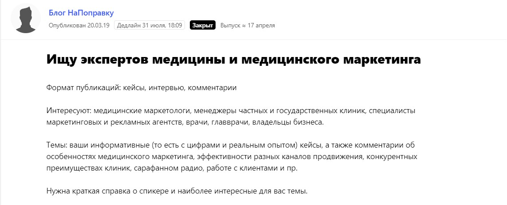
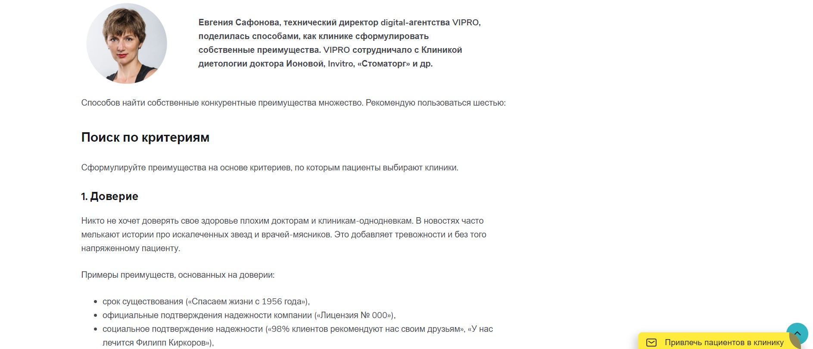
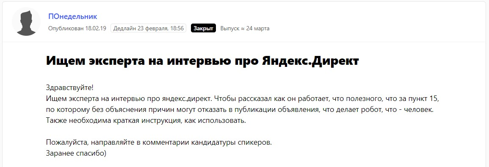
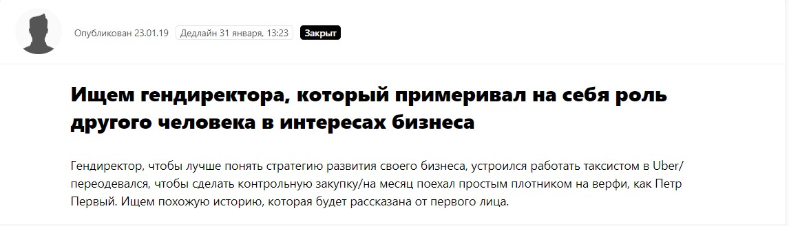
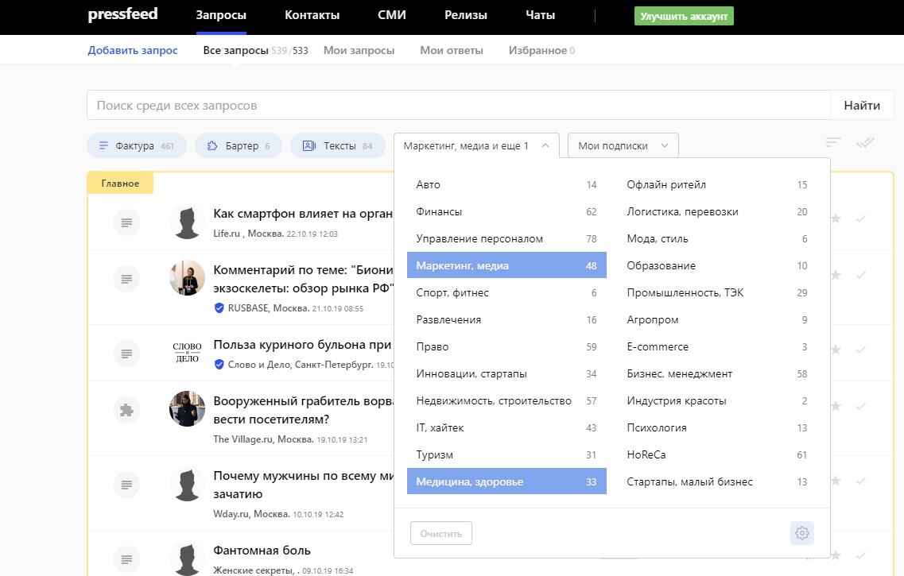

Наше маркетинговое агентство [VIPRO](https://www.vipro.ru/) существует уже 20 лет. В 1999 году мы были в первых рядах среди тех, кто начал заниматься продвижением бизнеса в интернете. Тогда компании массово принялись заказывать себе сайты, а SEO-оптимизация казалась новым неизученным инструментом. Главное, что в 2000-х годах количество digital-агентств не исчислялось тысячами, и на этом рынке не было такой жесткой конкуренции, как сегодня. Так что долгое время мы существовали благодаря наработанной годами базе клиентов и сарафанному радио: новые заказчики приходили по рекомендациям от текущих и бывших партнеров. Заказов хватало, поэтому мы и не уделяли должного внимания собственному продвижению. Но позже все изменилось: не то чтобы стало мало клиентов, но хотелось быстрее расти и увеличивать мощности. Помимо этого конкуренция в digital-сфере продолжает расти бешеными темпами, агентств становится все больше и больше, клиентам есть из чего выбирать, даже если они уже привыкли работать с нами.

В 2018 году мы решили взять курс на повышение узнаваемости VIPRO среди потенциальных заказчиков. Необходимо было зацепить тех, кто принимает решение о продвижении и развитии бизнеса. В малом бизнесе это как правило сами владельцы, учредители и директора, а в среднем ― маркетологи, которым требуются узкие специалисты для решения задач по интернет-продвижению. Мы стали думать: как привлечь целевую аудиторию и отстроиться от конкурентов, но при этом не тратить на рекламу баснословные бюджеты. Когда проанализировали рынок и разработали примерную маркетинговую стратегию для себя, выделили два самых эффективных способа продвижения.

## Почему контент, а не контекст

Итак, основных вариантов было два:

1. простой, быстрый, понятный способ, работающий по принципу «сколько вложил, столько сразу же и получил», ― привлекать клиентов напрямую, в лоб, например, через контекстную рекламу. Работает здесь и сейчас, но если деньги заканчиваются, то лиды тоже заканчиваются;
2. сложный, требующий времени, но с долгосрочным эффектом подход ― увеличивать узнаваемость бренда через публикации на внешних площадках, то есть заниматься контент-маркетингом. Тем самым, получать не холодные лиды, а уже прогретые, и вести общение с теми, кто заранее оценил нашу экспертность.

> Кажется, эти два способа друг другу не мешают и логично включать и контекст, и контент, но в итоге от контекстной рекламы мы отказались по причине слишком конкурентного рынка. Игроков настолько много, в том числе тех, кто продвигается через контекст, что стоимость лида превышала все мыслимые и немыслимые пределы. Мы поняли, что для бизнеса это будет просто невыгодно: мы не будем отбивать затраты на рекламу и просто потратим деньги впустую.

Так мы остановились на контент-маркетинге ― решили делать публикации на профильных сайтах, посвященных бизнесу и маркетингу. Работу с кейсами более или менее стабильно мы начали в середине 2018 года, а в начале 2019 года мы выпустили первую статью. Мы не прогадали. Оказалось, что полезный контент не просто в целом влияет на репутацию и узнаваемость, а даже один хороший текст способен привести в компанию новых теплых клиентов. Кроме того, контент-маркетингом можно заниматься совершенно бесплатно.

## Какие издания в приоритете

Главная тема, которой посвящены наши материалы, ― это маркетинг, а второстепенная ― управление бизнесом. 

Что касается площадок для публикаций, то в приоритете как популярные площадки о маркетинге типа VC.ru и Ruward, так и узкопрофильные издания, пишущие для конкретной отрасли. На последние сейчас делаем основной упор, потому что опытным путем выявили: если пишешь материал под конкретную ЦА, это выстреливает лучше, отдача больше, чем когда текст пытается охватить и привлечь всех сразу. Больше всего нам интересны промышленные предприятия, медицинские центры и клиники, спортивные организации.

## Как делать публикации бесплатно через сервис Pressfeed

До недавнего времени у нас в штате не было PR-менеджера, в задачи которого входило бы регулярное общение с журналистами и отслеживание упоминаний в СМИ (сотрудник появился у нас как раз в момент написания этой статьи). Все материалы, которые выходили с начала 2019 года, были написаны нашими специалистами в свободное от основных проектов время.

За первое полугодие 2019 мы выпустили лишь 5 статей с помощью [сервиса журналистских запросов Pressfeed](https://pressfeed.ru/), но даже такое маленькое количество дало нам первые результаты.

> Конкретно для нас удобство сервиса Pressfeed в том, что нам не нужно было писать напрямую в редакции, предлагать какие-то темы, договариваться о совместных статьях ― у нас просто не было времени на классическую работу пиарщика.

Платформа же дает возможность высылать свои предложения только в те редакции, которые сами ждут наших материалов, комментариев по заранее определенной теме. Регистрация бесплатная, но на базовом тарифе есть некоторые ограничения. Например, можно ответить всего на 3 запроса, нельзя общаться с журналистами во внутренних чатах. Лучше подключить тариф «Эксперт», цена не кусается — около 3,5 тысяч рублей в месяц. По сравнению с затратами на контекстную рекламу, деньги совсем небольшие.

Мы сразу отвечаем на запрос или уточняем детали ― далее идет знакомство и общение с журналистом. Он задает дополнительные вопросы или говорит, что ответ его устраивает, и он его забирает. Все довольно просто. Через некоторое время выходит публикация с участием VIPRO (обычно в течение 1-2 недель).

Одна из самых успешных публикаций, сделанная в отраслевом блоге «НаПоправку» (это сервис записи пациентов в клинику), сразу принесла нам 6 заявок на маркетинговое обслуживание в медицинской сфере. Мы бы не поверили, что публикация в медиа может так быстро сработать и напрямую привлечь клиентов, если бы такая ситуация не случилась с нами.

  
[_Запрос от редакции блога «НаПоправку»_](https://pressfeed.ru/query/53725)

Итоговый материал назывался «Конкурентные преимущества в медицине — мнение агентств». Представители трех маркетинговых агентств дали советы, как клинике выделиться среди конкурентов, с помощью каких методик выявлять свои плюсы и затем делать на достоинствах акцент в продвижении.

  
[_Фрагмент публикации_](http://partner.napopravku.ru/blog2/konkurentnye-preimushhestva-v-meditsine-mnenie-agentstv/)

Даже несмотря на то, что эксперт VIPRO был не единственным спикером в этой статье, в течение одной недели после выхода публикации мы получили 6 обращений от потенциальных заказчиков, клиник и медицинских центров. Сработало то, что контент был размещен на профильном ресурсе, который читают только представители отрасли, а мы сумели показать свою экспертизу и опыт.

> Кажется, лидов пришло не так много, с чего столько радости? Но если до выхода этой статьи мы получали 1-2 обращения от медицинских центров в квартал, то здесь сразу в 3 раза больше заявок за неделю. При этом мы получили эти лиды совершенно бесплатно, а на написание комментария потратили не более 1,5 часов. Допустим, мы могли бы привлечь этих клиентов через контекстную рекламу, но это стоило бы несколько десятков тысяч рублей. А так мы не потратили ничего.

Сейчас ведем переговоры с несколькими потенциальными клиентами, у нас долгий цикл сделки, который порой доходит до полугода. Часть лидов отсеяли, так как мы работаем с бюджетами от 100 000 рублей на рекламу и от 300 000 рублей на разработку, а их возможности были куда скромнее.

В другой раз я как опытный спец в маркетинге давала интервью для деловой площадки «ПОнедельник».

  
[_Запрос от площадки «ПОнедельник»_](https://pressfeed.ru/query/52729)

На редактора издания также вышли через сервис. Говорили о возможностях «Яндекс.Директа»: дело в том, что у меня за спиной не просто 8 лет в маркетинге, но и опыт работы в «Яндексе», а журналист искал именно такого эксперта.

  
[_Публикация в интернет-журнале «ПОнедельник»_](https://ponedelnikmag.com/post/chto-nam-stoit-direkt-nastroit)

Как было сказано выше, иногда контент на внешних площадках посвящен не только темам маркетинга, но и управлению бизнеса. Несколько раз мы сотрудничали с известным бизнес-изданием «Генеральный директор». Однажды журналист площадки искал руководителей компаний, которые добровольно стали рядовыми сотрудниками на некоторое время, чтобы проследить за бизнес-процессами изнутри.

  
[_Запрос от журнала «Генеральный директор»_](https://pressfeed.ru/query/51883)

У нас тоже был такой опыт, и мы поделились им в материале [«Управление вне офиса: зачем директора работают рядовыми сотрудниками».](https://e.gd.ru/712037)

Pressfeed нравится еще и потому, что если что-то не получается, какие-то проблемы, вам может помочь менеджер сервиса. Мы настроили подписку по ключевым словам, но фильтр работал далеко не идеально: сначала запросы приходили не по теме.

Тогда менеджер сам собрал для нас запросы вручную и прислал подборку на электронную почту. Это правильный подход и грамотный клиентский сервис.

Также удобно искать запросы по фильтрам. Например, нас интересуют темы «маркетинг» и «медицина». Просто выбираете эти фильтры и смотрите актуальные запросы от журналистов.

  
_Как выбирать фильтры_

## Как мы измеряем эффективность публикаций на внешних площадках

Основные способы узнать, на что повлияла каждая выпущенная статья или кейс:

* в течение 1-2 недель после выхода материала следить за входящими заявками и обязательно спрашивать у каждого клиента ― читали ли они статьи о нас;
* следить за трафиком с внешних площадок на официальный сайт компании;
* следить за ростом брендовых запросов в поиске;
* делать сравнения до/после, то есть сравнивать показатели бизнеса в отношении год к году.

Мы всегда смотрим на то, с какой площадки потенциальный клиент пришел к нам на сайт и оставил заявку. Если не можем увидеть это с помощью «Яндекс.Метрики», то спрашиваем напрямую. Часто в процессе общения заказчики сами говорят, что читали кейс и хотят такой же результат.

> На что еще влияет контент? Помимо получения дополнительных лидов, контент способен постепенно изменить качество клиентов. Клиенты доверяют вам еще до непосредственного знакомств, потому что уже читали статьи компании, они приходят уже подготовленные, с знанием дела. В итоге это отражается на среднем чеке заказов.

Если сравнивать первое полугодие 2018 и первое полугодие 2019 года, то средний чек по SEO-направлению у нас вырос на 60%, а общие обороты ― на 15%. При этом мы сознательно отказались от части клиентов, которые не были нам выгодны и распределили силы на потенциально более прибыльные проекты. Также и по направлению интернет-рекламы средний чек увеличился на 82%, а обороты ― на 60%. То есть мы уже увидели значимый рост наших доходов. В этом большая заслуга всей команды агентства, и в том числе тех, кто создавал полезный контент от лица компании.

Во время участия в тендерах публикации в СМИ также играют большую роль ― ссылки на тексты нужно прикладывать к остальной документации.

В целом, очевидно, что контент-маркетинг имеет накопительный эффект. Многое зависит от частоты и качества публикаций. Мы видим реальную отдачу даже со столь малой активности и после полугода работы с контентом, поэтому наша задача на ближайший год ― делать как можно больше публикаций, будем работать через Pressfeed и отвечать на максимум запросов, а также попытаемся выходить на площадки напрямую. Теперь этим будет заниматься штатный PR-менеджер.