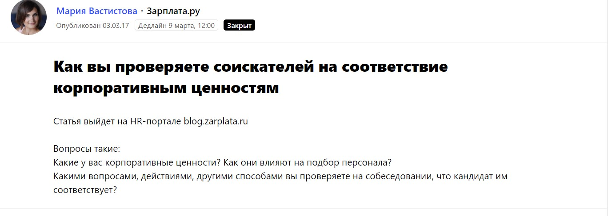

## Почему мы занялись контент-маркетингом

**Когда контекст и сарафанное радио перестали нормально работать**

Основная специализация агентства Digital.Tools — performance-маркетинг. Поисковая оптимизация, контекстная реклама, социальные сети, триггерные стратегии, email-рассылки. Наша компания основана в 2010 году.

До того как мы начали вникать в тему контент-маркетинга, агентство привлекало клиентов двумя банальными способами: контекстная реклама и сарафанное радио. Но однажды я понял, что эти каналы не приносят нам такого потока заказчиков, который бы меня устраивал. Объясню почему.

Контекстная реклама приводит холодных клиентов. Предприниматели изучают рынок, сравнивают агентства, анализируют цены, рассылают всем одни и те же письма со стандартными вопросами. У таких заявок низкая конверсия. Если заявка дойдет до сделки, то через долгое время.

Сарафанное радио приводит готовых клиентов. Они уже знают о компании, о нашей экспертизе, и готовы сразу заключить сделку. Однако повлиять на работу этого инструмента (да это и инструментом не назовешь) невозможно. Была идея просить клиентов давать рекомендацию за скидки или бонусы, но и это тоже спорный вариант.

> Я хотел, чтобы наши потенциальные заказчики были изначально лояльны к нам, были знакомы с нашим подходом, понимали, как мы ведем рекламные кампании и что умеем.

Мы решили часто выступать на профильных конференциях, проводить открытые вебинары. Эффект был: к нам начали приходить клиенты, которые видели наши презентации, вспоминали их на встречах. Но потом я осознал трудность такого формата продвижения: кроме меня в компании никто не выступал.

Другие сотрудники не смогли стать спикерами, а у меня не хватало сил на подготовку ко всем конференциям.

## Как мы пришли к понимаю, что нам нужен контент-маркетинг

Вот тогда мы в Digital.Tools задумались о контент-маркетинге, о полезных текстах. Тема популярная и, кажется, эффективная. Тем более, мы видели своих конкурентов, которые уже делали что-то подобное: публиковались на vc.ru, на cossa.ru., выпускали кейсы. Мы точно не хотели отстать и упустить тренд.

Для начала поставили себе такую цель — делать по 6-8 материалов с участием компании в месяц (сюда отношу и полноценные статьи от экспертов агентства, и небольшие комментарии в СМИ). Откуда взялись такие KPI? Скажу честно, что мы не делали глубокую аналитику и не высчитывали оптимальное количество публикаций в месяц. Скорее, мы представили, какой объем работы поручить штатному редактору (можно назвать его и pr-менеджером). Подумали, что 2-3 больших статьи + 3-4 экспертных комментария будет достаточно. Тем более, мы все еще находимся на этапе экспериментов: что писать, где публиковать, зачем.

## **О чем пишем и где публикуем тексты**

Мы пишем только о том, что знаем сами: интернет-маркетинг, управление персоналом, развитие бизнеса, кейсы компании. Когда выбираем площадки для размещения статей, отталкиваемся как раз от тематик. Сейчас мы остановились на 3 форматах медиа:

1. Профильные площадки, посвященные маркетингу и ИТ-технологиям;
2. СМИ об управлении персоналом;
3. Бизнес-СМИ (пока только прокачиваем их).

Расскажу подробнее о форматах медиа и поделюсь опытом, как мы публикуем там материалы компании.

### Профильные площадки

Прежде всего, нас интересуют профильные издания и блоги по интернет-маркетингу. Туда приходит знающая и качественная аудитория, и обычно тексты приносят отклик.

На таких площадках есть 2 базовых направления, о которых можно говорить:

* **Узкие темы по интернет-маркетингу.** Тематик сотни: email-рассылки, SEO-продвижение, социальные сети, лидогенерация… Рассказывайте о том, что умеете делать лучше всего. Подходите к написанию текстов серьезно: у вас должна получиться большая хорошая история.
* **Кейсы компании.** Думаю, что кейсы — универсальный формат, особенно для digital-агентства. Раскрывайте экспертизу, подробно описывайте свой подход, давайте пошаговые инструкции, показывайте честные результаты, подтвержденные цифрами. По сути сейчас вы тоже читаете наш кейс.

Например, посещаемость популярного сайта о технологиях и стартапах vc.ru более 6 млн человек в месяц. Среднее количество просмотров каждой статьи — 4-6 тысяч, бывает просмотры доходят до 20 тысяч.

Каждая компания может выкладывать на ресурс свои материалы. Однако сам факт публикации ничего не даст: чтобы текст заметили, и он набрал тысячи просмотров, тема должна быть интересной читателям.

Для vc.ru я написал колонку о том, [каких принципов стоит придерживаться начинающему предпринимателю](https://vc.ru/flood/17293-5-volkov). Дал пять советов, которые помогут в запуске бизнеса. Например, что нужно вовремя отдыхать и много читать. Советы, может быть, банальные, но люди любят такие списки с ответом на вопрос «Как жить»? Статья набрала 1,5 тысяч просмотров, а в дни выхода публикации количество брендовых запросов и заходов по ним на наш сайт выросло в десятки раз.  О всех результатах я подробнее скажу чуть позже.

Наверное, самым успешным материалом стала статья [«Что такое триггерные механики и как их использовать для роста KPI](https://serpstat.com/ru/blog/aleksej-volkov-chto-takoe-triggernie-mehaniki-i-kak-ih-ispolzovat-dlya-rosta-kpi/)», опубликованная в блоге Serpstat. Это блог агентства (посещаемость сайта около 1,8 миллионов в месяц, но трафик блога смешан с трафиком сервиса). Та статья набрала более 4 тысяч прочтений.

## Как опубликовать статью бесплатно? Используйте Pressfeed

Чтобы опубликовать текст на подобной площадке, мы действуем по такой схеме: придумываем тему (идея возникает или у меня, или у кого-то из сотрудников агентства) — отдаем тему редактору — редактор готовит статью (проводит интервью, правит, доводит до ума) — согласовываем и размещаем в нужном издании.

О последних четырех этапах хочется сказать чуть больше. Начну с того момента, как мы написали текст и хотим «пристроить» его в нужное издание. Порой с дня возникновения идеи и до публикации проходит очень много времени. Редакция издания вправе никак не отреагировать на ваше письмо. Могут сказать, что текст им не подходит. Предположим, вы обсудили тему с редакцией до того, как начать писать текст, но это тоже не значит, что в итоге все получится. А бывает так, что вы сами поверили в тему, а в итоге текст не сложился. Или редактор все никак не принимает статью и постоянно вносит правки. В общем, готовьтесь к некоторым трудностям, особенно в начале работы.

Чтобы сдружиться с изданиями, потребуются время и терпение. И если напрямую выйти на них не получается или пока что-то идет не так, заходите к ним с другой стороны. Через сервис журналистских запросов [Pressfeed](https://pressfeed.ru/). Это специальная платформа, где журналисты и редакторы СМИ (а их там более 4000 уже сейчас) сами оставляют запросы по нужной им теме. Наша задача — оперативно и развернуто ответить на запрос и отправить комментарий в издание. Проходит 3-6 дней — и статья с участием Digital.Tools выходит в свет.

На сервисе можно найти практически все издания по маркетингу, которые нам интересны: и vc.ru, и rusbase.ru, и SEOpult.tv.

Как только зарегистрируйте аккаунт, сразу можно искать нужные издания и связываться с ними. Возьмем в пример [Rusbase](https://rb.ru/) (месячная аудитория — 2,9 миллионов пользователей).

Заходим в раздел [СМИ]( "https://pressfeed.ru/smi-catalog").

К слову, на главной странице здесь представлены спецпредложения, бонусы и подарки от СМИ на размещение рекламы. Сейчас это нам не нужно. Но если потребутся разместить рекламу, например, рекламную статью, спецпроект, или баннер, то можно получить приятные бонусы. Например, баннер на 40 000 рублей, или дополнительные новости в подарок.

Но сейчас нам надо перейти на страницу нужного нам СМИ. Находим его в поиске.

  
Кстати, искать нужные СМИ можно также с помощью селектора "Темы", например, выбрать "Технологии", или "Бизнес". Выбрав нужное медиа, переходим на его страницу редакции на Pressfeed.

Здесь можно посмотреть все запросы, публиковавшиеся на Pressfeed журналистами этого издания, запросы, которые актуальны сейчас, посмотреть персоналии журналистов из этого издания, зарегистрированных на Pressfeed, при необходимости - перейти к ним в профиль и получить больше информации о темах, на которые они пишут, запросах, которые они публикуют, другие СМИ, с которыми они сотрудничают, посмотреть их портфолио и дополнительную информацию. Через сервис можно связаться с журналистами напрямую, написав им во внутренних чатах.

Для нас самый простой способ находить профильные запросы — использовать отраслевой фильтр в разделе [Запросы]( "https://pressfeed.ru/all-queries"). Выберите в выпадающем меню тему, которая соответствует вашей специализации и отвечайте на понравившиеся запросы. Тема нашего агентства — маркетинг.

  
Так мы познакомились с профильным с профильным изданием great-world.ru и поучаствовали в их нескольких материалах. Один из них был о ретаргинге в Instagram — в статье я описал стандартные сценарии запуска рекламной кампании по ретаргетингу.

[_Запрос_](https://pressfeed.ru/query/28451) _от great-world.ru_

Вот текст, который вышел в результате.

_Публикация на_ [_great-world.ru_](http://great-world.ru/retargeting-instagram/)_, вышедшая по итогам нашего ответа на запрос журналиста на Pressfeed._

В другой раз публикация с участием компании вышла в узкопрофильном издании SecurityLab, пишущем о событиях в области защиты информации, интернет права и новых технология.  Вот так выглядел запрос от издания на Pressfeed.

[_Запрос_](https://pressfeed.ru/query/27965) _от SecurityLab на Pressfeed_

Мы ответили на запрос журналиста и в итоге вышел материал с нашим комментарием.

[_Материал_](https://www.securitylab.ru/news/485171.php) _с комментарием_

Мой комментарий стоял первым среди всех комментариев экспертов — это показатель того, что я ответил быстро, развернуто и по делу.

**Темы, на которые может давать комментарии СМИ каждый предприниматель**

Если сфера вашей деятельности узкая и журналисты не так часто интересуются экспертами и событиями из вашей сферы, то есть темы, на которые может рассуждать каждый собственник бизнеса:

* Управление персоналом. Поделитесь своим мнением о системе мотивации, устройстве офисной жизни, найме и увольнении, корпоративных практиках. Эти вопросы очень часто интересуют деловые СМИ - достаточно посмотреть сколько запросов по этой теме на Presfeed в рубрике "HR, менеджмент" (спойлер: очень много)
* Все что касается бизнеса: как привлечь финансирование, делегировать полномочия, выбрать онлайн-кассу и пр..

Здесь опять же Pressfeed — основной инструмент для работы со СМИ.

Например, для издания Dailymoneyexpert я рассуждал о [признаках скорого увольнения сотрудника](http://dailymoneyexpert.ru/how-to-save/2017/03/03/5-priznakov-togo-chto-vam-grozit-uvolnenie-15677.html). Я считаю, что если за последнее время сотруднику не поручали никаких новых сложных задач, то руководство не заинтересовано в нем. Об этом и был разговор.

[_Запрос_](https://pressfeed.ru/query/28630) _от Dailymoneyexpert_

Неоднократно сотрудничал с блогом одного из крупнейших сайтов по поиску работы «Зарплата.ру».

[_Запрос_](https://pressfeed.ru/query/28909) _от «Зарплата.ру»_

Я рассказывал, как провожу интервью с соискателями и на какие качества будущего сотрудника обращаю в первую очередь, в статье [«Проверка соответствия корпоративным ценностям на собеседовании»](https://blog.zarplata.ru/2017/03/13/corporate-culture-interview/).

Также мы выпускали совместные материалы с изданиями  HR-tv, «Реальное время», Promdevelop.

  
Если посчитать все упоминания Digital.Tools за год, то благодаря Pressfeed появились примерно 25% упоминаний.  

Кстати, вы можете не мониторить запросы по профильным темам каждый день, а просто подписаться на темы и получать уведомления о новых запросах на почту. Для этого просто подпишитесь на результаты поиска по нужным ключевым словам в разделе [Запросы]( "https://pressfeed.ru/all-queries").

Наше агентство создает автоматизированные системы, так что в других областях мы тоже призываем всех пользоваться такими системами — это упрощает работу и дает эффект.

Еще один совет «бывалых»: чтобы полноценно заниматься контент-маркетингом, наймите редактора. Некоторые руководители считают, что они смогут привлечь всех сотрудников и сделать все сами. Нет, не смогут: сотрудники думают о проектах клиентов, у них нет времени заниматься другими вещами.

Мы работаем с Pressfeed по такой схеме:

* Каждое утро наш специалист мониторит все запросы на Pressfeed и отбирает публикации с подходящими для нас темами. Кроме того, смотрит рассылку: она приходит 2 раза в день. Отдельно приходят срочные запросы и отдельно те запросы, темы на которые вы подписались;
* Запросы, которые попали в выборку редактора, пересылаются мне: я оцениваю их и говорю, на что будем отвечать;
* В течение дня мы делаем диктофонную запись моих комментариев;
* Редактор переводит комментарий в текст, оформляет и пересылает журналисту;
* Редактор самостоятельно общается с журналистом на сервисе: в чате или в комментариях к запросу;
* через несколько дней следим за выходом материала.

## Результаты: увеличение количества заявок на услуги в 10 раз

С начала 2017 года мы появились в СМИ более 60 раз. Благодаря Pressfeed появились примерно 25% упоминаний. Пока планку в 6-8 публикаций в месяц получается держать не всегда, но мы идем в правильном направлении.

Результат в цифрах такой: если сравнивать середину 2017 года и середину 2018 года, то количество лидов выросло в 8-10 раз. Я на 100% уверен, что это заслуга контент-маркетинга.

_Скриншот CRM компании: лиды приходят каждый день_

Когда вышло интервью со мной на vc.ru, количество брендовых запросов и заходов по ним на наш сайт выросло в десятки раз. После новой публикации происходит заметный всплеск, через пару дней он затихает и опускается до уровня нормы. Новая удачная публикация — и снова всплеск. С одной статьи мы собираем около 10 запросов. Не все они целевые, кто-то отсеивается, но в итоге мы получаем 1-2 новых клиента.

_График из отчета коммерческого отдела по выполнению плана продаж_

Заслуга контент-маркетинга — это не только лиды. Стало намного больше «горячих» заявок. Сейчас к нам приходят компании, которые уже знакомы с нашей методологией, нашими принципами работы. Они уже прошли первый этап: рассмотрели несколько подрядчиков и выбрали именно нас. Конверсия в продажу гораздо выше у таких лидов, особенно в сравнении с контекстной рекламой.

Случай из жизни агентства: пришел клиент, который прочитал материал о SERM на Webromoexpert. Он несколько раз ссылался на эту статью, его вдохновил наш подход и в итоге мы заключили договор.

_Скрин письма с заявкой клиента_

## Заключение

Наверное, мой главный совет — старайтесь, чтобы машина контента не останавливалась. Интерес пользователей нужно подогревать постоянно. Для этого используйте сервис журналистских запросов Pressfeed и постепенно знакомьтесь с редакциями всех изданий, которые читают потенциальные клиенты вашего бизнеса.

И вот еще несколько практических советов, которые мы вынесли из собственного опыта.

### Пишите, и это начнет работать

1. Чтобы полноценно заниматься подготовкой контента для СМИ, наймите редактора. Некоторые руководители считают, что они смогут привлечь всех сотрудников и сделать все сами. Нет, не смогут: сотрудники думают о проектах клиентов, у них нет времени заниматься другими вещами.
2. Не ограничивайтесь темами, которые связаны с вашим продуктом. Пишите о бизнесе, управлении, принципах компании.
3. Используйте Pressfeed — автоматизация сэкономит вам массу времени и даст нужный эффект.
4. Выпустить текст на качественной площадке с большой аудиторией проще, чем вы думаете. Просто пишите полезные вещи.
5. Старайтесь, чтобы машина контента не останавливалась: интерес пользователей нужно подогревать постоянно. И тогда поток лидов также будет постоянный.
