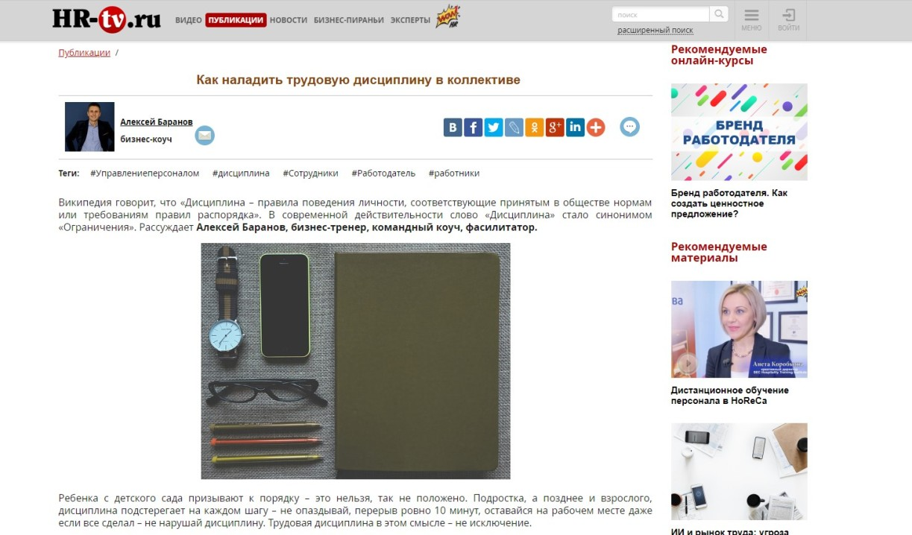

Меня зовут Алексей, и я руковожу компанией CONSTRUCTOR.TEAM, которая занимается организацией тимбилдингов и проведением стратегических сессий. Я учу команды осознанности и честному диалогу, помогаю повысить эффективность работы за счет использования талантов каждого сотрудника. Работаю с миссией и ценностями компании. Мои целевые клиенты ㅡ это, прежде всего, руководители HR-подразделений, управленцы по работе с талантами в крупных компаниях и корпорациях. В небольших организациях заказчиками выступают сами собственники бизнеса.

Пожалуй, самый эффективный инструмент для поиска новых клиентов в HR-среде ㅡ это сарафанное радио. Классные программы и тренеры передаются «из рук в руки». Однако есть важный момент: каким бы крутым и признанным профессионалом не был тренер, его «упаковка» играет огромную роль. Одно дело, когда ты ㅡ «Алексей, который провел тимбилдинг для команды и всем понравилось. Средняя оценка ㅡ 9,8 из 10». Совсем другое дело, когда у тебе говорят ㅡ «тренер по командной осознанности Алексей Баранов, эксперт/колумнист/автор статей на профильных медиа-площадках «Директор по персоналу», Hr-tv, Psychologies и других популярных в России изданий. Проводит эффективные тимбилдинги, после которых команда остается в восторге и сразу начинает применять инсайты, полученные на тренинге». В общем, думаю, вы поняли, что я имею в виду.

Главное ㅡ продукт. Это фундамент. Без хорошего продукта вообще не стоит начинать продвижение, однако если случается комбо ㅡ отличная программа + впечатляющая упаковка, то продавать свои услуги становится гораздо легче. Плюс ко всему, моя целевая аудитория «в лицах» ㅡ это очень требовательные и профессиональные женщины. Не всегда, но в большинстве случаев. Для них та самая экспертность, подтвержденная разнообразными социальными доказательствами (от страниц в соцсетях и внешнего вида сайта тренера и до публикаций в профильных СМИ), является весомым аргументом в мою пользу.

## Как я решил стать экспертом в СМИ

Раз социальные доказательства играют роль для моей ЦА, я понял, что пора начинать серьезно вкладываться в позиционирование себя как эксперта. При этом с социальными сетями я дружу давно, а вот с медиа никак не взаимодействовал.

Хорошо помню тот момент, когда ко мне пришло осознание: да, нужно срочно работать со СМИ и публиковать собственные статьи не только где-то на личных страницах, а на более известных и высокоаудиторных площадках. Тех ресурсах, которые читает моя аудитория.

> Как это было. На одной из рабочих встреч я очень-очень долго рассказывал потенциальному клиенту о том, кто я и о чем мои продукты. А на экране компьютера у него был открыт профильный новостной портал HR-tv. Меня прямо как по голове стукнуло: надо публиковаться в профильных изданиях, и тогда «вступительная речь» при знакомстве будет значительно короче. К слову, с тем клиентом мы так и не поработали, зато спустя буквально пару месяцев я стал колумнистом на HR-tv.

Только сразу скажу: наивно ждать, что после первой публикации клиенты моментально выстроятся к вам в очередь. Не буду утверждать за всех, но в ситуации со сложным продуктом, который предлагаю я, это точно так. PR-продвижение в СМИ ㅡ долгосрочная инвестиция. Оно, безусловно, влияет на продажи, но в перспективе года-полутора.

Рассуждаю так. Благодаря одной публикации обо мне узнают примерно 100 HR-специалистов, которые никогда раньше не слышали про Алексея Баранова и CONSTRUCTOR.TEAM. С вероятностью 90% хотя бы 8-10 из них со мной свяжутся, чтобы обсудить условия и подробности. В итоге с одним получится поработать, а это уже крутая конверсия просто с публикации в профильном СМИ. И это мои прогнозы исключительно на ближайшее время, а дальше конверсия будет только расти.

Тем более, параллельно я вкладываюсь в интернет-рекламу и знаю цену одного ЛИДа, а публикации в медиа ㅡ это фактически бесплатная реклама. 

> Я уверен, что через год активной работы со СМИ стоимость лида уменьшится примерно на 10-15%.

В конце концов, статьи в качественных изданиях ㅡ бесценный вклад в личный бренд. Повышается узнаваемость, о тебе начинают громче говорить в бизнес-сообществе, твоя экспертность признается коллегами, ты становишься более востребованным. Да и как еще доказывать свою экспертность, если не через публикации? Повторюсь, что у меня нет сейчас цели стремительно монетизировать работу со СМИ. Я занимаю свою нишу на рынке, постепенно повышаю узнаваемость собственного имени и продукта, а попутно ㅡ увеличиваю воронку продаж.

## О чем писать эксперту, как выбрать площадки для публикаций

На эти два вопроса дам два простых ответа.

Писать нужно на темы, в которых вы являетесь экспертом. Для меня это такие тематики ㅡ управление персоналом, взаимодействие в командах и командообразование. Из больших тем вытекают узкие подтемы: от эмоционального выгорания до «как наладить эффективную работу между поколениями Z, X и Y». Начинайте с того, что ближе, затем будете постепенно раскрывать каждое направление в своих материалах.

По изданиям тоже все понятно: выбирайте те площадки, которые читает целевая аудитория, то есть ваши потенциальные клиенты. Прежде всего, это профильные ресурсы и бизнес-порталы. Пока что я пишу для таких изданий, как «Директор по персоналу», «Генеральный директор», HR-tv, E-xecutive, Psychologies. Их читают и HR-специалисты, и собственники бизнеса, и психологи, и профи по командообразованию и мотивации.

## Как попасть на страницы СМИ, если до этого вы никогда не работали с журналистами

Это история обо мне. Я вдруг решил писать для СМИ, но у меня не было никакого опыта в общении с редакциями. Как попасть в желаемые издания, с чего начинать продвижение в мир популярных медиа? Ну, как минимум, нужно уметь нормально писать. Не буду углубляться в этот вопрос, так как это отдельная тема для разговора. Пишу я хорошо, успел потренироваться в социальных сетях.

Так вот, как общаться с журналистами и убедить их публиковать ваши тексты? Матерые пиарщики годами налаживают контакты с изданиями и собирают большие базы СМИ, а я в этом плане был на нулевой отметке и к тому же не имел навыков пиарщика.

**Начинайте с автоматизированного сервиса запросов от журналистов**

Было решено для начала обратиться к современным технологиям. Точнее, зарегистрироваться на [сервисе журналистских запросов Pressfeed](https://pressfeed.ru/) и мониторить там заявки от редакций. Суть сервиса такова: журналисты ищут на нем героев и экспертов для публикаций. Для этого они публикуют там запросы с формулировкой темы и требованиями к ответу и устанавливают дедлайн. Эксперту нужно оперативно и развернуто ответить на запрос. Если все окей, то в финальном тексте появится ваш комментарий. При этом редакциям часто нужен не просто комментарий, а полноценный текст от имени автора-эксперта. Я обращаю внимание на такие запросы в первую очередь.

Регистрация бесплатная, но на базовом аккаунте действуют разные ограничения: нельзя отвечать на более чем 5 запросов в месяц, актуальные запросы высвечиваются не сразу. А мне нужно было сразу ринуться в бой, поэтому я решился на платную версию «Эксперт», чтобы пользоваться возможностями сервиса по максимуму.

_Тарифы Pressfeed_

Итак, сервис я использую с февраля 2019 года.

Самый первый запрос, на который я ответил, был от того самого издания HR-tv, ситуация с которым и подтолкнула меня затеять этот процесс со СМИ.

Редакция искала автора, который бы написал текст о том, как наладить рабочую дисциплину в коллективе.

  
[_Запрос от HR-tv_](https://pressfeed.ru/query/52268)

Все оказалось даже проще, чем я думал. Через сервис рассказал редактору о себе, о своих услугах и опыте, отметил, что готов быстро подготовить материал на заданную тему. Собственно, так и получилось. Написал текст, согласовали с редакцией, в итоге материал опубликовали от моего имени.

[_Публикация на HR-tv_](https://hr-tv.ru/articles/kak-naladit-trudovuju-distsiplinu-v-kollektive.html)

Так я стал колумнистом портала, и меня внесли в [число экспертов издания](https://hr-tv.ru/speakers/baranov-alexej.html). Всего я отвечал на 5 запросов, 4 из них были приняты.

По такому же принципу я попал в блог Exiterra ㅡ эта площадка пишет в большей степени о маркетинге и управлении бизнесом. Им нужен был автор, который бы на постоянной основе писал материалы о мотивации, личностном росте и т. д.

  
[_Запрос от Exiterra_](https://pressfeed.ru/query/52515)

Первый совместный текст был посвящен тому, как сформулировать миссию компании и придерживаться ее в процессе становления и развития бренда.

[_Публикация на Exiterra_](https://exiterra.com/blog/motivation/missiya-kompanii/)

Не стоит зацикливаться на полноценных текстах, комментарии в хороших изданиях также добавят вам плюс в карму эксперта. Например, я комментировал вопрос от редакции деловой площадки E-xecutive.

  
[_Запрос от E-xecutive_](https://pressfeed.ru/query/53625)

Высказал мнение, что российский менеджмент не уделяет должного внимания планированию в момент постановки задачи и не имеет представления о ценных талантах своих подчиненных. Материал прочитали более 8 тыс. пользователей сайта.

[_Фрагмент публикации на E-xecutive_](https://www.e-xecutive.ru/management/practices/1990334-v-chem-osobennost-rossiiskogo-menedzhmenta)

> За полгода я выпустил около 15 статей с моим участием через Pressfeed.

За это время попробовал, кажется, все функции платформы.

Во-первых, в личном кабинете в разделе «Контакты» сохраняю журналистов, с которыми работал более двух раз.

  
_Можно добавить в контакты журналистов из целевых изданий_

Во-вторых, использую подписку на запросы по тематике «Командообразование» с моментальным уведомлением на почту.

  
_Подписка на запросы по ключевым словам_

В-третьих, часто общаюсь с журналистами во внутренних чатах ㅡ порой быстрее получить ответ на Pressfeed, чем на ждать его где-то в другом месте.

  
_Формат чатов с журналистами_

**Не бойтесь писать в СМИ напрямую и предлагать свои тексты**

Как только начинаешь делать первые публикации, сразу появляется азарт и уверенность в себе. Думаешь: «Если эта площадка взяла текст, то и с этими получится договориться». Так что я стал смелее и сам обратился в редакцию издания Psychologies. Нашел на Facebook главного редактора, описал ему вкратце ситуацию, которую наблюдал на одном проекте, и скинул текст статьи. Оп, и все получилось! Материал опубликовали практически без стилистических правок. Просто редакции нравятся живые тексты и взгляд изнутри. По такому же принципу предложил вторую статью, затем третью.

Самой резонансной стала публикация про [взаимодействие сотрудников разных поколений](http://www.psychologies.ru/articles/pokolenie-z-i-x-kak-nauchit-rabotat-vmeste/). Она разошлась по интернету десятками перепостов и теперь по запросу «Алексей Баранов тренер по командной осознанности» выпадает целая страница одинаковых заголовков.

Особенная гордость ㅡ мое исследование, в котором принимали участие HR-специалисты. Его взяли в печатную версию журнала «Директор по персоналу». В августе 2019 выйдет большой аналитический материал о миссии и ценностях российских компаний. На эту площадку я вышел через Facebook.

Кстати, на «Директор по персоналу» можно выйти и через Pressfeed: редакция постоянно публикует там свои запросы, я даже сам отвечал на некоторые. Так что если вас тоже интересует этот ресурс, попробуйте написать им на платформе.

  
[_Страница издания «Директор по персоналу»_](https://pressfeed.ru/smi/564) _на Pressfeed_

К популярному вопросу о том, приводят ли публикации в СМИ клиентов напрямую. Когда человек прочитал статью и сразу обратился к вам. Для меня это, скорее, исключение, чем правило, но такое случается.

> После выхода статьи, которая была посвящена выгоранию сотрудников, в отраслевом издании Hrhelpline.ru, в мои личные сообщения написала HR-директор огромной корпорации со словами: «Да у меня меня половина департамента таких, как вы описали. Что делать?» В итоге мы вместе подробно все обсудили, составили план, и до конца года будем вести работу по изменению ситуации.

  
[_Публикация на Hrhelpline.ru_](https://hrhelpline.ru/ya-ustal-ya-ukhozhu/)

С тех пор как я начал общаться с разными СМИ, понял, что в сфере HR больше всего ценится личный опыт и конкретные рабочие ситуации. Важно предлагать пути решения проблем, однако держать в голове, что универсального совета, подходящего для любой компании, не существует. В своих статьях я стараюсь просто подсвечивать «коридор» возможных решений, оставляя читателю право на маневр.

## Вывод: первые итоги за полгода и оценка эффективности СМИ

Сейчас я стараюсь выпускать минимум одну статью в месяц и еще несколько комментариев. Хотя чем чаще вы появляетесь в СМИ, тем лучше. Удивительно, но факт: теперь не только я обращаюсь в издания, но и сами журналисты приходят ко мне с запросами.

> Мои выводы по итогам полугода плодотворной работы с медиа. Прямых переходов на сайт из поисковых систем стало на 17,9% больше, чем в прошлом году. Я напрямую связываю это с публикациями: человек читает статью, видит автора, заходит в поисковик и ищет меня прицельно. Также на 8% увеличилось число переходов на сайт по активным ссылкам. Это тоже из СМИ, так как в некоторых изданиях мне согласовали активную ссылку в информации «об авторе». Цифры не такие большие, но ведь это только начало.

При этом я продолжаю руководствоваться прогнозом: 12 публикаций в год \~ 1200 касаний с ЦА \~ 60 контактов \~ 12 проданных проектов. По-моему, класс.

Вообще недавно заметил важную тенденцию с момента начала общения со СМИ. Стало легче продавать свой продукт. Клиенты читают о тимбилдингах, многим откликаются описываемые мной ситуации. Все чаще сталкиваюсь с тем, что если обращаюсь к потенциальному клиенту сам, то контакт уже «теплый». То есть человек что-то и где-то уже про меня слышал или читал. Так что публикации в медиа работают, нет сомнений.

Главное, что я понял: стать колумнистом в профильных СМИ намного проще, чем я думал. Советую всем начинать с Pressfeed, а через некоторое время, когда наберетесь опыта в общении с журналистами, можете параллельно попробовать связываться с редакторами через социальные сети. В итоге ваши старания приведут к логичному результату ㅡ вы будете выпускать больше публикаций, а затем у вас станет больше клиентов и интересных проектов.