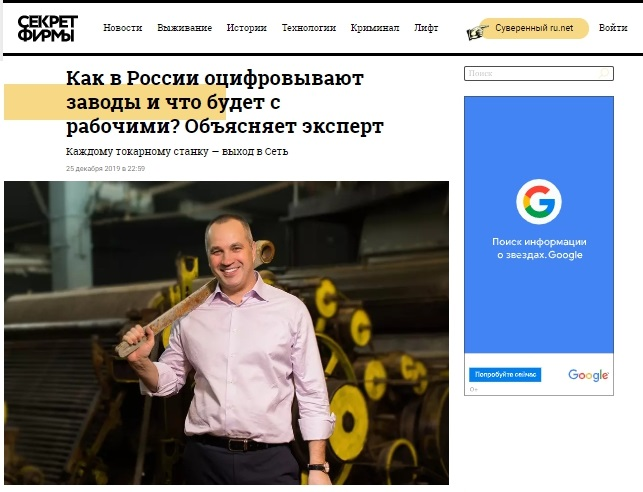
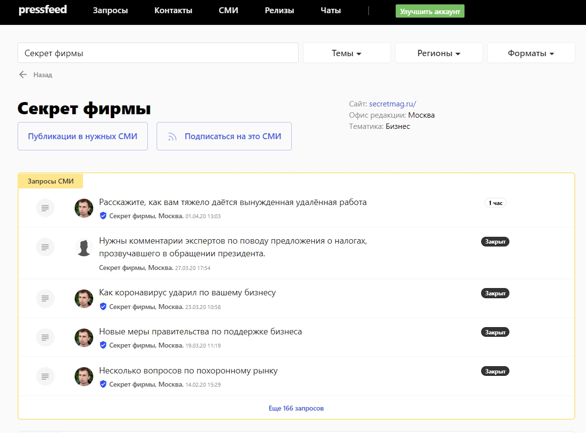
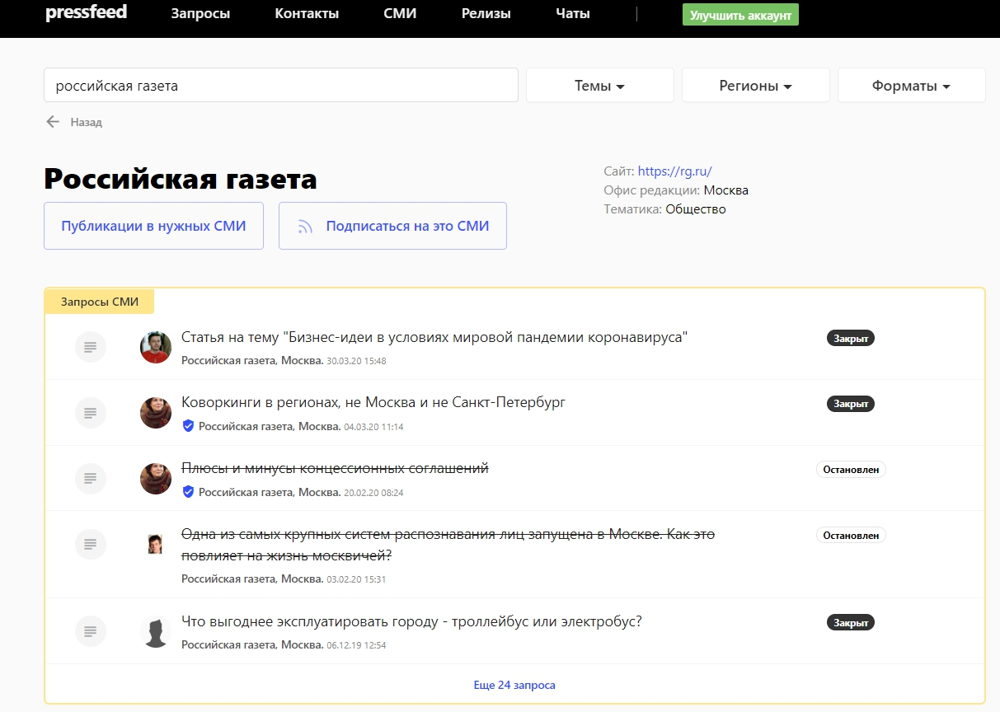
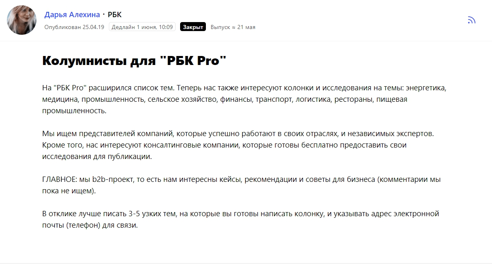
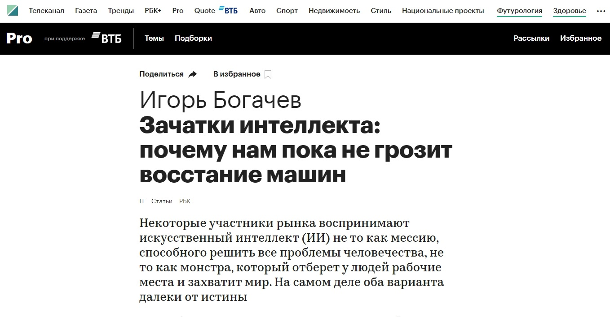
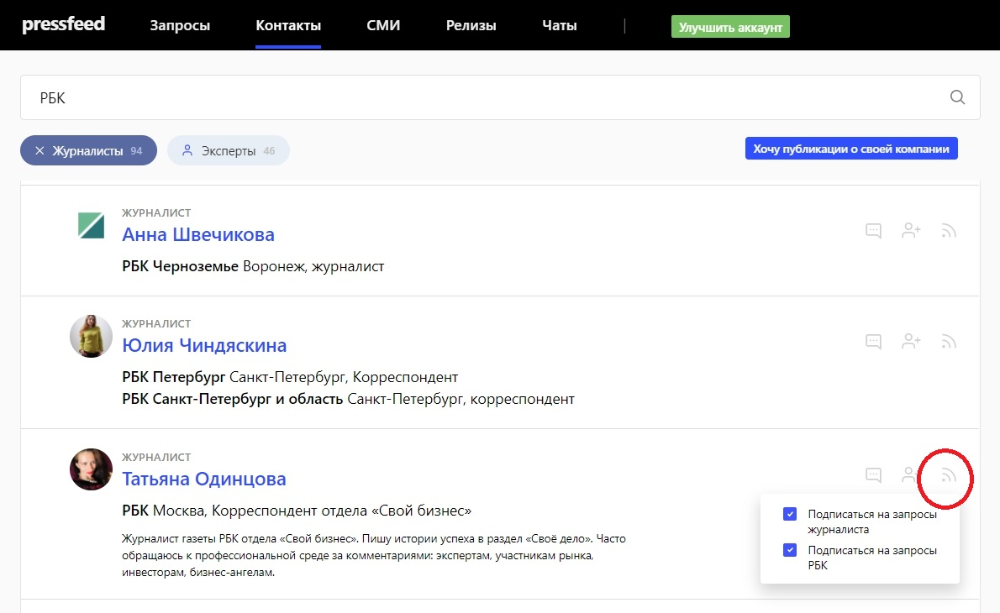
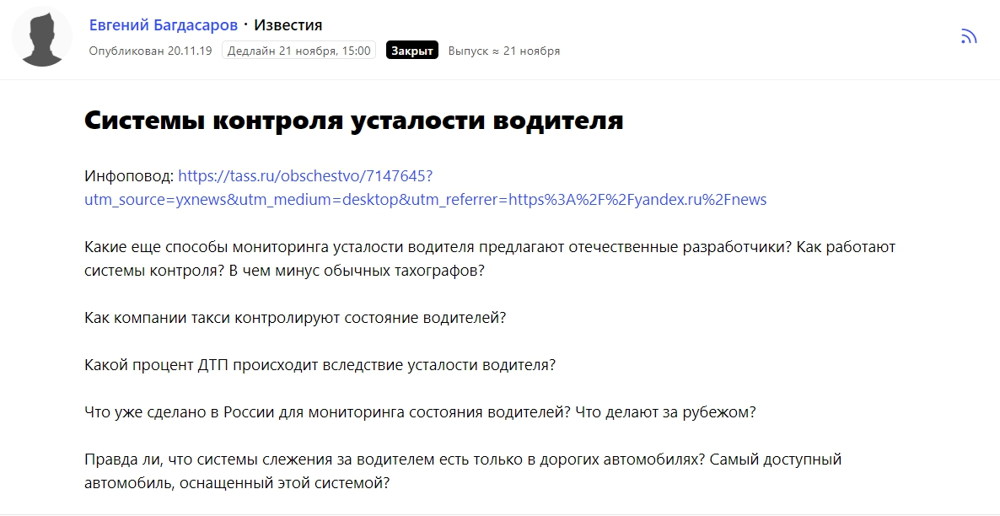
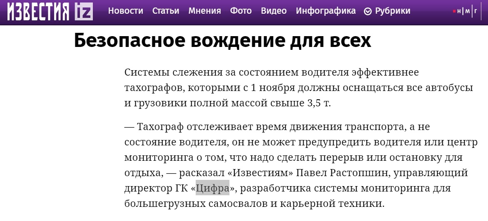
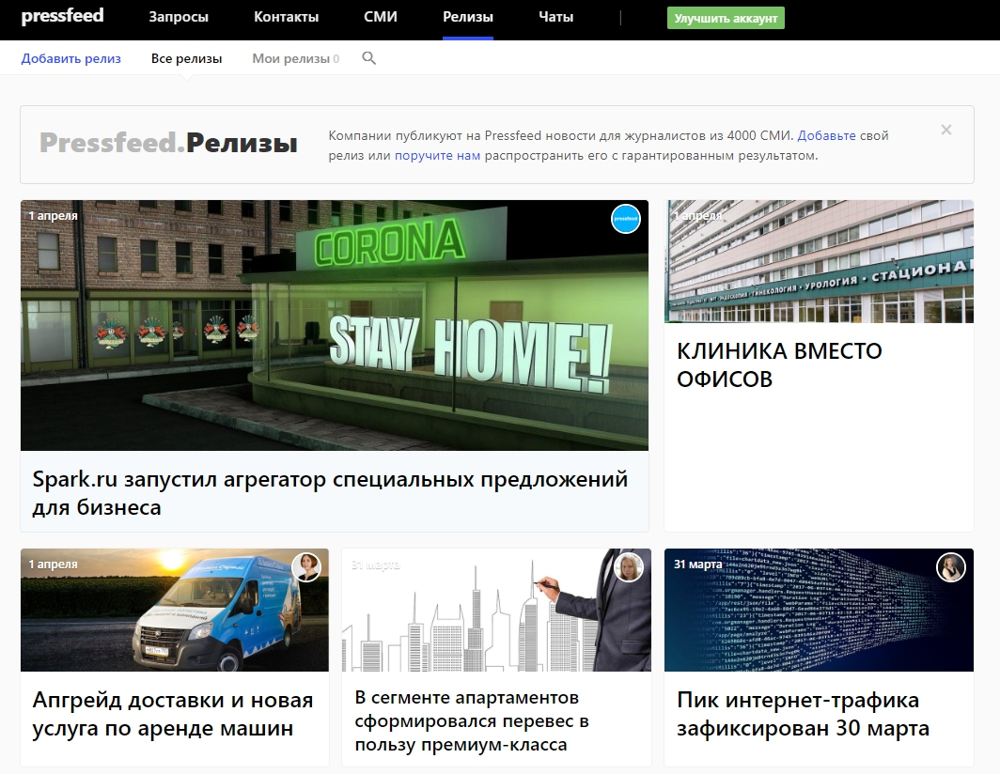

«Цифра» — молодая компания, разработчик систем для цифрового управления производством. Мы создаем продукты в сфере промышленного интернета вещей, искусственного интеллекта, а также промышленных роботов (самосвалов, буровых станков). Клиенты компании — корпорации «Ростех», «Росатом», «Объединенная авиастроительная корпорация», «Полюс Золото» и другие российские промышленные гиганты, а также предприятия из Финляндии, Румынии, Франции, Индии, Турции и десятков других стран. Выручка компании «Цифра» за 2019 год составила около 3 млрд рублей.

Что делает «Цифра» простыми словами: одна из наших ключевых разработок — система «Диспетчер», с помощью которой мы подключаем станки к промышленному интернету вещей, при этом совершенно неважно — современные это станки или они уже отработали не один десяток лет. Мы создаем своего рода Facebook для оборудования: машины могут «общаться», передавать информацию о своей загрузке, необходимости ремонта и т. п. При помощи искусственного интеллекта специальные приложения могут не только отслеживать реальное состояние станков, но и предсказывать возможные поломки в ближайшем будущем.

## Как пиар помогает молодой компании развиваться

Недавно «Цифре» исполнилось 3 года. Мы разрабатываем и продаем сложный, но очень важный для отрасли продукт. Когда мы только выходили на рынок, было непросто: руководству и всем, кто как-то связан с продажами, приходилось тратить немало времени, чтобы объяснять представителям промышленных предприятий, кто мы и что мы делаем.

> Сейчас же, когда мы говорим название «Цифра», 8 из 10 собеседников уже слышали о нас. Кроме того, за 2019 год количество брендовых запросов по названию компании выросло в 2,5 раза.

Также мы проводим глубинные интервью со спикерами «Цифры», в ходе которых спрашиваем, ощущают ли они эффект от PR. В 8 из 10 случаев ответ положительный. А на прошлом годовом собрании, когда мы обсуждали результаты, ключевой оценкой деятельности PR-отдела была фраза: «Нас все знают». Под «всеми» мы подразумеваем топ-менеджмент, руководителей среднего звена и линейных специалистов промышленных предприятий, а также сотрудников государственных и образовательных учреждений. Это те, на кого направлены все PR-активности.

Так вот, нас все знают и ищут в интернете не только потому, что за 3 года мы успели поработать с крупнейшими корпорациями, но и потому что с самого начала мы занимаемся PR-продвижением, причем как на российском, так и на зарубежном рынке.

PR решает две основных задачи, которые не под силу решить классической рекламе:

1. **повышение узнаваемости бренда** и конкретных людей, которые ассоциируются с этим брендом (CEO и визионеры компании). Когда бренд на слуху, экспертов компании чаще приглашают в качестве спикеров на бизнес-мероприятия, охотнее назначают встречи на самом высоком уровне, появляется больше входящих запросов на партнерство и так далее. Репутация имеет очень большое значение, особенно в промышленных отраслях, от этого никуда не деться;
2. **образование рынка** — про цифровые технологии много говорят, но мало кто действительно понимает, что это такое и как это можно использовать. Мы тратим много времени на то, чтобы готовить кейсы с реальным экономическим эффектом, чтобы доступным языком объяснять, что такое промышленный интернет вещей, и как он может повлиять на работу производства. PR нужен нам для того, чтобы наши потенциальные и действующие клиенты, журналисты, представители власти, говорили с нами на одном языке и понимали ценность новых технологий.

## Чем публикации в СМИ выигрывают у деловых мероприятий

Сейчас мы больше сфокусированы на посещении деловых мероприятий. В то же время PR-отдел всегда на связи с журналистами и редакциями десятков СМИ, а пиарщики бренда вместе с экспертами чуть ли не каждый день пишут статьи, дают комментарии для деловых, профильных, региональных изданий. Публикации в медиа, в отличие от любых мероприятий, имеют несколько плюсов:

* форумы и конференции проходят несколько раз в год, а выходы в СМИ позволяют находиться в инфополе круглый год;
* статьи в медиа охватывают тысячи представителей ЦА — мероприятия таким охватом похвастаться не могут (они работают более точечно);
* потенциальный клиент сможет прочитать хорошую публикацию и через месяц, и через год после ее появления в СМИ;
* когда человек читает о компании в уважаемом издании, то он переносит авторитет этого СМИ и на наш бренд тоже.

Работа со СМИ — это обязательная часть продвижения, важная составляющая репутации бренда. Если вы не будете говорить о себе сами, то о вас начнут говорить другие, не факт, что в правильном русле. Поэтому в медиа мы освещаем все темы, связанные с цифровой экономикой, инновациями, искусственным интеллектом, промышленным интернетом вещей, промышленностью, инвестициями.

Чтобы PR в СМИ действительно работал на узнаваемость, публикации нужно делать регулярно, то есть быть на слуху всегда (чтобы измерять уровень того самого «на слуху» существует МедиаИндекс, о нем будет сказано позже). Только за 2019 год в СМИ вышло 2000 оригинальных публикаций и 3000 перепечаток с упоминанием компании «Цифра».

## Как общаться с российскими журналистами

С журналистами российских изданий мы знакомимся и лично на различных мероприятиях, и по почте или в Facebook, или через сервис журналистских запросов Pressfeed. Все способы хороши, и каждое знакомство может привести к плодотворному сотрудничеству — конечно, если идти в СМИ с нормальными инфоповодами.

Например, в случае с изданием «Секрет фирмы» мы предложили интервью редактору, с которым уже работали. В итоге сделали большой материал с гендиректором компании о том, что такое цифровизация промышленности, как это работает, приведет ли внедрение искусственного интеллекта к увольнению сотрудников, о поддержке государства.

_Статья в «Секрете фирмы»_

Другое интервью было в «Российской газете» по той же теме — к чему приведет промышленный интернет вещей, зачем это все. Пожалуй, главный совет, как начать успешное сотрудничество с топовыми медиа, — заинтересовать редактора/журналиста цифрами, фактами, примерами и уметь говорить о сложных вещах простыми словами. Уходить от канцелярского языка.

На многих журналистов мы вышли через [сервис Pressfeed](https://pressfeed.ru/). Это платформа, на которой представители редакции выкладывают запросы, в которых указано, помощь какого эксперта им нужна для написания будущей статьи. Эксперт от компании должен дать либо готовый ответ, либо сообщить о своей готовности участвовать в материале. Обычно журналисты собирают мнения разных спикеров и потом вставляют их комментарии в статью, также редакторы ищут на сервисе колумнистов, которые хотят писать полноценные колонки для журнала / сайта. Удобно то, что с Pressfeed не нужно стучаться в редакции и предлагать темы, здесь все наоборот — журналисты сразу обозначают темы и ждут опытных экспертов, которые помогут им сделать отличный материал.

То же издание «Секрет фирмы» постоянно оставляет запросы на Pressfeed, и на редактора можно выйти через площадку:

  
Или же вот запросы от «Российской газеты»:

На Pressfeed зарегистрированы все журналисты главных российских медиа.

Так, именно благодаря Pressfeed мы познакомились с редактором «РБК Pro» Дарьей Алехиной и сейчас ведем колонку генерального директора в этом издании.

[_Запрос от редактора «РБК Pro»_](https://pressfeed.ru/query/55050)

Мы пишем на «РБК Pro» про тренды в области искусственного интеллекта, о нашем международном опыте.

[_Статья на «РБК Pro»_](https://pro.rbc.ru/demo/5cdeba399a79478ed327fc91)

После выхода колонки о развитии искусственного интеллекта нас позвали выступить с этой же темой в эфир «РБК ТВ».

Кстати, на pro-аккаунте вы можете подписаться на конкретного журналиста или СМИ — тогда все новые запросы от них будут сразу приходить на почту.

Так что мы никогда не пропускаем интересные запросы, в которых нужно дать небольшой комментарий от имени эксперта компании. Если видим подходящую тему — сразу готовим и отправляем ответ. Причем вопросы не обязаны касаться только промышленности: это может быть что угодно, связанное с искусственным интеллектом и IT-разработками.

Например, был запрос от «Известий» о том, какие системы сейчас контролируют усталость водителя, как еще можно следить за водителем, чтобы он не отвлекался от дороги.

[_Запрос от издания «Известия»_](https://pressfeed.ru/query/63053)

В «Цифре» работает отдельное направление по разработке системы мониторинга для большегрузных самосвалов и карьерной техники, так что эта тема нам тоже близка. В итоге в материале появился комментарий управляющего директора компании.

  
[_Комментарий в «Известиях»_](https://iz.ru/946043/evgenii-bagdasarov/polozhi-trubku-voditeliam-ne-dadut-usnut-ili-otvlechsia)

Каждое упоминание в СМИ — это вклад в репутацию, так что если есть возможность дать комментарий (на Pressfeed такая возможность появляется регулярно, на сервисе каждый день размещено около 400 запросов от журналистов), то ее нужно использовать.

Отдельно нужно сказать про пресс-релизы — не стоит списывать их со счетов. Они работают, как и раньше. В конце прошлого года мы объявляли о разработке беспилотного «Камаза». Провели презентацию проекта на базе Назарбаев Университета, куда пригласили журналистов, представителей горных компаний Казахстана, научного сообщества (этот проект мы ведем вместе со специалистами из Казахстана). После мероприятия подготовили два формата пресс-релиза: технический вариант и более бизнесовый. Вместе с пресс-службой «Камаза» распространили релиз по различным российским СМИ. Через некоторое время в компанию обратились несколько реальных лидов. Очевидно, что пресс-релиз все-таки выполнил свою функцию.

На Pressfeed тоже можно публиковать пресс-релизы в специальном разделе:

  
Когда пиарщик выкладывает в раздел релиз, текст автоматически становится доступен для всех журналистов, которые работают на сервисе.

## Какие метрики использовать для оценки эффективности публикаций в СМИ (на российском рынке)

Количество новых бизнес-сделок зависит в том числе от количества вышедших публикаций, но просчитать эту зависимость в точных цифрах невозможно. В PR действуют другие метрики. Пока речь идет только о российском рынке. Для нас самая важная — это МедиаИндекс от сервиса «Медиалогия». Эта метрика складывается из трех параметров: индекс цитируемости, характер упоминания, заметность сообщения. МедиаИндекс отображает, насколько хорошо «слышно» ваш бренд в инфополе, насколько вы заметны в СМИ (в своей отрасли).

> Причем необходимо оценивать не только свои результаты, но и сравнивать индекс компании с индексами конкурентов. По итогам 2019 года мы были на первом месте по МедиаИндексу по теме «цифровизация промышленности». Обогнали компании SAP, General Electric и другие крупные холдинги. По количеству публикаций стабильно находимся в тройке лидеров — всё благодаря налаженным контактам с редакциями и сервису Pressfeed.

Конечно, есть и косвенные показатели, что публикации в СМИ работают на бизнес. Например, мы замечаем, что если телемаркетинг присылает ссылку на публикацию при холодном контакте с потенциальным клиентом, то это значительно повышает вероятность отклика и желание клиента сотрудничать с нами. Это вновь вопросы доверия и репутации, за которые и отвечает PR-продвижение.