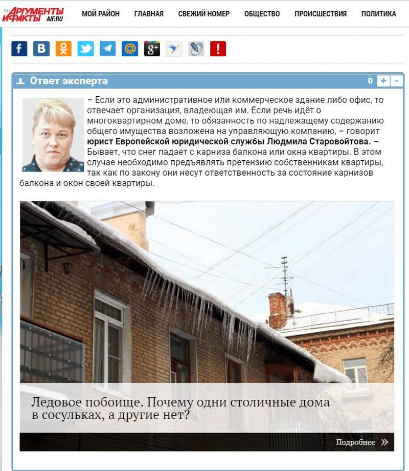
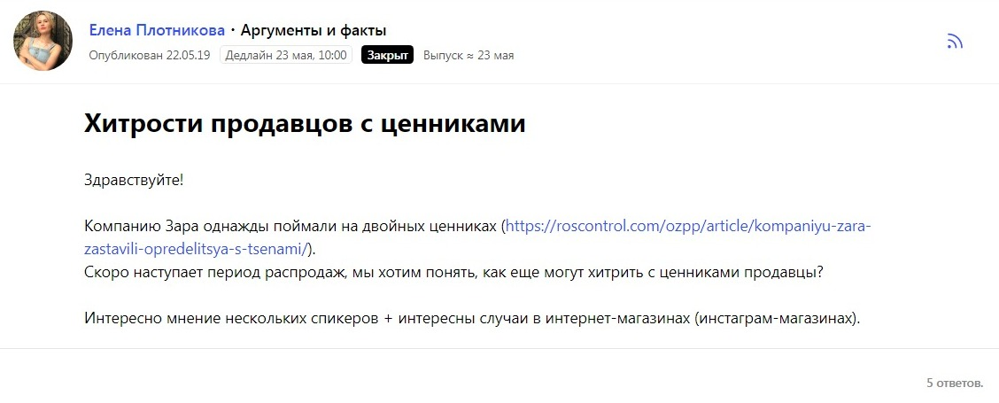
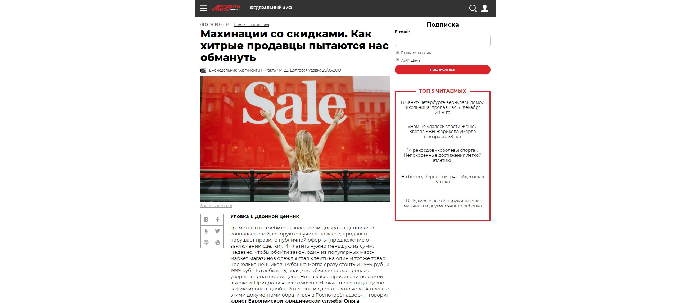

Меня зовут Елена, я уже 4,5 года работаю штатным корреспондентом в Издательском доме «Аргументы и факты». Несмотря на то, что за мной закреплены темы потребительского рынка, туризма, авто и авиа, порой приходится отрабатывать совершенно новые задачи. И тут можно потеряться: где взять экспертов по тематике, с которой ты никогда не работал?

До бума социальных сетей, когда нужному эксперту можно написать сразу на Фейсбуке (при условии, что он читает запросы), я вела документ с контактами. Они для меня, как для журналиста, на вес золота.

Как правило, я искала экспертов так. Я находила либо конкретного человека, который считается экспертом в интересующей меня области, либо организацию, которая работает по нужной мне тематике. Перед подготовкой каждого текста я изучаю, какие материалы и данные есть по этому поводу, кто высказывается, кто предоставляет фактическую информацию и пр. И обращаюсь именно к таким профессионалам.

Так за время работы мне удалось собрать собственную базу из более чем 1500 контактов. Но в какой-то момент найти нужного человека в ней стало просто невозможно. Для того чтобы как-то систематизировать всех экспертов, я поделила их по темам. Этот эксперт отвечает за молочную отрасль, а этот хорошо говорит о напитках. Такая схема упростила задачу, но лишь на время. Пока сами тематические рубрики не стали увеличиваться в геометрической прогрессии.

В итоге в каждой сфере я выделила 2-3 человека, которые брали трубку после первого гудка и всегда могли прокомментировать заданную тему. Так работать стало гораздо эффективнее. Но постепенно я стала понимать, что из текста в текст и из номера в номер повторяю одни и те же имена.

## Как найти новых спикеров по теме будущей публикации?

Стандартный поиск спикеров у журналистов идет по одной и той же схеме. Выход на экспертов можно найти через:

* пресс-службы ведомств (надзорные органы, профильные департаменты, министерства и пр.);
* пресс-службы ВУЗов (запрос на комментарий спикера конкретного факультета или направления);
* профильные организации (ассоциации, союзы, частные компании);
* входящие запросы различных пресс-служб;
* подсказки экспертов рынка, к кому можно обратиться и их помощь с контактами;
* социальные сети;
* помощь коллег.

Понятно, что рано или поздно встает задача поиска новых имен. Но где и как их искать, я не понимала. Интересно, что в других СМИ я также натыкалась на знакомые лица. Получается, у моих коллег была такая же проблема. А мне хотелось находить новые имена.

Зачем это нужно? Вот несколько причин:

* для того чтобы предоставлять более объективную и альтернативную точку зрения;
* выходить на новые и более точные знания;
* анализировать и сравнивать альтернативные точки зрения;
* расширять базу контактов;
* выходить на новые нетривиальные, но полезные читателям темы.

## Как сервис журналистских запросов помогает в поиске информации

Сервис журналистских запросов Pressfeed был у меня на слуху, но я не задумывалась о его использовании. Пока однажды мне срочно не потребовалось подготовить, казалось бы, легкую тему о том, кто должен сбивать сосульки с крыши зданий коммерческих предприятий. Требовался рассказ от лица профильного эксперта со ссылками на соответствующие статьи в законе. И тогда я оставила запрос на Pressfeed, параллельно занимаясь самостоятельными поисками спикера.

Уже через полчаса в мою почту посыпались комментарии с подробными ответами на этот вопрос. Причем, здесь были комментарии, как от представителей управляющих компаний, так и от преподавателей различных ВУЗов и юридических служб. Для публикации ответа я выбрала одного из спикеров, чей комментарий отразил проблему наиболее полно.

Так я узнала о существовании Европейской юридической службы, где можно найти профессионального юриста практически в любой тематике. И далее уже не раз обращалась к ним за разъяснением юридических тонкостей по тем или иным темам.

В следующий раз Pressfeed меня выручил, когда я искала экспертов для подготовки материала о хитрости продавцов во время распродаж.

В следующий раз Pressfeed меня выручил, когда я искала экспертов для подготовки материала о хитрости продавцов во время распродаж. Мне нужно было, чтобы эксперты разъяснили, как вести себя потребителям в случае обмана. Ведь от читателей мы неоднократно получали информацию о том, что их пытались ввести в заблуждении при покупке в период распродаж. На конкретных кейсах со ссылками на статьи закона и прикладными советами я вместе с экспертами, которые отозвались на мой запрос на Pressfeed, подготовила актуальный для наших читателей материал. И даже больше, сервис помог мне найти продавца, который рассказал изнутри, почему магазины идут на обман покупателей и на что лучше обратить внимание при покупке.

Другой пример взаимодействия с сервисом – поиск производителей ягодных джемов. Мне необходимо было попасть на такое производство и посмотреть, как готовятся варенья и джемы. Но ни одно производство, куда я обратилась самостоятельно, не готово было пускать меня в свои цеха. Отчаявшись найти таковых, я оставила запрос на Pressfeed. Ждать в этом случае мне пришлось всего сутки, и в результате нашлись даже несколько производителей, открытых для общения с журналистами.

Для того чтобы оформить запрос на платформе и вывести его в топ, не нужно каких-то особых навыков. Нужно только зарегистрироваться двумя кликами, указав имя, тематику работы и СМИ, сформулировать запрос и указать дедлайн. Запрос тут же отправляется на главную страницу сервиса, а, значит, журналисту ничего не нужно делать для его продвижения. А дальше ответы спикеров появляются и в вашем личном кабинете на Pressfeed, и в письмах на электронной почте. Все, что остается журналисту, ознакомиться с ними, выбрать подходящий и связаться со спикером для уточнения деталей.

## Можно ли обойтись без сервиса

Конечно, сервис журналистских запросов — не единственная площадка для поиска экспертов и тем для работы. Безусловным помощником сегодня являются социальные сети. Но, на мой взгляд, журналистам лучше использовать все способы поиска новых экспертов и тем, чтобы быть интересным читателю и объективно рассказывать о происходящем в любой отрасли.

Лично я все чаще обращаюсь к сервису. Особенно если понимаю, что мне нужно взглянуть на тему свежим взглядом. К тому же, через Pressfeed обо мне узнали и различные пресс-службы, работающие по моей тематике. И, если раньше я пыталась добиться от них ответа, то теперь они сами захотели сотрудничать со мной.
