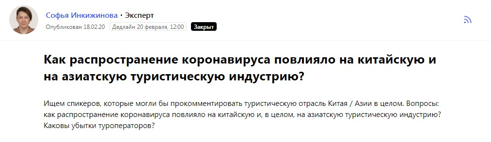
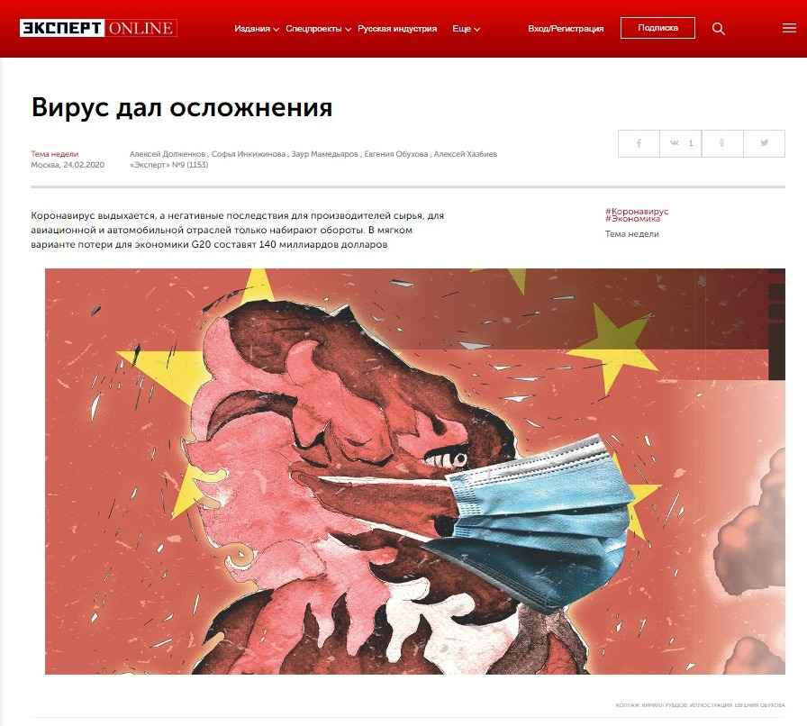

У нас десяток отделов, и каждый собирает информацию каким-то определённым образом. Я работаю в отделе конъюнктуры потребительских рынков. Мы рассматриваем потребительский спрос на самые различные товары повседневного спроса – от пищевой и лёгкой промышленности до non-food.

Я пишу на самые разные темы, но жестко за мной исторически закрепилась рыбная индустрия. Так получилось, что с 2008-го года, когда я только пришла, если что-то связано с этой отраслью, то коллеги из отдела промышленности, из отдела экономики, из отдела чуть ли не культуры, если что-то в рыбном секторе происходит, звонят мне и я, уже как эксперт по своему направлению, даю комментарии.

Система выбора тем для материалов у нас построена по вполне классической схеме: все определяет календарно-тематический план, который составляет главный редактор, опираясь на данные, полученные от системы отделов.

Сегодня, например, я даже не добралась ещё до редакции, а редактор отдела опрашивает нас в чате в WhatsApp, чтобы мы темы обозначили – что будем писать на этой неделе. Каждый корреспондент предлагает свои темы и, удалённо, но сообща, мы всё это обсуждаем.

Или бывает так: я еду на какую-нибудь конференцию, мне может редактор позвонить и сказать: «Так, разворачиваешься на 360 градусов и едешь совершенно в другую сторону, потому что случилось то-то, кого-то купили и созвали срочную конференцию». Но такое бывает редко, потому что специфично для новостийщиков. «Эксперт» – не новостное издание, это не ТАСС, не «Россия сегодня». Поэтому журналисты «Эксперта» сильно отличаются от журналистов информагентств.

Конечно, мы ориентируемся на инфоповоды и часто присутствуем на тех же мероприятиях, что и новостники, но то, что они записывают, проговаривают по телефону в редакцию и выпускают на лентах информагентств – нам не интересно. Там – журналистика фактов, у нас – мнения и аналитика. Если информагентства сообщают, что случилось, мы объясняем почему.

Сейчас, как можно предполагать, самая главная и ключевая тема – коронавирус. Так как наш отдел ориентируется на потребительский спрос, мы будем исследовать проблему с точки зрения разнообразных рынков. Акцент будет поставлен на спрос, на цены, на текущую рыночную ситуацию и что в ней меняется. А есть, например, отдел менеджмента и компаний. Они пишут примерно то же самое, но именно с точки зрения управления компанией. В наших материалах даже могут участвовать одни и те же компании, одни и те же спикеры, но акценты материалов будут разными.

Ещё важный фактор выбора тем в номер – новизна. Если информация написана даже 10 лет назад, она не пойдёт. То есть информация никогда не повторяется. Могут повторяться компании. Я, например, писала про активно развивавшуюся компанию в по рыбном комплексе – «Русское море». Писала про них в 2008-м году, потом спустя пять лет. И вот примерно через пять лет может быть повтор, даже кейс об этой же компании, но если у них что-то произошло – смена стратегии, привнесение каких-то новых инструментов или расширение рынков, что угодно, но это должен быть абсолютно другой материал.

Например, у меня недавно вышел материал по компании «Аскона». Раньше про них же писали двенадцать лет назад. Тогда даже готовил статью другой журналист, были другие спикеры, совершенно другая была и стратегия развития компании. Я пришла сейчас в компанию, посмотрела, как они работают, что они делают и сама повестка материала отличалась от того, что было двенадцать лет назад. Если тогда мы рассказывали о продукте, который они делают, то сейчас это больше были уже стратегические вещи.

Вся эта специфика требует от нашего издания очень кропотливого поиска спикеров и, в некотором смысле, ставит критерии их отбора.

#####   
**Какого эксперта ищет журналист «Эксперта» и где**

Нам , конечно, интересны спикеры с самых разных сторон – и малый, и крупный бизнес, но самое ядро – это средний: успешно развивающаяся компания, российский игрок. То есть, это не иностранцы, у которых всё хорошо, а именно отечественное предприятие. Знаете, такие компании-газели – быстро набирают скорость развития и показывают хороший результат. Понятное дело, что в кризис найти таких сложно, но мы пытаемся.

Внутри компании «Эксперту», конечно же, интересен владелец, топ-менеджмент или те люди, которые могут поговорить, могут высказать свою точку зрения, позицию, как сделать лучше по рынку и по своей компании.

Где мы их обычно ищем? Во-первых, существует база, которой пользуются все в журнале, кроме того у каждого журналиста – собственная база, которую он набирает в ходе своего развития и работы, и, конечно, мы все делимся контактами с коллегами. То есть – обычная классическая схема «Блокнотика» – есть один большой блокнот редакции и у каждого ещё – свой собственный.

Проблема этой схемы в том, что сейчас контакты очень быстро устаревают, а на поддержание актуальности базы лишних временных ресурсов нет ни у редакции, ни у отдельного журналиста. Например, я пришла в московскую редакцию из регионального сибирского подразделения в 2008-м году и пул комментаторов, который был 12 лет назад, по большей части сегодня уже не актуален.

Кроме того, из-за специфики издания нам зачастую требуются узкопрофильные контакты, найти которые порой не в человеческих силах, по-крайней мере, оперативно.

##### **Pressfeed стал источником оперативных и уникальных контактов**

  
Как я уже говорила выше, необходимость расширения контактной базы назрела у нас давно. Руководитель отдела мне так и сказала: «Пора бы тебе расширить свою контактную базу». Причины тому объективны и лежат на поверхности: те спикеры, с которыми ты постоянно общаешься, постоянно быть экспертами из номера в номер не могут, и хорошо, когда спектр комментаторов увеличивается. Есть, конечно, прекрасные спикеры, что называется «говорящие головы», звёзды, – представители компаний, которые могут по любому поводу, на любую тему дать исчерпывающий ответ, сделать прогноз. Но ведь и читателю постоянно из номера в номер читать одного и того же спикера не очень интересно.

С сервисом Pressfeed меня познакомил коллега, Алексей Грамматчиков, очень активный журналист нашего отдела, который пишет про автомобили и всё, что связано с IT, его темы зачастую пересекаются с темами наука и технологии. Начала пользоваться сервисом я всего год назад, а запросов успела отправить всего семь. Все, кроме одного, принесли отличный результат, который, в конце концов вылился в готовые материалы на страницах «Эксперта». Расскажу, как я работаю с Pressfeed’ом.

  

_Журналистка издания "Эксперт" ищет уникальных спикеров для материала "Вирус дал осложнения"_

_Коронавирус выдыхается, а негативные последствия для производителей сырья, для авиационной и автомобильной отраслей только набирают обороты. В мягком варианте потери для экономики G20 составят 140 миллиардов долларов._

Из недавних примеров статей, для подготовки которых я использовала сервис, – материал «Вирус дал осложнения». Когда коронавирус только начинался, мы написали большую тему номера именно про Китай – как коронавирус повлияет на экономику Китая. Так как я работаю с потребительским рынком, мне дали задание просмотреть сектор туризма. Именно – не влияние ситуации на туризм в России, а как коронавирус сказывается на экономике Китая и на экономике стран азиатского региона.

Найти экспертов, которые скажут, что будет с туризмом по России, было бы несложно: конференции с участниками рынка, ключевыми фигурами проходили чуть ли не ежедневно в любом доступном формате. Безусловно и это тоже важно, но у нас стояла другая задача. Нам было важно взять именно международный рынок, а так как я не часто или вообще никогда не писала на эту тему, то мне было сложно найти таких спикеров и, соответственно, я обратилась к Pressfeed и с помощью сервиса нашла троих спикеров. Это дало мне большую фору по времени к подготовке материала.

Был один ответ, который пришлось отклонить. Он, как раз, касался непосредственно российского рынка. Спикер дал ответ, со мной не посоветовавшись, не пообщавшись, просто, что называется рубанул, вывалил ответ.

> И здесь как раз тонкость нашей работы со спикерами: мы в 80% случаев не берем готовые ответы. Наш принцип при подготовке материала – только интервью со спикерами. В некоторых случаях, чтобы подготовить «заметку» на три странички в выпуск, я расшифровываю до 50 тысяч знаков.

Первоначально, конечно, спикер, а чаще – его пиарщик, могут дать письменный ответ, но мы всегда стараемся перевести контакт в разговор.

Мы договариваемся о том, чтобы созвониться в такое-то время или встретиться со спикером и обсудить тему. Потому что очень часто в письменных ответах не даётся ответ на наш вопрос. Или он даётся неполный, или ещё больше возникает вопросов.

Во-первых, для того, чтобы написать, нужно построить логику текста: прежде, чем написать достаточно глубокую, исчерпывающую статью, её нужно нарисовать. Что откуда вытекает, как и почему – некую модель статьи. Причем, при построении этой модели необходимо учитывать и интересность – чтобы это можно было прочитать, чтобы это было интересно, чтобы человек на первой-второй странице не ушёл.

Надо отметить, что некоторые эксперты довольно хорошо отвечают и в письменном виде. Но приоритет всё равно тем, кто может поговорить. Как правило в разговоре мы находим ту уникальную информацию, которая ещё не проговорена нигде, которая нигде не описана. Знаменитая эксклюзивность материалов «Эксперта» рождается именно в беседе со спикерами. Когда я беру интервью, оно может длиться по 3,5 часа.

> Главные критерии отбора спикеров – чтобы он соответствовал теме и чтобы мог что-то сказать, оценить и высказаться по ситуации в своём рынке. Как правило наш респондент – это лицо принимающее решения в компании.

Иногда бывали ситуации, когда я встречалась с пиарщиками, и получалось, что я – журналист – владела большей информацией об их же компании, чем пиарщик. И рассказываешь им, сколько лет компании, чем они занимаются, какая стратегия, хотя я всю эту информацию, перед встречей с пиарщиком нашла в абсолютно открытых источниках – посмотрела, что писали про компанию, что говорил руководитель в других СМИ ранее, а человек, который работает, не знает даже вех развития компании. Поэтому нам интересно именно с теми разговаривать, кто принимает решения.

  
**Как избежать ошибок в работе с Pressfeed**

Бывало в работе с Pressfeed и такое, что на запрос не приходило необходимого ответа. К примеру, на последний мой запрос ответили более десяти раз, и весьма интересные были ответы, но именно моим целям ни один не соответствовал.

Я проанализировала и поняла, что, возможно, сама допустила ошибку: я не совсем точно обозначила, что мне нужно и какие именно спикеры мне требуются. Мы готовили широкий материал про шеринг-экономику, а моей задачей было осветить лишь одну узкую часть рынка – аренду вещей. В запросе же я обозначила, что ищу «бизнес non-food, который развивается по шеринговой модели» и всё. То есть – не совсем чётко дала понять возможным спикерам, что мне требуются комментаторы в сфере аренды вещей. И пришли ответы из всех возможных сфер – офис-шеринг, авто-шеринг, фудшеринг, и чего-только-не-шеринг, но ни одного эксперта в «моей» нише

Пришлось мне всем отвечать: «Спасибо, спасибо» – и отправлять к своим коллегам. Так получилось, что я помогла всем, а к своей части материала спикеров не нашла. Зато я поняла, что эта тема настолько широкая, шеринг существует в таких направлениях, которые мы даже и не взяли в изначальную разработку.

\* * *

Что мы имеем в итоге? В современном ритме обмена информацией даже такие глубоко аналитические издания как «Эксперт» обязаны быть «в теме», обязаны успевать за стремительно устаревающей информацией и, в том числе, обеспечивать в своих публикациях поток актуальных спикеров, героев и экспертов.

Помогает в этом сервис Pressfeed, но, как и в любом техническом решении, есть небольшая погрешность на человеческий фактор: не всегда журналистам привычно пользоваться новым инструментом, не всегда адекватный контакт и с другой стороны – от спикеров или их представителей.

И тем и другим необходимо изучать алгоритмы работы сервиса, и тогда взаимовыгодный результат не заставит себя ждать. Примеров тому множество и с каждым днем становится больше.