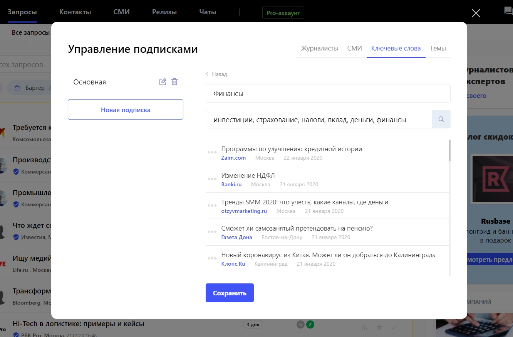
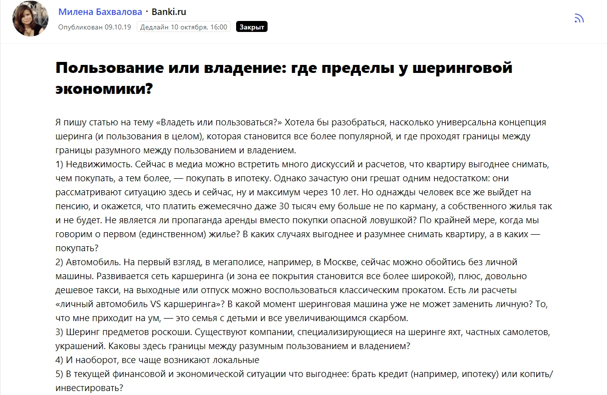
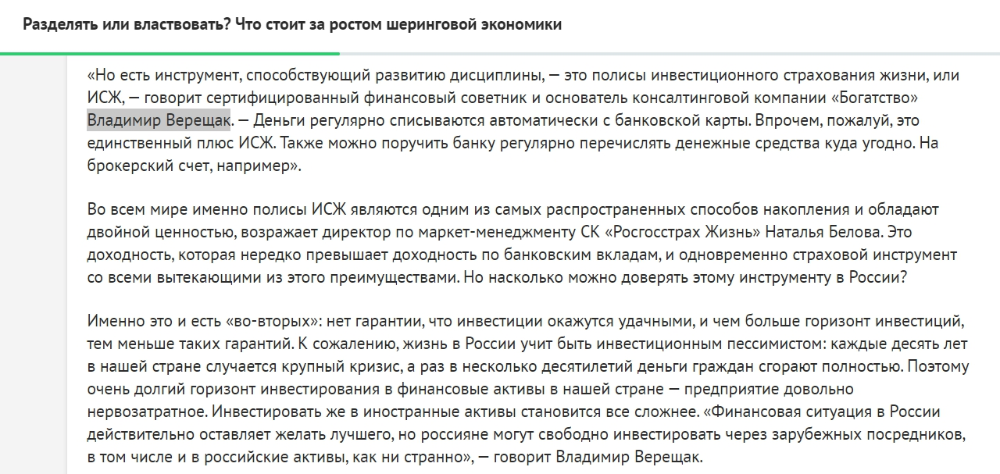

Меня зовут Владимир Верещак, я финансовый советник. Мои клиенты — это чаще всего предприниматели, которые сформировали капитал (примерно от 15 млн рублей) и ищут решения, как им управлять. Им нужен помощник, который подскажет, куда вкладывать средства, как увеличивать доходность и так далее. Я составляю для клиента личный финансовый план, затем сопровождаю его на всех этапах инвестирования. Порой у бизнесмена уже есть своя финансовая стратегия, но он хочет узнать мнение стороннего эксперта и убедиться, что его план не требует доработок (или все-таки требует). Услуга так и называется — «Второе мнение».

Откуда именно обо мне узнают новые клиенты, сказать трудно. Маркетологи считают, что для «продаж» в сегодняшних рыночных условиях нужно 7-8 «касаний» с потенциальным заказчиком. А в случае с дорогим сложным продуктом и состоятельными клиентами таких касаний может быть даже 15 и больше. Даже если меня порекомендовал кто-то, это не значит, что этот человек сразу же станет моим клиентом. Он будет присматриваться ко мне, изучать. В моей профессии не бывает быстрых продаж, здесь не будет работать классическая реклама в Директе. Клиенты «идут» ко мне долго, но я сопровождаю их чуть ли не всю жизнь (а может быть, стану консультантом и для их наследников).

Консультант должен вызывать доверие и быть профессионалом (уметь демонстрировать свои навыки) — это главное. Например, я развиваю свою страницу в Facebook, публикую посты практически каждый день — рассказываю, как о личном, так и о работе, а параллельно собираю вокруг себя некое сообщество по интересам. Недавно пересмотрел ленту и обнаружил лайки годовалой давности от своих нынешних клиентов.

> Один клиент читал мои посты в Facebook два года, прежде чем обратиться за консультацией, представляете?

В середине 2018 года я решил вкладывать ресурсы (свое время, в первую очередь) в еще один «рычаг доверия», в еще одно направление, которое помогает усилить свой личный бренд, — делать публикации в СМИ.

## Почему решил, что публикации в СМИ — это важно

Я читаю много зарубежной литературы, посвященной тому, как живут финансовые консультанты на Западе, как на них выходят клиенты, какие инструменты маркетинга и пиара считаются наиболее эффективными. Практически во всех книгах консультанты из разных стран мира считают СМИ одним из самых важных каналов коммуникации с бизнес-сообществом. Неправильно делать ставку только на статьи в медиа, то есть это не должен быть ваш единственный способ продвижения, но то, что этим нужно заниматься — нет сомнений.

> Считаю, что публикации в медиа — это, прежде всего, репутационная история. Одна статья, опубликованная в СМИ и в личном блоге, имеет совершенно разный вес. Если человек читает мою статью на известном финансовом портале или в Forbes, то это сразу отражается на моей репутации. Потенциальный клиент думает: «Да, это действительно эксперт, ему можно доверять».

Кроме того, публикации в СМИ повышают узнаваемость на рынке и в итоге растут брендовые запросы по моему имени. Клиент вбивает в поисковик «Владимир Верещак консультант» и сразу видит десятки моих статей на первой странице выдачи «Яндекса», например. Это отлично работает, и я увидел этот эффект практически сразу, как только начал взаимодействовать с журналистами. Но обо всём по порядку.

## Как я впервые попал в СМИ

  
Когда я только задумался о том, что мне необходимо налаживать контакты c различными изданиями, мне казалось, что это очень сложная задача: где вообще я, а где СМИ. Как в них попасть, что предлагать — непонятно.

Что я сделал на самом первом этапе — нашел какой-то список тематических СМИ в интернете (в основном там были бизнес-площадки). Начал составлять собственную базу: заходить на каждый сайт и копировать почту редакции или определенных журналистов. Получилось около 200 емайлов. В своих мыслях я ставил себя на место Гоголя или Ильфа и Петрова: они ведь тоже ходили по издательствам и предлагали свои рукописи. Я подумал: чем я хуже, буду предлагать свои статьи в редакции.

> Дальше я сделал массовую рассылку по изданиям. В письме рассказал о себе, о том, на какие темы могу писать (о финансах, инвестициях и всём, что с ними связано), показал готовые статьи из блога. Нетрудно догадаться, что конверсия была крайне низкая. Большинство редакций проигнорировали мои письма — конечно, ведь желающих писать для Forbes и «РБК» очень много.

Но были и те, кто мне ответил и согласился сотрудничать. Это были не самые целевые СМИ, но сначала это было не так важно, мне нужно было понять, как общаться с представителями медиа. Например, самая первая статья была опубликована на сайте NewsFrol.ru — это авторское издание, которое пишет о новостях Геленджика и Краснодарского края. Мы определили тему, и в итоге моя публикация называлась «Защита инвестиций в РФ и за рубежом».

Через пару месяцев вышел другой мой материал уже на более целевой площадке — в [бизнес-журнале «Деловой мир»](https://delovoymir.biz/investicii-dlya-predprinimateley.html). Я написал большой текст, в котором сравнил доходность, которую приносит традиционный бизнес и инвестирование, объяснил, почему нельзя выбирать между своим делом и пассивным доходом и так далее.

Статью прочитали более 9 тысяч человек — 9 тысяч участников бизнес-сообщества узнали обо мне. Думаю, что это хороший результат для тех, кто только начинает заниматься пиаром в СМИ.

## Следующий этап: подключил сервис Pressfeed и быстро попал в финансовые и деловые СМИ

Спустя время я понял, что так просто в деловые и отраслевые СМИ не попасть. К каждой редакции необходимо искать индивидуальный подход, долго договариваться, а столько времени у меня не было. Я все-таки финансовый советник, а не пиарщик. Поэтому летом 2019 года я подключился к сервису Pressfeed и решил попробовать взаимодействовать с изданиями через него.

[Pressfeed](https://pressfeed.ru/) — это сервис журналистских запросов. Специальная IT-платформа, на которой представители СМИ выкладывают своего рода «объявления». В них указано: на какую тему журналист готовит статью и каких экспертов он ищет, чтобы те смогли прокомментировать тот или иной вопрос. Всё, что интересно разным СМИ (на платформе работают более 5 тысяч изданий) прямо сейчас, находится перед глазами эксперта. Не нужно навязываться, предлагать свои идеи. Видишь запрос — если и тема, и СМИ близки тебе, то высылаешь ответ. Если он подходит журналисту, то он поставит мнение эксперта в свою статью.

Регистрация на Pressfeed бесплатная для всех, но на базовом тарифе, который по умолчанию идет для всех новых пользователей, можно отвечать всего на три запроса в месяц. Это очень мало, ведь все три ваших ответа журналисты могут запросто отклонить, тогда вообще не будет никакого выхлопа. Так что я подключил тариф «Эксперт» (стоимость подписки на три месяца — около 12 тысяч рублей, на год — 43 тысячи). С pro-аккаунтом можно отвечать на неограниченное количество запросов, также формировать подписки на запросы по ключевым словам, по СМИ и журналистам, а также общаться с любым изданием во внутренних чатах сервиса. Плюс вас сопровождает менеджер, который может помочь, если что-то непонятно.

Прежде всего, я настроил подписку по ключевым словам и теме «Финансы»:

  
_Пример подписки по ключевым словам_

Каждый день на почту приходили подборки с новыми актуальными запросами по моим темам. Как только я видел что-то интересное, то сразу готовил комментарий. В месяц реагировал на 8-12 запросов — и буквально сразу мои комментарии стали появляться в хороших финансовых СМИ.

Например, я ответил на запрос от издания Banki.ru. Журналист собирал мнения на тему шеринга, который сейчас становится все популярнее и популярнее. Что выгоднее — купить свою машину или арендовать?

  
  
[_Запрос от Banki.ru_](https://pressfeed.ru/query/61422)

Ответ был принят, мое мнение появилось в статье:

  
[_Статья на Banki.ru_](https://www.banki.ru/news/daytheme/?id=10908648)

> Материал прочитали более 18 тысяч человек. То есть 18 тысяч читателей, которые так или иначе интересуются деньгами и финансами, узнали обо мне.

Также два раза отвечал на вопросы издания «Финтолк» — это сайт рассказывает о финансах простым языком, учит общество финансовой грамотности (увы, в России с этим печально).

Журналист хотел получить мнение специалиста на тему, в какой валюте открыть свой первый вклад, при условии что сумма накоплений весьма скромная.