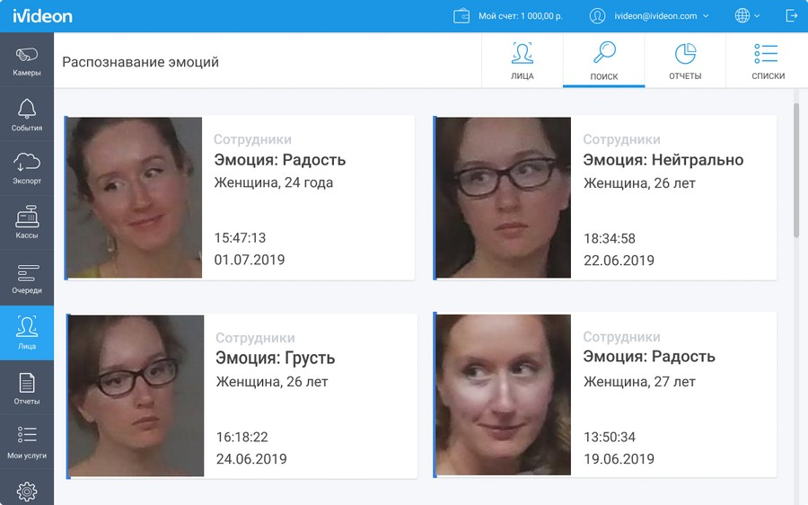

Типичное рабочее утро: я иду по офисному коридору с чашкой кофе в одной руке и телефоном в другой, яростно и ласково убеждая автора, что описывать облачные сервисы надо как хорошую еду — с эпитетами, метафорами и лирическими отступлениями, если потребуется. Камеры наблюдения под потолком фиксируют мои эмоции: от надежды до отчаяния и обратно.

_Алгоритмы компьютерного зрения определяют только базовые эмоции: ярко выраженную радость, грусть, гнев, удивление и нейтральное выражение. Не магия, но удобный инструмент для ритейлеров, сферы услуг и организаторов массовых мероприятий._

Ivideon на рынке с 2011 года, когда слово «видеонаблюдение» связывалось с устрашающего вида камерами, стеной из мониторов и скучающе-бдительным представителем службы безопасности. Как можно связать видеонаблюдение и интернет вообще практически никто не понимал. В Ivideon захотели, чтобы было вот так:

Сегодня в компании более 200 сотрудников в Москве, Санкт-Петербурге, Екатеринбурге и Рязани, представительства в США и Великобритании, около 3,5 млн пользователей, 15 удаленных дата-центров и партнеры по всему миру, внушительный отдел облачной разработки, мобильная и веб-разработка. Ключевые продукты: удаленное видеонаблюдение, облачный архив для хранения видео, интеллектуальные аналитические модули на базе компьютерного зрения и облачных вычислений — распознавание лиц, счетчик посетителей, учет рабочего времени, детектор очередей.

## Контент-маркетинг в IT: необходимые ингредиенты

Главный ресурс Ivideon — разработчики, инженеры, продуктологи, бизнес-аналитики, менеджеры по работе с клиентами из малого, среднего и крупного бизнеса. Сотрудники, досконально изучившие не только продукты, но и возможности их применения в разных сферах. От и до, включая подводные камни, боли, трудности, потребности — все, что составляет драматургию и соль контент-маркетинга, который, в сущности, был и остается ни чем иным, кроме как искусством рассказывания интересных историй. Историй о клиентах и для клиентов, рассказанных на языке клиентов.

> Неизбежная ошибка контент-стратегии любого IT-сервиса, выскакивающая на ранних этапах: упорно и развернуто рассказывать в статьях исключительно о себе и своих достоинствах, по касательной затрагивая боли бизнеса и предполагая, что предприниматели досконально знают все о своих проблемах и постоянно ищут IT-сервисы, чтобы их решить (на самом деле, нет).

Продукты Ivideon нацелены на малый и средний бизнес, поэтому мы быстро поняли, что помимо прямого рассказа о технологиях, софте и оборудовании, необходимо взять на себя функцию бизнес-тренера и обратить внимание потенциальных клиентов на «узкие» места в процессах, которые можно устранить с нашей помощью.

Мы выпускаем материалы для ритейлеров, финтеха, HoReCa, где эксперты Ivideon фокусируются не столько на видеоаналитике и видеоданных как таковых, сколько объясняют, как сделать так, чтобы данные с бизнесом заговорили. И отвечают на простые ежедневные вопросы: как экономить на аренде, как перевести устаревшую систему видеонаблюдения в облако и получить преимущества облачной инфраструктуры, предотвратить ЧП, запустить прогрессивную программу лояльности с помощью распознавания лиц, отследить мошенничество на кассах, оптимизировать работу персонала, разобраться в популярных технологиях «умного» дома и города и занять там свою нишу.

Материалы на эти темы выходили у нас в разных крупных СМИ: Forbes, РБК, Executive, «Деловая среда», Retail.ru, «Лайфхакер», Spark, «Коммерсантъ» и многих других.