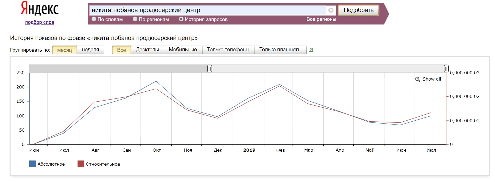
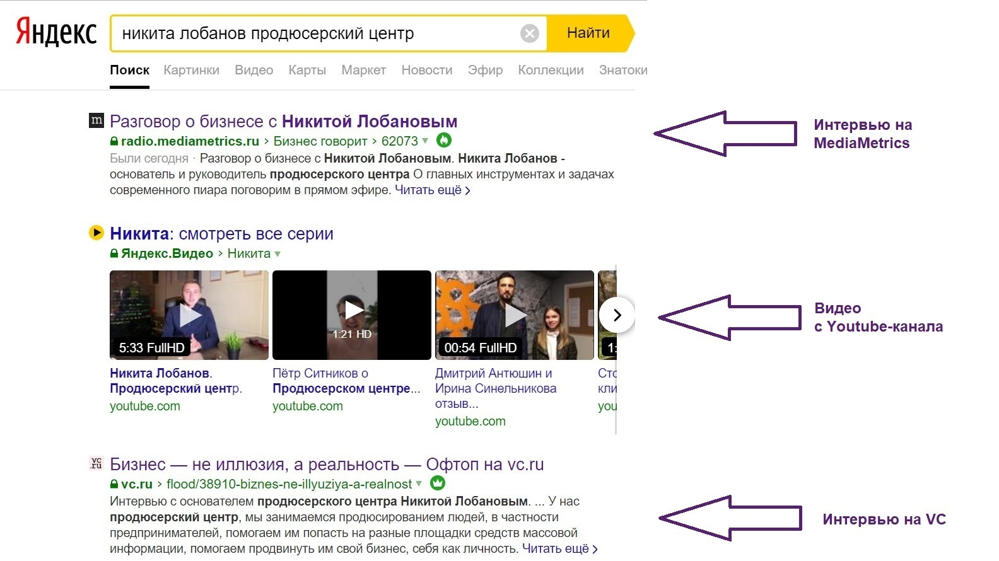
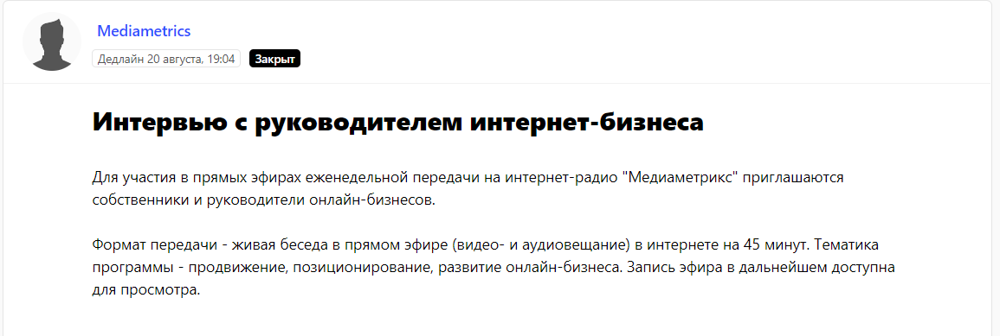
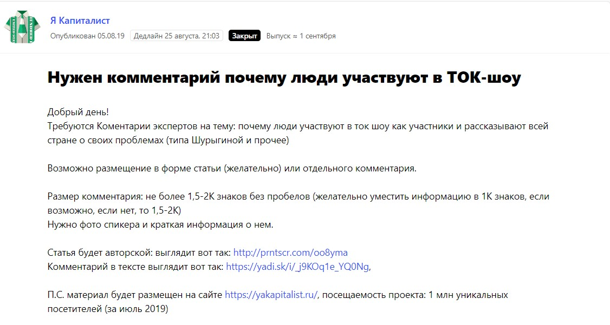
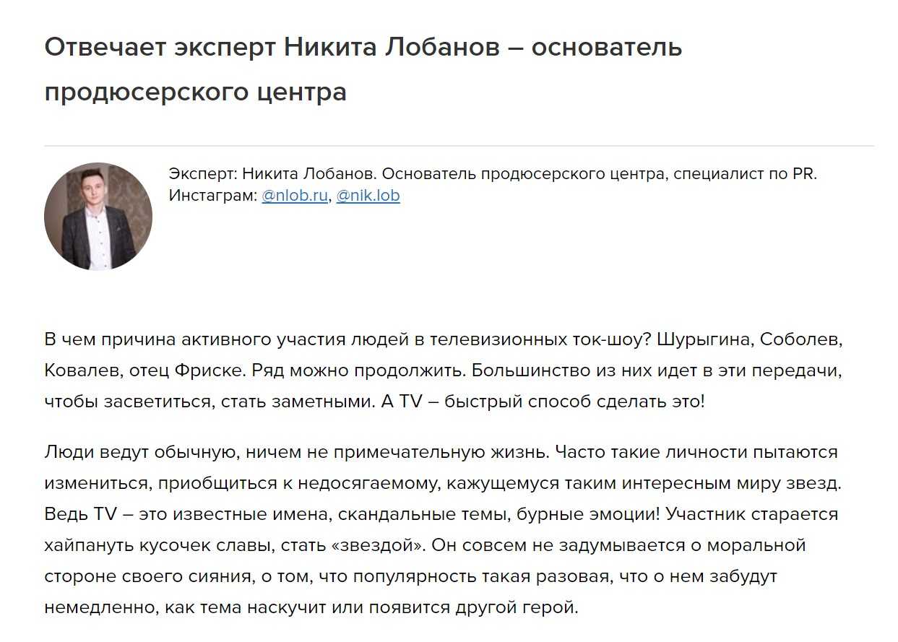

## Почему так важен пиар в медиа (вообще для всех)

Почему важен пиар в классических медиа, когда личный бренд успешно развивают с помощью социальных сетей?

Я ни в коем случае не принижаю ценность социальных сетей для развития личного бренда. Их нужно вести обязательно: вкладывать в SMM время, силы, деньги. Но для полноценного «сильного» образа эксперта этого недостаточно. Я считаю, что СМИ не умрут никогда. Люди смотрели телевизор и будут его смотреть. Это своеобразный инструмент управления общественным мнением: СМИ ведь не зря иногда называют четвертой ветвью власти.

Например, наш клиент ― клиника пластической хирургии. Маркетологи бренда сказали, что раньше они не рассматривали СМИ как эффективный инструмент для продвижения вообще. Наступила эра Инстаграма, и они вкладывали огромные бюджеты в эту соцсеть. Теперь аккаунт клиники в Инстаграме раскручен, но хочется прокачиваться дальше. Плюс кажется, что люди начинают уставать от того рекламного контента, который каждый день выливается на них в Инстаграме. И клиника решила уделить время СМИ и начать продвижение с помощью публикаций и эфиров.

_Справка о компании:_

_Основная специализация продюсерского центра Никиты Лобанова ― «прокачка» личного бренда эксперта и его продвижение в медиа (публикации в онлайн СМИ, эфиры на радио и ТВ). В основном идет работа с пластическими хирургами, стоматологами, руководителями строительных компаний ― то есть такими экспертами, кому для привлечения новых клиентов особенно важна репутация, отзывы и так далее._

Сегодня рынок переполнен предложениями, но потребители выбирают тот продукт или бренд, который слышали и видели, о котором читали. TV, радио, журналы, бесконечные прерии интернет-пространства в руках продюсерского центра, вбивают имя бренда (или конкретного эксперта) прямо в подкорку.

> Иногда люди даже не понимают, почему они сделали такой выбор, а мы знаем: скорее всего, они видели эксперта по ТВ, в журнале, на сайте, и в нужный момент вспомнили о нем. То есть репутация решает.

Однако бывает и противоположная ситуация: человек хочет купить что-то или пойти к какому-то специалисту. Он обращает внимание на рекламу по этой теме. Предположим, он кликнул на контекстную рекламу и узнал о продукте / эксперте в нужной области. На рынке довольно мало таких продуктов, которые пользователь покупает сразу. Обычно ему нужно поразмышлять, взвесить все за и против, узнать об этом больше. Дальше он начинает судорожно шерстить все источники на предмет информации о продукте или эксперте. Читает социальные сети, отзывы на отзовиках, статьи в СМИ, смотрит видео. Проверил все, поверил в бренд, берет! Чем интереснее и убедительнее материалы, которые он прочитает, тем быстрее он примет решение сделать покупку.

> То есть грамотный пиар влияет, прежде всего, на узнаваемость и на то, что о продукте / говорят в интернете. Знаете, хоть сколько бы ни звучала в моей практике фраза «Не верьте всему, что говорят в интернете, в том числе в СМИ», люди же все равно верят. И через СМИ можно повлиять на их мнение о компании.

Для продвижения продюсерского центра мы придерживаемся таких же принципов. Репутация как зачетка в институте: сначала работаете на нее, потом она работает на вас. Все просто. Поэтому собственные услуги мы также пиарим с помощью различных медиа-площадок.

## Как это работает в случае с продюсерским центром

Не буду скрывать, что в плане продаж у нас лучше всего работают холодные звонки с предложением услуг центра. У нас постоянно работает реклама в «Яндекс.Директе». Так же используем рассылки в Инстаграм, то есть пишем потенциальным клиентам там и рассказываем о нас. То есть это первое касание с ЦА ― мы цепляем их прямой рекламой.

Но что происходит, когда заказчик впервые узнает о нашем центре? Он идет гуглить информацию о нас. Вбивает запрос, предположим, «Никита Лобанов продюсерский центр». Примерно так выглядит статистика по этому запросу в «Яндекс.Вордстате»:

_Статистика по запросу «Никита Лобанов продюсерский центр»_

Что он увидит на первой странице? Сначала идет ссылка на официальный сайт центра и ссылки на страницы в социальных сетях. Это понятно, а потом? Эфиры и статью с моим участием. Также видео с Youtube-канала, там у нас отзывы клиентов в основном.

Это скрин первой страницы в «Яндексе»:

_Запросы на первой странице выдачи_

  
Сразу после ссылок на социальные сети идет запись моего интервью на радио MediaMetrics. Мы познакомились с радио MediaMetrics через [сервис журналистских запросов Pressfeed](https://pressfeed.ru/). Это платформа, где редакции совершенно разных медиа ― от профильных блогов до федеральных телеканалов ― ищут героев, экспертов для своих материалов. То есть продюсер канала, редактор на радио или журналист публикует там запрос: нужен вот такой-то человек для написания статьи или записи эфира. Выставляет дедлайн ― до такого времени он ждет отклики. Необходимо оперативно ответить и кратко рассказать о том, кто вы, кого представляете, на какие темы рассуждает эксперт. Если все окей, то журналист принимает ответ и дальше уже идет работа над текстом, либо эксперта приглашают на съемки.

  
[_Запрос от Pressfeed_](https://pressfeed.ru/query/46591)

Запись эфира можно [послушать по ссылке](https://radio.mediametrics.ru/business_says/62073/).

Регистрация на Pressfeed бесплатная для всех, но есть разные тарифы — базовый, «Эксперт», «Компания», «Агенство». На начальном (базовом) аккаунте можно отвечать только на 3 запроса в месяц, этого, конечно, мало, чтобы получить какие-то результаты. Лучше заплатить чуть больше 40 тысяч рублей за год (это цена тарифа «Эксперт») и комментировать сколько угодно запросов, и вот тогда от пиара в СМИ действительно будет эффект.

Через Pressfeed мы выпускали и публикации в онлайн-медиа. Говорим всегда о личном бренде, пиаре, брендинге, то есть о том, в чем отлично разбираемся сами.

Совсем недавно ответили на запрос от относительно новой площадки «Я Капиталист». Журналист спрашивал, почему некоторые люди так хотят попасть в скандальные ток-шоу на федеральных каналах.

  
[_Запрос на Pressfeed_](https://pressfeed.ru/query/58856)

Это наша тема, так что я дал свой развернутый комментарий, и в итоге стал экспертом в материале.

  
[_Фрагмент публикации_](https://yakapitalist.ru/news/pochemu-lyudi-idut-v-tv-shou/)

На момент написания этой статьи материал еще не успел проиндексироваться и попасть в поисковую выдачу, думаю, стоит подождать какое-то время.

Кстати, еще мы используем Pressfeed не только как эксперты, но и как редакция ― сами размещаем там запросы, когда собираем фактуру для наших статей в блоге. Например, искали кейсы, когда статья в СМИ привела реальных клиентов.