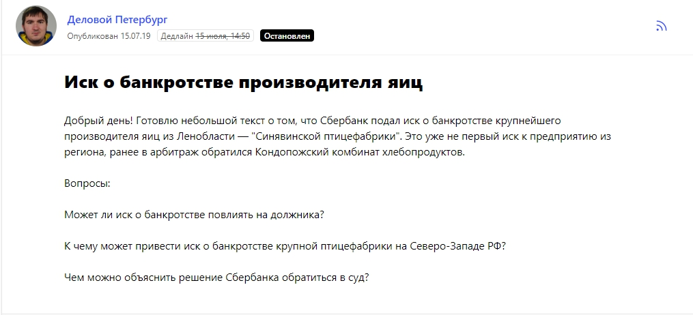
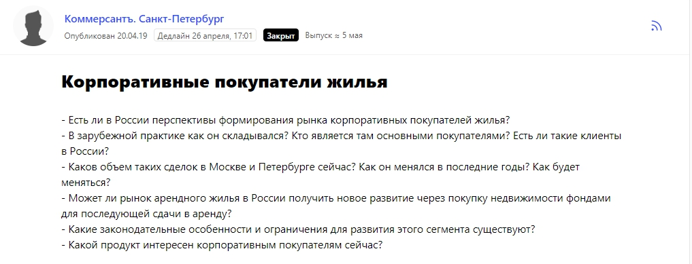
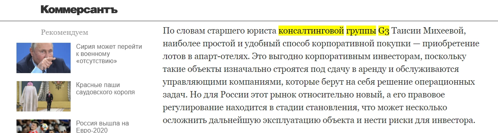
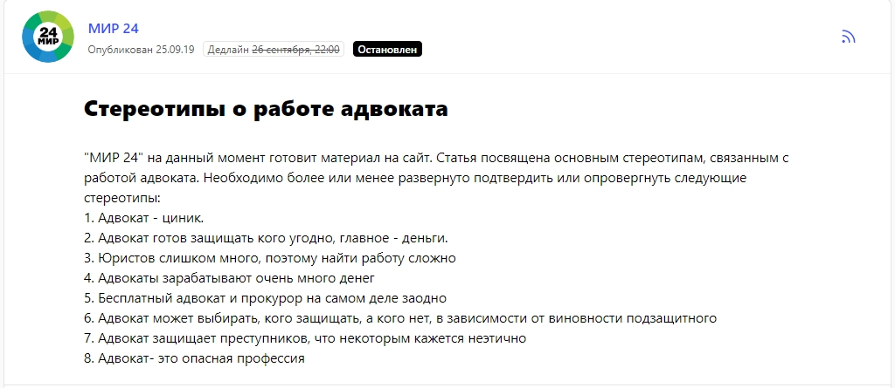
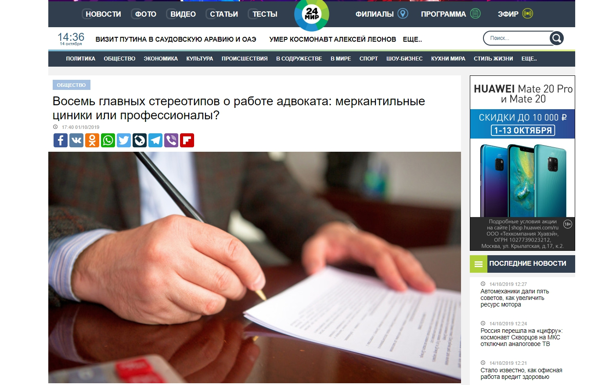
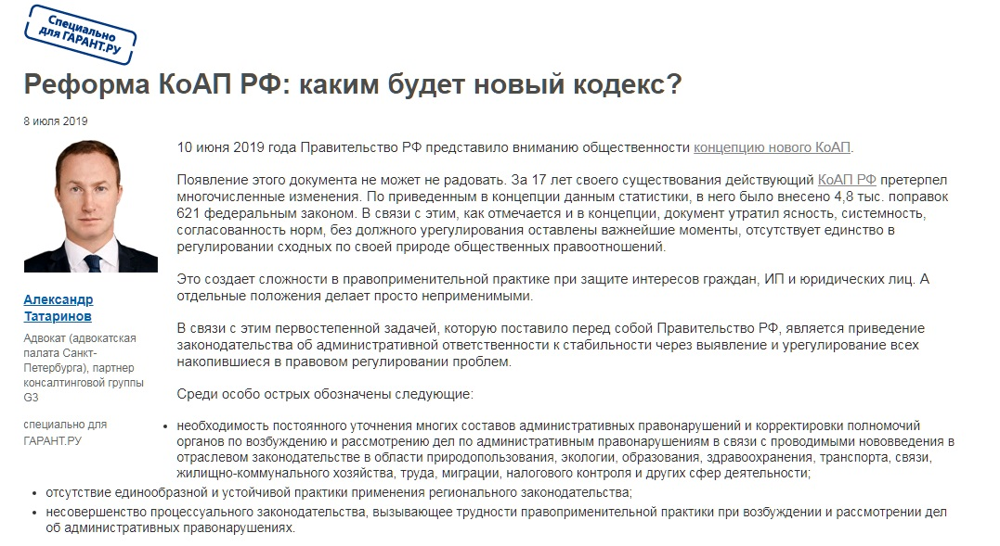
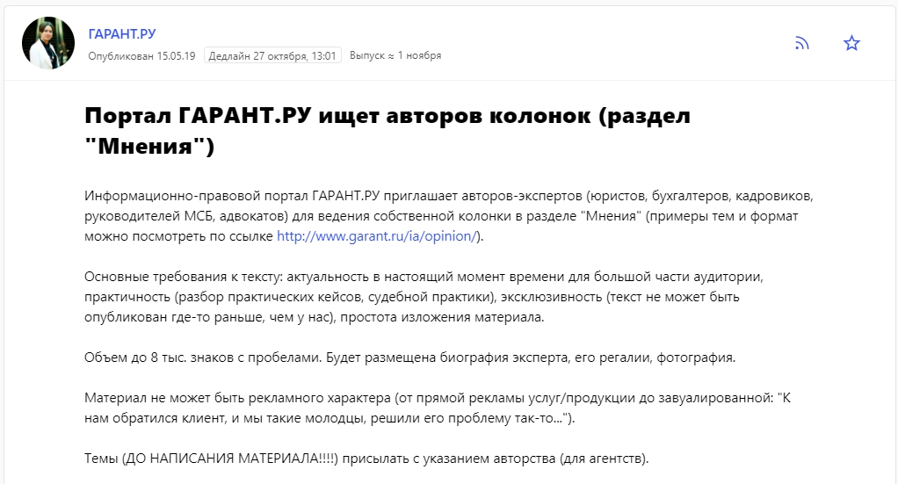
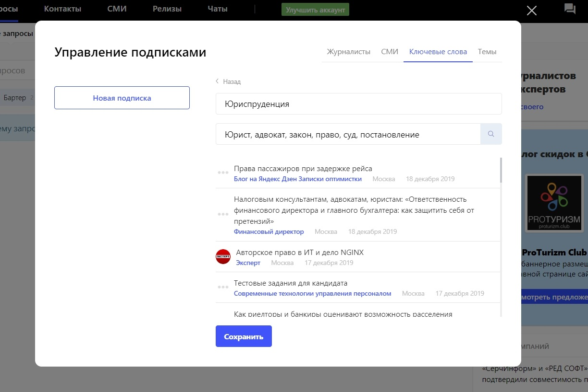

## Адвокатская этика запрещает запускать прямую рекламу

Начнем с того, что существует такое понятие, как адвокатская этика. Она включает много негласных правил, одно из которых касается рекламы, — адвокату фактически нельзя использовать прямые рекламные каналы для своего продвижения. Когда юрист получает статус адвоката, он принимает на себя обязательства, которые в том числе запрещают прямую рекламу. Поэтому адвокат, дорожащий своей репутацией, не может запустить таргетированную или баннерную рекламу со слоганом «Гарантированный результат, самые низкие цены, лучший адвокат в такой-то отрасли» и тому подобное. За явную и неприкрытую похвальбу адвоката могут не только поднять на смех коллеги, но даже лишить статуса, так что в консервативном юридическом мире к таким инструментам, как прямая реклама или «Яндекс.Директ» и Google AdWords, относятся весьма настороженно. С их помощью можно привлекать трафик на сайт, повысить узнаваемость, но не факт, что это приведет к сделке и деньги не будут потрачены впустую.

Все дело в том, что юристов выбирают по-другому. Огромную роль, как и в медицине, играет сарафанное радио и репутация консультанта. Для адвоката важно выстраивать личный бренд, и его главная задача — формировать доверие. Любое действие в рамках продвижения должно демонстрировать его профессиональную компетенцию. А способов, чтобы показать экспертность и создать деловой имидж, но при этом не раскрывать подробности своей работы (которые тоже обычно являются конфиденциальной информацией), и не удариться в пустословие, не так уж и много.

> Вернее, можно сказать, что их всего два — во-первых, публикация статей и комментариев от имени консультанта в уважаемых СМИ, во-вторых, участие в профильных мероприятиях. Получается, что у адвоката просто нет других вариантов, и грамотный классический пиар — это единственный формат, который позволяет открыто рассказать о себе общественности, в том числе потенциальным клиентам, и не нарушить адвокатскую этику.

_О компании:_

_Консалтинговая группа G3 — это проект, в котором объединились три юридические компании. Специалисты группы чаще всего работают в интересах среднего и крупного бизнеса, клиенты — большие компании или государственные органы, судебные дела — громкие и сложные._

## Как работает пиар в случае с юристом

Если большинство клиентов приходят благодаря сарафанному радио, возникает логичный вопрос: стоит ли вообще тратить время и силы на пиар? Конечно, я объясню почему. Прежде чем решиться заключить договор с юристом или адвокатом, клиент долго думает, выбирает по сути из списка ничего для него не значащих имен. Ему хочется оценить потенциального консультанта со всех сторон и быть уверенным в своем выборе. Да, возможно, этот консультант помог знакомому клиента и тот порекомендовал его, но это еще не значит, что адвокат сможет выиграть спор по другой категории дел. В этом случае задача пиар-инструментов — заранее объяснить человеку, к кому он идет, на чем этот адвокат специализируется, какие задачи он способен решать.

В юриспруденции, как и в медицине, множество узких направлений, и определенный юрист может идеально разбираться в одной теме, но только поверхностно понимать что-то в другой. Потенциальный клиент, желающий найти хорошего профессионала, начинает изучать информацию о нем — проверяет его сайт, социальные сети, гуглит его фамилию в попытках найти упоминания дел с участием консультанта. И если он натыкается на публикации в уважаемых СМИ от имени юриста, то это во много раз повышает доверие и уверенность в своем выборе.

> Статьи и комментарии в СМИ важнее, чем выступления на отраслевых мероприятиях, потому что на конференцию или форум приходит ограниченное число гостей, а публикации в медиа живут вечно, и их можно найти и прочитать даже через 5 или даже 10 лет после выхода.

В консалтинговой группе G3 работает около 30 консультантов. Многие из них развивает свой личный бренд с помощью публикаций в СМИ и таким образом формирует и свою репутацию, и имидж нашей компании в целом.

Мы стараемся давать 2-3 комментария в неделю и делать от 2 до 4 авторских статей в месяц. Такой объем, с одной стороны, обеспечивает достаточный охват, с другой стороны, не напрягает наших экспертов, то есть не отнимает слишком много времени от основной работы. Итого — более 10 упоминаний компании G3 ежемесячно.

## О чем и где писать

Как темы, так и издания, с которыми мы сотрудничаем, можно условно разделить на две категории по нашим целевым аудиториям: профессиональные и общественно-деловые.

Сугубо профессиональные темы интересны только юристам, на такие темы консультанты G3 пишут аналитические статьи для сайта различных юридических порталов, таких, как «Гарант.ру», «Адвокатской газеты» и множества профессиональных подписных изданий. Пусть эти издания не могут похвастаться многотысячными охватами, зато мы получаем возможность писать по конкретным узким вопросам, межеваться по темам, в конечном итоге дать потенциальному клиенту ответ на его конкретный вопрос. Такие публикации работают, как противопехотные мины, лежат долго, о себе никак не напоминают, но если зацепит потенциального клиента, с большой вероятностью такая статья превратится в новый контракт.

Но чтобы повышать узнаваемость в широких кругах, формировать доверие со стороны общественности, в которую входят и собственники бизнеса, необходимо писать для популярных деловых площадок — «Ведомости», «Коммерсантъ», «Деловой Петербург» и так далее. Чаще всего журналисты этих изданий просят прокомментировать какое-либо резонансное дело, проконсультировать по всевозможным правовым вопросам. Конверсии с таких публикаций немного, но, как описано выше, их количество перерастает в качество и усиливает уверенность клиента в его выборе.

## Как выстроить отношения с деловыми изданиями

Журналисты уважаемых деловых изданий получают десятки писем в день с предложениями сделать материал с участием очередного no name эксперта, взять комментарий спикера в статью. Увы, такой подход не работает, и очень легко навсегда оказаться в папке «Спам». Но журналист с радостью возьмет ваш комментарий в тот момент, когда он им действительно нужен. А как об этом узнать? Только не стоит каждый день звонить в редакцию, лучше использовать современные средства коммуникации с изданиями, а именно мониторить запросы журналистов на специальном сервисе. Мы подключились к сервису журналистских запросов Pressfeed — на этой платформе сотрудники редакции выкладывают «объявления» с указанием темы, требований, дедлайна. Что нужно сделать эксперту: найти подходящий запрос, написать развернутый ответ, который соответствует требованиям, выслать его журналисту до дедлайна. Если все нормально, то комментарий появится на страницах издания в течение нескольких дней или недель.

Регистрация на сервисе Pressfeed бесплатная для всех, но на базовом аккаунте есть ограничения по количеству ответов в месяц — всего 3. Этого недостаточно, чтобы эффективно работать со СМИ. У нас подключен PRO-аккаунт, который позволяет реагировать на сколько угодно запросов, также можно общаться с журналистами во внутреннем чате и формировать подписки по ключевым словам.

Обычно через Pressfeed наши юристы дают комментарии, касающиеся горячих новостей. Много раз так работали с изданием «Деловой Петербург», корреспонденты этой площадки часто размещают запросы на сервисе.

[_Запрос от «Делового Петербурга»_](https://pressfeed.ru/query/57986)

Например, когда «Сбербанк» подал иск о банкротстве «Синявинской птицефабрики», юрист G3 высказал свое мнение по поводу этой ситуации.

  
[_Фрагмент публикации_](https://www.dp.ru/a/2019/07/15/Zaklevali_kreditori__Sber)

Консалтинговая группа G3 работает в Санкт-Петербурге, так что запросы от «Делового Петербурга» на Pressfeed всегда в приоритете, мы стараемся отвечать на все, в чем компетентны. Более того, недавно редактор «Делового Петербурга» позвал нашего специалиста выступить на конференции по интеллектуальной собственности.

Также удавалось сотрудничать с региональным «Коммерсантом». Редакция искала экспертов, которые ответят на вопросы о покупке жилья для корпоративных нужд.

  
[_Запрос от издания «Коммерсантъ»_](https://pressfeed.ru/query/54898)

Юрист G3 дал комментарий об апарт-отелях и объяснил плюсы и минусы такой инвестиции.

  
[_Фрагмент публикации_](https://www.kommersant.ru/doc/3991541?query=%D0%BA%D0%BE%D0%BD%D1%81%D0%B0%D0%BB%D1%82%D0%B8%D0%BD%D0%B3%D0%BE%D0%B2%D0%B0%D1%8F%20%D0%B3%D1%80%D1%83%D0%BF%D0%BF%D0%B0%20g3)

> Как такие комментарии влияют на репутацию адвоката? Когда потенциальный или действующий клиент увидит знакомую фамилию в крупном издании, в его голове сразу возникнет мысль: «Так, “Коммерсантъ” спросил совета у этого юриста, значит, его мнению доверяют, он профессионал в этом вопросе».

Также через Pressfeed можно знакомиться с редакциями новых изданий, а затем контактировать с ними уже напрямую. В прошлом месяце впервые вышли на телеканал «МИР 24». Площадка хотела развенчать стереотипы об адвокатах.

  
[_Запрос от «МИР 24»_](https://pressfeed.ru/query/60803)

Получился интересный, познавательный материал о реальной жизни адвоката в России.

[_Статья на сайте «МИР 24»_](https://mir24.tv/articles/16379683/8-glavnyh-stereotipov-o-rabote-advokata-merkantilnye-ciniki-ili-professionaly)

По опыту работы скажу, что журналисты крупных изданий ценят оперативность и известность конкретного юриста. Им нужен тот, кто уже умеет работать со СМИ, кто сможет отреагировать быстро и при этом сможет написать ответ, который не будет переполнен юридическими терминами и будет понятен всем читателям сайта.

> Подготовка комментария через Pressfeed занимает не так и много времени, обычно от получения запроса до отправки ответа проходит 5-6 часов. Когда мы видим хороший запрос, то он сразу переадресовывается тому юристу, который точно разбирается в этом вопросе. Так что ему не сложно довольно быстро написать ответ без дополнительной подготовки.

## Как происходит общение с отраслевыми площадками

Чтобы опубликовать большую статью в профильном издании, то можно действовать по правилам классического пиара. То есть писать в редакцию напрямую, предлагать тему для будущего материала, прописывать тезисы, согласовывать их с главредом. Если тема интересная, а эксперт готов раскрыть ее с небанальной стороны и привести конкретные примеры из собственной практики, то издание обязательно будет сотрудничать.

Статью не напишешь за 6 часов, на подготовку достойной публикации уходит от 2 недель до месяца.

Пример статьи для «Гарант.ру» — юрист G3 рассуждал о реформе Кодекса об административных правонарушениях.

  
[_Фрагмент статьи на «Гарант.ру»_](http://www.garant.ru/ia/opinion/author/tatarinov/1281111/)

Такие публикации работают на репутацию адвоката среди узкой аудитории, а именно среди корпоративных юристов, которые являются основными клиентами группы G3.

> Прочитав статью, заинтересованный человек может легко связаться с автором, обговорить условия дальнейшего сотрудничества. Проще говоря, со статьи может прийти лид. Такое бывает не часто, но бывает. Однако не нужно ждать, что лид сразу превратится в клиента, так как от момента первого контакта до заключения сделки иногда проходит около года.

**Совет для начинающих.** Можно выйти на отраслевое юридическое издание через Pressfeed. Посмотрите, что какие запросы редакция публикует на сервисе. Тот же «Гарант.ру» время от времени ищет там авторов для статей.

[_Запрос от «Гарант.ру» на Pressfeed_](https://pressfeed.ru/query/55532)

Редакция таким образом расширяет пул экспертов и авторов, а юрист, который только начинает свой пиар в СМИ, сможет попробовать написать свою первую колонку.

Всего на сервисе работает 24 юридических издания. Связаться с редакцией любого из них можно во внутреннем чате. Также можно подписаться на запросы конкретной площадки, чтобы точно не пропустить ничего важного.

  
_Пример подписки по ключевым запросам_

### **Пиар — это дорого?**

Консалтинг и конкретно юридические услуги — не та сфера, где компании вкладывают в пиар-продвижение большие деньги. Во-первых, по настоящему хороший пиар не купишь за деньги, а во-вторых, консервативность отрасли и интересы клиентов требуют сдержанности и осторожности. Я скажу больше: все публикации в СМИ мы инициируем практически бесплатно. С журналистами договариваемся на безбюджетной основе, а за аккаунт на Pressfeed платим чуть более 40 тыс. рублей в год (тариф «Эксперт») — это небольшие деньги в рамках маркетинговых бюджетов.

Работа со СМИ требует времени, но не бюджета. Важно понимать информационную повестку, чувствовать рост интереса к той или иной теме и работать на опережение, в этом залог эффективного общения с изданиями.

## Можно ли оценить эффективность пиара в СМИ

Что касается того, ведет ли пиар к продажам. Конечно, пиар-активности выливаются в продажи. Другое дело, что считать конверсию, особенно в сфере консалтинга высокой экспертизы, это как гадание на кофейной гуще. Мы отслеживаем частоту поисковых запросов по именам наших экспертов и названию компании, но этот показатель слабо коррелирует с продажами. Более того, публикация, сделанная однажды, может привести клиента спустя несколько месяцев, а то и годы.

Для юриста, работающего с крупным бизнесом и сложными клиентами, важно не столько количество клиентов, которых привела конкретная публикация, сколько общий охват, количество упоминаний.

Мы никогда не спрашиваем у клиентов, откуда они узнали о нас. Консультации юристов G3 стоят дорого, время наших клиентов еще дороже, поэтому каждая минута на счету, и мы не тратим их на такие вопросы. Но если клиент сам упомянет об этом и даже вспомнит статьи с участием юриста, разумеется, это фиксируется и является еще одним подтверждением, что пиар работает.

## Еще один плюс от дружбы с журналистами

Бонус, который нужен именно юристам. Наши адвокаты часто ведут резонансные дела, которые активно освещаются в СМИ. И это важно, чтобы у юридической компании были выходы на эти СМИ и их журналистов.

Приведу пример. Однажды оппоненты использовали грязные технологии и отправили в разные крупные СМИ компромат на нашего клиента. В медиа появилась информация, что наш клиент имеет отношение к некоторым преступлениям, хотя эти данные категорически не соответствовали действительности. Что мы сделали: оперативно опубликовали опровержения, просили редакции снять статьи с недостоверной информацией и подсветить конфликт с выгодной для нас стороны. В таких случаях знакомый журналист обязательно пойдет навстречу. Для пиарщика это несколько звонков и полчаса времени, но клиент очень высоко оценит такую «непрофильную» помощь.

Адвокату крайне полезно дружить с журналистами, чтобы те в случае спорных ситуаций обращались к нему напрямую, а не к каким-то сторонним экспертам, или еще хуже — к оппонентам. Кроме того, иногда нужно поддержать судебный процесс в информационном поле, обратить внимание общественности на некоторые моменты. Если юрист имеет доверительные отношения с изданиями, то договориться с ними, чтобы опубликовать что-то или опровергнуть, будет гораздо проще.