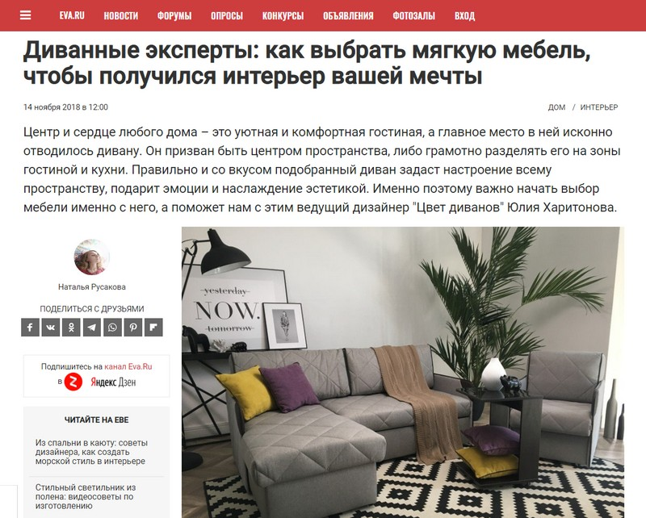
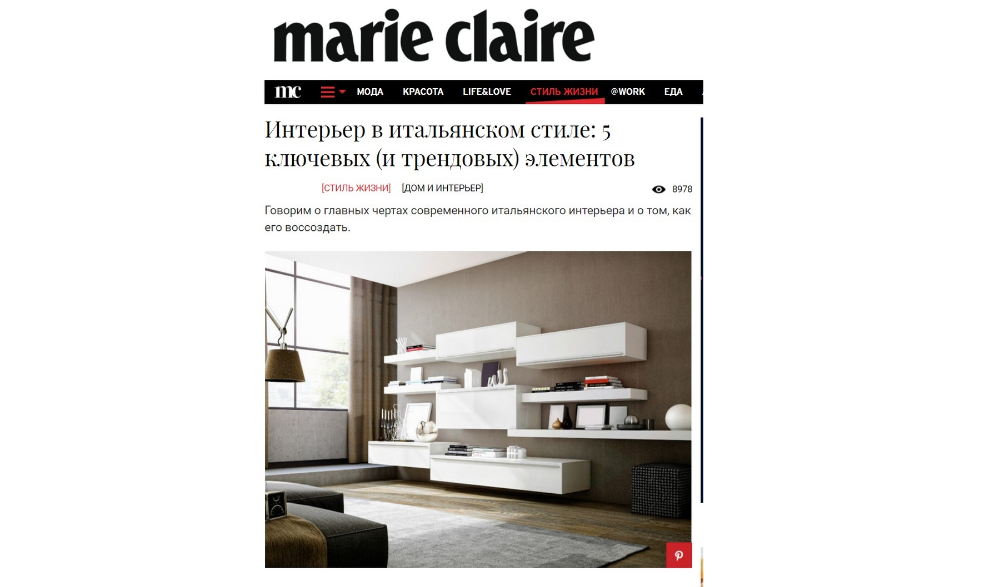
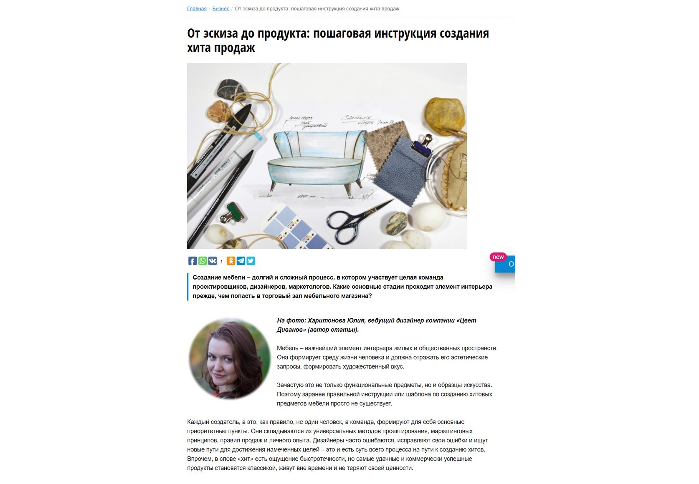
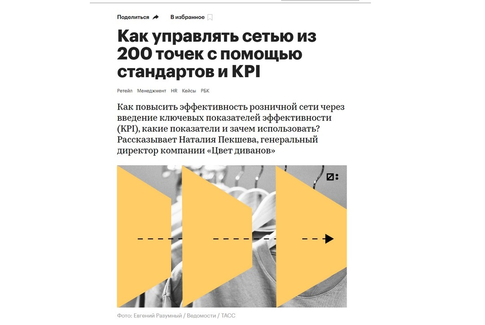
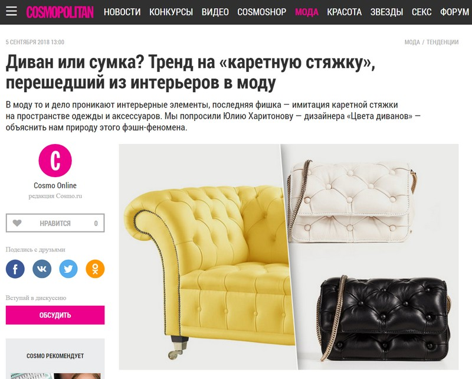
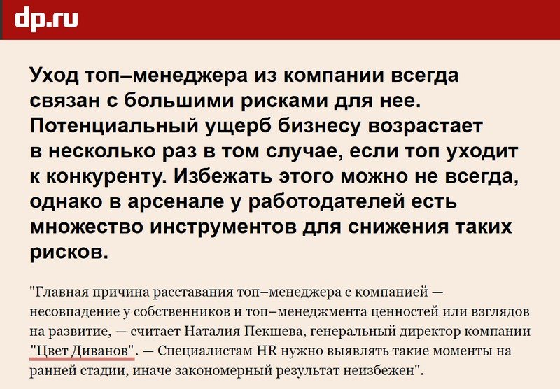

«Цвет диванов» — российская розничная сеть по продаже мягкой и корпусной мебели собственного производства. История бренда начинается с 2004 года, долгое время это был формат сети дискаунтеров, с соответствующим позиционированием: продавали мебель сторонних производителей через широкую сеть собственных салонов и франчайзи.

В 2014 году «Цвет диванов» вошла в мебельный альянс с двумя крупными мебельными производителями: Via Ferrata и Rival. Компания сфокусировалась на производстве мебели на металлическом каркасе собственной разработки. Так мы столкнулись с масштабным ребрендингом розничной сети. У нас изменились логотип, слоган, корпоративные цвета. Компания ушла от формата дискаунтера, организовала производственную площадку и разработала новый стандарт производства мягкой мебели. Изменилась ассортиментная и ценовая политика, и, как следствие, — целевая аудитория.

Перед нами возникла жизненно важная задача: создание и поддержание нового имиджа бренда, увеличение узнаваемости среди нужной ЦА. В тот момент мы вышли на постоянную работу со СМИ. А сегодня мы поняли, что ведем эту работу уже пять лет не переставая, и имидж бренда для нас — уже далеко не единственная задача. С помощью публикаций в СМИ мы решаем бизнес-задачи, а также формируем репутацию отрасли в целом.

## Как и зачем мы работаем на бренд компании

Бренд создает представление клиента о компании. Узнаваемый бренд с хорошей репутацией привлекает, формирует лояльную аудиторию, готовую к покупкам, повторным покупкам и рекомендациям. В мебельной отрасли лояльная клиентская база — это большое преимущество. В России пока мало крупных мебельных брендов, название которых говорит само за себя. У нас больше известны гипермаркеты мебели Hoff и IKEA, чем отечественные производители. При этом, без ложной скромности, — качество нашей продукции не только не уступает этим компаниям, а во многом их превосходит. Поэтому для нас очень важно развивать бренд, грамотно его позиционировать и продвигать.

В России 70% людей спят на диванах: мужчины и женщины от 25 до 50 лет; семьи с детьми или без. Наша аудитория огромна.

При этом практически все наши потенциальные покупатели — активные потребители контента. Дело в том, что мягкая мебель — это покупка долгосрочного характера. Диван или кресло будут служить владельцу годами, поэтому принятие решения может занять время. Перед тем, как определиться с выбором, многие покупатели тщательно изучают варианты, собирают мнения семьи и знакомых, оценивают репутацию компании. Клиенты ищут не только качественный товар, но и индивидуальный подход, высокий уровень сервиса и позитивный покупательский опыт. Так что мы стараемся присутствовать в тех медиа, которые читают наши клиенты для того, чтобы сделать осознанный выбор. Мы рассказываем о трендах, даем советы, помогаем с информацией.

Во многом PR — это не прямые продажи, а создание репутации. Для нас важно не только привлекать клиентов здесь и сейчас, но и формировать позитивный имидж в глазах тех, кто столкнется с необходимостью покупки мебели через несколько месяцев или даже лет. Работа с репутацией — долгосрочный процесс с перспективой на будущее, его сложно измерять, в отличие от рекламных кампаний. Но это не значит, что он не приносит результатов.

В рамках пиар-работы мы демонстрируем потенциальным клиентам наш подход к производству мягкой мебели, свою экспертность в этом вопросе. Для этого мы используем не только публикации в СМИ, наши специалисты также регулярно участвуют в специализированных конференциях и выставках, общаясь с потребителями напрямую.

Также мы регулярно знакомимся с мировым опытом — ездим на международные выставки, изучаем опыт европейских, азиатских, американских коллег. И с удовольствием делимся информацией с нашими потребителями — конечно через СМИ.

Наши сотрудники знают все об интерьерном дизайне, мебельных тканях и видах обивки, наполнителях матрасов кроватей, каркасах диванов, видах ДСП и их отличий от других материалов. СМИ для нас — канал общения и обмена опытом с людьми, которые столкнулись с задачей — выбрать мебель. Мы можем не только рассказать о любом процессе производства и о каждом из используемых нами материалов, но и помочь человеку самостоятельно определиться с необходимыми характеристиками и свойствами дивана, разобраться в механизмах раскладывания и других тонкостях.

## Как мы сформировали бренд надежного бизнес-партнера

Приятно отмечать, когда при деловых встречах и бизнес-знакомствах нашу компанию уже знают — по интервью и кейсам. Часто встреча начинается с обсуждения публикаций, а соискатели при найме уже знакомы с историей компании. Нам время от времени приходят предложения по участию в бизнес-мероприятиях, федеральных конкурсах, конференциях — потому что компания известна и находится на слуху. Все это можно воспринимать как метрики эффективности нашей PR-активности. Не скажу, что мы изначально ставили перед собой такую цель, скорей это стало незапланированным, но приятным эффектом, случайно. Однако то, что мы ее достигли, определенно помогает вести бизнес.

Компании, которые давно присутствуют на рынке, имеют преимущество: у них существует определенная база лояльных клиентов, есть возможности точнее таргетировать рекламу, выбирать наиболее успешные форматы, они получают более широкий охват новой аудитории, им предлагают лучшие арендные площади. Как бы ни был популярен бренд, но при покупке мебели люди чаще всего окончательное решение по-прежнему принимают после похода в салон. Важно, чтобы он был хорошо обустроен и находился в удобном месте, а стоимость аренды не противоречила целесообразности его содержания.

В построении имиджа надежного бизнес-партнера решающую роль играет личный бренд руководителя — как концентрация экспертизы в своей области. Он также значим, как контакт с покупателем и качественный сервис. Личный бренд позволяет развивать персональные партнерские отношения в бизнес-пространстве. Особенно, когда руководитель легко отзывается на публичные акции — выступления на конференциях, участие в передачах на радио и ТВ, пишет статьи и с удовольствием дает интервью прессе.

## Зачем мы формируем репутацию отрасли

Как я уже говорила, в российской мебельной отрасли пока мало действительно крупных узнаваемых брендов — гораздо больше известны гипермаркеты мебели Hoff и IKEA, чем отечественные производители. Мы давно осознали, что на крупных производителях мебели в нашей стране лежит куда более амбициозная задача, чем просто развитие собственного бренда. Мы развиваем всю отрасль, привлекая к ней внимание СМИ и целевых аудиторий.

К сожалению, к мебельной отрасли недостаточно интереса прессы, и нам требуется популяризация не только нашего бренда, но и отрасли в целом. Я уверена, что за несколько лет мы существенно повлияли на представление российского потребителя об отечественных производителях мебели. В конечном итоге формирование репутации отрасли для нас конвертируется в более легко закрывающиеся сделки, в новых покупателей. Но измерить результативность по реализации этой цели — это уже совсем сложная задача.

## Как мы решаем все эти задачи

Очевидно, что столько разных направлений — это колоссальный фронт работ для пиарщиков: нужно охватить массу тем — от отраслевых и лайфстайловых, до бизнеса и аналитики по отрасли. Одному-двум штатным сотрудникам справиться с такой задачей сложно — обязательно время от времени будут пробелы по какому-либо из направлений. Так что мы дополнительно привлекаем помощь подрядчиков.

Последние полтора года, с мая 2018-го, работаем с проектом «Виртуальный пиарщик» Pressfeed. Особенность «Виртуальных пиарщиков» заключается в том, что они работают именно с тем инструментарием, который нам необходим: организация публикаций в СМИ. Со стратегией продвижения, определением инструментов и целей мы справляемся ин-хаус, и это помогает тратить существенно меньше на подрядчиков: услуга по организации публикаций в сравнении с комплексным пиар-сопровождением от агентств стоит значительно дешевле.

Мы разделили сферы ответственности между нашими внутренними и «виртуальными» пиарщиками. Внутри мы работаем с отраслевыми изданиями, поддерживаем рекламные и маркетинговые активности, отвечаем на прямые запросы журналистов. Наши внешние пиарщики отвечают за коммуникации с потребительскими и бизнес-изданиями. У нас есть персональный менеджер, которая предлагает наши темы в СМИ, ведет переписку с редакторами, озвучивает сроки и контролирует дедлайны по подготовке контента. Наша задача — вовремя предоставить качественный материал, ответить на подходящие запросы на комментарии.

Кроме всего прочего, совмещение усилий внутренних и «виртуальных» пиарщиков помогает раскрывать более широкий круг тем. Когда находишься внутри компании, взгляд «замыливается». Наши «Виртуальные пиарщики» находятся совсем в другой ситуации — они находится в постоянной коммуникации с журналистами и редакторами, поэтому смотрят на нас совсем под другим углом: с точки зрения того, что может быть интересно медиа. Так что у нас есть возможность поделиться опытом по вопросам, которые мы бы сами не предложили в качестве «наших» тем.

Например, не так давно у нескольких изданий выходили материалы, посвященные рынку труда и подготовке кадров. В двух статьях мы приняли участие, ответив на вопросы журналистов с точки зрения производителя мебели. В этом случае сервис «Виртуальный пиарщик» нам помогает найти новые возможности для публикаций и показать свою экспертность не только в производстве мебели и дизайне, но и в ИТ, ведении бизнеса и других областях.

## Подводя итоги

Работа со СМИ для нашей компании постепенно превратилась из прикладной временной задачи в часть долгосрочной стратегии развития. Да, публикации в СМИ не влияют напрямую на продажи, но при этом помогают решать целый спектр важных задач: повышают экспертность компании и специалистов, узнаваемость бренда в бизнес-сфере и среди потребителей. Что в конечном итоге, конечно, конвертируется в продажи.

Посчитать эффективность PR сложно. Но мы точно знаем, что никакой другой способ продвижения не может решать так много важных задач одновременно.